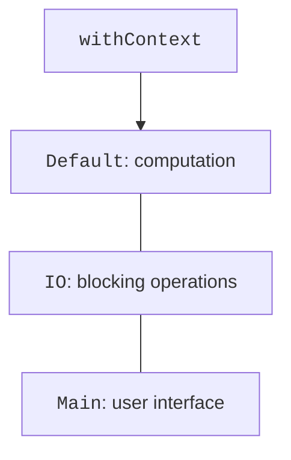

# Dispatchers and shared state

## Context and dispatchers

A context contains a `Job`, a dispatcher, the coroutine name, and other elements. `withContext` temporarily changes the context and returns the result of the block. This is the usual way to move a blocking file read off the UI thread or to run a computation on a worker pool.

- `Dispatchers.Default` – computational work on a thread pool.
- `Dispatchers.IO` – blocking file, network, and JDBC operations.
- `Dispatchers.Main` – the GUI thread, if the corresponding platform module is present.
- `Dispatchers.Unconfined` starts execution without being bound to a particular thread; after suspension, resumption depends on the operation. It is a special tool, not a universal "fast" mode.



Figure 13.4. The dispatcher is chosen by the nature of the work {.caption}

`limitedParallelism(n)` limits the parallel execution of a particular view of a dispatcher. It is not a semaphore for an entire `suspend` block: after suspension, other tasks can make progress. To limit the number of simultaneous operations, including their waiting, use `Semaphore.withPermit`. For mutual exclusion, use `Mutex`.

`CoroutineName("download")` helps distinguish tasks in a log. A thread name is not a reliable coroutine identifier: a coroutine can resume on another thread of the same dispatcher.

## Shared mutable state

The operation `balance += amount` consists of a read, an addition, and a write. Two coroutines on different threads can read the same old value and lose one update. `volatile` provides visibility of access but does not make such a sequence atomic. `AtomicInteger` works for a simple counter; several related fields need a single protected critical section.

`Mutex` is mutual exclusion for coroutines. Waiting for a locked mutex suspends the coroutine. `withLock` releases it even on an exception. One mutex must protect all accesses to a particular invariant; a new local `Mutex()` in each call synchronizes nothing between calls.

### Example 3. Depositing to an account

All amounts are given as whole kopiykas. There is no `Double` rounding. After `joinAll`, the children have already finished, so the parent can check the final balance. Random delays are not needed for correctness.

```kotlin
import kotlinx.coroutines.*
import kotlinx.coroutines.sync.Mutex
import kotlinx.coroutines.sync.withLock

class Account {
    private val mutex = Mutex()
    private var cents = 0L

    suspend fun deposit(amount: Long) {
        require(amount > 0)
        mutex.withLock {
            cents = Math.addExact(cents, amount)
        }
    }

    suspend fun balance(): Long = mutex.withLock { cents }
}

fun main() = runBlocking {
    val account = Account()
    List(20) {
        launch(Dispatchers.Default) {
            repeat(100) { account.deposit(1) }
        }
    }.joinAll()
    check(account.balance() == 2000L)
    println("Balance: ${account.balance()} kop.")
}
```

```text
Balance: 2000 kop.
```

A zero or negative deposit violates the precondition and does not change the balance. `Math.addExact` prevents silent `Long` overflow. For a transfer between two accounts, protecting a single field is no longer enough: the operation must preserve the total balance. In Topic 14, this invariant will be protected by a database transaction.

### Channels as work handoff

`Channel<T>` passes elements from a producer to a consumer. `send` and `receive` can suspend execution; the capacity limits accumulation. Several consumers of one channel share the elements between themselves rather than each receiving all messages. The producer closes the channel when it is done; the loop `for (x in channel)` reads out the remainder and ends. Canceling the owner must also terminate the producers and consumers.

A channel is convenient for an order queue, but for a stream of readings with transformations it is better to start with `Flow`. `select` lets you wait for several alternative operations; in this course it is an overview tool. Do not add it when an ordinary structured scope and one channel express the task more simply.
