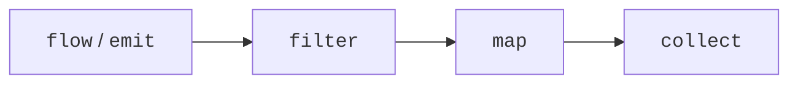
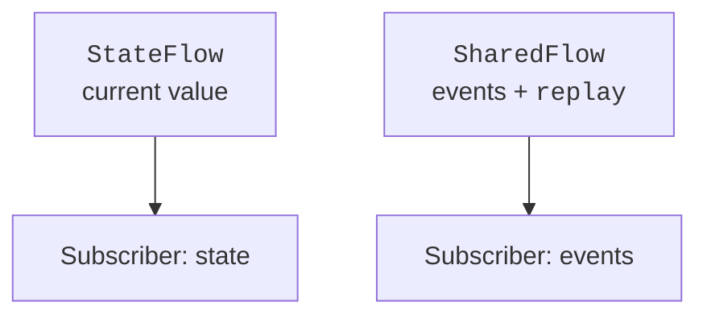

# Asynchronous Flow streams

## A cold Flow

A **Flow** is an asynchronous sequence of values. An ordinary `flow { }` is **cold**: its body starts executing when the results are collected. Two independent `collect` calls repeat the producer's work. Creating a variable with a flow does not yet mean starting a sensor or a request.

`emit` passes the next value. `collect`, `toList`, and `first` are terminal operators; `map` and `filter` build a new flow. An ordinary pipeline performs production and processing sequentially, until a special operator introduces additional concurrency.



Figure 13.5. Data passes through the pipeline during collect {.caption}

### Example 4. A temperature sensor

We discard negative values according to the rule of this model, not as a general rule for temperature. The flow converts degrees Celsius to Fahrenheit; a separate `StateFlow` stores the latest result. The producer finishes after three measurements.

```kotlin
import kotlinx.coroutines.*
import kotlinx.coroutines.flow.*

fun readings(): Flow<Int> = flow {
    for (value in listOf(-2, 0, 20)) {
        delay(5)
        emit(value)
    }
}

fun main() = runBlocking {
    val current = MutableStateFlow<Double?>(null)
    readings()
        .filter { it >= 0 }
        .map { it * 9.0 / 5 + 32 }
        .flowOn(Dispatchers.Default)
        .collect {
            current.value = it
            println("F = $it")
        }
    println("Latest: ${current.value}")
    check(current.value == 68.0)
}
```

```text
F = 32.0
F = 68.0
Latest: 68.0
```

`flowOn` changes the context of the upstream part of the pipeline, not the downstream `collect`. Inside `flow`, do not call `emit` from an arbitrary `withContext`: a flow preserves its context. For concurrent production from different coroutines, there is `channelFlow`.

### Operators and consumption speed

`transform` can emit zero, one, or several elements per input element. `take(n)` limits the flow and cancels unnecessary production. `onEach` is convenient for logging, but by itself it starts nothing. `buffer` lets the producer make progress while the consumer processes the previous element; an unbounded buffer risks accumulating too much data.

`conflate` keeps the latest available element when the consumer is slow. This fits a current reading, but not a stream of all payments: a skipped payment changes the total. `collectLatest` cancels the previous processing block when a new value arrives. The interrupted action must be safe to cancel.

`debounce` passes a value through after a pause in new arrivals, which is convenient for a search field. In the API used, this operator is marked `FlowPreview`, so the example has an explicit `@OptIn`. This is local consent to a preview API, not disabling all checks. For a new request, you can apply `mapLatest` so that an old slow result does not replace a new one.

`zip` forms pairs of corresponding elements and completes when one flow is exhausted. `combine`, after the first value of each source, uses the latest values on every update. For the price and quantity of a product, `combine` is appropriate; for reading two identically ordered sets in pairs, `zip`.

### Flow errors

`catch` handles errors in the upstream part of the pipeline. It does not catch an error in the downstream `collect` and does not intercept flow cancellation. After an error, you can emit a fallback value, but this is not a continuation from the point where the previous producer failed. `retry` restarts the source: external actions may be repeated.

Retry only transient errors, with a limited number of attempts and a delay; a wrong password or an invalid format will not be fixed by endless retrying. `onCompletion` is suitable for observing completion and its cause. It is not a substitute for `finally` for all resources outside the flow's lifecycle.

## StateFlow and SharedFlow

`StateFlow<T>` always has a current `value`. A new subscriber receives the current state. Values that are equal by `equals` are conflated, and a slow consumer may miss intermediate changes. So a counter's state fits `StateFlow`, but a log of every click does not. Keep a private `MutableStateFlow` and expose `asStateFlow()`.

`update { old -> ... }` computes the new state atomically. Its lambda may run again under contention; inside it you must not send an email or increment an external counter as a side effect. For a data class, create a `copy` rather than changing a nested list of the same object: the change must be visible to the equality mechanism.



Figure 13.6. The current state and event broadcasting have different contracts {.caption}

`SharedFlow` broadcasts values to active subscribers. `replay` determines how many of the latest values a new subscriber receives. With no subscribers and no replay, an event can be lost: it is not a durable message queue. For an important save result, it is better to represent the confirmation in the state until the UI handles it.

`stateIn` and `shareIn` turn a cold flow into a shared one, but they need a scope and a start policy. `WhileSubscribed` ties production to the presence of subscribers; a stop timeout helps survive a brief screen resubscription. A hot flow usually does not complete; in a test, it is limited with `take`, collected in `backgroundScope`, or the collector is canceled explicitly.
