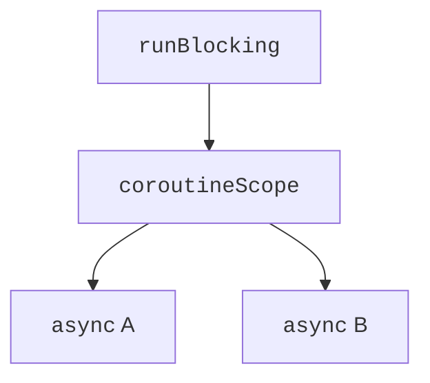

# Structured concurrency

## Structured concurrency

A **coroutine scope** defines the context and lifetime boundaries of child tasks. `coroutineScope` does not return until its children complete. If one ordinary child task fails, the scope cancels the others and passes the error to the caller. This way child work does not silently keep changing state after the function returns.

The parent waits for its children even when the code of its own block has already reached the end. `join` is needed for a specific synchronization point, not to make the scope wait for children at all. `GlobalScope` loses this local boundary: responsibility for stopping the task shifts to the entire application. In the educational examples, all tasks have an explicit owner.



Figure 13.3. The parent owns its child tasks {.caption}

A custom `CoroutineScope` is appropriate for a component with a defined lifecycle. For example, the controller of an open window cancels its scope when the window closes. Creating a scope in each function without storing it or canceling it means hiding background work. In Topic 16 we will look at this responsibility for a `ViewModel`.

## Cooperative cancellation

`cancel()` sends a cancellation request. It does not forcibly stop an arbitrary instruction. The functions `delay`, `yield`, channel waits, and other cancellable operations check the task's state and throw `CancellationException`. For a long computation loop, insert `ensureActive()` or check `isActive`.

Cancellation is a normal part of the lifecycle, not a "the server broke" message. If `catch (e: Exception)` is needed for a domain error, `CancellationException` should be rethrown. Otherwise the task keeps working after the screen is closed or a timeout occurs. `cancelAndJoin()` combines the request with waiting for actual completion.

The `finally` block runs during cancellation too. Ordinary closing of a resource can be done without an additional context. If the cleanup itself needs to suspend, a short `withContext(NonCancellable)` block lets it complete. Long work should not be done there: the owner will wait for it even after cancellation.

### Example 2. Downloading with a time limit

We model a source that needs 500 ms but give it 80 ms. `withTimeoutOrNull` returns `null` for its own timeout. External cancellation is not turned into a successful response.

```kotlin
import kotlinx.coroutines.*

suspend fun download(): String {
    try {
        delay(500)
        return "data"
    } finally {
        println("Resource closed")
    }
}

fun main() = runBlocking {
    val result = withTimeoutOrNull(80) { download() }
    println(result ?: "Time is up")
    val fast = withTimeoutOrNull(500) {
        delay(1)
        "done"
    }
    check(fast == "done")
    println(fast)
}
```

```text
Resource closed
Time is up
done
```

`withTimeout`, in contrast, throws `TimeoutCancellationException`. A timeout does not guarantee interruption of a blocking JDBC call or an arbitrary Java API. Such operations need the driver's own timeouts, and interruptible calls need `runInterruptible`. Do not promise an instant stop of all I/O.

## Errors and supervision

In an ordinary scope, a child's failure cancels the parent regardless of whether `await` has already been called. A `try/catch` around `await` does not automatically turn the whole scope into independent tasks. If one failed check must not cancel the others, the boundary of independence is set with `supervisorScope` or `SupervisorJob`.

In a supervised scope, a failed `async` stores the exception in the `Deferred`; each result must be read and handled. A failed `launch` has no `await`, so its unhandled error needs an appropriate handler. `CoroutineExceptionHandler` serves as the last report of an unhandled error; it does not restore the completed coroutine and does not replace local handling.

A supervisor does not make children independent of the owner itself: canceling the scope cancels everyone. This matters for a screen that checks several servers: the failure of one server can be shown separately, but closing the screen must stop all checks. An example of this division of responsibility is given in the lab assignment.
