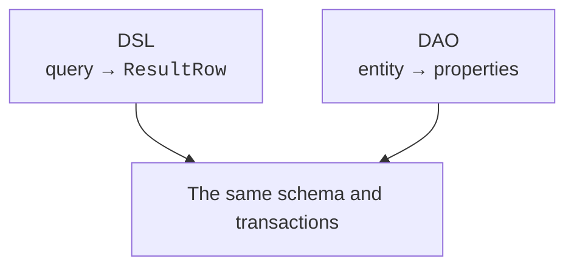
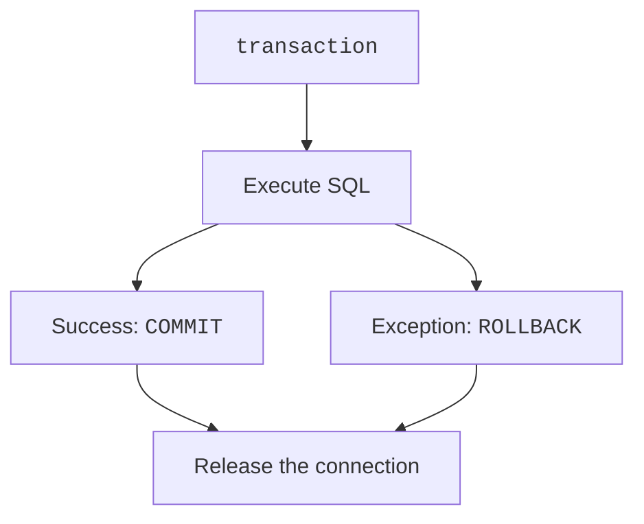

# DAO and transactions

## DAO: a row as an object

A **DAO** (*data access object*) in Exposed represents a row as an entity with delegated properties. `IntEntity` stores the identifier, `IntEntityClass` performs lookup and creation, and `by Table.column` binds a property to a column. This is convenient for navigating relationships, but it does not make the data independent of the transaction and the entity cache.



Figure 14.7. Two styles of access to the same relational model {.caption}

### Example 3. A small DAO catalog

This is a separate project with the `exposed-dao` module. The data is read in a transaction and converted to an ordinary string before leaving it. The example does not return a "live" DAO entity to the interface.

```kotlin
import java.nio.file.Files
import org.jetbrains.exposed.v1.core.dao.id.*
import org.jetbrains.exposed.v1.dao.*
import org.jetbrains.exposed.v1.jdbc.*
import org.jetbrains.exposed.v1.jdbc.transactions.transaction

object Editions : IntIdTable("editions") {
    val title = varchar("title", 120)
}
class Edition(id: EntityID<Int>) : IntEntity(id) {
    companion object : IntEntityClass<Edition>(Editions)
    var title by Editions.title
}

fun main() {
    val path = Files.createTempFile("editions-", ".db")
    val db = Database.connect("jdbc:sqlite:$path",
        "org.sqlite.JDBC")
    val text = transaction(db) {
        SchemaUtils.create(Editions)
        val book = Edition.new { title = "Atlas" }
        book.title = "Educational atlas"
        "${book.id.value}: ${book.title}"
    }
    println(text)
    path.toFile().deleteOnExit()
}
```

```text
1: Educational atlas
```

The `referencedOn` relationship represents a reference to a single entity, `referrersOn` a collection of children; `via` describes a many-to-many relationship through an intermediate table. Lazily reading a relationship in a loop can cause the **N+1** problem: one query for the list and one more for each row. Eager loading with `with` or one explicit join makes the number of queries predictable.

The DSL is well suited for reports, aggregates, and explicit control of SQL; the DAO, for working with related entities. Both approaches can be used in one project, but for a particular operation you should clearly define the source of the current state and the caching boundary. In the lab, the DSL remains the main style.

## A transaction as an integrity boundary

A **transaction** is a group of operations that is committed or rolled back together. A transfer must decrease one balance and increase another at the same time. If the second action fails, keeping only the first violates the invariant. The exception must leave `transaction` so that it rolls back the changes; catching it inside and continuing is a different scenario.



Figure 14.8. Commit or rollback of the whole operation {.caption}

Atomicity does not mean the absence of concurrent conflicts. Isolation determines which changes of other transactions are visible to a reader. The supported levels and locks depend on the DBMS. SQLite serializes writes; server DBMSs have other concurrency models. Do not keep a transaction open while the user fills in a form.

A nested `transaction` usually uses the current transaction; separate savepoint scenarios need explicit configuration. A nested block does not necessarily produce an independent COMMIT. Retries also matter: if the transaction body runs again, an external email or payment must not be executed twice.

A connection pool, such as HikariCP, reuses a limited number of connections. A pool is not a query cache and does not extend SQLite to an unlimited number of simultaneous writers. Its owner closes the pool when the application shuts down.
