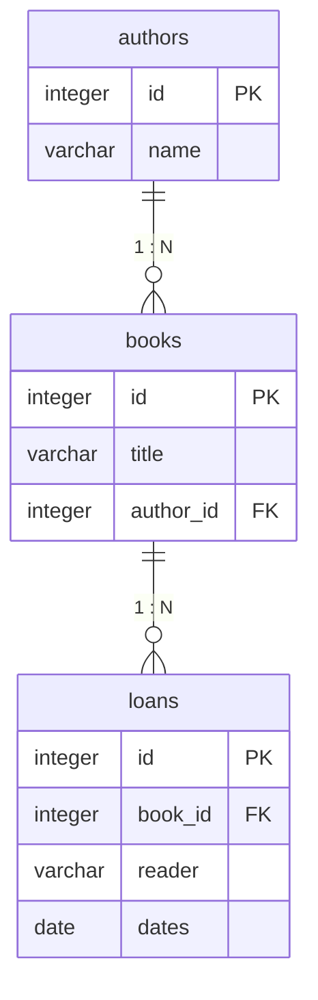
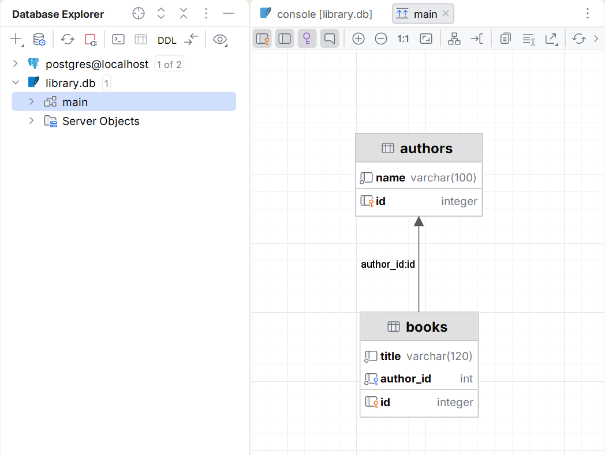

# Relationships and joins

## Relationships and joins

One author can have many books, and a book can have many historical loans. Instead of repeating the author's name in every book, a foreign key is stored. This reduces inconsistencies when renaming. `ON DELETE` must reflect the domain rule: delete the dependent data, forbid the deletion, or clear a nullable reference.



Figure 14.5. Relationships in the educational library {.caption}

`innerJoin` keeps only rows that have a match on both sides. `leftJoin` keeps all rows of the left table; the fields of a missing right row will be NULL. So the report "all authors, even those without books" needs an outer join. Place a condition on the right table carefully so that WHERE does not discard the NULL rows.

### Example 2. A catalog and the number of books

We create two authors and three books. The first query prints the title and the author; the second, the number of books per author. Both queries have an explicit order. For convenience, each ResultRow is read immediately within the transaction.

```kotlin
import java.nio.file.Files
import org.jetbrains.exposed.v1.core.*
import org.jetbrains.exposed.v1.jdbc.*
import org.jetbrains.exposed.v1.jdbc.transactions.transaction

object Authors : Table("authors") {
    val id = integer("id").autoIncrement()
    val name = varchar("name", 100)
    override val primaryKey = PrimaryKey(id)
}
object Books : Table("books") {
    val id = integer("id").autoIncrement()
    val title = varchar("title", 120)
    val author = integer("author_id").references(Authors.id)
    override val primaryKey = PrimaryKey(id)
}

fun main() {
    val path = Files.createTempFile("library-", ".db")
    val db = Database.connect(
        "jdbc:sqlite:$path?foreign_keys=on", "org.sqlite.JDBC"
    )
    transaction(db) {
        SchemaUtils.create(Authors, Books)
        val a = Authors.insert { it[name] = "Author A" }[Authors.id]
        val b = Authors.insert { it[name] = "Author B" }[Authors.id]
        for ((title, author) in listOf(
            "Spring" to a, "Summer" to a, "Autumn" to b
        )) {
            Books.insert {
                it[Books.title] = title
                it[Books.author] = author
            }
        }
        (Books innerJoin Authors)
            .select(Books.title, Authors.name)
            .orderBy(Books.id)
            .forEach {
                println("${it[Books.title]}: ${it[Authors.name]}")
            }
        val count = Books.id.count()
        (Authors innerJoin Books)
            .select(Authors.name, count)
            .groupBy(Authors.id, Authors.name)
            .orderBy(Authors.id)
            .forEach { println("${it[Authors.name]}: ${it[count]}") }
    }
    path.toFile().deleteOnExit()
}
```

```text
Spring: Author A
Summer: Author A
Autumn: Author B
Author A: 2
Author B: 1
```

The `count` aggregate is an SQL expression object; it is stored in a variable and used to read the same column of the result. `sum` and `avg` can return NULL for an empty group. Converting NULL to zero must be an explicit domain decision.

If a table is joined twice, for example the sender and the recipient of a transfer, you need `alias` aliases. Without them, identical columns cannot be distinguished. For large reports, check the query plan and indexes instead of loading all rows for a Kotlin `groupBy`.



Figure 14.6. Tables and foreign keys in a database client {.caption}
