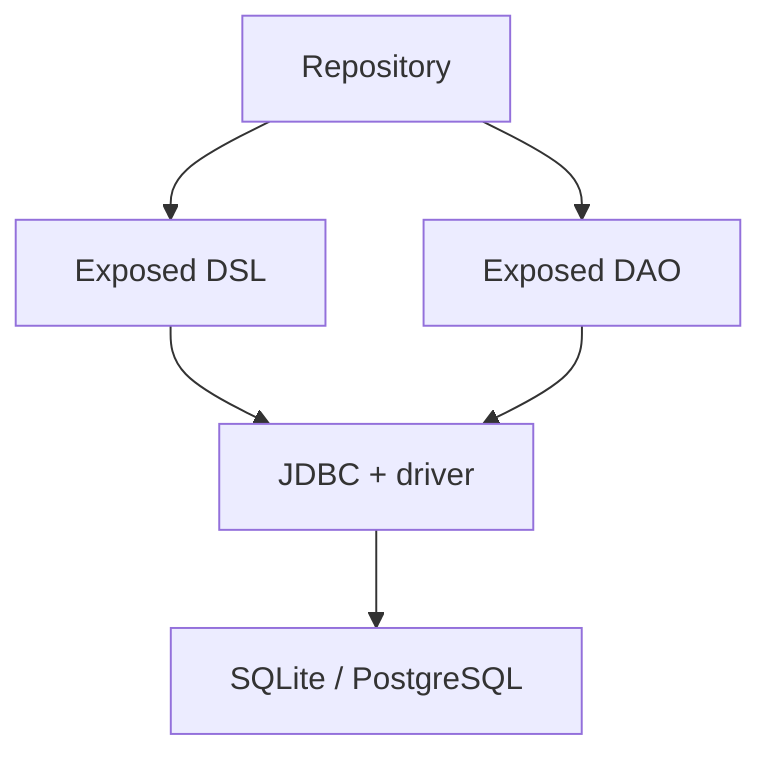

# The database and connection

## From a collection to a database

A list in memory disappears when the program exits. A JSON file stores values, but by itself it does not provide foreign keys, concurrent updates, or an atomic transfer between two records. A **relational database** represents information as tables, supports constraints, and executes queries in SQL.

A row is one fact or object; a column is one of its properties. A **primary key** uniquely identifies a row. A **foreign key** refers to a key of another table. A book title is not a reliable key: different editions can have the same title. A numeric `id` separates identity from text.

**JDBC** is the standard Java API for accessing relational databases. A driver translates its calls into the protocol of a specific DBMS. **Exposed** is a JetBrains Kotlin library with a typed DSL and a DAO. It helps build SQL, but it does not remove the need to understand keys, transactions, and the cost of a query. <https://www.jetbrains.com/help/exposed/home.html>.



Figure 14.1. The place of Exposed in a JVM application {.caption}

In this topic we use Exposed 1.4.0 and SQLite. An SQLite file is easy to submit together with the lab; no separate server is needed. PostgreSQL is a server alternative for many clients. Results should be verified on the target DBMS: compatible Kotlin code does not guarantee identical SQL types, collation rules, or locking. <https://sqlite.org/docs.html>.

## Preparing the project and connecting

Add modules of the same version to the JVM project. `exposed-core` contains expressions and the schema description, `exposed-jdbc` execution via JDBC, and `exposed-dao` the object representation of rows. `exposed-java-time` adds `java.time` types if the schema needs them. The driver dependency is mandatory: Exposed does not include SQLite.

```kotlin
dependencies {
    val exposed = "1.4.0"
    implementation("org.jetbrains.exposed:exposed-core:$exposed")
    implementation("org.jetbrains.exposed:exposed-jdbc:$exposed")
    implementation("org.jetbrains.exposed:exposed-dao:$exposed")
    implementation(
        "org.jetbrains.exposed:exposed-java-time:$exposed"
    )
    implementation("org.xerial:sqlite-jdbc:3.53.1.0")
    implementation(
        "org.jetbrains.kotlinx:kotlinx-coroutines-core:1.11.0"
    )
}
```

Exposed 1.x packages start with `org.jetbrains.exposed.v1`. Examples with the old `org.jetbrains.exposed.sql` should not be mixed with the new imports. DSL constructs are in `core`, query execution is in `jdbc`, and transactions are in `jdbc.transactions`. The migration page: <https://www.jetbrains.com/help/exposed/migration-guide-1-0-0.html>.

`Database.connect` creates a description of database access. Actual operations run in `transaction(db)`. With several databases, pass `db` explicitly: a hidden "last registered" connection is hard to test. The JDBC URL `jdbc:sqlite:library.db` means a file relative to the process's working directory, not the directory containing `Main.kt`.

SQLite requires enabling foreign key checks for each connection. The examples use the driver parameter `?foreign_keys=on`. A one-off PRAGMA command in another SQL client does not automatically configure your program's connections.

### A server alternative: PostgreSQL

The official source of the installer is <https://www.postgresql.org/download/windows/>. In the wizard, select the server and the command-line tools, and note the port and the administrator password. For an educational application, create a separate database and a separate user with the necessary privileges. Do not use the administrator for the program's everyday work.

In DataGrip, open *File → New → Data Source → PostgreSQL* and specify `localhost`, the configured port, the database, and the user. After *Download missing driver files*, run *Test Connection*. Then open a query console and check the current database. <https://www.jetbrains.com/help/datagrip/connecting-to-a-database.html>.

The JDBC URL has the form `jdbc:postgresql://localhost:5432/library`; you need the `org.postgresql:postgresql` driver of a matching version. The password is read from an environment variable or a local configuration that does not go into Git. An error message must not print the entire URL if it contains secrets.

::: info Screenshot
Official Windows installer, Select Components; no password.
:::

Figure 14.2. Components of a PostgreSQL server installation {.caption}

::: info Screenshot
PostgreSQL localhost library, Test Connection; hide secrets.
:::

Figure 14.3. Testing the educational data source in DataGrip {.caption}
