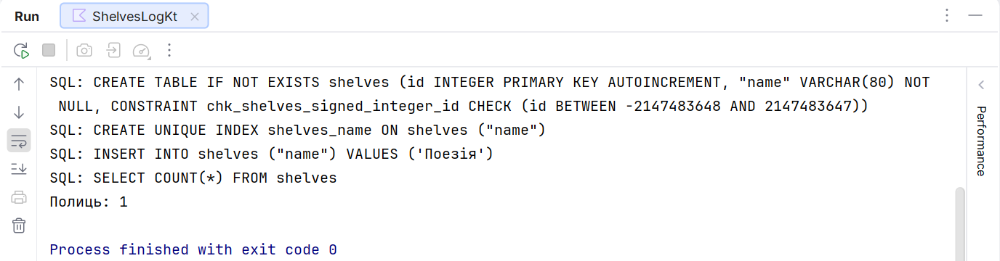

# Tables and DSL queries

## Describing a table and its constraints

`object Books : Table("books")` is a schema description, not a collection of records. The property `varchar("title", 120)` describes a column. `nullable()` allows SQL NULL; `default` sets a default value; `uniqueIndex()` forbids duplicates at the database level. Validating a form before insertion is useful, but it does not replace database constraints.

`integer`, `long`, `bool`, `decimal`, `date`, and `enumerationByName` represent different types. Money is best stored as whole kopiykas or as an exact `decimal`, not as `double`. For a date without a time, `java.time.LocalDate` is suitable; for an instant across different time zones, you must choose a storage contract explicitly.

`IntIdTable` provides a default numeric key, which in the DSL is an `EntityID<Int>`. Its `.value` is an ordinary `Int`. In a custom `Table`, the primary key is set via `PrimaryKey`. Do not mix an external document number with a technical auto-generated key.

### Example 1. Connection and schema

Each complete example in the lecture is a separate program. For transparent repetition, this example uses its own temporary database; in a real catalog, a persistent user path is passed instead. `maxAttempts = 1` makes the educational error behavior unambiguous.

```kotlin
import java.nio.file.Files
import org.jetbrains.exposed.v1.core.Table
import org.jetbrains.exposed.v1.jdbc.*
import org.jetbrains.exposed.v1.jdbc.transactions.transaction

object Shelves : Table("shelves") {
    val id = integer("id").autoIncrement()
    val name = varchar("name", 80).uniqueIndex()
    override val primaryKey = PrimaryKey(id)
}

fun main() {
    val path = Files.createTempFile("shelves-", ".db")
    val db = Database.connect(
        "jdbc:sqlite:$path?foreign_keys=on", "org.sqlite.JDBC"
    )
    transaction(db) {
        maxAttempts = 1
        SchemaUtils.create(Shelves)
        Shelves.insert { it[name] = "Poetry" }
        println("Shelves: ${Shelves.selectAll().count()}")
    }
    path.toFile().deleteOnExit()
}
```

```text
Shelves: 1
```

Creating the schema in a transaction is convenient for a first exercise. `SchemaUtils.create` is not a universal mechanism for updating an existing schema. Changing a Kotlin property does not automatically move data from the old column or fix old values.

For diagnostics, add `addLogger(StdOutSqlLogger)` to the transaction with the import `org.jetbrains.exposed.v1.core.StdOutSqlLogger`. The log helps you see the number of queries. In a production system, do not log personal data and parameters uncontrollably.



Figure 14.4. SQL generated by Exposed {.caption}

## DSL: create, read, update, and delete

`insert` returns the insertion result; the generated key is read from it. For an `IntIdTable`, `insertAndGetId` is convenient. `batchInsert` expresses inserting a set of rows, but actual batching depends on the driver. Do not assume that a thousand `insert` calls will automatically turn into one SQL query.

`selectAll().where { ... }` selects rows; `select(columns)` restricts the columns. The conditions `eq`, `greater`, `like`, `and`, and `or` form an SQL expression tree. Values are passed as parameters, not by concatenating an SQL string. If you need a literal search, remember that `%` and `_` in LIKE are wildcard characters.

Without `orderBy`, the order of rows is not guaranteed. Even if SQLite returned them in insertion order today, an index or a new query plan can change the result. For pagination, specify a stable sort with a unique secondary key. `limit` without sorting does not mean "the newest" records.

`update(where = { ... })` and `deleteWhere { ... }` return the number of affected rows. Check it for an operation by `id`: zero means the object is already gone. A mistake in the condition can change many rows; a preview and a transaction are useful for bulk educational operations.

`upsert` combines insertion and update on a key conflict. Its behavior depends on the dialect and the unique constraints. Before using it, determine exactly which key denotes "the same object" and which fields may be overwritten.
