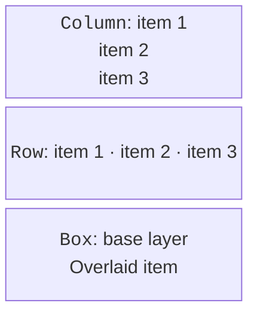
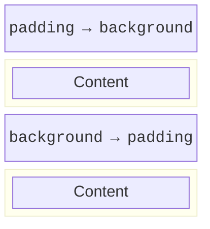

# Composable functions and layout

## A composable function and local state

The `@Composable` annotation lets a function participate in composition. It describes UI rather than returning a ready-made widget to be modified later. A composable is called from another composable function or an appropriate context, such as the content of a `Window`. An ordinary domain function without UI does not need this annotation.

`remember` stores a value across recompositions at a specific place in the composition. `mutableStateOf` creates observable state. Delegation with `by` gives the syntax of an ordinary variable, but reads and writes go through Compose State. The `getValue` and `setValue` imports are required for this delegation.

### Example 1. A counter

A button changes the state; the text automatically shows the new value. A limit of 100 prevents overflow in the educational interface. Reset is an ordinary event, not re-creation of the window.

```kotlin
import androidx.compose.foundation.layout.*
import androidx.compose.material3.*
import androidx.compose.runtime.*
import androidx.compose.ui.Modifier
import androidx.compose.ui.unit.dp
import androidx.compose.ui.window.*

@Composable
fun Counter() {
    var count by remember { mutableStateOf(0) }
    Column(Modifier.padding(20.dp)) {
        Text("Count: $count")
        Row(horizontalArrangement = Arrangement.spacedBy(8.dp)) {
            Button(onClick = { count++ }, enabled = count < 100) {
                Text("Add")
            }
            Button(onClick = { count = 0 }) { Text("Reset") }
        }
    }
}

fun main() = application {
    Window(onCloseRequest = ::exitApplication,
        title = "Counter") {
        MaterialTheme { Counter() }
    }
}
```

The initial screen shows `Count: 0`; after three clicks, `Count: 3`; after a reset, zero again. Closing and restarting also gives zero: `remember` does not store data on disk. Do not use a random remember key if the state must survive an ordinary recomposition.


Figure 15.4. The counter after three clicks {.caption}

`rememberSaveable` stores serializable state through the owner's saveable state mechanism. It is not an automatic database and does not promise restoration after any desktop restart. For persistent settings, use a file or a repository.

## Layout and Modifier

`Column` places its children vertically, `Row` horizontally, and `Box` in layers. `Arrangement` determines the spacing and distribution along the main axis; `Alignment`, the alignment along the other axis. `Spacer` leaves room. Absolute coordinates are usually unnecessary: the window can change size, and the text can change length.



Figure 15.5. Column, Row, and Box solve different problems {.caption}

A **Modifier** is an ordered chain of behavior and styling. `padding`, `size`, `fillMaxWidth`, `background`, `border`, and `clickable` cannot be rearranged arbitrarily. An outer padding before background leaves an unpainted margin; padding after background is included in the painted area.



Figure 15.6. The order of modifiers changes the styled area {.caption}

`weight` applies within the scope of a `Row` or `Column`, which distributes the remaining space. By itself, it does not set a pixel width. `BoxWithConstraints` lets you choose a layout depending on the available space; it is important to test a narrow window, not just the initial size.

UI sizes are set in `dp`, and text in `sp`. These are logical units, not a requirement for the number of physical pixels on every display. The height of a text field must take into account system scaling and the font. A clipped label is not fixed by shrinking the font until it is unreadable.
