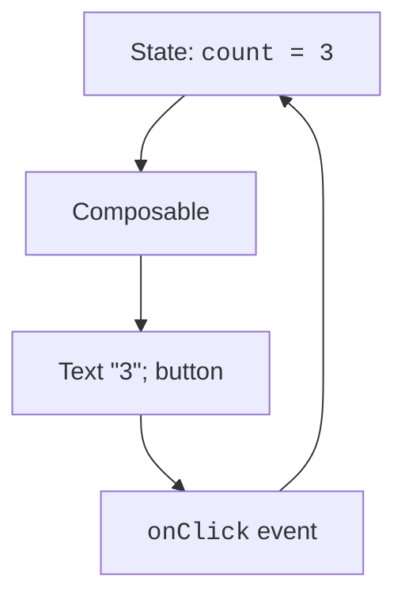
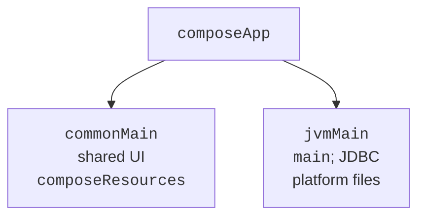

# Declarative UI and the project

## Declarative UI

In a console program, the code determines the input sequence. In a graphical program, the user can change any field, go back to a previous step, or close the window. The interface reacts to events, and the computational model stores the current data.

**Compose Multiplatform** is a declarative UI framework from JetBrains. The developer describes which interface corresponds to the current state, and the system updates the necessary parts after changes. Instead of "find the label and manually replace its text", you write `Text(value)`. <https://www.jetbrains.com/compose-multiplatform/>.

Compose Multiplatform uses the approaches and many APIs of Jetpack Compose. However, an Android dependency does not necessarily work on desktop. Files, permissions, lifecycle, navigation, and packaging have platform-specific features. In the lab, the target is **desktop JVM**; Android, iOS, and web are mentioned as possibilities for sharing code.



Figure 15.1. An event changes the state, and the state determines the interface {.caption}

**Recomposition** is the re-execution of the necessary composable functions for a new state. It is not necessarily a full redraw of the window and not a guaranteed call of all functions in a fixed order. So reading a file, writing to a database, or incrementing a counter must not be performed as arbitrary side effects of a composable's body.

## The project and entry point

In IntelliJ IDEA, you can use the Kotlin Multiplatform wizard or the official generator <https://kmp.jetbrains.com/>. Select the desktop target and shared Compose UI. The names of the wizard's items depend on the installed plugin version; after creating the project, check the targets and dependencies in Gradle, not just the project tree.

In a Multiplatform module, shared composable functions are placed in `commonMain`, and the desktop entry point and JVM libraries in `jvmMain` or `desktopMain`, depending on the target's name. Exposed JDBC cannot be imported into arbitrary shared code for iOS or web.



Figure 15.2. Shared UI is separated from the desktop entry point {.caption}

To keep the examples short and fully self-contained, a single JVM module with `src/main/kotlin/Main.kt` is used below. It is a Compose Multiplatform desktop application without extra targets. Changing the directory layout does not change the principles of state and layout. Do not mix this Gradle file with an unmodified KMP module template.

```kotlin
import org.jetbrains.kotlin.gradle.dsl.JvmTarget

plugins {
    kotlin("jvm") version "2.4.20"
    id("org.jetbrains.kotlin.plugin.compose") version "2.4.20"
    id("org.jetbrains.compose") version "1.11.1"
}
repositories {
    google()
    mavenCentral()
}
kotlin {
    jvmToolchain(27)
    compilerOptions { jvmTarget.set(JvmTarget.JVM_26) }
}
tasks.withType<JavaCompile>().configureEach {
    options.release.set(26)
}
dependencies {
    implementation(compose.desktop.currentOs)
    implementation("org.jetbrains.compose.material3:material3:1.9.0")
    implementation(
        "org.jetbrains.kotlinx:kotlinx-coroutines-swing:1.11.0"
    )
}
compose.desktop {
    application { mainClass = "MainKt" }
}
```

The version of the Compose compiler plugin matches Kotlin, while the version of the Compose UI libraries is set separately. Material 3 also has its own version: here 1.9.0 is pinned explicitly, as used by the verified Compose 1.11.1 configuration. JDK 27 runs the application; bytecode target 26 is consistent with the capabilities of the course's compiler. Gradle runs on a separate compatible JDK, as described in Topic 1. Official compatibility: <https://kotlinlang.org/docs/multiplatform/compose-compatibility-and-versioning.html>.

In `settings.gradle.kts`, the project name is enough. Run with `./gradlew run`, or `.\gradlew.bat run` on Windows. Each complete program replaces `Main.kt` rather than adding another entry point with the same name. `application` manages the application's lifetime, `Window` creates a window, and `onCloseRequest = ::exitApplication` terminates the application after a close request.

::: info Screenshot
Current Kotlin Multiplatform wizard; Desktop selected.
:::

Figure 15.3. Selecting the desktop target in the project wizard {.caption}
