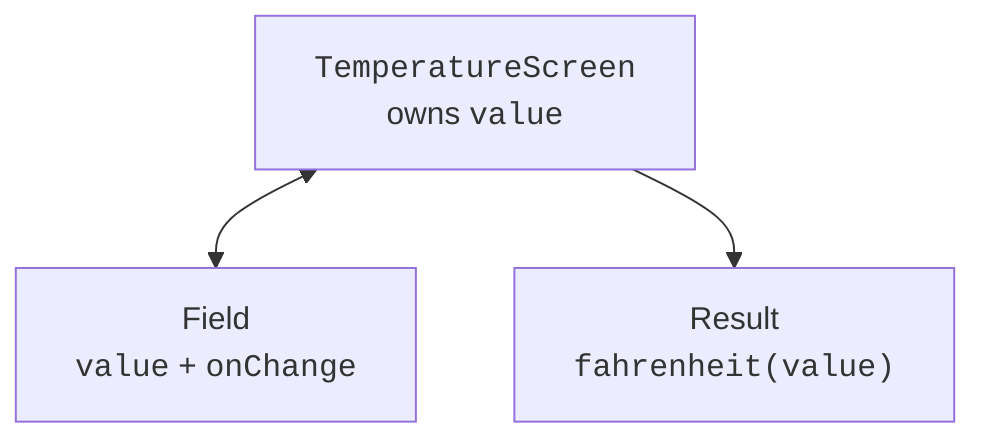

# State hoisting and lists

## State hoisting and input validation

**State hoisting** moves state to a common owner and passes the value and an event handler to child components. A field does not decide on its own how to store data; instead, it reports via `onValueChange`. This makes the component reusable and easier to test.



Figure 15.7. A single owner keeps the field and the result consistent {.caption}

A text field must store the entered string, including a temporary `-` or an empty value. Forcing a conversion to a number on every keystroke gets in the way of editing. The numeric result is computed separately via `toDoubleOrNull`, a finiteness check, and domain constraints.

### Example 2. A temperature converter

```kotlin
import androidx.compose.foundation.layout.*
import androidx.compose.material3.*
import androidx.compose.runtime.*
import androidx.compose.ui.Modifier
import androidx.compose.ui.unit.dp
import androidx.compose.ui.window.*

fun fahrenheit(text: String): Double? {
    val c = text.replace(',', '.').toDoubleOrNull() ?: return null
    if (!c.isFinite() || c < -273.15) return null
    return (c * 9 / 5 + 32).takeIf { it.isFinite() }
}

@Composable
fun TemperatureInput(value: String, onChange: (String) -> Unit) {
    OutlinedTextField(value = value, onValueChange = onChange,
        label = { Text("Degrees Celsius") },
        isError = value.isNotEmpty() && fahrenheit(value) == null)
}

@Composable
fun TemperatureScreen() {
    var value by remember { mutableStateOf("20") }
    val result = fahrenheit(value)
    Column(Modifier.padding(20.dp)) {
        TemperatureInput(value, onChange = { value = it })
        Text(result?.let { "$it °F" } ?: "Enter a valid number")
    }
}

fun main() = application {
    Window(onCloseRequest = ::exitApplication,
        title = "Temperature") {
        MaterialTheme { TemperatureScreen() }
    }
}
```

For `20` the result is `68.0 °F`, for `0`, `32.0 °F`. An empty string, `NaN`, and values below absolute zero do not produce a number. The domain function knows nothing about Compose, so it can be tested with an ordinary unit test without opening a window.

`derivedStateOf` is useful when the source state changes often but the required UI result changes much less often, for example a flag for scrolling past a certain point. For simply adding two numbers, it is an unnecessary mechanism. `remember(key)` caches a computation until the key changes, but it does not turn an expensive blocking computation into a background one.

## Lists, keys, and cards

`LazyColumn` creates the items needed for the visible area; `LazyRow` works horizontally, and `LazyVerticalGrid` as a grid. This is appropriate for a catalog that can grow. An ordinary `Column` is convenient for a short form and is not automatically scrollable.

A stable `key` identifies an item across insertions and reorderings. A list index is unreliable if a new record is added before it. The key must be unique and tied to the object, for example an `id`. Changing the name must not change the product's identity.

### Example 3. Product cards

```kotlin
import androidx.compose.foundation.layout.*
import androidx.compose.foundation.lazy.grid.*
import androidx.compose.material3.*
import androidx.compose.runtime.Composable
import androidx.compose.ui.Modifier
import androidx.compose.ui.unit.dp
import androidx.compose.ui.window.*

data class Product(val id: Int, val name: String, val cents: Int)

@Composable
fun Products() {
    val products = listOf(
        Product(1, "Tea", 4500), Product(2, "Coffee", 7200),
        Product(3, "Cocoa", 6300)
    )
    LazyVerticalGrid(columns = GridCells.Adaptive(160.dp),
        contentPadding = PaddingValues(12.dp),
        horizontalArrangement = Arrangement.spacedBy(8.dp),
        verticalArrangement = Arrangement.spacedBy(8.dp)) {
        items(products, key = { it.id }) { product ->
            Card(Modifier.fillMaxWidth()) {
                Column(Modifier.padding(12.dp)) {
                    Text(product.name)
                    Text("${product.cents} kop.")
                }
            }
        }
    }
}

fun main() = application {
    Window(onCloseRequest = ::exitApplication,
        title = "Products") {
        MaterialTheme { Products() }
    }
}
```

The grid changes the number of columns when the width changes. Prices are stored as whole kopiykas; formatting as hryvnias can be moved into an ordinary function. In this example the data is constant, so creating a short list during recomposition does not affect correctness; loading from a database needs a separate state owner.
