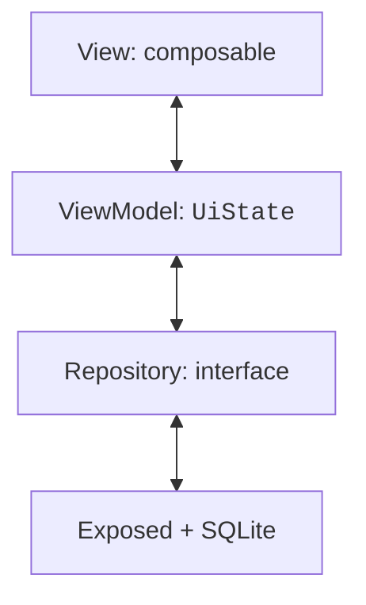
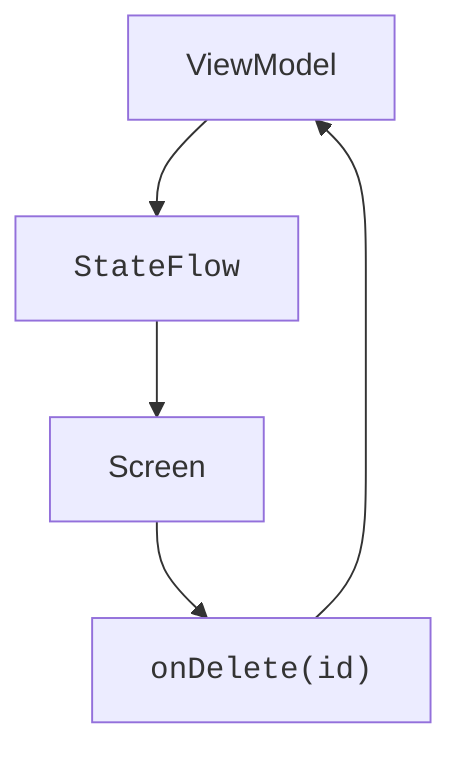

# MVVM and unidirectional data flow

## Why one composable is not enough

A local counter is convenient to store with `remember`. A catalog with search, read errors, saving, and several screens needs explicit boundaries of responsibility. If an SQL query, validation, and all components live in one function, a change to the interface is hard to distinguish from a change to the domain rules.

**MVVM** (*Model–View–ViewModel*) separates these roles. The **View** displays the state and passes on events. The **ViewModel** prepares the screen state and coordinates actions. The **Model** covers domain data and rules; the repository hides how the data is obtained. A folder name by itself does not create an architecture: what matters is the direction of dependencies.



Figure 16.1. The screen depends on the state, and database access has a separate boundary {.caption}

In a simple project, the packages `ui`, `domain`, and `data` make the boundaries visible. The ViewModel does not import `Button`, `NavHostController`, or JDBC tables. The repository does not show dialogs. A domain class does not need `@Composable`. Passing dependencies manually through the constructor is enough for the lab; Koin is a possible tool for larger projects, but it is not an MVVM requirement.

The official ViewModel guide: <https://kotlinlang.org/docs/multiplatform/compose-viewmodel.html>. Architecture principles and examples: <https://developer.android.com/topic/architecture>. Adapt Android-oriented examples to the desktop lifecycle.

## Consistent dependencies

Use the desktop Gradle project from Topic 15. Add the serialization plugin with the same version as Kotlin, and the dependencies listed. Navigation Compose 2.9.2 is used as a specific, verifiable API branch with `NavHost`, not as a claim about the newest navigation. Navigation 3 takes a different approach; there is no need to mix their examples.

```kotlin
// In plugins:
kotlin("plugin.serialization") version "2.4.20"

// In dependencies:
implementation(
    "org.jetbrains.androidx.lifecycle:" +
        "lifecycle-viewmodel-compose:2.10.0"
)
implementation(
    "org.jetbrains.androidx.navigation:navigation-compose:2.9.2"
)
implementation(
    "org.jetbrains.kotlinx:kotlinx-serialization-json:1.9.0"
)
implementation("org.jetbrains.exposed:exposed-core:1.4.0")
implementation("org.jetbrains.exposed:exposed-jdbc:1.4.0")
implementation("org.xerial:sqlite-jdbc:3.53.1.0")
testImplementation(kotlin("test"))
testImplementation(
    "org.jetbrains.kotlinx:kotlinx-coroutines-test:1.11.0"
)
testRuntimeOnly("org.junit.platform:junit-platform-launcher")
```

On desktop, the `kotlinx-coroutines-swing` module from the previous topic is needed for `Dispatchers.Main`, which `viewModelScope` uses. Having only `kotlinx-coroutines-core` does not install the main dispatcher of the graphical platform. For tests, `tasks.test { useJUnitPlatform() }` runs kotlin.test via the JUnit Platform.

Each complete example below is run separately as `Main.kt`. Long Gradle coordinate strings can be moved into a version catalog: this does not affect the packages of the Kotlin imports. Keep shared dependencies in one place to avoid accidentally different versions.

## Unidirectional data flow

The ViewModel exposes an immutable `StateFlow<UiState>`. The screen reads it via `collectAsState` and sends events through ordinary callback functions. After an event, the ViewModel validates the data, calls the repository, and publishes a new state. The UI does not modify the internal MutableStateFlow itself.



Figure 16.2. State flows to the screen, and events return to the owner {.caption}

A `UiState` should describe what needs to be displayed: the data, a loading flag, a draft, an error. A set of independent booleans can allow a contradictory combination such as "Loading and Error at the same time". For mutually exclusive states, a sealed hierarchy `Loading`, `Success`, `Error` fits; for a form with data and background saving, a data class with clear invariants is convenient.

### Example 1. A counter with a ViewModel

`viewModel { ... }` binds the instance to the current ViewModelStoreOwner. An ordinary constructor call in a composable would create a new object on re-execution. Local state such as focus or an open simple menu can still remain in the View via remember.

```kotlin
import androidx.compose.foundation.layout.*
import androidx.compose.material3.*
import androidx.compose.runtime.*
import androidx.compose.ui.Modifier
import androidx.compose.ui.unit.dp
import androidx.compose.ui.window.*
import androidx.lifecycle.ViewModel
import androidx.lifecycle.viewmodel.compose.viewModel
import kotlinx.coroutines.flow.*

class CounterViewModel : ViewModel() {
    private val mutable = MutableStateFlow(0)
    val count = mutable.asStateFlow()
    fun increment() { mutable.update { (it + 1).coerceAtMost(100) } }
    fun reset() { mutable.value = 0 }
}

@Composable
fun CounterScreen(model: CounterViewModel = viewModel {
    CounterViewModel()
}) {
    val count by model.count.collectAsState()
    Column(Modifier.padding(20.dp)) {
        Text("Count: $count")
        Button(onClick = model::increment, enabled = count < 100) {
            Text("Add")
        }
        Button(onClick = model::reset) { Text("Reset") }
    }
}

fun main() = application {
    Window(onCloseRequest = ::exitApplication, title = "MVVM") {
        MaterialTheme { CounterScreen() }
    }
}
```

A ViewModel does not mean automatic persistence after the process closes. The current value lives as long as its owner lives. `onCleared` is called when the store is cleared; `viewModelScope` is canceled. Do not keep a reference to a window, a component, or an arbitrary UI context in a ViewModel longer than its lifetime.
