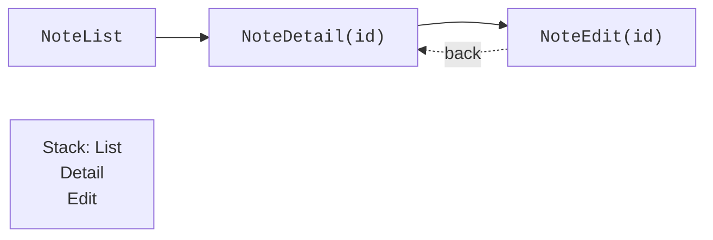

# Navigation as history state

## Navigation as history state

Separate screens have routes, arguments, and return rules. The **back stack** stores the history of transitions. `navigate` adds a destination, and `popBackStack` returns to the previous one. The "Back" button must not create a new instance of the list on top of the old history with every press.



Figure 16.3. An id is passed to the details screen, and going back removes the top entry {.caption}

A type-safe route is a `@Serializable` object or data class. For details, pass an id, not the whole mutable object. The data is read from the repository by this id; if the record has been deleted, the screen shows "not found". This protects against a stale copy and large serialized arguments.

### Example 2. Notes: a list and details

```kotlin
import androidx.compose.foundation.layout.*
import androidx.compose.material3.*
import androidx.compose.runtime.Composable
import androidx.compose.ui.Modifier
import androidx.compose.ui.unit.dp
import androidx.compose.ui.window.*
import androidx.navigation.compose.*
import androidx.navigation.toRoute
import kotlinx.serialization.Serializable

@Serializable object NoteList
@Serializable data class NoteDetail(val id: Int)

@Composable
fun NotesNavigation() {
    val notes = mapOf(1 to "Prepare the report", 2 to "Read the topic")
    val navigation = rememberNavController()
    NavHost(navigation, startDestination = NoteList) {
        composable<NoteList> {
            Column(Modifier.padding(20.dp)) {
                Text("Notes")
                for ((id, title) in notes) {
                    Button(onClick = {
                        navigation.navigate(NoteDetail(id))
                    }) { Text(title) }
                }
            }
        }
        composable<NoteDetail> { entry ->
            val route = entry.toRoute<NoteDetail>()
            Column(Modifier.padding(20.dp)) {
                Text(notes[route.id] ?: "Note not found")
                Button(onClick = { navigation.popBackStack() }) {
                    Text("Back")
                }
            }
        }
    }
}

fun main() = application {
    Window(onCloseRequest = ::exitApplication,
        title = "Notes navigation") {
        MaterialTheme { NotesNavigation() }
    }
}
```

After selecting the second row, the screen shows "Read the topic"; going back restores the list. For an unknown id, an explicit message is shown. The route must not silently substitute the first record. The official guide: <https://kotlinlang.org/docs/multiplatform/compose-navigation.html>.

In a large program, the details screen receives an `id` and `onBack`, not the whole NavController. Then the UI can be tested without a real graph. For editing, a separate route is created with an id, or a nullable id for a new record; after saving, return only after the repository has confirmed the result.
