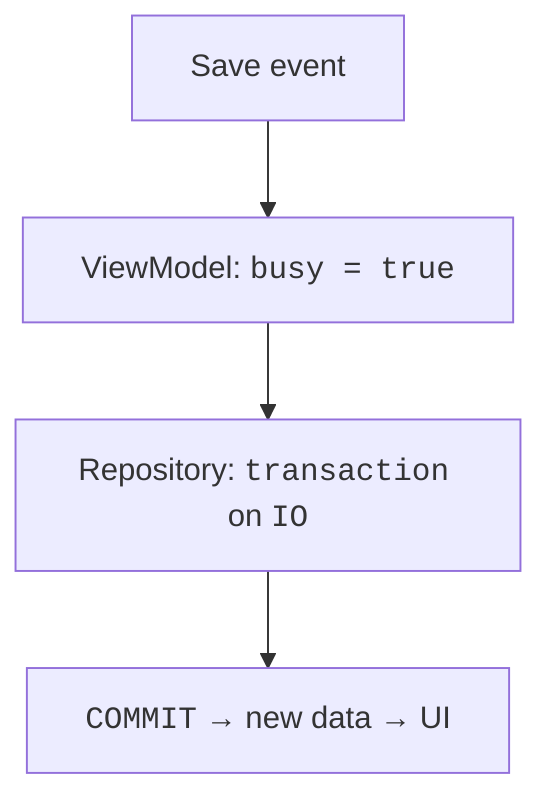

# Repository and loading data

## The repository boundary and the loading lifecycle

The repository interface describes domain operations. The Exposed implementation opens short transactions on IO, while a fake implementation returns controlled data for a test. The ViewModel receives the interface through its constructor; creating the SQLite database and choosing the implementation happen at the application's root.

The SQLite file is stored in a directory accessible to the user, not next to the installer. In the JVM example we use `user.home/.course-notes/notes.db`. This is an educational path that must be explained to the user. In a real KMP project, choosing a system directory can be hidden behind a platform API or `expect`/`actual`; a shared screen must not know a Windows path.



Figure 16.4. The UI changes after the transaction completes {.caption}

After the data changes, the repository can emit a new Flow value, or the ViewModel explicitly reloads the list. Exposed JDBC by itself does not turn every SELECT into a reactive observation. In a small application, re-reading after a successful write is simple and sufficient; external changes require a different refresh policy.

### Example 3. Notes with a persistent SQLite database

The following program is self-contained: it includes the schema, the repository, the ViewModel, the screen, and the entry point. For readability, it keeps adding, viewing, and deleting; an editing route is added following the principle of the previous example. Repeated clicks are blocked during an operation, and the draft is cleared only after success.

```kotlin
import java.nio.file.Files
import java.nio.file.Path
import androidx.compose.foundation.layout.*
import androidx.compose.foundation.lazy.LazyColumn
import androidx.compose.foundation.lazy.items
import androidx.compose.material3.*
import androidx.compose.runtime.*
import androidx.compose.ui.Modifier
import androidx.compose.ui.unit.dp
import androidx.compose.ui.window.*
import androidx.lifecycle.ViewModel
import androidx.lifecycle.viewModelScope
import androidx.lifecycle.viewmodel.compose.viewModel
import kotlinx.coroutines.*
import kotlinx.coroutines.flow.*
import org.jetbrains.exposed.v1.core.*
import org.jetbrains.exposed.v1.jdbc.*
import org.jetbrains.exposed.v1.jdbc.transactions.transaction

data class Note(val id: Int, val title: String)
interface NoteRepository {
    suspend fun all(): List<Note>
    suspend fun add(title: String)
    suspend fun delete(id: Int)
}
object NotesTable : Table("notes") {
    val id = integer("id").autoIncrement()
    val title = varchar("title", 120)
    override val primaryKey = PrimaryKey(id)
}

class SqliteNotes(private val db: Database) : NoteRepository {
    suspend fun initialize() = withContext(Dispatchers.IO) {
        transaction(db) { SchemaUtils.create(NotesTable) }
    }
    override suspend fun all(): List<Note> =
        withContext(Dispatchers.IO) {
            transaction(db) {
                NotesTable.selectAll().orderBy(NotesTable.id).map {
                    Note(it[NotesTable.id], it[NotesTable.title])
                }
            }
        }
    override suspend fun add(title: String): Unit =
        withContext(Dispatchers.IO) {
            require(title.trim().length in 1..120)
            transaction(db) {
                NotesTable.insert {
                    it[NotesTable.title] = title.trim()
                }
            }
        }
    override suspend fun delete(id: Int): Unit =
        withContext(Dispatchers.IO) {
            transaction(db) {
                val deleted = NotesTable.deleteWhere {
                    NotesTable.id eq id
                }
                check(deleted == 1)
            }
        }
}

data class NotesState(
    val notes: List<Note> = emptyList(),
    val draft: String = "",
    val busy: Boolean = false,
    val error: String? = null
)

class NotesViewModel(private val repository: NoteRepository)
    : ViewModel() {
    private val mutable = MutableStateFlow(NotesState())
    val state = mutable.asStateFlow()

    fun edit(text: String) {
        if (!mutable.value.busy) {
            mutable.update { it.copy(draft = text, error = null) }
        }
    }
    fun reload() = perform { repository.all() }
    fun add() {
        val text = mutable.value.draft.trim()
        if (text.length !in 1..120) {
            mutable.update {
                it.copy(error = "1–120 characters required")
            }
            return
        }
        perform(clearDraft = true) {
            repository.add(text)
            repository.all()
        }
    }
    fun delete(id: Int) = perform {
        repository.delete(id)
        repository.all()
    }
    private fun perform(clearDraft: Boolean = false,
        action: suspend () -> List<Note>) {
        if (mutable.value.busy) return
        mutable.update { it.copy(busy = true, error = null) }
        viewModelScope.launch {
            try {
                val notes = action()
                mutable.update {
                    it.copy(notes = notes,
                        draft = if (clearDraft) "" else it.draft)
                }
            } catch (e: CancellationException) {
                throw e
            } catch (e: Exception) {
                mutable.update {
                    it.copy(error = "The operation failed")
                }
            } finally {
                mutable.update { it.copy(busy = false) }
            }
        }
    }
}

@Composable
fun NotesScreen(model: NotesViewModel) {
    val state by model.state.collectAsState()
    LaunchedEffect(model) { model.reload() }
    Column(Modifier.padding(16.dp)) {
        OutlinedTextField(state.draft, onValueChange = model::edit,
            label = { Text("New note") }, enabled = !state.busy)
        Row {
            Button(onClick = model::add, enabled = !state.busy) {
                Text("Add")
            }
            Button(onClick = model::reload, enabled = !state.busy) {
                Text("Refresh")
            }
        }
        if (state.busy) LinearProgressIndicator()
        state.error?.let { Text(it) }
        if (state.notes.isEmpty() && !state.busy) {
            Text("No notes")
        }
        LazyColumn {
            items(state.notes, key = { it.id }) { note ->
                Row {
                    Text(note.title, Modifier.weight(1f))
                    TextButton(enabled = !state.busy,
                        onClick = { model.delete(note.id) }) {
                        Text("Delete")
                    }
                }
            }
        }
    }
}

fun main() {
    val directory = Path.of(System.getProperty("user.home"),
        ".course-notes")
    Files.createDirectories(directory)
    val db = Database.connect(
        "jdbc:sqlite:${directory.resolve("notes.db")}",
        "org.sqlite.JDBC")
    val repository = SqliteNotes(db)
    runBlocking { repository.initialize() }
    application {
        Window(onCloseRequest = ::exitApplication,
            title = "Notes") {
            val model = viewModel { NotesViewModel(repository) }
            MaterialTheme { NotesScreen(model) }
        }
    }
}
```

The database is initialized before the window opens; `runBlocking` here is the startup boundary, not a UI handler. For a slow migration, a separate startup state can be shown. If creating the directory or the database fails, the program must not start working with a seemingly empty catalog and then overwrite the user's data.

After a successful INSERT, the next SELECT can in theory also fail. The message "The operation failed" then does not prove that the record does not exist. The "Refresh" button lets you check the state; critical operations use a request identifier and idempotency so that a retry does not create duplicates.

::: info Screenshot
Run persistent Notes; add two titles; show enabled controls.
:::

Figure 16.5. Notes read from SQLite {.caption}

::: info Screenshot
Run navigation example, select second note, show Back.
:::

Figure 16.6. Note details and an explicit way back {.caption}

::: info Screenshot
Open the demo SQLite file in DataGrip; no personal records.
:::

Figure 16.7. Confirming the saved data in the notes table {.caption}
