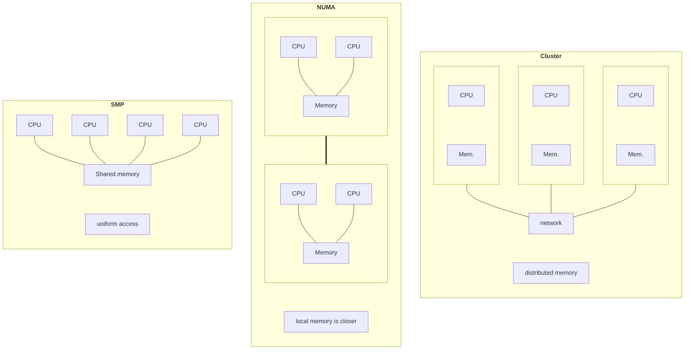
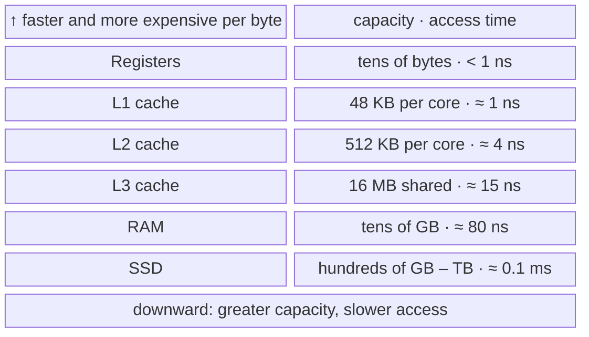
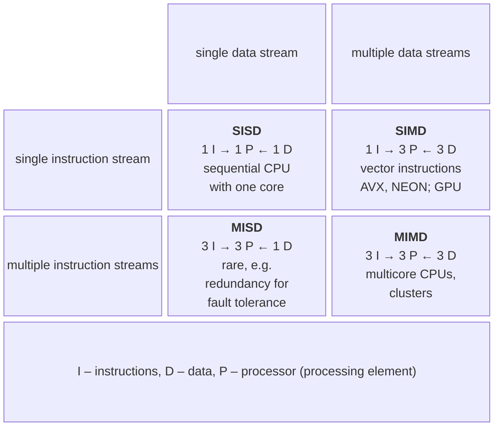

# Parallel system architectures

## Shared-memory systems

In a **shared-memory system** (*shared memory*), all processors access the same RAM, so threads can exchange data through shared variables (Fig. 1.1). These are the systems covered in Module 1.

Figure 1.1. Shared-memory (SMP, NUMA) and distributed-memory systems {.caption}

- **SMP** (*symmetric multiprocessing*) — all processors are peers and have equally fast access to all memory. A modern multicore desktop processor is an SMP system on a single chip.
- **NUMA** (*non-uniform memory access*) — memory is divided among **NUMA nodes**: each processor (socket) has its own local memory and accesses another node’s memory more slowly through an interprocessor connection. NUMA is typical of servers with multiple sockets; a program runs faster when a thread processes data stored in the memory of “its own” node (Topic 10).
- **SMT** (*simultaneous multithreading*), called **Hyper-Threading** on Intel processors, lets one physical core execute two hardware threads, so the operating system sees two **logical processors**. The second thread uses the core’s idle time (while waiting for data from memory), so it usually provides 10–30% more performance rather than doubling it.
- **Hybrid processors** (Intel from the 12th generation onward, Apple M, and many ARM processors) have high-performance **P-cores** (*performance cores*) and energy-efficient **E-cores** (*efficient cores*) with different speeds. The OS scheduler distributes threads between them, so identical parts of a parallel program may take different amounts of time. The processor in the lab computers is not hybrid.

Windows Task Manager shows the number of cores and logical processors and the cache sizes (Fig. 1.2); on Linux, use the `lscpu` and `nproc` commands (Fig. 1.3).

::: info Screenshot
Task Manager → Performance → CPU; right-click graph → Change graph to → Logical processors; cores, logical processors, L1–L3 cache
:::

Figure 1.2. Processor information in Task Manager {.caption}

::: info Screenshot
Ubuntu 26.04 (WSL2) terminal: `lscpu` and `nproc`; Sockets, Cores per socket, Threads per core, NUMA nodes, caches
:::

Figure 1.3. Processor topology in Ubuntu {.caption}

### Memory hierarchy

A processor executes instructions much faster than RAM supplies data. To keep it busy, several levels of **cache** (*cache*) — small, fast memory on the processor chip — sit between them (Fig. 1.4). Each core has L1 and L2 caches, while the L3 cache is shared by all cores.

Figure 1.4. Computer memory hierarchy (cache sizes are for the i9-11900KF) {.caption}

Data moves into the cache in blocks called **cache lines** (*cache lines*), usually 64 bytes long. If the required data is in the cache, this is a **cache hit** (*cache hit*); otherwise, it is a **cache miss** (*cache miss*), and the processor waits tens of times longer for RAM. A program runs quickly when it has good **data locality** (*data locality*): it accesses neighboring array elements one after another. Cache matters in two ways for parallel programs: threads compete for the shared L3 cache, and writes by multiple threads to a shared cache line cause **false sharing** (Topic 4).

## Distributed-memory systems

In a **distributed-memory system** (*distributed memory*), each node has its own memory, and data travels between nodes as messages over a network (Fig. 1.1, right). Such a system scales to thousands of nodes, but transferring data over the network is thousands of times slower than accessing memory.

- **Cluster** (*cluster*) — a group of ordinary servers connected by a network and managed by a job scheduler (Slurm in Topic 13).
- **MPP** (*massively parallel processing*) — a supercomputer with specially designed nodes and its own high-speed network.
- **Grid** (*grid*) — a combination of geographically distributed resources belonging to different organizations.
- **Cloud** (*cloud*) — virtual machines and containers rented from a provider on demand (Module 3).

The network determines communication speed. Standard **Ethernet** offers bandwidth from 1 to 800 Gbit/s, while clusters often use **InfiniBand** with bandwidth up to 400–800 Gbit/s and latency of a few microseconds. By comparison, RAM access takes about 100 ns.

Twice a year, the **TOP500** ranking (<https://top500.org/>) lists the world’s most powerful supercomputers by their floating-point operations per second (*FLOPS*) on the HPL benchmark. In the June 2026 list, LineShine (China, about 13.8 million cores, 2.2 exaflops, or $2 {,} 2 \cdot 10^{18}$ operations per second) ranks first, and El Capitan (USA) ranks second. Every system in the ranking runs Linux.

## Flynn’s taxonomy

In 1966, Michael Flynn (*Michael Flynn*) proposed classifying computing systems by the number of **instruction streams** (*instruction streams*) and **data streams** (*data streams*) processed simultaneously (Fig. 1.5).

Figure 1.5. Flynn’s taxonomy {.caption}

- **SISD** (*single instruction, single data*) — a sequential computer: one instruction processes one data element.
- **SIMD** (*single instruction, multiple data*) — one instruction processes many elements simultaneously: the SSE, AVX, AVX-512, and NEON processor vector extensions (Topic 7).
- **MISD** (*multiple instruction, single data*) — different instructions operate on the same data; rare in practice, for example in fault-tolerant systems that compute the same result several times.
- **MIMD** (*multiple instruction, multiple data*) — several processors independently execute different instructions on different data: multicore processors and clusters. Most parallel systems belong to this class.

MIMD is further classified by how programs are written. In the **SPMD** (*single program, multiple data*) model, all processes execute one program on different parts of the data, and their behavior depends on the process number; MPI programs work this way (Topic 12). In the **MPMD** (*multiple program, multiple data*) model, different nodes execute different programs, such as a client and a server. NVIDIA graphics processors are described as **SIMT** (*single instruction, multiple threads*): one kernel function runs in thousands of lightweight threads, each working on its own data element (Topic 11).
