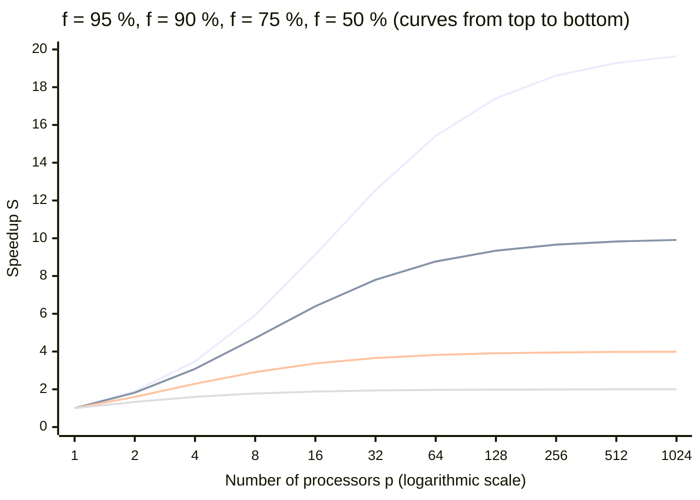
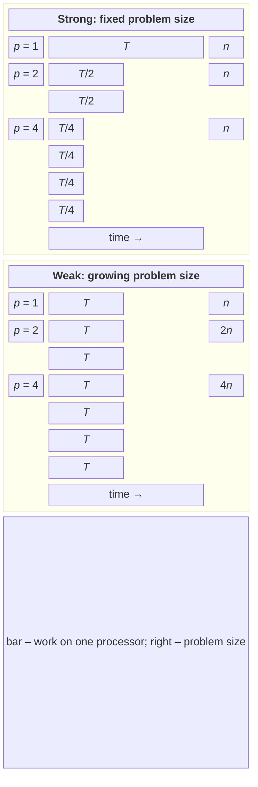

# Models, metrics, and scaling laws

## Parallelism models

The way work is divided determines the **parallelism model** (Table 1.1).

Table 1.1. Parallelism models {.caption}

| **Model** | **Description** | **In this course** |
| --- | --- | --- |
| Data parallelism (*data parallelism*) | the same operation on different parts of a large dataset | Topics 6, 7, 10, 11 |
| Task parallelism (*task parallelism*) | different independent tasks run simultaneously | Topics 5, 10 |
| Pipeline (*pipeline*) | data passes through successive stages, each running in its own thread | Topics 4, 15 |
| Master–worker (*master–worker*) | the main process distributes pieces of work to workers and collects the results | Topics 2, 12, 13 |
| Message passing (*message passing*) | processes without shared memory communicate only through messages | Topics 12, 14–16 |

Choose a model based on the problem: image processing naturally divides the data into parts, a web server handles independent requests as tasks, and a pipeline is a convenient way to describe event-stream processing.

## Parallel program metrics

Let $T_{1}$ be the program’s execution time on one processor (using the best sequential algorithm), and $T_{p}$ its execution time on $p$ processors. Then:

- **speedup** (*speed-up*) $S_{p} = T_{1} / T_{p}$ — how many times faster the parallel program is than the sequential one;
- **efficiency** (*efficiency*) $E_{p} = S_{p} / p$ — the fraction of each processor’s capacity used;
- **cost** (*cost*) $C_{p} = p \cdot T_{p}$ — total processor time; with ideal parallelization, it equals $T_{1}$.

Ideal, **linear** speedup $S_{p} = p$ means 100% efficiency. In practice, $S_{p} \lt p$ because of sequential sections, overhead, and competition for memory and cache. Sometimes **superlinear** speedup $S_{p} \gt p$ occurs. The most common reason is cache: the part of an array assigned to one thread fits in L2 or L3 cache, whereas the entire array did not. Other reasons include a search that ends as soon as one thread finds the answer, or comparison against an inefficient sequential algorithm.

For example, if $T_{1} = 120$ s and $T_{8} = 20$ s on 8 cores, then $S_{8} = 6$, $E_{8} = 75$%, and the cost $C_{8} = 160$ s of processor time — 40 s more than the sequential program.

## Amdahl’s law

Suppose a fraction $f$ of a sequential program’s execution time is spent on code that can be parallelized, and a fraction $1 - f$ on sequential code (reading input, initialization, writing the result). On $p$ processors, the parallel part becomes $p$ times faster while the sequential part stays the same: $$T_{p} = (1 - f) T_{1} + \frac{f T_{1}}{p} .$$ This gives the speedup under **Amdahl’s law** (*Amdahl’s law*, 1967): $$S_{p} = \frac{T_{1}}{T_{p}} = \frac{1}{(1 - f) + f / p} .$$

As $p \to \infty$, the term $f / p$ approaches zero, and speedup cannot exceed $$S_{\infty} = \frac{1}{1 - f} .$$ If the parallel part accounts for 95%, the program can never become more than 20 times faster, regardless of the number of processors; at $f = 90$%, the limit is 10 (Fig. 1.6). With 64 processors and $f = 90$%, speedup is only 8.8 and efficiency is 14%: most processors sit idle while the sequential part runs.

Figure 1.6. Speedup under Amdahl’s law for different parallel fractions $f$ {.caption}

Conclusions from Amdahl’s law:

- first reduce the sequential fraction of the program, then add processors;
- each doubling of the processor count provides a smaller gain;
- the law ignores overhead, so actual speedup is even lower: with too many threads, execution time can even increase.

## The Gustafson–Barsis law and scalability

Amdahl’s law considers a **fixed-size problem**. In 1988, John Gustafson (*John Gustafson*) and Edwin Barsis (*Edwin Barsis*) pointed out that more processors are usually used to solve a **larger** problem: a finer weather-forecasting grid, more pixels, or more particles. The sequential part (reading parameters, collecting the result) grows only slightly.

Let $s$ be the sequential fraction measured **on a parallel system** with $p$ processors. The same amount of work would take $s + p (1 - s)$ on one processor, giving the **scaled speedup** under the Gustafson–Barsis law: $$S_{p} = s + p (1 - s) = p - s (p - 1) .$$ At $s = 5$% on 64 processors, $S = 60 {,} 85$ — speedup grows almost linearly.

The two laws do not contradict each other; they correspond to two ways of evaluating a program’s **scalability** (*scalability*) (Fig. 1.7):

- **strong scaling** (*strong scaling*) — the problem size stays fixed while the processor count increases; the goal is to reduce execution time (Amdahl’s law);
- **weak scaling** (*weak scaling*) — the problem size grows in proportion to the processor count; the goal is to keep execution time constant (Gustafson’s law).

Figure 1.7. Strong and weak scaling {.caption}

### The Karp–Flatt metric

Measured speedup can estimate the fraction of a program that effectively behaves sequentially. The **experimentally determined serial fraction** (*experimentally determined serial fraction*), or **Karp–Flatt metric** (*Karp–Flatt metric*, 1990), is: $$e = \frac{1 / S_{p} - 1 / p}{1 - 1 / p} .$$ If $e$ barely changes as $p$ increases, sequential code is limiting speedup. If $e$ increases, the main cause is overhead (synchronization, data exchange, competition for cache and memory) that grows with the number of threads. For example, for $S_{8} = 6$, we get $e = (1 / 6 - 1 / 8) / (1 - 1 / 8) \approx 0 {,} 048$.
