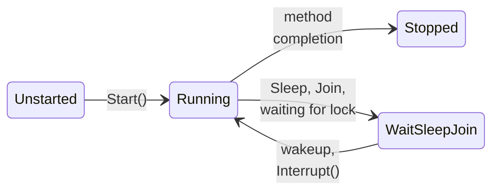

# Processes and the Thread class in .NET

## Processes in .NET

The `System.Diagnostics.Process` class starts other programs and provides access to running processes (`Process.GetProcesses`, `GetProcessById`, `GetCurrentProcess`) and their properties: `Id`, `ProcessName`, `Threads.Count`, `WorkingSet64`, `TotalProcessorTime`, and `StartTime`. The `ProcessStartInfo` class describes startup settings:

- `FileName` and `ArgumentList` — the program and arguments (each argument is a separate string, with no manual escaping of spaces);
- `RedirectStandardOutput`, `RedirectStandardError`, `RedirectStandardInput` — redirect I/O streams to the parent program (together with `UseShellExecute = false`);
- `WorkingDirectory`, `Environment`, `CreateNoWindow`.

The `WaitForExit` method waits for a process to finish, and `ExitCode` returns its **exit code**: 0 means success; any other value is an error defined by the program (the value returned from `Main` or passed to `Environment.Exit(code)`):

```cs
ProcessStartInfo info = new("dotnet", "--version")
{
    RedirectStandardOutput = true,   // read output in the program
    UseShellExecute = false,
};
using (Process process = Process.Start(info)!)
{
    string version = process.StandardOutput.ReadToEnd().Trim();
    process.WaitForExit();
    Console.WriteLine($"SDK {version}, code {process.ExitCode}");
}
```

```
SDK 10.0.401, code 0
```

Several worker processes provide parallelism without shared memory: each receives its part of the problem through arguments and returns its result through standard output or an exit code. This approach is reliable (one worker’s failure does not corrupt the others) and scales to multiple computers, as MPI does (Topic 12), but starting a process costs tens of milliseconds, and data must be serialized.

::: tip Warning
If both `StandardOutput` and `StandardError` are redirected and the child process writes large amounts of data to both, reading one sequentially with `ReadToEnd` can block: the other stream’s buffer fills up and the child process waits. Read large volumes asynchronously (the `OutputDataReceived` event), or do not redirect standard error.
:::

## The Thread class

The `System.Threading.Thread` class creates a separate OS thread. Its constructor accepts a `ThreadStart` delegate (a parameterless method) or a `ParameterizedThreadStart` delegate (a method with an `object?` parameter), and `Start` starts the thread. `Join` blocks the calling thread until the target thread finishes (a timeout overload returns `bool`). Table 2.2 lists the main members.

```cs
Thread worker = new(() => Console.WriteLine("Working in a thread"))
{
    Name = "Worker 1",           // the name is visible in the debugger
    IsBackground = true,         // does not keep the process alive
};
worker.Start();
worker.Join();                   // wait for completion

Thread printer = new(s => Console.WriteLine($"Received: {s}"));
printer.Start("\u0437\u0432\u0456\u0442.txt");       // an object? parameter
printer.Join();
```

Passing data to a thread through a lambda that captures variables is more convenient than using `object?`. In a `for` loop, the lambda captures a single counter variable, so first copy its value into a local variable inside the loop body (`int index = i;`). Store the thread’s result in a variable or array element read after `Join`; each thread should write to **its own** element so threads do not compete for the same data (Topic 3).

Table 2.2. Main members of the `Thread` class {.caption}

| **Member** | **Purpose** |
| --- | --- |
| `Start()`, `Start(object?)` | start a thread; calling again throws `ThreadStateException` |
| `Join()`, `Join(TimeSpan)` | wait for thread completion |
| `Name` | a name for the debugger and logs |
| `IsBackground` | a background thread does not keep the process alive |
| `Priority` | the `ThreadPriority` level (`Lowest`…`Highest`) |
| `ManagedThreadId` | the managed thread identifier (also `Environment.CurrentManagedThreadId`) |
| `ThreadState`, `IsAlive` | the current thread state |
| `IsThreadPoolThread` | whether the thread belongs to the thread pool |
| `Thread.CurrentThread` | the thread object executing the current code |

### Foreground and background threads

A thread created with `Thread` is a **foreground** (*foreground*) thread by default: the process does not exit until all foreground threads finish, even if `Main` has already returned. A **background** thread (*background*, `IsBackground = true`) does not keep the process alive: when the last foreground thread finishes, the runtime stops background threads without executing `finally` blocks. Make supporting threads (monitoring, periodic polling) background threads, and perform work that must not be interrupted (writing a file) in a foreground thread or wait for it with `Join`. All thread pool threads are background threads.

### Thread states

The `ThreadState` property returns a thread’s state (Fig. 2.6). A new thread is `Unstarted`; after `Start`, it is `Running` (ready or executing — .NET does not distinguish them); during `Sleep`, `Join`, or waiting for a lock, it is `WaitSleepJoin`; after its method finishes, it is `Stopped`. The state can change at any moment, so use `ThreadState` only for diagnostics, not to control program logic.



Figure 2.6. Main states of a managed thread {.caption}

### Waiting: Sleep, Yield, SpinWait

- `Thread.Sleep(ms)` puts a thread into a waiting state for at least the specified duration; the actual delay depends on the OS timer (on Windows, usually a multiple of 15.6 ms unless applications have increased the resolution). `Thread.Sleep(0)` yields the remainder of the time slice to a thread with the same priority.
- `Thread.Yield()` yields the remainder of the time slice to any ready thread on **the same** core and returns `true` if a switch occurs.
- The `SpinWait` structure performs **busy waiting** (*spinning*): a few iterations of an empty loop, followed by `Yield` and `Sleep` for longer waits. It is beneficial only when the condition will become true within microseconds, because it avoids the cost of a context switch.

```cs
SpinWait spinner = new();
while (!ready)                   // another thread changes ready
    spinner.SpinOnce();          // loop, then Yield/Sleep
```

Waiting for another thread’s result with `while (!done) { }` and no delay fully occupies a core. Use `Join` and synchronization primitives to wait for events (Topic 3).

### Stopping a thread

There is no safe way to forcibly “kill” a thread. In .NET 5 and later, `Thread.Abort` throws `PlatformNotSupportedException`: forced termination could leave data inconsistent (an unfinished write, an unreleased lock). Stop threads **cooperatively**: each thread periodically checks a stop-request flag and exits cleanly. Declare a flag modified by another thread as a `volatile` field so the JIT compiler does not cache its value. Topic 5 implements the same idea with the standard `CancellationToken`.

```cs
class Scanner
{
    private volatile bool stopRequested;

    public void RequestStop() => stopRequested = true;

    public void Run()
    {
        while (!stopRequested) { /* a unit of work */ }
    }
}
```

A thread blocked in `Sleep`, `Join`, or a wait can be awakened with `Interrupt`: it receives a `ThreadInterruptedException`, which it handles before exiting.

```cs
Thread sleeper = new(() =>
{
    try
    {
        Thread.Sleep(Timeout.Infinite);  // wait “forever”
    }
    catch (ThreadInterruptedException)
    {
        Console.WriteLine("Thread interrupted while waiting");
    }
});
sleeper.Start();
Thread.Sleep(100);
sleeper.Interrupt();
sleeper.Join();
```

### Exceptions in threads

An unhandled exception in any thread (created with `Thread` or from the pool) **terminates the entire process**: the runtime raises `AppDomain.CurrentDomain.UnhandledException` (for logging only) and crashes the program. The exception is **not** passed to the thread that called `Start` or `Join`, so a `try` around `Start` does not catch it. The thread method must catch exceptions itself and store the exception or error message in a field that the main thread checks after `Join`. TPL tasks (Topic 5) do this automatically: a task’s exception is rethrown when its result is awaited.

### Thread-local data

Sometimes each thread needs its own instance of a variable: a `Random` generator, buffer, or counter. **Thread-local storage** (*thread-local storage*) gives each thread a separate value:

- the `[ThreadStatic]` attribute on a static field gives each thread its own copy; the field initializer runs in only one thread, so other threads see the default value;
- the `ThreadLocal<T>` class accepts a value factory called separately for each thread; with `trackAllValues: true`, the `Values` property returns values from all threads.

```cs
using ThreadLocal<int> counter = new(() => 0, trackAllValues: true);
Thread[] threads = new Thread[3];
for (int i = 0; i < threads.Length; i++)
{
    threads[i] = new Thread(() =>
    {
        for (int k = 0; k < 1000; k++) counter.Value++;
    });
    threads[i].Start();
}
foreach (Thread t in threads) t.Join();
Console.WriteLine(string.Join(", ", counter.Values));
```

```
1000, 1000, 1000
```

Pool threads are reused by different jobs, so a value written to `ThreadLocal<T>` or `[ThreadStatic]` by one job may be “seen” by the next job on the same thread.
