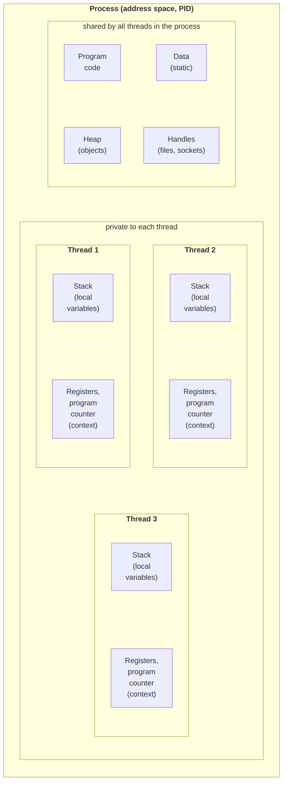

# OS processes and threads

## A process and its resources

A **process** (*process*) is a running program together with all the resources the operating system has allocated to it. Each process has:

- its own **virtual address space** (*address space*): program code, static data, a heap (*heap*) containing objects, and thread stacks; another process cannot read this memory directly;
- **handles** (*handles*) to open files, sockets, events, and registry keys;
- a **PID** identifier, environment variables, current directory, and user permissions;
- at least one **thread** executing code.

The operating system isolates processes from one another: a failure in one process does not corrupt another process’s memory. The cost of isolation is that processes can exchange data only through interprocess communication mechanisms (pipes, files, sockets, shared memory), and creating a process is more expensive than creating a thread. All threads in a process share its memory and handles, but each thread has its own stack and register set (Fig. 2.1).



Figure 2.1. Structure of a process with multiple threads {.caption}

A process goes through several **states**: creation, ready, running, waiting (for disk input, for example), and termination. More precisely, these are states of the process’s threads: the process runs as long as at least one of its foreground threads is running (see “The `Thread` class”).

### Viewing processes in Windows and Linux

On Windows, **Task Manager** (*Task Manager*, **Ctrl+Shift+Esc**) provides a convenient view of processes. On the *Details* tab, add the *Threads* and *Handles* columns (right-click the table header → *Select columns*) and sort processes by thread count (Fig. 2.2). Even a simple .NET console program has several threads: in addition to the main thread, the runtime creates service threads for garbage collection, finalization, timers, and debugging.

::: info Screenshot
Task Manager → Details, right-click header → Select columns → Threads, Handles; sort by Threads; the demo process visible
:::

Figure 2.2. Process thread counts in Task Manager {.caption}

On Linux, `ps` lists processes, while `top` and `htop` provide an interactive view. Each Linux thread appears as a separate **task** (*task*) with its own TID:

```bash
ps -eo pid,nlwp,comm --sort=-nlwp | head   # nlwp – number of threads
ps -T -p 4120                              # threads of process 4120
top -H -p 4120                             # top in thread mode
grep Threads /proc/4120/status             # from the /proc filesystem
ls /proc/4120/task                         # a directory for each thread
```

The `/proc` virtual filesystem contains a directory for each process: `status` (state, memory, thread count), `cmdline`, `fd` (open handles), and `task` (threads). The `htop` utility displays processes as a tree and threads as children of their process; names set in code with `Thread.Name` become visible after you enable the corresponding option (Fig. 2.3).

::: info Screenshot
Ubuntu terminal: htop, F2 → Display options → Tree view and Show custom thread names; the .NET demo process expanded with its threads
:::

Figure 2.3. Threads of a .NET process in htop {.caption}

## Operating system threads

A **thread** (*thread*) is the smallest unit of execution scheduled by the operating system. A thread has:

- a **stack** (*stack*) for local variables and return addresses; Windows reserves 1 MB of address space per thread by default;
- a **context** (*context*) — processor register values, including the program counter and stack pointer;
- a state (running, ready, waiting), a priority, and a mask of allowed processors.

.NET uses a **1:1 model**: each `System.Threading.Thread` object corresponds to one operating system thread. Everything said about OS threads therefore also applies to C# threads.

### Context switching

There are usually fewer processor cores than threads ready to run. The operating system gives threads turns on the cores. To hand a core to another thread, the OS kernel saves the current thread’s context and restores the next thread’s context. This operation is called a **context switch** (*context switch*). It has a direct cost (entering kernel mode, saving registers, selecting a thread) and an indirect one: the new thread works with different data, so the processor cache becomes “cold.” Direct costs are measured in microseconds, but thousands of switches per second noticeably slow down computation.

Creating a thread is also expensive: the OS allocates a stack and kernel structures, and the .NET runtime creates a managed thread object. Creating and starting a thread takes tens of microseconds. For short jobs, therefore, reuse existing threads from a **thread pool** instead of creating a new thread each time (see “The thread pool”).

::: tip Tip
Avoid creating more simultaneously active computation threads than logical processors (`Environment.ProcessorCount`): extra threads do not speed up the work and only add context switches.
:::
