# Scheduling and affinity

## Thread scheduling and priorities

The operating system **scheduler** (*scheduler*) decides which thread runs on which core. Windows and Linux use **preemptive multitasking** (*preemptive multitasking*): a thread receives a **time slice** (*time slice*, *quantum*) lasting from a few to tens of milliseconds. When it expires, or when the thread waits (I/O, `Thread.Sleep`, locking), the OS can give the core to another thread without asking the program’s permission (Fig. 2.4). As a result, the moment of switching between threads is unpredictable, and the order of lines printed by different threads changes between runs.

```mermaid
gantt
  title Boundaries between segments are context switches
  dateFormat x
  axisFormat %S
  tickInterval 1second
  section Core 0
    T1 · time slice : 0, 2000ms
    T3 : 2000, 2000ms
    T1 : 4000, 2000ms
    T4 : 6000, 1000ms
    T3 : 7000, 2000ms
  section Core 1
    T2 : 0, 2000ms
    T4 : 2000, 2000ms
    T2 waits for I/O and yields the rest of its time slice : 4000, 1200ms
    T4 : 5200, 3800ms
```



Figure 2.4. Scheduling four threads on two cores {.caption}

### Priorities in Windows

Windows schedules threads by **priority**, from 0 to 31: ready threads with the highest priority always run, and threads with equal priority receive time slices in turn (*round-robin*). Two values determine a thread’s base priority: the **process priority class** and the **thread priority level** within that class (Table 2.1). In .NET, these correspond to the `ProcessPriorityClass` enumeration (`Process.PriorityClass`) and `ThreadPriority` enumeration (`Thread.Priority`).

Table 2.1. Base thread priority in Windows by process class and thread level (`ThreadPriority`) {.caption}

| **Process class** <br>**(`ProcessPriorityClass`)** | `Lowest` | `BelowNormal` | `Normal` | `AboveNormal` | `Highest` |
| --- | --- | --- | --- | --- | --- |
| `Idle` | 2 | 3 | 4 | 5 | 6 |
| `BelowNormal` | 4 | 5 | 6 | 7 | 8 |
| `Normal` | 6 | 7 | **8** | 9 | 10 |
| `AboveNormal` | 8 | 9 | 10 | 11 | 12 |
| `High` | 11 | 12 | 13 | 14 | 15 |
| `RealTime` | 22 | 23 | 24 | 25 | 26 |

By default, a process uses the `Normal` class and a thread uses the `Normal` level, giving a base priority of 8. Windows temporarily **boosts** the priority (*priority boost*) of threads that have finished waiting for input or belong to the active window, keeping the interface responsive.

Raising the priority of computation threads is dangerous: a continuously busy high-priority thread denies CPU time to other threads, including system threads. The `RealTime` class is almost never used because it even preempts mouse and keyboard processing threads. Background computation, on the other hand, can reasonably run with the `BelowNormal` or `Idle` class to avoid disrupting the user.

### The Linux scheduler: an overview

On Linux, ordinary threads use the `SCHED_OTHER` (`SCHED_NORMAL`) policy. Their weight is determined by a **nice value** from −20 (highest priority) to 19 (lowest), with a default of 0. Each unit of difference in nice changes the share of CPU time by approximately a factor of 1.25. The `nice` command starts a program with a different value, while `renice` changes it for a running process (only an administrator can lower nice below 0):

```bash
nice -n 10 dotnet Render.dll        # start with lower priority
renice -n 5 -p 4120                 # change nice for process 4120
```

Since Linux kernel 6.6, ordinary threads have been scheduled by **EEVDF** (*Earliest Eligible Virtual Deadline First*), which replaced CFS (*Completely Fair Scheduler*). EEVDF tracks whether each thread has received its fair share of CPU time and, among eligible threads, selects the one with the earliest **virtual deadline**. Threads requesting shorter time slices get a core sooner, improving responsiveness. Separate real-time policies, `SCHED_FIFO` and `SCHED_RR`, use static priorities from 1 to 99 and always preempt ordinary threads.

The .NET `Thread.Priority` setting is mainly meaningful on Windows. On Linux, changing a thread’s priority without administrator privileges may have no effect, so use the process’s `nice` value instead.

## Processor affinity

**Processor affinity** (*processor affinity*) restricts the set of logical processors on which the scheduler may run a process’s threads. Without restrictions, the OS moves a thread between cores — **thread migration** (*thread migration*): after a move, the new core’s cache is “cold.” Affinity is used to:

- isolate heavy computation on some cores and leave the others for the system;
- measure speedup reproducibly on 1, 2, and 4 cores of the same computer;
- bind threads to cores in one NUMA node (Topic 10).

The mask uses bits: bit 0 represents logical processor 0, bit 1 processor 1, and so on. The value `0b0101` allows processors 0 and 2. In .NET, the `Process.ProcessorAffinity` property of type `nint` reads and changes the process mask (on Windows and Linux); the default is $2^{n} - 1$ for $n$ processors:

```cs
using Process self = Process.GetCurrentProcess();
self.ProcessorAffinity = 0b0101;       // processors 0 and 2 only
self.PriorityClass = ProcessPriorityClass.BelowNormal;
```

You can also set the mask when starting a program or for an existing process:

```powershell
cmd /c start /belownormal /affinity 5 Render.exe   # mask 0x5
```

```bash
taskset -c 0,2 dotnet Render.dll    # start on processors 0 and 2
taskset -cp 0-3 4120                # change the mask for process 4120
```

In Windows Task Manager, change the mask through the process’s context menu on the *Details* tab → *Set affinity* (Fig. 2.5). On processors with SMT (*Hyper-Threading*), the two logical processors of one physical core have adjacent numbers, so the mask `0b11` usually gives only one physical core (see the “Affinity and priority” example).

::: info Screenshot
Task Manager → Details → right-click the demo process → Set affinity; only CPU 0 and CPU 1 checked
:::

Figure 2.5. Setting process affinity in Task Manager {.caption}

Binding can also hurt performance: if you restrict a process to two logical processors and start 16 computation threads, they take turns on two cores. Do not fix affinity without measurements.
