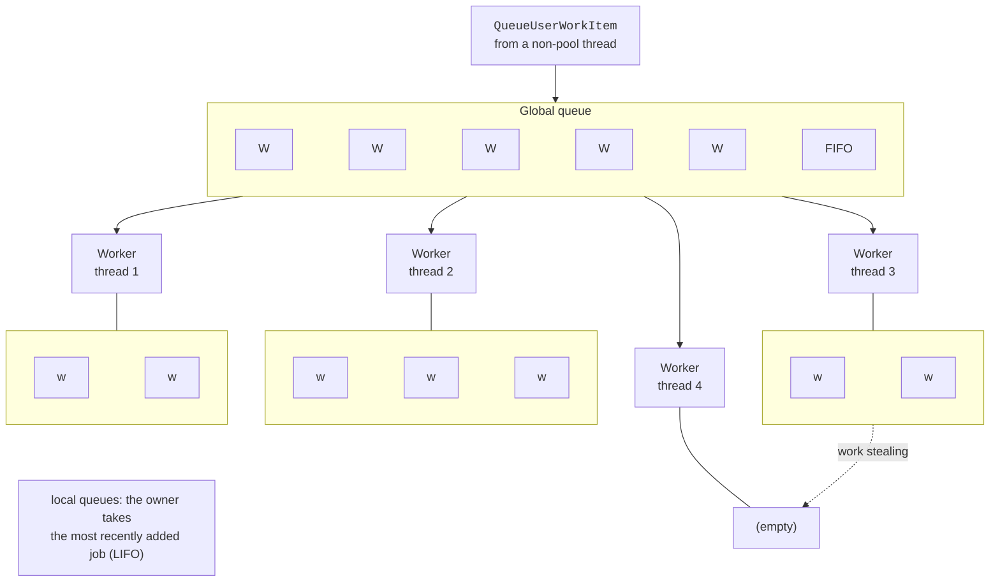

# The thread pool and monitoring

## The thread pool

A **thread pool** (*thread pool*) is a set of background worker threads that .NET creates once and reuses for short jobs. Each process has one pool. Queue work with `ThreadPool.QueueUserWorkItem`; an available pool thread takes it from the queue and executes it. The pool is used by `Task` and `Parallel` (Topics 5–6), `async`/`await` continuations, timers, and I/O completion handling.

```cs
ThreadPool.QueueUserWorkItem(_ => Console.WriteLine("Working in the pool"));
ThreadPool.QueueUserWorkItem(n => Console.WriteLine(n * n), 12,
    preferLocal: false);                   // strongly typed int state
```

`QueueUserWorkItem` does not return an object you can wait on, so wait for completion through a separate mechanism (the “Thread pool” example uses the existing `CountdownEvent` class, covered in detail in Topic 3).

### Pool queues and threads

The pool has a **global work queue** and a **local queue** for each worker thread (Fig. 2.7). Work submitted from outside the pool enters the global queue (FIFO). Work submitted from a pool thread (`preferLocal: true` or TPL tasks) enters its local queue: the owner takes the most recently added job because its data is still in cache. A thread with an empty queue takes work from the global queue; if that is empty too, it “steals” the oldest job from another thread’s local queue (**work stealing**, *work stealing*). This balances the load without a central coordinator.



Figure 2.7. .NET thread pool queues {.caption}

The pool has two kinds of threads: **worker threads** (*worker threads*) for computation and **I/O completion threads** (*I/O completion threads*). `GetMinThreads`/`GetMaxThreads` return thread-count limits, `ThreadPool.ThreadCount` gives the current count, `PendingWorkItemCount` gives the queue length, and `CompletedWorkItemCount` gives the number of completed jobs.

Until it reaches the **minimum** (the number of logical processors by default), the pool creates threads immediately on demand. Above the minimum, the **hill climbing** algorithm adjusts the count: the pool tentatively adds or removes a thread and keeps the change if throughput (jobs completed per unit of time) increases. New threads are added gradually, with a delay.

### Thread pool starvation

If pool jobs **block** (`Thread.Sleep`, synchronous network or file waits), pool threads sit idle while the queue grows. This is **thread pool starvation** (*thread pool starvation*): new jobs wait a long time to start even though the CPU is free. The program queues 40 jobs, each blocking a thread for 3 s, and prints the pool thread count and queue length twice per second:

```cs
using System.Diagnostics;

Console.OutputEncoding = System.Text.Encoding.UTF8;

if (args is ["--min", var text])            // e.g. --min 48
{
    ThreadPool.GetMinThreads(out _, out int io);
    ThreadPool.SetMinThreads(int.Parse(text), io);
}

// 40 jobs block pool threads for 3 s each.
for (int i = 0; i < 40; i++)
    ThreadPool.QueueUserWorkItem(_ => Thread.Sleep(3_000));

Stopwatch clock = Stopwatch.StartNew();
while (clock.ElapsedMilliseconds < 3_000)
{
    Console.WriteLine(
        $"{clock.ElapsedMilliseconds,5} ms: threads " +
        $"{ThreadPool.ThreadCount,2}, queued " +
        $"{ThreadPool.PendingWorkItemCount,2}");
    Thread.Sleep(500);
}
```

```
PS> .\S2Starve.exe
    0 ms: threads  3, queued 37
  514 ms: threads 16, queued 24
 1029 ms: threads 17, queued 23
 1546 ms: threads 17, queued 23
 2062 ms: threads 18, queued 22
 2563 ms: threads 18, queued 22
PS> .\S2Starve.exe --min 48
    0 ms: threads  2, queued 39
  504 ms: threads 41, queued  0
```

The pool quickly creates 16 threads (the minimum on a computer with 16 logical processors), then adds approximately one thread every half-second to a second: 22 jobs remain queued. After `SetMinThreads(48, …)`, all jobs start immediately. However, raising the minimum only hides the problem: the correct solution is to avoid blocking pool threads (asynchronous I/O, Topic 5) and run long blocking jobs in separate `Thread` threads.

Use a dedicated `Thread` instead of the pool when it needs a special priority, name, or stable identity, runs for the entire program lifetime, blocks for a long time, or must be a foreground thread (*foreground*).

### The System.Threading.Timer timer

The `System.Threading.Timer` class periodically calls a method on a pool thread. The constructor accepts a `TimerCallback` delegate, state, initial delay (`dueTime`), and interval (`period`). `Change` updates the schedule, and `Dispose` stops the timer:

```cs
int ticks = 0;
using (Timer timer = new(_ =>
{
    int n = Interlocked.Increment(ref ticks);
    Console.WriteLine($"Tick {n} on a pool thread: " +
        Thread.CurrentThread.IsThreadPoolThread);
}, null, dueTime: 0, period: 100))
{
    Thread.Sleep(350);
}
```

```
Tick 1 on a pool thread: True
Tick 2 on a pool thread: True
Tick 3 on a pool thread: True
Tick 4 on a pool thread: True
```

Keep the timer callback short. If it runs longer than the period, the next invocation starts on another pool thread in parallel with the previous one, so protect shared data (here with the atomic increment `Interlocked.Increment`, Topic 3). Keep a reference to the timer: a timer with no references can be garbage-collected.

## Partitioning a computation among N threads

The simplest parallel array algorithm uses **partitioning** (*partitioning*):

- divide an array of length $L$ into $N$ contiguous parts of length $L / N$ (the last part takes the remainder);
- each thread processes its part and writes its result to its own element in the results array;
- the main thread waits for every thread with `Join` and combines the partial results;
- compare the result with a sequential computation.

Measure speedup $S_{N} = T_{1} / T_{N}$ and efficiency $E_{N} = S_{N} / N$ (Topic 1) for $N = 1 , 2 , 4 , …$, with warmup and the median of several runs in *Release* configuration. In practice, speedup is limited by:

- thread creation **overhead** (for small arrays, the parallel version is slower);
- **memory bandwidth**: simple operations on large arrays are limited by memory read speed rather than cores;
- **SMT**: the i9-11900KF’s 16 logical processors represent 8 physical cores, and a core’s second logical processor adds much less than a separate core;
- **uneven** work across parts (for example, testing larger numbers for primality takes longer), causing threads to wait idle for the slowest one;
- shared data and synchronization (Topics 3–4).

Determine the optimal thread count by measurement; for computation, it is usually the number of physical cores or logical processors (`Environment.ProcessorCount`).

## Thread monitoring tools

### Threads in the Rider debugger

While debugging in JetBrains Rider (<https://www.jetbrains.com/help/rider/Debugging_Code.html>), the *Debugger* tab of the *Debug* window shows the thread list on the left and the selected thread’s call stack (Fig. 2.8). Threads assigned a `Name` in code are easy to find by name; selecting a thread switches the displayed variables and stack to that thread. The *Parallel Stacks* tab combines all thread stacks in one graph. A breakpoint in a thread method stops the entire process, so other threads “freeze” too.

::: info Screenshot
Rider: breakpoint inside the worker method of lecture example 1, Debug (Shift+F9); Debug tool window → Debugger tab, Threads pane with Worker 1…4, the current thread selected
:::

Figure 2.8. Process threads in the Rider debugger {.caption}

### dotnet-counters metrics

The `dotnet-counters` utility (<https://learn.microsoft.com/dotnet/core/diagnostics/dotnet-counters>) shows runtime counters for a running process without stopping it. For .NET 9 and later programs, `System.Runtime` includes the thread pool metrics `dotnet.thread_pool.thread.count` (thread count), `dotnet.thread_pool.queue.length` (queue length), and `dotnet.thread_pool.work_item.count` (completed jobs), as well as `dotnet.monitor.lock_contentions` and `dotnet.process.cpu.time` (Fig. 2.9):

```powershell
dotnet tool install --global dotnet-counters
dotnet-counters ps                                  # .NET processes
dotnet-counters monitor -n PoolDemo --counters System.Runtime
```

To run the utility without installation, use `dnx dotnet-counters monitor …` (available from .NET SDK 10). During thread pool starvation, the queue grows while the thread count increases slowly.

::: info Screenshot
Windows Terminal: dotnet-counters monitor -n PoolDemo –counters System.Runtime while the starvation demo runs; dotnet.thread\_pool.thread.count, queue.length, work\_item.count visible
:::

Figure 2.9. Thread pool counters in dotnet-counters {.caption}
