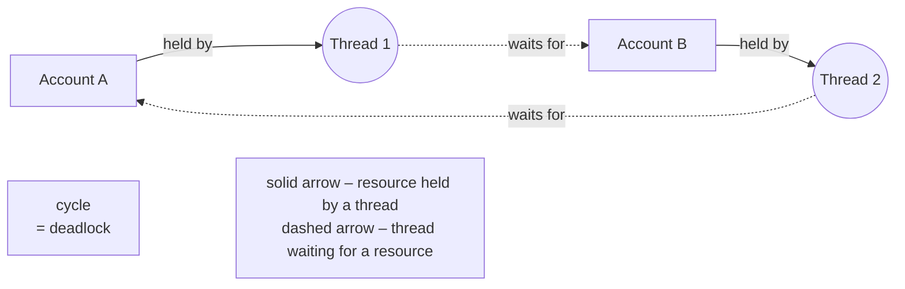
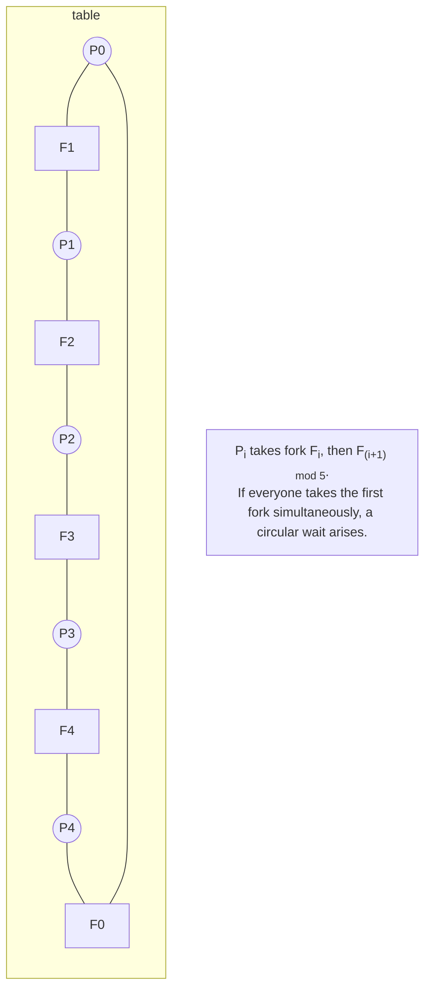

# Deadlock and the cost of synchronization

## Deadlock

**Deadlock** is a state in which every thread in a group waits for a resource held by another thread in the same group, so none can continue. A classic example is a money transfer: thread 1 transfers from account A to B, locking A first, then B; thread 2 simultaneously transfers from B to A, locking B first, then A. If each acquires its first account, both wait forever (Fig. 3.4). The process does not exit, CPU usage is low, and the log contains no errors.



Figure 3.4. A resource allocation graph during deadlock {.caption}

### Coffman conditions

Deadlock is possible only when all four **Coffman conditions** hold simultaneously (E. Coffman, 1971):

1. **mutual exclusion** — only one thread can use the resource;
2. **hold and wait** — a thread holds a resource while waiting for another;
3. **no preemption** — a resource cannot be forcibly taken from a thread;
4. **circular wait** — a cycle of threads exists, each waiting for a resource held by the next.

In a **resource allocation graph**, threads are circles and resources are rectangles; an arrow from a resource to a thread means “held by,” and an arrow from a thread to a resource means “waits for.” A cycle in a graph with single-instance resources indicates deadlock.

### Strategies for handling deadlock

Deadlock is **prevented** by breaking one of the conditions:

- **lock ordering** (breaks circular wait) — all threads acquire locks in the same global order, for example by account number. This is the main practical technique;
- **acquiring with a timeout** (breaks hold and wait) — use `Monitor.TryEnter` or `Lock.TryEnter` with a timeout; on failure, the thread releases locks it has already acquired, waits for a random interval, and retries;
- **acquiring all resources at once**, or using one shared lock for a group of resources — simple, but reduces parallelism;
- **do not call external code while holding a lock**, and avoid holding two locks when possible.

Other strategies — **avoidance** (the system grants a resource only if the state remains safe, as in Dijkstra's banker's algorithm) and **detection and recovery** (periodically searching the wait-for graph for a cycle and restarting one thread) — are used in operating systems and database management systems. For example, a database server detects transaction deadlock and aborts one transaction.

### Diagnosis

If a program hangs, run it under the JetBrains Rider debugger (*Run → Debug…*) and, after the hang, click *Pause Program* (**Ctrl+Pause**) in the *Debug* window. The *Parallel Stacks* tab shows all threads as a stack diagram: deadlocked threads are stopped in `Monitor.Enter` (or `Lock.Enter` for `Lock`) inside the transfer methods (Fig. 3.5). Documentation: <https://www.jetbrains.com/help/rider/Debugging_Multithreaded_Applications.html>.

::: info Screenshot
Rider: debug lecture example “Bank transfers” with argument `naive`, Pause Program (Ctrl+Pause), Debug tool window → Parallel Stacks; two threads blocked in `Monitor.Enter` inside `TransferNaive`
:::

Figure 3.5. Deadlock in the Parallel Stacks tab {.caption}

On a server without an IDE, capture a process **dump** using `dotnet-dump` (<https://learn.microsoft.com/dotnet/core/diagnostics/dotnet-dump>) and analyze it with SOS commands:

```powershell
dotnet tool install --global dotnet-dump
dotnet-dump ps                           # list .NET processes
dotnet-dump collect -n Deadlock -o deadlock.dmp
dotnet-dump analyze deadlock.dmp
> syncblk                                # monitor owners
> clrstack -all                          # all thread stacks
> parallelstacks                         # combined stacks
```

An excerpt from an actual dump analysis of the “Bank transfers” example (addresses and long lines shortened, Fig. 3.6):

```
> syncblk
Index SyncBlock MonitorHeld Recursion Owning Thread Info  Owner
    1 ...C268           3         1 ...BC90 6368   9    System.Object
    2 ...C2C0           3         1 ...8460 4040   8    System.Object
> parallelstacks
      ~~~~ 4040
         1 System.Threading.Monitor.Enter(Object, Boolean ByRef)
         1 Program.<<Main>$>g__TransferNaive|0_3(Account, ...)
      ~~~~ 6368
         1 System.Threading.Monitor.Enter(Object, Boolean ByRef)
         1 Program.<<Main>$>g__TransferNaive|0_3(Account, ...)
```

The two monitor objects belong to threads 4040 and 6368 (the *Owning Thread Info* column), and the stacks show that both threads are waiting in `Monitor.Enter` inside `TransferNaive`: each is waiting for the other's lock. The `syncblk` command shows only monitors (`lock` on `object`); it does not show locks of type `Lock`, which must be located using the stacks.

::: info Screenshot
Windows Terminal: `dotnet-dump collect -n Deadlock`, `dotnet-dump analyze <file>`, commands `syncblk` and `clrstack -all` (trimmed); owning thread IDs visible
:::

Figure 3.6. Analyzing a process dump with syncblk and clrstack {.caption}

## Starvation, livelock, priority inversion, and lock convoys

Deadlock is not the only violation of liveness.

**Starvation** occurs when a thread could run but continually fails to obtain a resource because other threads get ahead of it. Causes include higher-priority threads (Topic 2), unfair locks (monitors and semaphores do not guarantee FIFO order), a thread holding a lock for a long time in a loop, and “greedy” readers preventing a writer from entering. Prevention: hold locks briefly, avoid unnecessary priority changes, use fair queues (for example, a custom numbered request queue), and measure the maximum wait time.

**Livelock** occurs when threads are not blocked and continually take actions but make no progress. An example is two people in a narrow hallway both stepping to one side, then the other. In a program, two threads acquire their first locks, fail to obtain their second locks, release the first locks, and retry simultaneously. The solution is a **random delay** before retrying (*randomized backoff*), as in Ethernet.

**Priority inversion** occurs when a low-priority thread holds a lock needed by a high-priority thread, while a medium-priority thread preempts the low-priority thread and prevents it from releasing the lock. The high-priority thread effectively waits for the medium-priority thread. A famous case caused the Mars Pathfinder spacecraft to reset in 1997. Operating systems mitigate the problem through **priority inheritance** or temporarily boosting the priority of threads that have waited a long time: Windows periodically boosts threads that have not received CPU time for an extended period.

A **lock convoy** occurs when many threads frequently acquire one lock for short periods. Threads form a queue; each release wakes the next thread, and most of the time is spent switching contexts rather than doing work. Signs include high kernel-mode CPU usage and throughput that stops increasing or falls as more threads are added. The solution is to reduce acquisition frequency (process data in batches and accumulate results locally).

## Classic synchronization problems

Classic problems describe common thread interaction patterns; real programs are usually variations of them.

The **bounded buffer**, or producer–consumer problem: producers add items to a fixed-capacity buffer, and consumers remove them. A producer waits when the buffer is full; a consumer waits when it is empty. Solutions include a monitor with condition variables (the “Bounded buffer” example) or two semaphores for “free slots” and “items.” Topic 4 uses the ready-made `BlockingCollection<T>` and channels for this purpose.

**Readers–writers**: readers can operate concurrently, while a writer must operate alone. Reader-preference variants risk starving writers, and vice versa. The .NET solution is `ReaderWriterLockSlim`.

**Dining philosophers** (E. Dijkstra): five philosophers sit around a circular table, with one fork between each pair of neighbors; to eat, a philosopher takes two forks — the left and the right (Fig. 3.7). If everyone takes the left fork simultaneously, a circular wait arises.



Figure 3.7. The dining philosophers problem {.caption}

Solutions:

- **resource ordering** — everyone takes the lower-numbered fork first (the last philosopher takes the forks in the opposite order, making a cycle impossible);
- **a waiter** — a semaphore admitting `N - 1` philosophers: no more than four eat at the table simultaneously;
- **timeout and backoff** — take the left fork, try to take the right with a timeout, and on failure put down the left fork and wait for a random interval.

The **sleeping barber**: a barber sleeps when there are no customers; a customer wakes the barber or joins the queue in one of N chairs, and leaves if no chair is available. The problem models a server with a bounded request queue that rejects requests when full; it can be solved with semaphores or a monitor.

## The cost of synchronization

Synchronization makes a program correct, but a critical section executes sequentially. By Amdahl's law (Topic 1), it limits speedup, and lock contention adds overhead. The “Visitor counter” example measures 8 000 000 counter increments divided among 1–16 threads (Table 3.3, median of five runs on an Intel Core i9-11900KF; the numbers will differ on another computer).

Table 3.3. Time for 8 million counter increments by synchronization method {.caption}

| **Method** | **1 thread, ms** | **2 threads, ms** | **8 threads, ms** | **16 threads, ms** |
| --- | --- | --- | --- | --- |
| No synchronization (incorrect result) | 2,3 | 5,7 | 4,3 | 3,7 |
| `Interlocked.Increment` | 33,9 | 66,0 | 77,8 | 79,8 |
| `lock (object)` | 118,7 | 207,5 | 264,9 | 258,6 |
| `lock (Lock)` | 106,3 | 213,9 | 519,1 | 560,4 |
| Local counter + `Interlocked.Add` | 2,4 | 1,4 | 0,8 | 1,0 |

Conclusions from the measurements:

- without synchronization, the program is fast but loses up to 70% of increments;
- on one thread, `Interlocked` is tens of times slower than an ordinary increment (which the JIT may also optimize); on multiple threads, it is another two times slower because threads contend for the cache line containing a single variable;
- on one thread, entering and exiting `lock` costs about 15 ns; as the thread count increases, time grows by a factor of 2–5 because a lock convoy forms. In this test with an extremely short section, `Lock` under heavy contention was slower than a monitor, so synchronization choices must be based on measurements rather than general advice;
- **none** of the synchronization methods produced a speedup: all the work is in the critical section. Only the local counter produced a speedup, eliminating shared state inside the loop and accessing the shared variable once per thread.

This leads to the following rules for **lock granularity**:

- **coarse** granularity (one lock for the entire structure) is simple and safe, but threads wait more often;
- **fine** granularity (a separate lock for each account or table segment) scales better but complicates the code and introduces deadlock risk;
- the best approach is to reduce shared data access: calculate locally and hold a lock only while merging results.

The example's terminal output is shown in Fig. 3.8.

::: info Screenshot
Windows Terminal: `dotnet run -c Release` in the Visitors project (lecture example 1); the table with columns method, threads, result, time ms
:::

Figure 3.8. Comparing synchronization tools {.caption}
