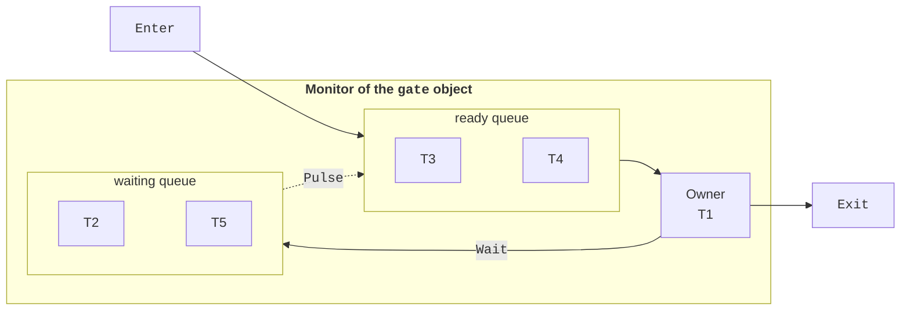

# Locks and condition variables

## The `lock` statement, `Lock` type, and `Monitor` class

The `lock` statement executes a block of statements as a critical section: the thread **acquires** the lock, executes the block, and **releases** the lock even if an exception occurs inside the block. Other threads attempting to acquire the same lock wait.

Starting with .NET 9 and C# 13, a dedicated `System.Threading.Lock` object is recommended for locking (<https://learn.microsoft.com/dotnet/api/system.threading.lock>):

```cs
class BankAccount
{
    private readonly Lock balanceLock = new();
    private decimal balance;

    public bool Withdraw(decimal sum)
    {
        lock (balanceLock)               // check and action together
        {
            if (balance < sum) return false;
            balance -= sum;
            return true;
        }
    }
}
```

The compiler translates `lock` on a variable of type `Lock` into `using (balanceLock.EnterScope()) { … }`, and on any other reference type into `Monitor.Enter` and `Monitor.Exit` calls in a `try…finally` block (<https://learn.microsoft.com/dotnet/csharp/language-reference/statements/lock>). The `Lock` type provides `Enter`, `TryEnter` (without waiting or with a timeout), `Exit`, and `EnterScope` methods, and the `IsHeldByCurrentThread` property. If a `Lock` object is converted to `object` and locked, the compiler issues warning CS9216: an ordinary monitor will be used instead of `Lock`.

Both mechanisms are **reentrant**: a thread that already holds the lock can acquire it again (for example, in a recursive call) and must release it the same number of times.

### The `Monitor` class

Any reference-type object in .NET can be used as a lock through the `Monitor` class's static `Enter`, `Exit`, and `TryEnter` methods. Explicit calls are needed when `lock` is insufficient, particularly when attempting to enter with a timeout: `Monitor.TryEnter(sync, TimeSpan.FromMilliseconds(100), ref taken)` returns even if the lock could not be acquired, and `taken` indicates the result; call `Monitor.Exit(sync)` in a `finally` block only if `taken` is `true`. Only the owning thread can release the monitor (`Monitor.Exit` in another thread causes `SynchronizationLockException`): the monitor has **thread affinity**.

### Choosing a lock object

- Lock a **dedicated private** object, `private readonly Lock gate = new();` (or `object` in code targeting versions before .NET 9), used only for synchronization.
- Do not lock `this`, `Type` objects (`typeof(Account)`), or strings: other parts of the program can access them, acquire the same lock, and cause deadlock. String literals are also **interned** — the same literal in different classes is a single object.
- Value types cannot be locked: `lock (count)` for an `int` produces error CS0185.
- Always protect the same resource with **the same** lock; use different locks for independent resources.
- `await` is prohibited inside `lock` (error CS1996): after `await`, execution may continue in another thread. Asynchronous waiting is covered in Topic 5.
- Hold the lock as briefly as possible, and do not call unknown code (events, delegates, virtual methods) inside the critical section, because it may acquire other locks.

## Condition variables: `Monitor.Wait`, `Pulse`, `PulseAll`

A thread often needs not just to enter a critical section but to **wait for a condition**: an item appears in a queue or space becomes available in a buffer. Checking the condition in a loop with `Thread.Sleep` is inefficient. A monitor provides a **condition variable** for this purpose — a queue of threads waiting for a signal (Fig. 3.3):

- `Monitor.Wait(obj)` — the owner **releases** the lock and joins the waiting queue; after a signal, the thread moves to the ready queue and, once it reacquires the lock, resumes after `Wait`;
- `Monitor.Pulse(obj)` — moves **one** thread from the waiting queue to the ready queue;
- `Monitor.PulseAll(obj)` — moves **all** waiting threads.



Figure 3.3. Monitor queues: the owner, ready queue, and waiting queue {.caption}

All three methods can be called only inside a `lock` on the same object; otherwise, `SynchronizationLockException` occurs. The `Lock` type has no `Wait` or `Pulse` methods, so condition variables use an ordinary object and `Monitor`. The pattern for waiting for a condition:

```cs
lock (gate)
{
    while (items.Count == 0)     // use while, not if
    {
        Monitor.Wait(gate);      // releases gate and waits for a signal
    }
    item = items.Dequeue();
    Monitor.PulseAll(gate);      // notify those waiting for space
}
```

The condition is checked in a `while` loop because another thread may enter first between the signal and reacquiring the lock, making the condition false again (a “stolen” wake-up). Also, `PulseAll` wakes threads waiting for **different** conditions, and `Wait` with a timeout returns without a signal. If `Pulse` is called when no one is waiting, the signal is **lost** — unlike a semaphore, a monitor does not remember signals. The state being signaled must therefore always be stored in shared variables and checked under the lock.

`Pulse` is more efficient but safe only when all waiting threads are waiting for the same condition and any of them can handle it. Otherwise, use `PulseAll`.

## `Mutex`, `Semaphore`, and `SemaphoreSlim`

A **mutex** (from *mutual exclusion*) is a lock implemented by the operating system. The `System.Threading.Mutex` class has thread affinity, like a monitor, but every operation is a system call, making it tens of times slower than `lock`. Its advantage is that a **named** mutex is visible to all processes and synchronizes them with one another. A typical use is preventing a second instance of an application from starting:

```cs
using Mutex single = new(false, @"Local\PrintQueueDemo");
if (!single.WaitOne(TimeSpan.Zero))
{
    Console.Error.WriteLine("The application is already running");
    return 1;
}
try
{
    Console.WriteLine("Running… Enter to exit");
    Console.ReadLine();
}
finally
{
    single.ReleaseMutex();
}
return 0;
```

The `Local\` prefix (the default) limits visibility to the user's session; `Global\` makes the mutex visible throughout the system. On Linux, named mutexes are implemented through the file system. If the owning thread exits without releasing the mutex, the next `WaitOne` throws `AbandonedMutexException`: the data protected by the mutex may be inconsistent.

A **semaphore** is a permit counter: `Wait` decrements the counter or waits if it is zero, while `Release` increments it and allows a waiting thread through. A semaphore limits the **number** of threads accessing a resource simultaneously: parking spaces, database connections, or concurrent downloads. A semaphore has no thread affinity: another thread can release a permit.

- `SemaphoreSlim` is a lightweight semaphore within a process: `Wait()`, `Wait(timeout)`, `WaitAsync` (Topic 5), `Release()`, `CurrentCount`; place the `Release` call in a `finally` block (the “Parking” example).
- `Semaphore` is a system semaphore; a named instance (`new Semaphore(2, 2, "Scanners")`) synchronizes processes, but named semaphores are supported only on Windows.

The order in which waiting threads pass through a semaphore is not guaranteed (neither FIFO nor LIFO). An extra `Release` call exceeding the maximum count throws `SemaphoreFullException`. A semaphore with one permit (a *binary semaphore*) resembles a mutex but has no owner and is not reentrant.
