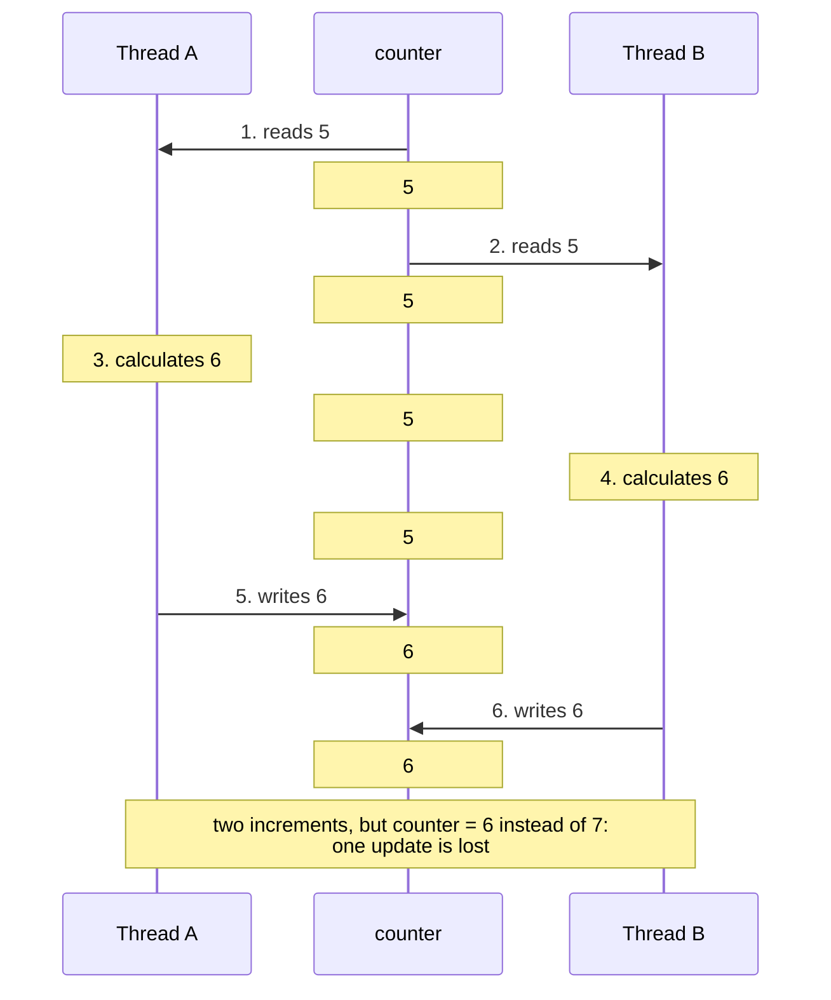
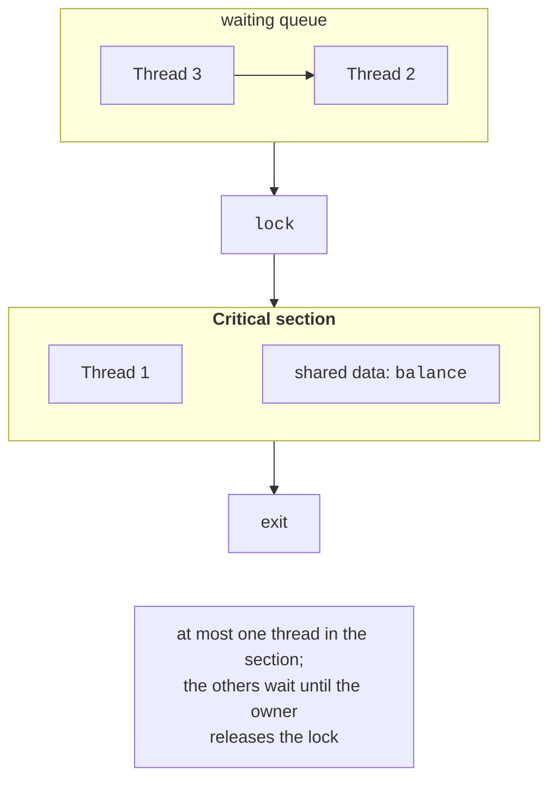

# Race conditions and mutual exclusion

## Shared state and race conditions

In Topic 2, threads processed separate parts of an array without interfering with one another. In practice, threads often need **shared state**: a request counter, account balance, cache, or task queue. Static fields, fields of an object accessible to multiple threads, and local variables captured by a lambda executed by multiple threads are shared. A method’s local variables that are not captured by a lambda reside on their thread’s stack and are inaccessible to other threads.

A code fragment that accesses shared data and must not execute in multiple threads simultaneously is called a **critical section**. If the critical section is unprotected, the program’s result depends on how the OS scheduler interleaves thread instructions. This situation is called a **race condition**.

The simplest example is four threads incrementing a counter:

```cs
int counter = 0;
Thread[] threads = new Thread[4];
for (int t = 0; t < threads.Length; t++)
{
    threads[t] = new Thread(() =>
    {
        for (int i = 0; i < 1_000_000; i++) counter++;
    });
    threads[t].Start();
}
foreach (Thread t in threads) t.Join();
Console.WriteLine(counter);          // expected: 4000000
```

Three runs in the *Release* configuration printed `1073918`, `1219211`, and `1304128`: about two-thirds of the increments were lost, with a different number each time. The reason is that `counter++` is not one action but three: **read** the value into a register, **calculate** the new value, and **write** it back. If thread B reads the variable between thread A’s read and write, both write the same result, losing one increment (Fig. 3.1).



Figure 3.1. A lost update when `counter++` executes concurrently {.caption}

Other operations that look like “one line” are also non-atomic:

- `total += x` for `long`, `double`, or `decimal` is the same read–modify–write sequence; in a 32-bit process, writing a 64-bit `long` takes two machine instructions, so another thread may read a “torn” value (half old, half new);
- copying a structure with several fields (`Point`, `decimal`, `DateTime`);
- **check-then-act**: `if (cache == null) cache = Load();` or `if (balance >= sum) balance -= sum;` — another thread may change the condition between the check and the action;
- operations on ordinary collections: concurrent `List<T>.Add` calls or writes to `Dictionary<TKey,TValue>` can not only lose elements but also corrupt the collection’s internal structure (Topic 4).

Assigning a reference (`current = newObject;`) is atomic, but the sequence “read the reference, create a modified copy, write it back” is again a race condition.

Race condition bugs are hard to reproduce: a program may work correctly for years on a dual-core laptop and fail on a 16-core server, while the bug often “disappears” under a debugger because pauses change the timing. Synchronization should therefore be designed in advance rather than added only after bugs appear.

## Mutual exclusion requirements

**Mutual exclusion** is the property that at most one thread executes a critical section at any moment. A correct solution to the critical section problem must ensure:

- **safety**: two threads are never in the critical section simultaneously, and data invariants are preserved;
- **liveness**, or progress: if the section is free and threads want to enter, one of them will enter; threads do not block one another forever;
- **fairness**, or bounded waiting: a waiting thread will enter after a finite number of entries by other threads and will not starve.

In addition, the solution must not depend on processor speed or the number of cores, and a thread outside the critical section must not prevent others from entering it. In Fig. 3.2, one thread executes the critical section while the others wait in a queue until it releases the lock.



Figure 3.2. A critical section and mutual exclusion {.caption}

Whether synchronization is needed at all can be checked using **Bernstein’s conditions**. Suppose fragment $P_{1}$ reads a set of variables $R_{1}$ and writes a set $W_{1}$, while fragment $P_{2}$ reads $R_{2}$ and writes $W_{2}$. The fragments can execute in parallel without synchronization if

$$
W_{1} \cap W_{2} = \varnothing , \quad R_{1} \cap W_{2} = \varnothing , \quad W_{1} \cap R_{2} = \varnothing .
$$

For example, `a[i] = b[i] * 2` for different values of `i` satisfies the conditions: each iteration writes to its own element. The fragments `sum += a[i]` violate the first condition (both write to `sum`), so they require synchronization or restructuring: each thread calculates a local sum, and the results are added at the end.

There are three approaches to shared state:

1. **locking** — threads take turns acquiring a lock (`lock`, `Mutex`, semaphores);
2. **nonblocking atomic operations** — the `Interlocked` class and algorithms based on compare-and-swap;
3. **avoiding shared state** — thread-local variables, *immutable* data, and message passing through thread-safe queues and channels (Topic 4).

The third approach is the most efficient, so first try to eliminate shared data before protecting it.

## Atomic operations: the `Interlocked` class

The `System.Threading.Interlocked` class performs simple operations on a variable **atomically**: no other thread can observe an intermediate state. Its methods use special processor instructions (`lock xadd` and `lock cmpxchg` on x64) without putting the thread into a waiting state, so they are very fast.

Table 3.1. Main methods of the `Interlocked` class {.caption}

| **Method** | **Action (atomic)** |
| --- | --- |
| `Increment(ref x)`, `Decrement(ref x)` | Increments or decrements by 1 and returns the new value |
| `Add(ref x, n)` | Adds `n` and returns the new value |
| `Exchange(ref x, v)` | Writes `v` and returns the old value |
| `CompareExchange(ref x, v, expected)` | Writes `v` only if `x == expected`; always returns the old value |
| `Read(ref long x)` | Reads an entire 64-bit value (important for 32-bit processes) |
| `And`, `Or` | Performs bitwise AND or OR and writes the result |

The corrected counter: `Interlocked.Increment(ref counter);`. These methods work with fields, array elements, and captured variables, but not properties, because they require a `ref` reference.

The **compare-and-swap** (CAS) operation allows an arbitrary update to be performed atomically using a **CAS loop**: read the value, calculate a new one, and write it only if the variable has not changed in the meantime; otherwise, retry:

```cs
static void UpdateMax(ref int max, int value)
{
    int seen;
    do
    {
        seen = max;                      // 1. snapshot
        if (value <= seen) return;       // 2. no update needed
    }                                    // 3. write if unchanged
    while (Interlocked.CompareExchange(ref max, value, seen) != seen);
}
```

A CAS loop does not block threads: if another thread changes `max` first, the current thread simply retries. These algorithms are called **lock-free**. They cannot cause deadlock, but frequent conflicts make threads repeat calculations unnecessarily. More complex lock-free structures (the Treiber stack and the ABA problem) are covered in Topic 4.

### The `volatile` modifier

The JIT compiler and processor may cache a field’s value in a register and reorder reads and writes. For a field that one thread modifies and another only reads (for example, the stop flag `private volatile bool stopRequested;`, checked by a worker thread in a `while (!stopRequested)` loop), the `volatile` modifier prevents these optimizations. The `Volatile.Read(ref x)` and `Volatile.Write(ref x, v)` methods provide the same effect for fields without the modifier (Example 1 in the lab). Important: `volatile` **does not make** compound operations atomic — `volatileCounter++` remains a race condition; it requires `Interlocked` or `lock`.
