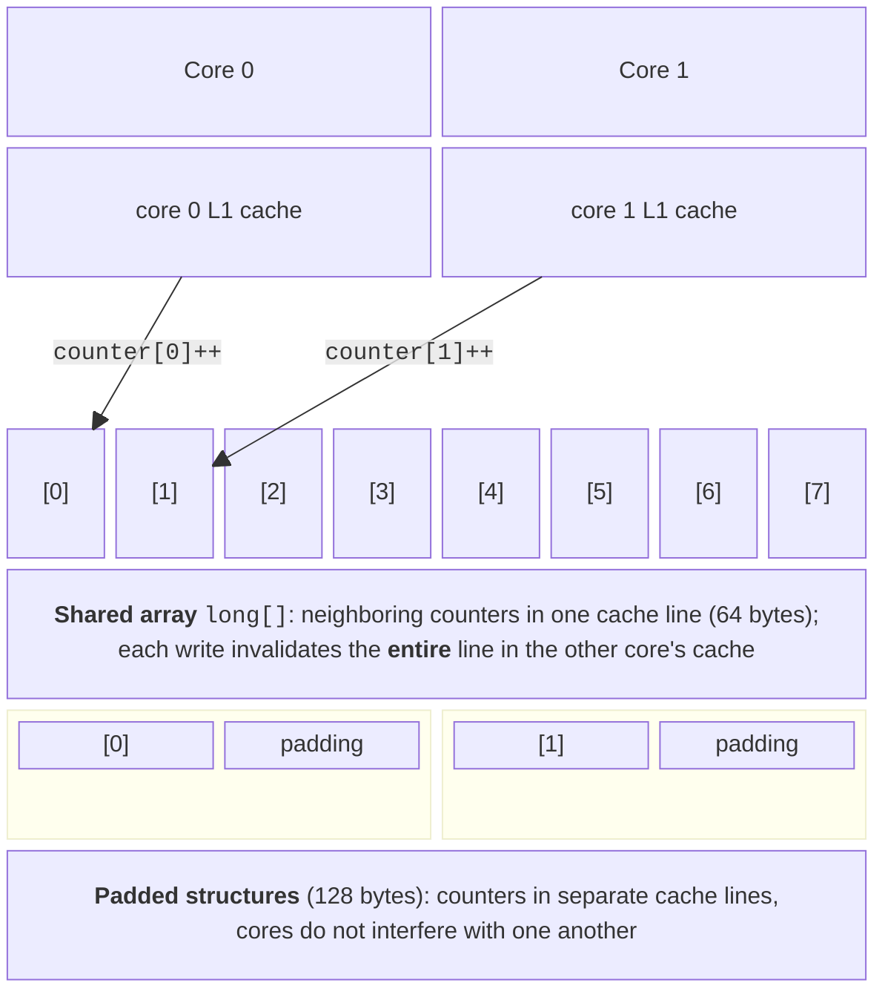

# Caches, false sharing, and profiling

## CPU caches and data locality

Thread safety is only half the task: a parallel program must also **scale**. CPU caches strongly affect multithreaded code performance (Topic 1). The lab PC's Intel Core i9-11900KF has a 48 KiB L1 data cache, a 32 KiB L1 instruction cache, and a 512 KiB L2 cache per core, plus a 16 MiB L3 cache shared by all cores (data from the Windows `GetLogicalProcessorInformation` function).

Data moves between main memory and cache in fixed-size blocks called **cache lines**. On modern x86-64 processors, a cache line is 64 bytes. Accessing a byte absent from the cache causes a **cache miss**: the processor waits for the line to load from a slower level. Caches are effective because of **locality**:

- **spatial**: data neighboring recently accessed data will soon be needed (array traversal);
- **temporal**: recently accessed data will soon be needed again (a loop counter).

An array of structures is therefore processed faster than a linked list containing the same data, and traversing a two-dimensional array by rows is faster than by columns. Another point matters for parallel programs: each core has **its own** copies of lines in its L1 and L2 caches. When one core **writes** to a line, copies of that line in other cores' caches become invalid, and those cores must obtain a fresh copy before their next access. A hardware protocol (such as MESI) keeps copies coherent, and this takes time.

## False sharing

**False sharing** occurs when threads write to **different** variables that happen to occupy **the same** cache line. Logically, the threads share no data and need no synchronization, but at the hardware level, every write by one thread invalidates the line in another core's cache, making the line continually bounce between cores (Fig. 4.5). Unlike true sharing, where threads modify the same variable, the program is correct but slow.



Figure 4.5. False sharing {.caption}

A classic example is a `long[] counters` array, where thread `i` repeatedly increments its own element, `counters[i]++`. Each `long[]` element occupies 8 bytes, so up to eight counters fit in one line. Symptoms of false sharing include much less speedup than expected and execution time that barely decreases or even increases as threads are added. In the “False sharing” example below, eight threads using a shared array sped up counting only 1.6 times, versus 6.3 times with local variables.

Ways to eliminate it:

1. **local variables**: each thread accumulates its result in a local variable (a CPU register or its own stack) and writes it to the shared array once at the end — the best solution;
2. **structure padding**: each counter occupies a structure larger than a cache line, guaranteeing that neighboring counters reside on different lines (see below);
3. **partitioning data by thread**: each thread works with its own object (a local histogram or dictionary), and results are merged after completion; separate heap objects are not always far apart, so frequently accessed fields are still best kept in local variables.

```cs
[StructLayout(LayoutKind.Sequential, Size = 128)]
struct PaddedCounter
{
    public long Value;
}
```

The `StructLayout` attribute in `System.Runtime.InteropServices` specifies the structure's size. A size of 64 is sufficient for a 64-byte line, but 128 provides a margin: some processors have larger lines, and hardware *prefetching* loads neighboring lines. False sharing concerns only **writes**: threads that only read shared data do not invalidate lines.

## Choosing a data structure

The choice depends on who reads and writes data and whether waiting is needed (Table 4.3).

Table 4.3. Choosing a data structure for a scenario {.caption}

| **Scenario** | **Structure** |
| --- | --- |
| Shared dictionary with frequent writes (counters, cache) | `ConcurrentDictionary<TKey, TValue>`, `AddOrUpdate`, `GetOrAdd` with `Lazy<T>` |
| Nonblocking job queue, polling with `TryDequeue` | `ConcurrentQueue<T>` |
| The same threads add and take items; order is unimportant | `ConcurrentBag<T>` |
| Producers and consumers on ordinary threads, bounded capacity | `BlockingCollection<T>` |
| Asynchronous pipeline, backpressure, dropping items | `Channel<T>` (`CreateBounded`) |
| Rare updates, very frequent reads, snapshots needed | Immutable collections + `ImmutableInterlocked` |
| Reference data created once at startup | `FrozenDictionary<TKey, TValue>` |
| Each thread calculates its own result | Local variables or local collections merged at the end (no shared data) |

The fastest synchronization is none at all: if threads can work with their own data and merge results at the end, this is almost always better than any shared collection.

## Measurement and profiling

### BenchmarkDotNet

Use **BenchmarkDotNet** (<https://benchmarkdotnet.org/>), introduced in Topic 1, to compare code variants. It warms up the code, runs enough iterations, removes outliers, and calculates statistics automatically. Add the package with `dotnet add package BenchmarkDotNet` and mark benchmark methods with `[Benchmark]`:

```cs
using BenchmarkDotNet.Attributes;
using BenchmarkDotNet.Running;

BenchmarkRunner.Run<CounterBenchmarks>();

public class CounterBenchmarks
{
    private int[] data = [];

    [Params(8)]                      // thread count
    public int Threads { get; set; }

    [GlobalSetup]                    // once before measurements
    public void Setup() { /* populate data */ }

    [Benchmark(Baseline = true)]     // baseline version
    public long SharedArray() { /* … */ return 0; }

    [Benchmark]                      // likewise for LocalVariable
    public long PaddedStruct() { /* … */ return 0; }
}
```

The method bodies are the same as in the “False sharing” example; declare `LocalVariable` in the same way. The class and methods must be `public`, and benchmarks must run only in Release: `dotnet run -c Release`. BenchmarkDotNet 0.15.8 produced the following table on the lab PC (abridged):

```
| Method        | Threads | Mean      | StdDev    | Ratio |
|-------------- |-------- |----------:|----------:|------:|
| SharedArray   | 8       | 202.99 ms | 12.178 ms |  1.00 |
| LocalVariable | 8       |  51.05 ms |  0.516 ms |  0.25 |
| PaddedStruct  | 8       |  78.78 ms |  2.745 ms |  0.39 |
```

*Mean* is the average time, *StdDev* is the standard deviation, and *Ratio* is the ratio to the baseline method (`Baseline = true`). BenchmarkDotNet uses a decimal point regardless of regional settings. The full report also includes *Error* and *RatioSD* columns, .NET versions, and the processor (Fig. 4.6).

::: info Screenshot
Windows Terminal: `dotnet run -c Release` in the FalseSharingBench project; the Summary table with SharedArray, LocalVariable, PaddedStruct and columns Mean, Error, StdDev, Ratio
:::

Figure 4.6. BenchmarkDotNet results for false sharing {.caption}

### The dotTrace profiler in Rider

BenchmarkDotNet shows **how long** code takes, while a profiler shows **why**. JetBrains Rider includes the **dotTrace** profiler. According to JetBrains documentation, the dotTrace and dotMemory plugin is available in Rider only to dotUltimate or All Products Pack subscribers, so check the lab PCs' licenses before class. The most useful profiling type for multithreaded programs is **Timeline**: it collects a timeline of thread states (running, waiting, blocked).

Procedure:

1. Select the program's run configuration (for example, `PipelineDemo`) on the toolbar.
2. Select *Run → Switch Profiling Configuration → Timeline*.
3. Run *Run → Profile 'PipelineDemo' with 'Timeline'*; on Windows, Timeline requires JetBrains ETW Host Service, which Rider offers to install with administrator privileges.
4. When the program finishes, the snapshot opens in the *dotTrace Profiler* window.

Each thread has its own lane on the timeline (Fig. 4.7). In a pipeline, consumers spend some time waiting for data, while producers wait when the channel is full. If worker-thread lanes mostly show waiting for locks, synchronization is the bottleneck.

::: info Screenshot
Rider: Run → Switch Profiling Configuration → Timeline; Run → Profile 'PipelineDemo' with 'Timeline'; snapshot in the dotTrace Profiler window, thread lanes with running and waiting states of producers and consumers
:::

Figure 4.7. A thread timeline in dotTrace {.caption}

### perf c2c on Linux

On Linux, **`perf c2c`** (“cache to cache,” <https://man7.org/linux/man-pages/man1/perf-c2c.1.html>) finds false sharing. It analyzes memory accesses and identifies cache lines that different cores modify and read concurrently (HITM events — reads of a line modified by another core). `perf c2c record` records samples, and `perf c2c report` displays tables, including the *Shared Data Cache Line Table* with the hottest lines and *Shared Cache Line Distribution Pareto* with access offsets within each line.

```bash
export DOTNET_PerfMapEnabled=3        # JIT method names for perf
perf c2c record -- dotnet FalseSharing.dll
perf c2c report --stdio | less
```

`DOTNET_PerfMapEnabled=3` makes the .NET runtime write a `/tmp/perf-<pid>.map` file containing JIT-compiled method names; otherwise, `perf` shows only addresses. `perf c2c` requires hardware counters: load latency events (PEBS) on Intel, IBS on AMD, and SPE on Arm64. These counters are often unavailable in virtual machines and WSL2, so capture the report on a physical Linux node (Fig. 4.8).

::: info Screenshot
Ubuntu 26.04 terminal on a physical machine (or VM with PMU passthrough): `perf c2c record -- dotnet FalseSharing.dll`, then `perf c2c report --stdio`; top of the Shared Data Cache Line Table
:::

Figure 4.8. A `perf c2c` report for a C# program on Linux {.caption}
