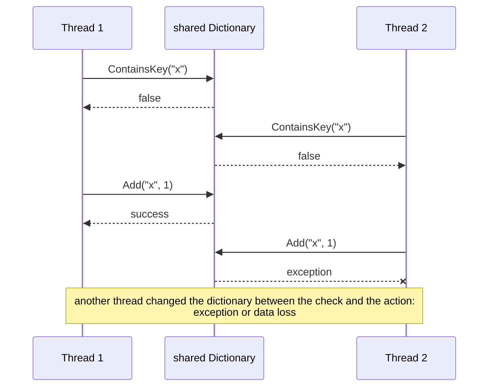
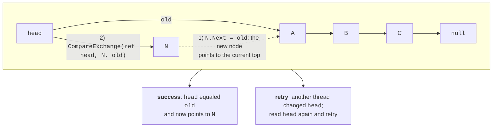

# Collections and lock-free algorithms

## Ordinary collections in a multithreaded program

In Topic 3, shared variables were protected with locks and the `Interlocked` class. Collections are the most common form of shared data: threads put results in a list, count words in a dictionary, or pass tasks through a queue. Classes in the `System.Collections.Generic` namespace (`List<T>`, `Dictionary<TKey, TValue>`, `Queue<T>`) **are not thread-safe**: they assume that only one thread modifies the collection. Concurrent **reads** without writes are safe, but concurrent writes corrupt the internal state.

For example, `List<T>.Add` performs two actions: it writes an element to the internal array cell `_items[_size]` and increments `_size`. Two threads may write to the same cell, losing an element; when the array grows, one thread may write to the old array while another is already copying it to a new one. In tests on this PC, four threads each adding 200 000 numbers to a shared `List<int>` retained about 600 000–800 000 of the 800 000 elements without any exception. A shared `Dictionary<TKey, TValue>` behaves even worse:

- it loses key–value pairs;
- it throws `InvalidOperationException` with the message “Operations that change non-concurrent collections must have exclusive access…”, `IndexOutOfRangeException`, or `ArgumentException`;
- it may **loop forever** if bucket chains are corrupted: in one trial, the threads had still not finished after 20 s.

::: tip Warning
Errors in ordinary collections do not appear on every run. A program that “worked” is not necessarily correct.
:::

### Compound check-then-act operations

Even a thread-safe collection does not make a **sequence** of calls atomic. A common mistake is a **check-then-act** operation: first check a condition, then modify the collection based on it (Fig. 4.1).

```cs
if (!cache.ContainsKey(key))       // 1. check
{
    cache.Add(key, Load(key));     // 2. act: another thread may
}                                  //    already have added this key
```



Figure 4.1. A race in a compound check-then-act operation {.caption}

Another thread may change the collection between the check and the action, making the check result stale. Other examples include “if `Count > 0`, call `Dequeue()`” and “read a value, increment it, write it back.” There are two fixes: protect the entire sequence with one lock, or use a method that performs it atomically: `TryAdd`, `GetOrAdd`, `AddOrUpdate`, or `TryDequeue`. These are exactly the methods .NET concurrent collections provide.

## Lock-free algorithms

Locks are simple, but a thread waiting for a lock is idle, and under heavy contention, waiting and context-switching costs become significant. **Lock-free algorithms** modify shared data without locks: threads never wait for one another and retry the operation on conflict. A lock-free algorithm guarantees that at least one thread makes progress under any thread scheduling.

These algorithms rely on the processor's atomic **compare-and-swap** (**CAS**) operation. In .NET, `Interlocked.CompareExchange(ref location, value, comparand)` performs it: if `location` currently contains `comparand`, write `value` there. The method returns the value that was in `location` before the call, so the operation succeeded if the result equals `comparand`.

### The Treiber stack

The simplest lock-free structure is the **Treiber stack**, a singly linked list with a `head` reference to its top. Adding an element (Fig. 4.2):

1. Create node `N` and remember the current top as `old = head`.
2. Set `N.Next = old`.
3. Perform `CompareExchange(ref head, N, old)`: if `head` still equals `old`, `N` becomes the top; otherwise, another thread has changed the stack, so repeat steps 2–3 with the new `head` value.

```cs
public void Push(T item)
{
    Node node = new(item, null);
    while (true)
    {
        Node? current = head;
        node.Next = current;
        if (Interlocked.CompareExchange(
                ref head, node, current) == current)
        {
            return;                // success
        }                          // otherwise, retry
    }
}
```



Figure 4.2. The lock-free Treiber stack {.caption}

Removal with `TryPop` is symmetric: read `current = head` and replace `head` with `current.Next` using the same `CompareExchange`. The retry loop is sometimes supplemented with `SpinWait`, which briefly spins the processor under frequent conflicts, then yields time to other threads.

### The ABA problem

The **ABA problem** occurs when a thread reads value `A`, another thread changes it to `B`, then back to `A`. CAS sees `A` and assumes nothing has changed. This is dangerous in a stack: thread 1 reads top node `A` and its successor `B`; thread 2 removes `A` and `B`, then adds **the same node** `A` again; thread 1's CAS succeeds and makes the already-removed node `B` the top. In languages with manual memory management (C, C++), a freed node is reused for a new element, making ABA a real threat; version counters or deferred memory reclamation protect against it.

In .NET, the problem is **less severe**: the garbage collector does not reclaim a node while at least one thread still references it, and each `Push` creates a new object. A reference to “the same” node therefore cannot accidentally reappear. ABA remains possible if the program itself reuses nodes (an object pool) or compares values rather than references.
