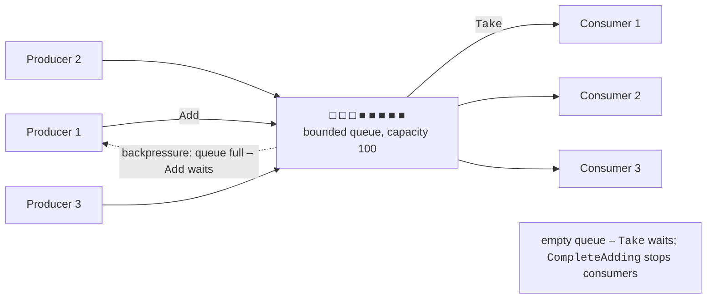
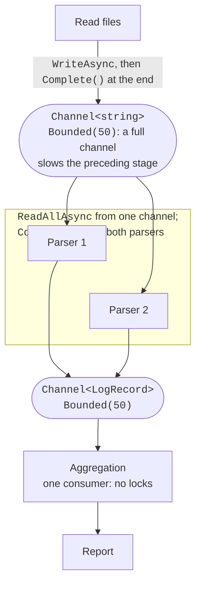

# The producer–consumer pattern and channels

## BlockingCollection

**`BlockingCollection<T>`** wraps any collection implementing `IProducerConsumerCollection<T>` (`ConcurrentQueue<T>` by default), adding **blocking** and **bounded capacity**:

- `Add` blocks the thread if a capacity (`boundedCapacity`) is specified and the collection is full;
- `Take` blocks the thread while the collection is empty;
- `CompleteAdding()` signals that no more items will arrive; subsequent `Add` calls throw an exception, and `IsAddingCompleted` is `true`;
- `IsCompleted` is `true` when adding is complete and the collection is empty;
- `GetConsumingEnumerable()` returns a sequence that **removes** items and ends after `CompleteAdding` has been called and the collection is empty;
- `TryAdd` and `TryTake` with a timeout and `CancellationToken` do not wait indefinitely; the static `AddToAny` and `TakeFromAny` methods work with an array of collections.

The “Order queue” example shows typical usage. To obtain a blocking stack or bag, pass the underlying collection to the constructor: `new BlockingCollection<int>(new ConcurrentStack<int>(), 100)`. `BlockingCollection<T>` implements `IDisposable`, so dispose of it with `using`. Its methods block OS **threads**, so each waiting consumer occupies a thread; use channels instead in asynchronous code.

## The producer–consumer pattern

The **producer–consumer pattern** separates a program into parts that create work (**producers**) and parts that perform it (**consumers**). A thread-safe queue sits between them (Fig. 4.3). Benefits:

- producers and consumers do not know about one another and can work at different speeds;
- the consumer count can be chosen to match the workload and core count;
- the queue smooths out short bursts of load.



Figure 4.3. The producer–consumer pattern {.caption}

### Bounded queues and backpressure

If producers are faster than consumers, an unbounded queue grows until memory runs out. A **bounded** queue stops a producer when full: `Add` waits until a consumer frees space. This is **backpressure**: a slow stage automatically slows a fast one. Choose capacity to smooth bursts without accumulating millions of items; an alternative to waiting is dropping items (see channel modes below) when loss is acceptable, such as sensor readings.

### Correct completion

A consumer must know when no more work will arrive; otherwise, it waits forever and the program never exits. Approaches:

- **completion signal**: after **all** producers finish, call `CompleteAdding()` (`BlockingCollection<T>`) or `Writer.Complete()` (a channel); consumers drain the remaining items and exit their loops;
- **poison pill**: a special item (for example, `null` or an order with `Id = -1`) that tells a consumer to stop; N consumers require N pills, added after all ordinary items.

A completion signal is more reliable: there is no need to agree on a special value or count consumers. Calling `CompleteAdding()` from one of several producers is a mistake: other producers will receive an exception from `Add`.

### A pipeline of stages

A **pipeline** is a chain of stages where one stage's consumer is the next stage's producer: “read files → parse lines → aggregate → report.” Each stage has its own queue and worker count: slow parsing can run in multiple threads, while aggregation runs in one thread without locks (Fig. 4.4). When a stage finishes, close its output queue, letting the completion signal propagate through the entire pipeline.

## System.Threading.Channels

A **channel** in the `System.Threading.Channels` namespace is a modern producer–consumer implementation for asynchronous code. A `Channel<T>` has two sides: a `Writer` of type `ChannelWriter<T>` for producers and a `Reader` of type `ChannelReader<T>` for consumers. Channels are included in the .NET shared library and require no NuGet packages.

```cs
// Unbounded channel: writes are always immediate.
Channel<int> unbounded = Channel.CreateUnbounded<int>();

// A bounded channel with capacity 100 and options.
Channel<Reading> readings = Channel.CreateBounded<Reading>(
    new BoundedChannelOptions(100)
    {
        FullMode = BoundedChannelFullMode.DropOldest,
        SingleReader = true,       // promise: one consumer
    });
```

`BoundedChannelFullMode` determines the behavior of a full bounded channel (Table 4.2). In dropping modes, a second argument can be passed to `CreateBounded`: an `itemDropped` delegate that receives each discarded item (for example, to count losses). The `SingleReader` and `SingleWriter` options allow a simpler, faster implementation when the program guarantees one consumer or producer.

Table 4.2. BoundedChannelFullMode values {.caption}

| **Value** | **Behavior when the channel is full** |
| --- | --- |
| `Wait` (default) | `WriteAsync` waits for space; `TryWrite` immediately returns `false` |
| `DropNewest` | Remove the **newest** item in the channel and write the new one |
| `DropOldest` | Remove the **oldest** item in the channel and write the new one |
| `DropWrite` | Discard the item being written |

The main methods on each side of a channel:

- `ChannelWriter<T>`: `TryWrite` (a synchronous attempt), `WriteAsync` (asynchronously wait for space), `WaitToWriteAsync`, `Complete()`, and `TryComplete()` (no more writes);
- `ChannelReader<T>`: `TryRead`, `ReadAsync`, `WaitToReadAsync`, `ReadAllAsync()` (an asynchronous sequence of all items until channel closure), and the `Completion` property.

Writing to a closed channel throws `ChannelClosedException`. As with `CompleteAdding`, when there are multiple producers, call `Complete()` only after **all** of them finish.

### A brief introduction to await

Channel methods are asynchronous: they return `ValueTask`, and the result is obtained using `await`. Unlike `Take` on `BlockingCollection<T>`, `await reader.ReadAsync()` **does not block a thread**: while there is no data, the thread returns to the pool and does other work; the method resumes when an item arrives. An `await foreach` loop enumerates the asynchronous `ReadAllAsync()` sequence. `Task.Run(async () => …)` starts an asynchronous stage in the thread pool, while `await Task.WhenAll(tasks)` waits for multiple stages to finish. Tasks and `async/await` are covered in detail in Topic 5; these basics are enough for channel pipelines (the “Log pipeline” example below).



Figure 4.4. A channel pipeline {.caption}

`BlockingCollection<T>` is well suited to programs using ordinary threads (Topic 2), while channels suit asynchronous applications: web servers, services, and I/O pipelines where thousands of waiting consumers must not occupy thousands of threads.
