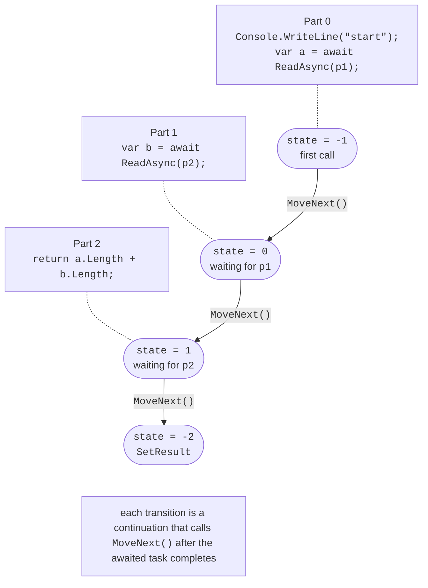

# The async/await model

## The `async`/`await` model

The `async` keyword allows a method to use the `await` operator. Such a method returns `Task`, `Task<TResult>`, `ValueTask`, `ValueTask<TResult>`, or `IAsyncEnumerable<T>` (`void` for event handlers). The `await task` operator:

1. checks whether the task has already completed; if so, execution continues synchronously;
2. otherwise, registers a **continuation** (the rest of the method) and **returns control** to the caller along with an incomplete task;
3. when the task completes, runs the continuation, and returns the result or throws an exception.

Guide: <https://learn.microsoft.com/dotnet/csharp/asynchronous-programming/>.

### The state machine

The compiler transforms an `async` method into a **state machine**: a structure (in Release) or a class (in Debug) with a `MoveNext()` method. The method's code is divided at `await` points, the `<>1__state` field stores the number of the point where the method is waiting, and local variables needed after `await` become fields (Fig. 5.5). Each continuation calls `MoveNext()` again to advance to the next part.



Figure 5.5. Compiler transformation of an async method {.caption}

You can view the generated code in Rider: *Tools → IL Viewer*, then *Low-Level C#* mode on the window's toolbar (Fig. 5.6). For a `ReadAsync` method, the compiler creates a nested type `<ReadAsync>d__0` with fields `<>1__state`, `<>t__builder`, and `<>u__1` (the task awaiter). Window documentation: <https://www.jetbrains.com/help/rider/Viewing_Intermediate_Language.html>.

::: info Screenshot
Rider: caret in `ReadAsync`, Tools → IL Viewer, toolbar mode Low-Level C#; visible struct `<ReadAsync>d__0` with `MoveNext` and field `<>1__state`
:::

Figure 5.6. Generated state machine in IL Viewer {.caption}

### Synchronization context and `ConfigureAwait`

Where does a continuation run after `await`? The operator captures the current `SynchronizationContext` (or task scheduler if it is not the default):

- in WPF, WinForms, and MAUI, the context returns the continuation to the UI thread, so you can update window controls after `await`;
- console programs, services, and ASP.NET Core have no context (`SynchronizationContext.Current` is `null`), and the continuation runs on any pool thread. Consequently, `Environment.CurrentManagedThreadId` often differs before and after `await`.

Calling `await task.ConfigureAwait(false)` specifies that execution should not return to the captured context. Library code that does not interact with the UI uses `ConfigureAwait(false)`: it is slightly faster and removes the risk of deadlock if someone calls the library synchronously through `Result`. Application code (button handlers) does not use `ConfigureAwait(false)` because it needs the UI thread after `await`. Since .NET 8, the overload with `ConfigureAwaitOptions` provides additional modes, such as `ForceYielding` (always release the thread) and `SuppressThrowing`.

### Compute and I/O operations

`async` does not make code parallel or create threads. It is important to distinguish two kinds of work (Fig. 5.7):

- **I/O-bound operations**: file access, networking, databases. No thread is needed while waiting: the driver signals completion through an I/O completion port, and only then does the continuation occupy a pool thread. Use asynchronous library methods (`ReadAllTextAsync`, `GetAsync`) and `await` for these operations;
- **CPU-bound operations**: these occupy the processor the entire time. To avoid blocking the caller, start them with `await Task.Run(...)`; to speed them up, divide them into parts (Topic 6).

```mermaid
gantt
  dateFormat x
  axisFormat %S
  tickInterval 1second
  section Synchronous: thread 4 is occupied the entire time
    computation : 300, 700ms
    waiting for I/O (blocked thread) : 1000, 2600ms
    computation : 3600, 700ms
    waiting for I/O (blocked thread) : 4300, 2600ms
    computation : 6900, 700ms
    waiting for I/O (blocked thread) : 7600, 2600ms
    computation : 10200, 600ms
  section Asynchronous: a thread is occupied only during computation
    thread 4 : 300, 700ms
    thread in pool (waiting without a thread) : 1000, 2600ms
    thread 7 : 3600, 700ms
    thread in pool (waiting without a thread) : 4300, 2600ms
    thread 5 : 6900, 700ms
    thread in pool (waiting without a thread) : 7600, 2600ms
    thread 4 : 10200, 600ms
```



Figure 5.7. Synchronous and asynchronous I/O waiting {.caption}

A server handling 10 000 concurrent requests that wait for a database would need 10 000 blocked threads (gigabytes of stacks) in a synchronous implementation, while an asynchronous implementation manages with a few dozen pool threads.

## `ValueTask`, asynchronous streams, and `PeriodicTimer`

### `ValueTask<TResult>`

`Task<TResult>` is a class, so every asynchronous method call allocates an object on the heap. If a method usually completes synchronously (for example, the value is already in a cache or buffer), this object is unnecessary. The `ValueTask<TResult>` structure contains either a ready result (`ValueTask.FromResult(value)` without allocation) or a reference to a task if the value must be awaited.

`ValueTask` has limitations: it can be awaited **only once**, cannot be awaited concurrently from multiple places, and its `Result` cannot be read before completion. If you need combinators (`WhenAll`), convert it with `AsTask()`. Return `Task` by default in your own APIs; choose `ValueTask` when measurements show that allocations are a problem.

### `IAsyncEnumerable<T>` and `await foreach`

An **async stream** is a sequence whose elements become available over time: sensor readings, lines of a large file, pages of a server response. Declare the generator method as `async IAsyncEnumerable<T>` and return elements with `yield return`; the consumer iterates over them with `await foreach`. The cancellation token reaches the generator through a parameter with the `[EnumeratorCancellation]` attribute and the `WithCancellation(token)` method. Lab 5 includes a complete generator example with `PeriodicTimer`. Documentation: <https://learn.microsoft.com/dotnet/csharp/asynchronous-programming/generate-consume-asynchronous-stream>.

The `IAsyncDisposable` interface, with its `DisposeAsync()` method, lets you asynchronously release a resource that writes data when closing (file streams, network connections). Use it with `await using`.

### `PeriodicTimer`

`PeriodicTimer` (.NET 6 and later) is a timer for asynchronous loops. `WaitForNextTickAsync(token)` returns a `ValueTask<bool>` that completes on each tick and returns `false` after `Dispose()`. Unlike `System.Threading.Timer`, it does not invoke the handler again before the previous iteration finishes, and no lock is required:

```cs
using PeriodicTimer timer = new(TimeSpan.FromSeconds(1));
while (await timer.WaitForNextTickAsync(token))
{
    await PollSensorsAsync(token);   // iterations do not overlap
}
```

## `TaskCompletionSource<T>`: turning events into tasks

Not every asynchronous operation has an `…Async` method. Older APIs signal completion through an event or callback. `TaskCompletionSource<T>` (TCS) creates a task whose state is set manually: `TrySetResult(value)`, `TrySetException(ex)`, `TrySetCanceled()`. The `tcs.Task` task remains in `WaitingForActivation` until one of these methods is called; it can then be awaited with `await` and combined with `WhenAny` and `WaitAsync`.

You should always specify `RunContinuationsAsynchronously`: otherwise the continuation of `await tcs.Task` runs synchronously inside `TrySetResult`, on the thread that raised the event, and may hold it up for a long time. The `Try…` methods do not throw if the task has already completed (the event might arrive twice). A complete `FileSystemWatcher` example appears in the “Program examples” section.
