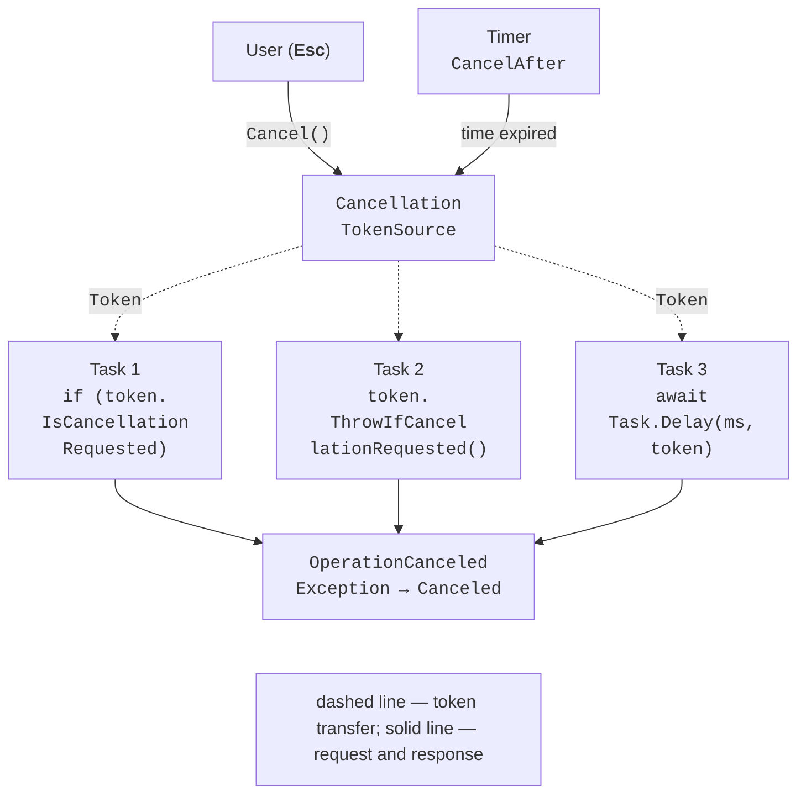

# Exceptions, cancellation, and timeouts

## Exception handling

An exception that is not handled inside a task does not immediately terminate the process: TPL catches it and stores it in the task, which enters the `Faulted` state. The exception “returns” to the code waiting for the task. Documentation: <https://learn.microsoft.com/dotnet/standard/parallel-programming/exception-handling-task-parallel-library>.

Because a task can collect multiple exceptions (child tasks, `WhenAll` for several tasks), its `Exception` property has type `AggregateException`, and individual exceptions reside in the `InnerExceptions` collection. Waiting behavior differs:

- `Wait()`, `Result`, and `WaitAll` throw an `AggregateException` containing all exceptions;
- `await` throws the **first** inner exception so that an ordinary `catch (IOException)` works just as it does in synchronous code. To see all exceptions after `await Task.WhenAll(...)`, read the `Exception` property of the task returned by `WhenAll`.

```cs
Task all = Task.WhenAll(tasks);
try
{
    await all;
}
catch (Exception first)
{
    Console.WriteLine($"first: {first.Message}");
    foreach (Exception ex in all.Exception!.InnerExceptions)
    {
        Console.WriteLine($"  {ex.GetType().Name}: {ex.Message}");
    }
}
```

In the Rider debugger, a task exception pauses the program at `await`, and the *Threads & Variables* tab shows the contents of `InnerExceptions` (Fig. 5.3).

::: info Screenshot
Rider: Run → Debug the statistics example with two failing parts; exception popup at `await all` and Threads & Variables with `all.Exception.InnerExceptions` expanded (2 items)
:::

Figure 5.3. An `AggregateException` in the Rider debugger {.caption}

### The `Flatten` and `Handle` methods

For child tasks, `AggregateException` forms a tree: the parent task's exception contains each child's `AggregateException`. `Flatten()` returns a new exception with a flat list of all inner exceptions. `Handle(predicate)` invokes the predicate for each inner exception; exceptions for which it returns `true` are considered handled, while the rest form a new `AggregateException` that is thrown:

```cs
try
{
    // the parent threw InvalidOperationException,
    // two child tasks threw FormatException and IOException
    parent.Wait();
}
catch (AggregateException ae)
{
    Console.WriteLine(ae.InnerExceptions.Count);    // 3
    AggregateException flat = ae.Flatten();  // flat list
    flat.Handle(ex => ex is IOException or FormatException);
    // Handle throws a new AggregateException
    // containing the unhandled InvalidOperationException
}
```

### Unobserved exceptions

If nobody waits for a faulted task or reads its `Exception`, the exception remains **unobserved**. Since .NET Framework 4.5, this does not terminate the process: when the garbage collector finalizes such a task, the `TaskScheduler.UnobservedTaskException` event occurs. Use it for logging (the handler can call `e.SetObserved()`), not as an exception handling mechanism.

The event does not fire immediately, only after garbage collection, so errors in “forgotten” tasks are easy to miss. Await every task you start or explicitly handle its exceptions.

## Cooperative cancellation

In .NET, you cannot safely “kill” a thread or task from outside: the operation might leave data in an inconsistent state. Instead, .NET uses **cooperative cancellation**: the code initiating cancellation merely **requests** a stop, while the operation itself periodically checks the request and finishes gracefully (Fig. 5.4). Documentation: <https://learn.microsoft.com/dotnet/standard/threading/cancellation-in-managed-threads>.



Figure 5.4. Cooperative cancellation {.caption}

The components of this mechanism are:

- `CancellationTokenSource` — the cancellation source; `Cancel()` (or `CancelAsync()`) sends a request, and `CancelAfter(TimeSpan)` does so on a timer; the source implements `IDisposable`;
- `CancellationToken` — a lightweight “ticket” structure passed to operations; the token itself cannot cancel an operation, only check for a request: `IsCancellationRequested`, `ThrowIfCancellationRequested()`;
- `Register(callback)` — registers an action to run on cancellation (for example, close a socket or stop a server);
- `OperationCanceledException` (and its subclass `TaskCanceledException`) — the standard way to report that an operation was canceled.

```cs
static long CountPrimes(int limit, CancellationToken token)
{
    long count = 0;
    for (int n = 2; n <= limit; n++)
    {
        if (n % 10_000 == 0)
        {
            token.ThrowIfCancellationRequested();  // checkpoint
        }
        if (IsPrime(n)) count++;
    }
    return count;
}

using CancellationTokenSource cts = new();
cts.CancelAfter(TimeSpan.FromSeconds(2));
Task<long> task = Task.Run(() => CountPrimes(50_000_000, cts.Token),
    cts.Token);
```

Place checkpoints so that no more than tens of milliseconds pass between them, but not in every short iteration. Library asynchronous methods (`Task.Delay`, `File.ReadAllTextAsync`, `HttpClient.GetAsync`, `SemaphoreSlim.WaitAsync`) accept a token and throw `OperationCanceledException` themselves.

### `Canceled` or `Faulted` state

A task enters `Canceled` if it throws `OperationCanceledException` **with the same token** passed to `Task.Run(..., token)`. If no token was passed to `Task.Run`, the same exception puts the task in `Faulted`. Also, if the token is canceled before the task starts, a task with that token will never begin execution. For `async` methods, any `OperationCanceledException` that escapes the method sets the `Canceled` state.

When awaiting a task, catch cancellation in a separate `catch (OperationCanceledException)` block. A `when (cts.IsCancellationRequested)` filter distinguishes “our” cancellation from a timeout inside a library.

### Linked tokens

An operation often needs to be canceled for several reasons: the user pressed **Esc**, an overall timeout expired, or the entire application is shutting down. `CancellationTokenSource.CreateLinkedTokenSource(token1, token2)` creates a source that is canceled as soon as either original token is canceled. Always dispose of the linked source (`using`); otherwise it remains registered with the parent tokens.

## Progress and timeouts

A long-running operation should report its progress. The standard interface is `IProgress<T>`, with the single method `Report(T value)`. The operation accepts `IProgress<T>?` and does not know how progress is displayed: in the console, a window's progress bar, or a log.

When created, `Progress<T>` captures the current `SynchronizationContext` and invokes its handler through that context: in WPF or WinForms, the handler runs on the UI thread and can therefore update window controls. A console program has no context, so handlers are queued to the thread pool and may run **in parallel and out of order**. In a test on an i9-11900KF, five calls to `Report(0)`…`Report(4)` printed values in the order 0, 3, 2, 1, 4 from different threads. In console programs, it is therefore convenient to implement `IProgress<T>` with a custom class that prints messages immediately (see the “File hashing with cancellation” example).

`WaitAsync(TimeSpan)` provides a timeout without a separate cancellation source: it returns a task that completes with the original task or throws `TimeoutException` if time runs out: `await File.ReadAllTextAsync(path).WaitAsync(TimeSpan.FromSeconds(3))`.

`WaitAsync` stops only the **wait**: the operation itself continues running. To stop the operation, pass it a token from a source with `CancelAfter`.
