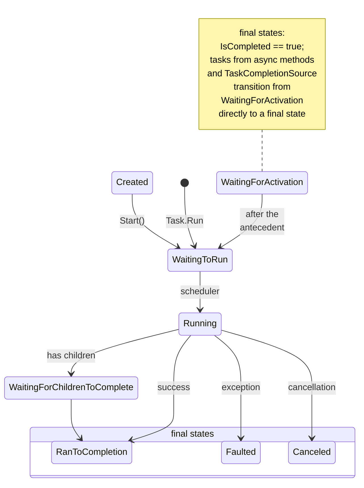
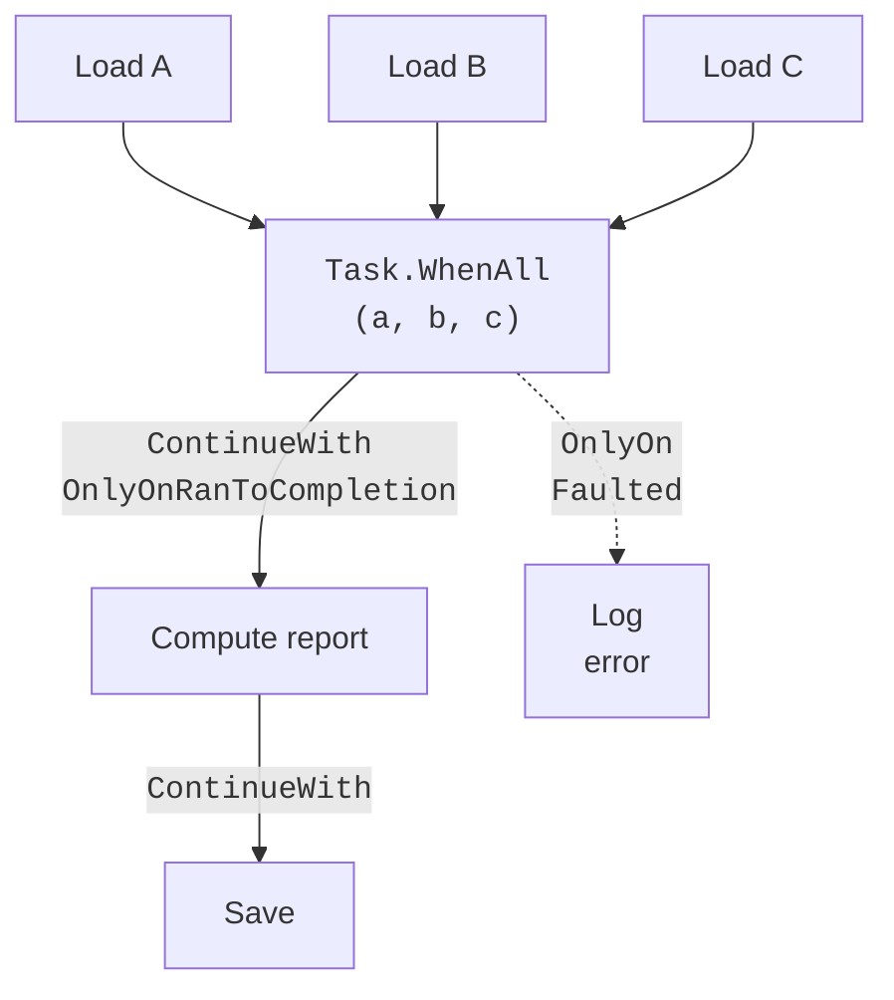

# Tasks, states, and continuations

## From threads to tasks

In Topic 2, parallel computations were started in `Thread` objects and in the thread pool. A thread is an operating system resource: it has its own stack (typically 1 MB), and creating and switching threads takes time. Also, `Thread` provides no convenient way to return a result, propagate an exception to the caller, or wait for several jobs at once.

The **Task Parallel Library** (*TPL*) in the `System.Threading.Tasks` namespace provides a higher level of abstraction: a **task**. A task describes an asynchronous operation that will eventually complete: successfully (with a result), with an exception, or with cancellation. A task is not a thread: a compute task runs on a pool thread, while an I/O task may occupy no thread at all while waiting for a disk or the network. Library overview: <https://learn.microsoft.com/dotnet/standard/parallel-programming/task-parallel-library-tpl>.

- `Task` — an operation without a result (analogous to `void`);
- `Task<TResult>` — an operation with a result available through `await` or the `Result` property.

The simplest way to start computation in the thread pool is `Task.Run`:

```cs
Task<long> sumTask = Task.Run(() =>
{
    long sum = 0;
    for (int i = 1; i <= 100_000_000; i++) sum += i % 7;
    return sum;                   // task result
});
Console.WriteLine("The main thread is not waiting…");
long sum = await sumTask;         // wait without blocking
Console.WriteLine(sum);
```

### `Task.Factory.StartNew` and creation options

`Task.Run(action)` is shorthand for calling `Task.Factory.StartNew` with default options. Use `StartNew` when you need to configure a task with **creation options** (`TaskCreationOptions`):

- `LongRunning` — a hint to the scheduler that the task will run for a long time (seconds or more) and will usually block a thread; the default scheduler creates a dedicated thread so that it does not occupy a pool thread for a long time;
- `AttachedToParent` — a child task whose parent waits for its completion;
- `DenyChildAttach` — prevents child tasks from attaching (this is how `Task.Run` creates tasks);
- `RunContinuationsAsynchronously` — task continuations always run asynchronously.

::: tip Warning
`StartNew` does not understand asynchronous lambdas. Calling `Task.Factory.StartNew(async () => { await Task.Delay(500); })` returns a `Task<Task>`: the outer task finishes immediately after the first `await`, while the inner task is still in `WaitingForActivation`. For asynchronous lambdas, use `Task.Run` (which “unwraps” the inner task) or `Unwrap()`. `LongRunning` also makes no sense for asynchronous code: execution continues in the pool after the first `await` anyway.
:::

### The task scheduler

A **task scheduler**, an object of class `TaskScheduler`, assigns a task to a thread. The default scheduler, `TaskScheduler.Default`, queues tasks in the thread pool. The pool has a global queue and local worker thread queues: a task created inside another task enters the current thread’s local queue (LIFO order, better cache locality), while idle threads use **work stealing** to take work from the ends of other threads’ queues. Custom schedulers are uncommon (for example, `ConcurrentExclusiveSchedulerPair` limits parallelism); in applications with a user interface, `TaskScheduler.FromCurrentSynchronizationContext()` runs a task on the UI thread.

## Task states and waiting

The `Status` property of type `TaskStatus` returns a task’s current state (Fig. 5.1). A task created with the `new Task(...)` constructor remains in `Created` until `Start()` is called. Tasks created by `Task.Run` are queued immediately (`WaitingToRun`) and then run (`Running`). Continuations and tasks from `async` methods wait in `WaitingForActivation`. There are three final states:

- `RanToCompletion` — successful completion, `IsCompletedSuccessfully == true`;
- `Faulted` — completion with an unhandled exception, `IsFaulted == true`, with the exception in the `Exception` property;
- `Canceled` — cancellation through `OperationCanceledException` with the task’s token, `IsCanceled == true`.



Figure 5.1. Task lifecycle {.caption}

### Blocking and asynchronous waiting

There are two ways to wait for a task (Table 5.1). **Blocking** methods `Wait()`, `Result`, `Task.WaitAll`, and `Task.WaitAny` stop the current thread until tasks finish. **Asynchronous** combinators `Task.WhenAll`, `Task.WhenAny`, and `Task.WhenEach` themselves return a task that is awaited with `await`, without occupying a thread.

Table 5.1. Waiting for tasks {.caption}

| **Blocking call** | **Asynchronous equivalent** | **Result and exceptions** |
| --- | --- | --- |
| `task.Wait()` | `await task` | `Wait` throws `AggregateException`; `await` throws the first inner exception |
| `task.Result` | `await task` | a `TResult` value; exceptions as above |
| `Task.WaitAll(tasks)` | `await Task.WhenAll(tasks)` | an array of results in task order; waits for all tasks, even after a failure |
| `Task.WaitAny(tasks)` | `await Task.WhenAny(tasks)` | the index or the task that finished first (including a faulted task) |
| – | `await foreach (var t in Task.WhenEach(tasks))` | tasks in completion order (.NET 9 and later) |

::: tip Pitfall
`Wait()` and `Result` block the thread. In a console program this merely wastes a pool thread, but in an application with a synchronization context (WinForms, WPF, older ASP.NET) it may cause a **deadlock**: the UI thread waits for the task, while the task waits for the UI thread to run its continuation. The rule is to use `await` rather than `Result` whenever a method can be asynchronous.
:::

`Task.WhenAny` is useful for timeouts or choosing the fastest source: after the first task completes, the others continue running, so cancel them or at least await them and check for exceptions. `Task.WhenEach` lets you process results as they become available: `await foreach (Task<int> t in Task.WhenEach(tasks))` returns tasks in completion order, and reading `t.Result` inside the loop no longer blocks the thread.

## Continuations and task graphs

A **continuation** is a task that starts after another task (the **antecedent**) completes. `ContinueWith` creates a continuation: its delegate receives the completed antecedent and can read its `Result`, `Exception`, or `Status`. More information: <https://learn.microsoft.com/dotnet/standard/parallel-programming/chaining-tasks-by-using-continuation-tasks>.

```cs
Task<int> load = Task.Run(() => LoadRecords("orders.csv"));
Task<string> report = load.ContinueWith(
    t => $"records: {t.Result}",
    TaskContinuationOptions.OnlyOnRanToCompletion);
```

`TaskContinuationOptions` specify **which** antecedent outcomes trigger the continuation:

- `OnlyOnRanToCompletion`, `OnlyOnFaulted`, `OnlyOnCanceled` — only for a particular final state; if the condition is not met, the continuation enters `Canceled`;
- `NotOnFaulted`, `NotOnCanceled`, `NotOnRanToCompletion` — the opposite conditions;
- `ExecuteSynchronously` — run a short continuation on the same thread that completed the antecedent;
- `AttachedToParent`, `LongRunning` — the same as the creation options.

Continuations form a **task graph**: several independent tasks run in parallel, `Task.WhenAll` waits for all of them, results are then processed, and a separate branch handles errors (Fig. 5.2).



Figure 5.2. Task graph with continuations {.caption}

::: tip Tip
In new code, continuation chains are usually written using `await`: `int n = await load; string text = $"records: {n}";`. The code reads sequentially, exceptions are handled with ordinary `try`/`catch`, and the continuation runs in the correct context. `ContinueWith` remains useful for explicit task graphs and conditional branches. When using it, explicitly pass `TaskScheduler.Default`: otherwise the continuation takes the **current** scheduler, which in library code might turn out to be the UI thread scheduler.
:::

### Nested and child tasks

A task created inside another task is **nested** by default: the parent does not wait for it. A task with `AttachedToParent` becomes a **child**: the parent enters `WaitingForChildrenToComplete`, finishes after all children, and collects their exceptions. Tasks cannot attach to `Task.Run` tasks (`DenyChildAttach`); in new code, collect tasks into an array and await `Task.WhenAll` instead of using child tasks.
