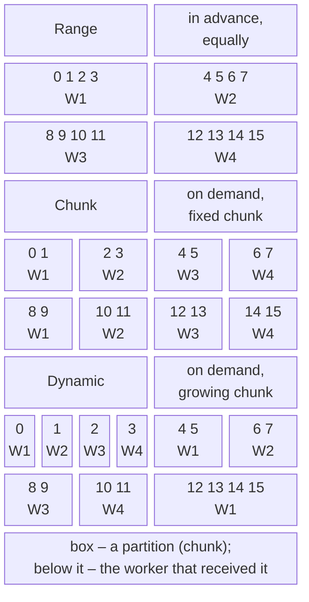

# Parallel.Invoke and data partitioning

## Parallel.Invoke, Parallel.ForAsync, and Parallel.ForEachAsync

`Parallel.Invoke` executes several **different** actions, potentially in parallel, and waits for all to finish. It is the simplest form of task parallelism when there are only a few actions and their count is known in advance, such as two array halves in merge sort:

```cs
double min = 0, max = 0, average = 0;
Parallel.Invoke(
    () => min = data.Min(),
    () => max = data.Max(),
    () => average = data.Average());
```

Each action writes to its own variable, so there is no race condition. Action exceptions are also collected into `AggregateException`.

`Parallel.For` and `Parallel.ForEach` are intended for computation: a pool thread is occupied throughout the body’s execution. If the body mostly **waits** (network, disk, `Task.Delay`), blocking pool threads is inefficient. For asynchronous bodies, use `Parallel.ForEachAsync` (since .NET 6) or `Parallel.ForAsync` (since .NET 8). The body is an asynchronous delegate that receives an element and a cancellation token and returns `ValueTask`:

```cs
string[] files = ["a.txt", "b.txt", "c.txt", "d.txt"];
ParallelOptions options = new() { MaxDegreeOfParallelism = 2 };

await Parallel.ForEachAsync(files, options, async (file, token) =>
{
    await Task.Delay(200, token);       // simulate I/O
    Console.WriteLine($"{file} processed");
});
```

At most two files are processed concurrently, so four files taking 200 ms each finish in about 400 ms (405 ms in our run), and output line order varies between runs. Without `ParallelOptions`, `ForEachAsync` runs at most `Environment.ProcessorCount` operations concurrently. For I/O, set the limit explicitly in most cases: it depends on server or disk capacity, not the number of cores.

## Data partitioning

For multiple threads to process one collection, it must be divided into **partitions**. A **partitioner** handles this. TPL and PLINQ provide standard partitioners and allow custom ones for special cases <https://learn.microsoft.com/dotnet/standard/parallel-programming/custom-partitioners-for-plinq-and-tpl>. Figure 6.3 shows the main strategies.



Figure 6.3. Data partitioning strategies {.caption}

- **Range partitioning.** For arrays and `IList<T>` with a known length, each thread receives its index range in advance. Synchronization is needed only when creating ranges. The drawback: if one range is “heavier” (the central rows of a fractal), its thread works longer while others cannot help.
- **Chunk partitioning.** Threads take chunks of elements on demand until none remain. This provides natural **load balancing**: an idle thread takes the next chunk. Acquiring each chunk requires synchronization, so excessively small chunks increase overhead.
- **Dynamic partitioning.** Chunk sizes and partition counts change during execution: chunks grow (1, 2, 4, …), and new partitions are created when the loop adds a task. This is how the default `Parallel.ForEach` partitioner works for an `IEnumerable<T>` of unknown length.

According to the documentation, PLINQ defaults to range partitioning without load balancing for arrays and `IList<T>`, and chunk partitioning for other `IEnumerable<T>` sources. Enable load balancing for an array with `Partitioner.Create(array, loadBalance: true)`.

### Small loop bodies: Partitioner.Create(from, to)

Calling a delegate on each iteration costs about as much as a virtual method call. If the loop body is a single addition, the call takes longer than the work itself. In that case, use the **range partitioner** `Partitioner.Create(fromInclusive, toExclusive, rangeSize)`: it creates a sequence of `Tuple<int, int>` range boundaries, and the `Parallel.ForEach` body traverses its range with an ordinary `for` loop. The delegate is called once per range, not per element:

```cs
var ranges = Partitioner.Create(0, data.Length, 1 << 20);
Parallel.ForEach(ranges, range =>
{
    long local = 0;
    for (int i = range.Item1; i < range.Item2; i++)
    {
        local += (long)data[i] * data[i];
    }
    Interlocked.Add(ref sum, local);
});
```

A program computing the sum of squares of 50 million numbers from 0 to 999 using different approaches produced the results in Table 6.2 (median of five runs after warmup).

Table 6.2. Sum of squares of 50 million numbers on an i9-11900KF {.caption}

| **Method** | **Time, ms** | **Result** |
| --- | --- | --- |
| sequential `for` loop | 30.9 | correct |
| `Parallel.For`, shared variable `sum +=` | 582.2 | incorrect, different every time |
| `Parallel.For` with `lock` on every iteration | 5802.5 | correct |
| `Parallel.For` with local state | 19.8 | correct |
| `Partitioner.Create` with ranges of $2^{20}$ elements | 5.0 | correct |

The race condition not only corrupts the result but also makes the loop almost 19 times slower because of constant processor cache conflicts. Locking fixes the result, but 50 million lock acquisitions make the loop 190 times slower. Local state removes synchronization, but calling a delegate for every multiplication is still costly; only the range partitioner achieves a sixfold speedup.

Without `rangeSize`, the library chooses the range size: in the current implementation on a PC with 16 logical processors, an array of 1,000,000 elements is divided into 49 ranges of 20,833 elements (approximately $n / (3 p)$). Range size is the task’s **granularity**: ranges that are too small increase overhead, while excessively large ranges hurt load balancing.

Create a custom partitioner when the data structure can be divided better than the standard partitioner allows (a tree or a file of records), or when elements have different “weights.” Derive from `Partitioner<TSource>` (or `OrderablePartitioner<TSource>` if ordering is needed) and override `GetPartitions`; for `Parallel.ForEach`, also override `SupportsDynamicPartitions` and `GetDynamicPartitions`. The partitioner must enumerate every element exactly once, without omissions or duplicates.
