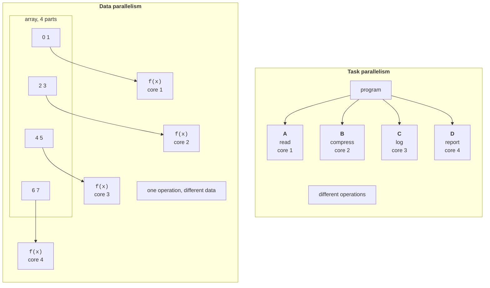

# Parallel loops in the Parallel class

## Data parallelism and task parallelism

In Topic 5, a program was divided into **tasks**: separate operations that can run concurrently. This approach is called **task parallelism**: different cores do different work, such as one loading a file, another compressing data, and a third writing a log.

**Data parallelism** performs **the same operation** on different parts of a large dataset (Fig. 6.1). An array, collection, image, or matrix is divided into parts, and each core processes its own part. Image filters, vector and matrix computations, searches in large arrays, and log statistics all work this way. This parallelism scales well: the more data there is, the more work each core has and the smaller the share of overhead.



Figure 6.1. Data parallelism and task parallelism {.caption}

A loop can run in parallel only if its **iterations are independent**. For iterations $i$ and $j$, this means (Bernstein's conditions) that iteration $i$ does not write data read or written by iteration $j$, and vice versa. Shared data may be read concurrently, but not written.

```cs
// Independent iterations: each writes only to its own element.
for (int i = 0; i < n; i++) c[i] = a[i] + b[i];

// Dependent iterations: iteration i reads the result of iteration (i-1).
for (int i = 1; i < n; i++) a[i] = a[i - 1] + b[i];

// Dependency through a shared variable: a race condition (Topic 3).
for (int i = 0; i < n; i++) sum += a[i];
```

The first loop can be parallelized without changes. The second has a **loop-carried dependency**: it needs an algorithmic change, such as replacement with a prefix sum (see “Parallel reduction and prefix sum”). The third loop is parallelized through **reduction**: each thread accumulates its own partial sum, and the partial sums are combined at the end.

Dividing a problem into parts that can be processed independently is called **data decomposition**. Both correctness and performance depend on it: parts should be large enough that useful work outweighs overhead, and roughly equal in computational cost so no core sits idle.

## Parallel.For and Parallel.ForEach loops

TPL's `System.Threading.Tasks.Parallel` class provides parallel equivalents of loops <https://learn.microsoft.com/dotnet/api/system.threading.tasks.parallel>. `Parallel.For` replaces a `for` loop, and `Parallel.ForEach` replaces `foreach`. The loop body is passed as a delegate, and the library distributes iterations among pool threads, also using the calling thread. The method returns only after all iterations finish.

```cs
Parallel.For(0, input.Length, i =>      // for (int i = 0; …)
{
    output[i] = Math.Sqrt(Math.Abs(input[i]));
});
Parallel.ForEach(files, path => Compress(path));  // foreach
```

Iteration order is unspecified: iteration 1000 may finish before iteration 0. Therefore, the body must not depend on order; write results to the element at the iteration's index (the `output` array), or accumulate them using the approaches in “Thread-local state”. A parallel loop loads all logical processors (Fig. 6.2).

::: info Screenshot
Task Manager → Performance → CPU, graph “Logical processors”, while the Mandelbrot example runs; all 16 graphs near 100 %
:::

Figure 6.2. Logical processor utilization during `Parallel.For` {.caption}

### Loop settings: ParallelOptions

Overloads taking `ParallelOptions` let you configure the loop:

- `MaxDegreeOfParallelism` — the maximum number of concurrent iterations; `-1` (the default) means “unlimited”, allowing the scheduler to choose the thread count;
- `CancellationToken` — a cancellation token (Topic 5): after cancellation is requested, no new iterations start, and the method throws `OperationCanceledException`;
- `TaskScheduler` — the task scheduler (the standard thread pool by default).

```cs
using CancellationTokenSource cts = new(TimeSpan.FromSeconds(5));
ParallelOptions options = new()
{
    MaxDegreeOfParallelism = Environment.ProcessorCount / 2,
    CancellationToken = cts.Token     // exception after 5 s
};
Parallel.For(0, images.Length, options, i => Blur(images[i]));
```

Use `MaxDegreeOfParallelism` to leave cores for other programs, avoid overloading a disk or server, and measure execution time for different thread counts $p$ when analyzing scalability.

### Early termination: Break and Stop

You cannot use a `break` statement in the delegate body. Instead, overloads with a `ParallelLoopState` parameter provide two methods:

- `Stop()` — stop the loop as soon as possible; no new iterations start. Suitable for finding **any** element that satisfies a condition;
- `Break()` — do not start iterations with **higher** indices, but execute all iterations with lower indices. Suitable for finding the **first** element, as in a sequential loop.

Iterations already running are not interrupted. Long iterations check `ShouldExitCurrentIteration` and, after `Break`, `LowestBreakIteration`. The method returns a `ParallelLoopResult` structure: `IsCompleted` is `false` if the loop ended early, and `LowestBreakIteration` is the lowest index at which `Break` was called (`null` after `Stop`).

```cs
ParallelLoopResult result = Parallel.For(0, values.Length,
    (i, state) =>
    {
        if (values[i] < 0) state.Break();
    });
if (!result.IsCompleted)
{
    Console.WriteLine(
        $"First negative: index {result.LowestBreakIteration}");
}
```

For an array of 1 000 000 elements with negative values at positions 97 330, 194 661, …, this code always prints index 97 330. With `Stop()`, the index found depends on which iteration encounters a negative value first (194 661 in our run). You cannot call both `Break` and `Stop` in one loop: doing so throws `InvalidOperationException`.

### Exceptions in parallel loops

If the loop body throws an exception, no new iterations start, but those already running finish, and each may also throw an exception. After completion, the method collects all exceptions into one `AggregateException`, with the list available in `InnerExceptions`. For example, a `Parallel.For(0, 100, …)` loop whose body throws `InvalidOperationException` for `i % 30 == 7` produced an `AggregateException` with four inner exceptions (for $i = 7 , 37 , 67 , 97$) when run on 16 logical processors: those iterations started concurrently on different threads. The count may differ on another PC.

### Thread-local state

A common parallel loop task is calculating a sum, count, minimum, or histogram. A shared variable, `sum += …`, without synchronization produces a **race condition** (Topic 3) and an incorrect result. A `lock` on every iteration produces the correct result, but threads constantly wait for one another, making the parallel loop dozens of times slower than the sequential loop (Table 6.2).

The correct approach is **thread-local state**. The `Parallel.For<TLocal>` and `Parallel.ForEach<TSource, TLocal>` overloads accept three delegates (Table 6.1):

Table 6.1. Delegates for a loop with local state {.caption}

| **Parameter** | **Purpose** |
| --- | --- |
| `localInit` | creates the initial local state for each portion of work (each loop task): `() => 0L` |
| `body` | iteration body: receives the index (or element), `ParallelLoopState`, and current local state, then returns the new state: `(i, state, local) => local + a[i]` |
| `localFinally` | called once for each local state after its portion finishes; combines partial results here: `local => Interlocked.Add(ref sum, local)` |

```cs
long sum = 0;
Parallel.For(0, data.Length,
    localInit: () => 0L,
    body: (i, state, local) => local + (long)data[i] * data[i],
    localFinally: local => Interlocked.Add(ref sum, local));
```

The body does not access shared variables, so it needs no lock. Synchronization is needed only in `localFinally`, which is called a few times over the entire loop; for complex state (a histogram array or dictionary), use `lock` in `localFinally`. There are usually as many local states as tasks created by the loop, not as many as iterations. The task count is not guaranteed, so the combining operation must give the same result regardless of how work is partitioned.
