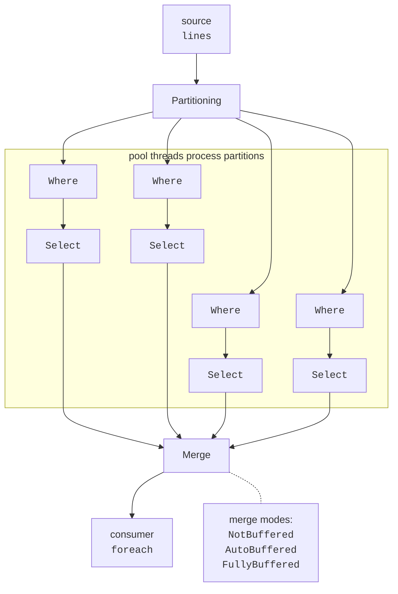

# PLINQ and aggregation

## PLINQ: parallel queries

**PLINQ** (*Parallel LINQ*) is a parallel implementation of LINQ to Objects <https://learn.microsoft.com/dotnet/standard/parallel-programming/introduction-to-plinq>. To run a query in parallel, apply `AsParallel()` to the source. It returns `ParallelQuery<T>`, after which methods of the `ParallelEnumerable` class are called with the same names: `Where`, `Select`, `GroupBy`, `Sum`, `Aggregate`, and so on.

```cs
int[] numbers = Enumerable.Range(1, 10_000_000).ToArray();
long count = numbers.AsParallel()
    .Where(n => IsPrime(n))
    .LongCount();
```

Figure 6.4 shows PLINQ query execution: the source is partitioned, each partition is processed by its own thread, and results are **merged** for the consumer: a `foreach` loop, `ToList()`, or an aggregation operation.



Figure 6.4. PLINQ query execution {.caption}

Configure query behavior with methods placed after `AsParallel()` (Table 6.3).

Table 6.3. PLINQ query configuration methods {.caption}

| **Method** | **Purpose** |
| --- | --- |
| `WithDegreeOfParallelism(p)` | maximum query thread count, from 1 to 512 |
| `WithExecutionMode(ForceParallelism)` | run in parallel even if PLINQ considers parallelization inefficient for the query |
| `WithMergeOptions(…)` | result merge mode: `NotBuffered`, `AutoBuffered`, `FullyBuffered` |
| `WithCancellation(token)` | cancel the query with a token; throws `OperationCanceledException` |
| `AsOrdered()` / `AsUnordered()` | preserve source element order / discard it later in the query |
| `ForAll(action)` | perform an action on each result in parallel, without merging |
| `AsSequential()` | execute the rest of the query sequentially |

### Result order

By default, PLINQ **does not preserve source order**: results arrive in the order partitions process them. `AsOrdered()` preserves order, but PLINQ must track element indices and reorder results during merging, slowing the query. After operations that no longer need order (for example, before `GroupBy` or `Sum`), call `AsUnordered()`. `OrderBy` establishes a new order independently of `AsOrdered`.

For example, given the array $1 , 2 , … , 8$ and a method that takes longer for smaller numbers (a `Thread.Sleep((9 - n) * 20)` delay), the query `numbers.AsParallel().Select(SlowSquare)` with `WithMergeOptions(ParallelMergeOptions.NotBuffered)` returned squares in completion order in our run, which was reverse order: `64 49 36 25 16 9 4 1`. The same query with `AsOrdered()` returned `1 4 9 16 25 36 49 64`.

### Merge modes

When one thread consumes results, PLINQ merges them using one of these modes:

- `NotBuffered` — each result is delivered to the consumer immediately after computation; the first result arrives fastest, but total time may be longer;
- `AutoBuffered` (the default for most queries) — results are delivered in batches;
- `FullyBuffered` — the entire result is computed before the first element is delivered; total time is often shortest.

The mode is only a hint: `OrderBy` and `Reverse` always buffer all results, while `ForAll(item => bag.Add(item))` never buffers because it executes the action on partition threads without merging (the receiving collection must be thread-safe, such as `ConcurrentBag<T>`).

### When PLINQ is slower than LINQ

PLINQ has overhead: partitioning, task startup, merging, and, for `AsOrdered`, ordering. A query becomes slower than its sequential counterpart when:

- the source is small or operations are cheap: in our measurement, 10,000 `Where(x => x % 3 == 0).Sum()` queries on a 100-element array took 62 ms with LINQ and 126 ms with PLINQ;
- most work is done by an operator that parallelizes poorly, such as `GroupBy` with millions of small elements (see the “Text analysis” example);
- delegates access a shared resource with locking (`lock`, `Console.WriteLine`) or allocate large amounts of memory;
- order is required (`AsOrdered`, `Take`, `Skip`), and much of the work goes into ordering.

Always base conclusions on measurements in *Release* configuration.

## Aggregation: associativity and commutativity

PLINQ aggregation operations (`Sum`, `Min`, `Max`, `Average`, `Count`, `Aggregate`) use **reduction**: each partition accumulates a partial result, then the partial results are combined. The most general `Aggregate` overload has four delegates:

```cs
var (count, total) = orders.AsParallel().Aggregate(
    seedFactory: () => (Count: 0, Total: 0m),          // for a partition
    updateAccumulatorFunc: (acc, order) =>             // within a partition
        (acc.Count + 1, acc.Total + order.Amount),
    combineAccumulatorsFunc: (a, b) =>                 // combine partitions
        (a.Count + b.Count, a.Total + b.Total),
    resultSelector: acc => acc);                       // result
```

`seedFactory` creates a separate accumulator for each partition, so `update` changes it without locks. `combine` merges partition accumulators, and `resultSelector` transforms the final accumulator into the result (for example, a sum and count into an average).

The parallel aggregation result is independent of partitioning only if the combining operation is:

- **associative**: $(a \oplus b) \oplus c = a \oplus (b \oplus c)$, meaning that parenthesization (the combining tree) does not affect the result. Addition, multiplication, minimum, maximum, and set union are associative; subtraction and division are not;
- **commutative**: $a \oplus b = b \oplus a$. This is required when partition order during merging is not guaranteed, as in `Aggregate` without `AsOrdered`. String concatenation is associative but not commutative.

For a non-associative operation, PLINQ does not report an error; it simply returns the wrong result:

```cs
int[] numbers = Enumerable.Range(1, 1000).ToArray();
int sequential = numbers.Aggregate((a, x) => a - x);   // -500,498
int parallel = numbers.AsParallel()
    .Aggregate((a, x) => a - x);                       //  481,376
```

The value `481,376` was obtained on a PC with 16 logical processors; on another PC it differs, but is equally incorrect.

PLINQ collects exceptions thrown by query delegates into `AggregateException`, just like parallel loops. The query `numbers.AsParallel().Select(x => 100 / (x % 500)).ToArray()` on numbers 1…1000 produced an `AggregateException` with two `DivideByZeroException` instances (for 500 and 1000). A query canceled through `WithCancellation` throws `OperationCanceledException`.
