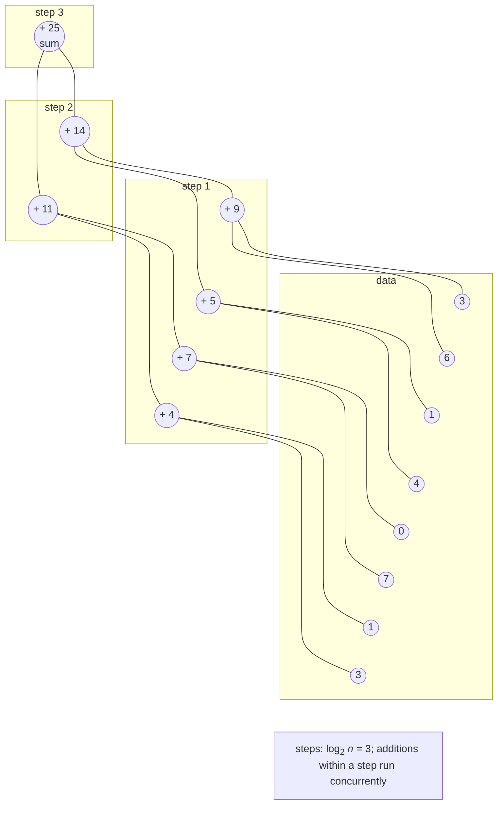
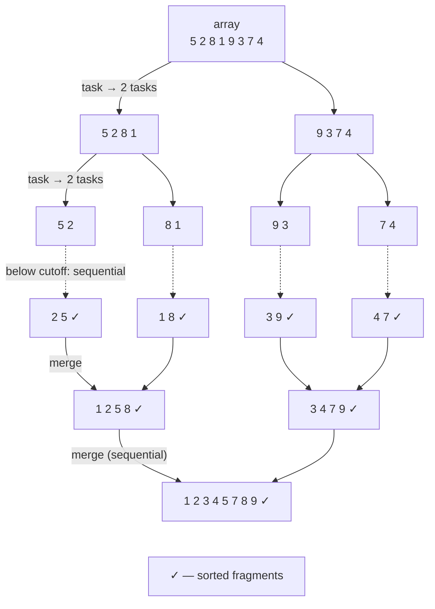

# Reduction, sorting, and performance

## Parallel reduction and prefix sum

**Reduction** combines a dataset into one value using an associative operation $\oplus$: sum, product, minimum, maximum. A sequential loop performs $n - 1$ operations in $n - 1$ steps. Parallel reduction combines values pairwise in a **reduction tree** (Fig. 6.5): the first step computes sums of adjacent pairs concurrently, the second sums pairs of those sums, and so on.

Figure 6.5. Parallel reduction tree {.caption}

Total **work** (operation count) remains $n - 1$, while the **span** (step count with unlimited processors) is $\log_{2} n$: 20 steps for a million elements. On a conventional processor with $p$ cores, the tree's lower levels have far more operations than cores, so first divide the data into $p$ parts (reduce each part sequentially), then build a tree only from the partial results. This is how `localInit`/`localFinally` and `Aggregate` work.

A **prefix sum** (*scan*) computes every intermediate result: for $x = (3 , 1 , 7 , 0 , 4 , 1 , 6 , 3)$, the **inclusive** prefix sum is $(3 , 4 , 11 , 11 , 15 , 16 , 22 , 25)$, while the **exclusive** one (the sum of elements **before** the current element) is $(0 , 3 , 4 , 11 , 11 , 15 , 16 , 22)$. The sequential loop `s[i] = s[i - 1] + x[i]` has a dependency between iterations, but the problem can be parallelized using the **Blelloch scan** for an array of length $n = 2^{k}$. It has two phases, each with $\log_{2} n$ levels; operations within a level are independent:

1. **Up-sweep** builds a reduction tree in place: at the level with stride $s = 2 , 4 , … , n$, execute `a[i + s - 1] += a[i + s/2 - 1]` for each pair. After the up-sweep, the last element contains the entire array's sum.
2. **Down-sweep** replaces the last element with the identity element (0), then, at levels with stride $s = n , … , 4 , 2$, gives each pair's left element the right element's (parent's) value, and the right element the sum of the parent and the old left value.

After the down-sweep, the array contains the exclusive prefix sum. The algorithm performs about $2 n$ operations with span $2 \log_{2} n$. On GPUs (Topic 11) with thousands of cores, this provides substantial speedup. On an 8-core CPU, the Blelloch algorithm is slower than a sequential loop for simple 64-bit addition: it performs twice as many operations, each level traverses memory again, and the work per operation is tiny (lab, Example 1). Prefix sums are used to calculate positions during parallel filtering, in radix sort, and to compute cumulative metrics.

## Parallel sorting algorithms

Sorting is a classic example combining data and task parallelism.

### Merge sort

**Merge sort** splits an array in half, sorts the halves, and merges them. The halves are independent, so they can be sorted in parallel, for example with `Parallel.Invoke` (Fig. 6.6). Two details matter:

- **cutoff**: sort fragments below a threshold (thousands to tens of thousands of elements) sequentially, because creating tasks for small fragments costs more than the work itself;
- **depth limit**: create new tasks only at the top $\log_{2} p$ recursion levels; beyond that, recurse sequentially.

Figure 6.6. Parallel merge sort {.caption}

The final merge runs on one thread and scans the entire array, so Amdahl's law (Topic 1) limits speedup: the “Parallel merge sort” example achieves only 4–6 on 16 logical processors. For greater speedup, parallelize merging too: locate the middle element of one half in the other half using binary search, then merge the two parts independently.

**Quicksort** is parallelized similarly: partitioning around the pivot is sequential, while tasks sort the two parts in parallel with the same cutoff and depth limit. The parts may be very unequal, so scalability is worse.

### Odd–even transposition sort

**Odd–even transposition sort** is a parallel version of bubble sort. An array of $n$ elements is sorted in $n$ phases. An even phase compares and, if needed, swaps pairs $(0 , 1) , (2 , 3) , …$; an odd phase uses pairs $(1 , 2) , (3 , 4) , …$ Pairs within a phase do not overlap, so all comparisons in that phase run in parallel. The algorithm performs $O (n^{2})$ comparisons and is suitable only for small arrays or hardware implementations. **Sorting networks**, such as Batcher's odd-even merge network with depth $O (\log^{2} n)$, perform a fixed comparison sequence independent of the data; they are implemented in hardware, on GPUs, and in SIMD code (Topic 7).

### Sample sort

**Sample sort** scales best with many processors and on clusters (Topic 12): select and sort a random sample from the array; choose $p - 1$ **splitters** from it to define $p$ buckets; assign each element to its bucket in parallel using binary search; sort the buckets in parallel and write them consecutively. Sample quality determines load balancing: with unequal buckets, one thread works longer than the others.

## Other data parallelism patterns

- **Parallel search.** `Parallel.For` with `Stop()` finds any matching element; with `Break()`, the first. PLINQ provides `Any` and `First` (with `AsOrdered`). If the target element is near the beginning, sequential search may be faster.
- **Histogram.** Use a local histogram for each partition (`localInit`) and merge in `localFinally`; a shared array with `Interlocked.Increment` on each element is slow because threads constantly compete for the same counters and cache lines (Topic 4).
- **Image filter.** Process rows independently and write results to a new array (not in place): the filter reads neighboring pixels that another thread might already have changed.
- **Monte Carlo method.** A `Random` instance is not thread-safe: concurrent calls from multiple threads can corrupt its state and cause it to return zeros. `Random.Shared` is thread-safe, but results are not reproducible. For reproducible results, split work into a fixed number of blocks, with block `k` creating its own `new Random(seed + k)`: the result is independent of thread count (lab, Example 2).
- **Nested loops.** Usually parallelize the **outer** loop: each iteration does more work, with less overhead.

## Performance analysis

For a parallel program, measure time $T_{p}$ for several thread counts $p$ and calculate **speedup** $S_{p} = T_{1} / T_{p}$ and **efficiency** $E_{p} = S_{p} / p$ (Topic 1). The measurement rules are unchanged: *Release* configuration, warmup, median of several runs, and result verification against a sequential version. Use the best **sequential** version or the parallel version with $p = 1$ for $T_{1}$; specify which in the report.

**Strong scaling** keeps problem size fixed while increasing $p$; ideally, $S_{p} = p$. **Weak scaling** increases problem size proportionally to $p$ (for example, $10^{6} \cdot p$ elements); ideally, time stays constant. The results table has columns $n$, $p$, time, $S$, and $E$; write it to CSV for plotting (Fig. 6.7).

::: info Screenshot
Windows Terminal: `dotnet run -c Release -- 1,2,4,8,16` in the merge sort project; the aligned table n, p, time, S, E and the line with `speedup.csv`
:::

Figure 6.7. Merge sort speedup and efficiency table {.caption}

Open the CSV in Excel (*Data → From Text/CSV*) or LibreOffice Calc (comma delimiter, period decimal separator), then plot $S (p)$ as a scatter chart with the ideal speedup line $S = p$. Common reasons for less-than-ideal speedup include:

- **the sequential portion** (Amdahl's law): reading data, the final merge, output;
- **task and partitioning overhead** when work per iteration is small (granularity);
- **memory limitations**: when computation is limited by memory bandwidth rather than cores, speedup may stop after just a few threads;
- **SMT/Hyper-Threading**: the i9-11900KF has 16 logical processors but only 8 physical cores, so going from 8 to 16 threads yields a much smaller gain;
- **garbage collection**: code allocating many objects (strings, tuples) waits for the garbage collector. Server GC (`<ServerGarbageCollection>true</ServerGarbageCollection>` in the project file) made the `GroupBy` version of the “Text analysis” example almost twice as fast;
- **false sharing** (Topic 4) and **uneven partition workloads**.

Use a profiler to see where threads sit idle. In JetBrains Rider, dotTrace's *Timeline* mode shows each thread's activity on a timeline <https://www.jetbrains.com/help/rider/Profiling_Applications.html>: choose *Run → Switch Profiling Configuration → Timeline*, then *Run → Profile …* (Fig. 6.8). Solid worker thread bars indicate computation; gaps indicate waiting or blocking.

::: info Screenshot
Rider: Run → Switch Profiling Configuration → Timeline; profile the merge sort example with program argument `16`; Get Snapshot; thread lanes of .NET ThreadPool workers, filter by method `ParallelMergeSort.Sort`
:::

Figure 6.8. Parallel sorting threads in dotTrace (Timeline) {.caption}
