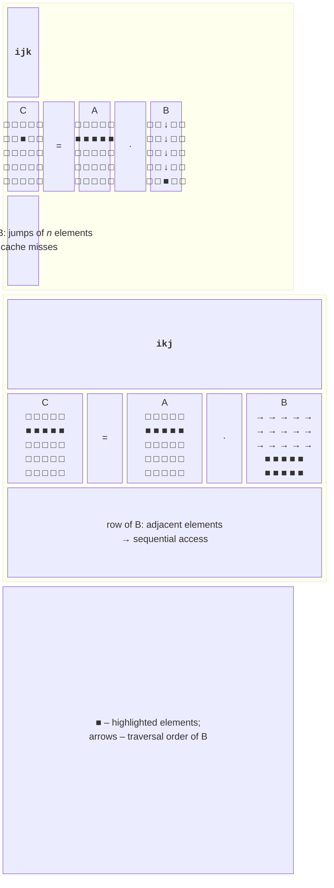
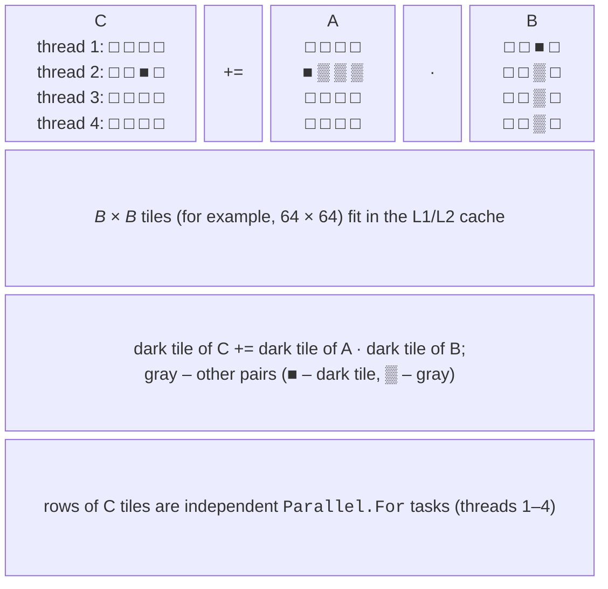

# Linear algebra and performance

## BLAS levels and matrix multiplication

**BLAS** (*Basic Linear Algebra Subprograms*) is a standard set of linear algebra subroutines <https://www.netlib.org/blas/> on which LAPACK, NumPy, MATLAB, and machine learning frameworks rely. Optimized implementations (Intel oneMKL, OpenBLAS) are written with intrinsics for each processor. The subroutines are divided into three levels by complexity (Table 7.5).

Table 7.5. BLAS levels {.caption}

| **Level** | **Examples** | **Operation** | **Complexity** |
| --- | --- | --- | --- |
| 1: vector–vector | `dot`, `axpy`, `nrm2` | $x \cdot y$, $y \leftarrow \alpha x + y$ | $O (n)$ |
| 2: matrix–vector | `gemv` | $y \leftarrow \alpha A x + \beta y$ | $O (n^{2})$ |
| 3: matrix–matrix | `gemm` | $C \leftarrow \alpha A B + \beta C$ | $O (n^{3})$ |

Level 1 operations are limited by memory bandwidth: there are only one or two arithmetic operations per number. Level 3 operations perform $n^{3}$ multiplications on $n^{2}$ data, so with proper cache use they vectorize well and scale across cores.

### Loop order

The product $C = A B$ of $n \times n$ matrices is computed by the formula $c_{i j} = \sum_{k} a_{i k} b_{k j}$. Matrices are stored in memory **by rows** (*row-major*): element $(i , j)$ is at index `i * n + j` in the array. The three nested loops can be arranged in six ways without changing the result, but the performance does change (Fig. 7.5).



Figure 7.5. Loop order and memory access {.caption}

- **ijk** (as in the formula): the innermost loop over `k` traverses a row of `A` sequentially, but traverses matrix `B` **by column**, in jumps of $n$ elements. The column is scattered across the whole matrix, which for $n = 2048$ occupies 32 MB and does not fit even in the L3 cache (16 MB), so almost every access to `B` is a **cache miss**.
- **ikj**: the loop over `j` is innermost, and all three matrices are traversed **by rows**, sequentially. The inner loop `c[i*n + j] += aik * b[k*n + j]` has the form of an `axpy` operation and vectorizes easily.

In the “Matrix multiplication” example for $n = 2048$, the sequential ijk order took 48.5 s, and ikj took 7.2 s: merely reordering the loops made the program 6.8 times faster (Table 7.6). For $n = 1024$ the difference is smaller (1.1–1.8 times in different runs), because matrix `B` occupies 8 MB and fits in the L3 cache.

### Blocked matrix multiplication

The ikj order traverses rows sequentially, but for large $n$, a row of `B` (16 KB for $n = 2048$) takes up a third of the L1 cache (48 KB), and the entire matrix `B` does not fit in the cache. **Blocked (tiled) multiplication** divides the matrices into **tiles** of size $B \times B$ and multiplies them tile by tile (Fig. 7.6): the three outer loops iterate over tiles, and the three inner loops iterate over elements inside the tiles. A tile that fits in the L1 or L2 cache is processed without misses.



Figure 7.6. Blocked matrix multiplication {.caption}

Three $64 \times 64$ tiles of `double` occupy $3 \cdot 64^{2} \cdot 8 \approx 98$ KB – that is the L2 cache (512 KB per core on the i9-11900KF). The tile size is chosen by measurement. For $n = 1024$, tiles of 16, 32, 64, 128, and 256 took 436, 251, 218, 335, and 285 ms in the “blocked + SIMD” variant, and 65, 46, 43, 67, and 110 ms with 16 threads: the best tiles are 32–64. Tiles that are too small increase loop overhead, and tiles that are too large do not fit in the cache. Blocked multiplication combines with the other techniques:

- **SIMD**: the inner loop over `j` (an `axpy` operation on a tile row) is vectorized with `Vector256`;
- **threads**: the rows of tiles of matrix `C` are independent, so the outer loop runs through `Parallel.For`; each thread writes only to its own rows of `C`, and no synchronization is needed.

Computational performance is measured in **FLOPS** (*floating-point operations per second*); **GFLOPS** means billions of them. Multiplying $n \times n$ matrices takes approximately $n^{3}$ multiplications and $n^{3}$ additions, so

$$
\text{GFLOPS} = \frac{2 n^{3}}{t \cdot 10^{9}} ,
$$

where $t$ is the time in seconds. The results for $n = 2048$ are shown in Table 7.6.

Table 7.6. Multiplying $2048 \times 2048$ matrices on the i9-11900KF {.caption}

| **Method** | **Time, ms** | **GFLOPS** | **$S$** |
| --- | --- | --- | --- |
| ijk | 48,506.6 | 0.35 | 1.0 |
| ikj | 7153.7 | 2.40 | 6.8 |
| blocked, 64 tiles | 4715.3 | 3.64 | 10.3 |
| blocked + SIMD (`Vector256`) | 2276.8 | 7.55 | 21.3 |
| blocked + SIMD + `Parallel.For` | 461.1 | 37.26 | 105.2 |

The 105× speedup consists of three factors: the cache (10×), SIMD (2×), and 16 threads (4.9×). Optimized BLAS libraries achieve even more: they write the operation kernel with intrinsics and use several levels of tiles for L1, L2, and L3.

## Parallel methods for solving linear systems

A system of linear algebraic equations $A x = b$ with $n$ unknowns is solved by **direct** methods (an exact result in a finite number of steps, such as Gaussian elimination) or **iterative** methods (a sequence of approximations, such as the Jacobi and Gauss–Seidel methods).

### Gaussian elimination

For each column $k = 0 , … , n - 2$, the **forward elimination** phase of Gaussian elimination selects a **pivot** (the element with the largest absolute value in the column; rows are swapped) and eliminates the unknown $x_{k}$ from the rows below: row $k$ multiplied by $f = a_{i k} / a_{k k}$ is subtracted from row $i$. **Back substitution** computes $x_{n - 1} , … , x_{0}$. Forward elimination has complexity $O (n^{3})$.

At step $k$, rows $i = k + 1 , … , n - 1$ change independently: each reads only row $k$ and writes only itself. Therefore, row elimination runs through `Parallel.For`, and each row update is vectorized (an `axpy` operation):

```cs
// a – augmented n × (n + 1) matrix, w = n + 1.
Parallel.For(k + 1, n, i =>
{
    double f = a[i * w + k] / a[k * w + k];
    ReadOnlySpan<double> rowK = a.AsSpan(k * w + k, w - k);
    Span<double> rowI = a.AsSpan(i * w + k, w - k);
    // rowI = rowK · (-f) + rowI – vectorized
    TensorPrimitives.MultiplyAdd(rowK, -f, rowI, rowI);
});
```

Pivot selection and row swapping remain sequential, and the steps $k$ are dependent, so the speedup is limited by Amdahl’s law. In the last steps there are few rows and columns, and `Parallel.For` costs more than the work: when $n - k$ is below a few hundred, elimination is performed sequentially. For a system of 300 equations, this code produced an error of $5 {,} 44 \cdot 10^{- 13}$ compared with the exact solution.

### The Jacobi method

The Jacobi method computes the new approximation only from the old one:

$$
x_{i}^{(t + 1)} = \frac{1}{a_{i i}} \left(b_{i} - \sum_{j \ne i} a_{i j} x_{j}^{(t)}\right) .
$$

All $n$ equations of an iteration are independent – ideal data parallelism: the sum for a row is a dot product (SIMD), and the rows run in `Parallel.For`. Iterations are repeated until $\max_{i} | x_{i}^{(t + 1)} - x_{i}^{(t)} |$ becomes smaller than the specified tolerance. The method is guaranteed to converge for **diagonally dominant** matrices: $| a_{i i} | \gt \sum_{j \ne i} | a_{i j} |$ for every row. An implementation with measurements is given in the lab (Example 2).

### Red–black Gauss–Seidel method

The **Gauss–Seidel** method uses new values of $x_{j}$ immediately after computing them, so it converges roughly twice as fast as Jacobi, but the dependency between equations makes it sequential. For grid problems (the heat equation, the Laplace equation) with a five-point stencil, node $(i , j)$ depends only on its four neighbors. If the grid is colored like a chessboard (**red–black ordering**), the neighbors of each node have a different color. An iteration consists of two half-steps: first all “red” nodes ($(i + j)$ even) are updated in parallel, then all “black” ones. Each half-step is a `Parallel.For` over rows `i`, and within a row the loop over `j` starts at `1 + (i + color + 1) % 2` and advances in steps of 2, updating `u[i*n + j]` with the average of its four neighbors.

A red node reads only black neighbors, which do not change during that half-step, so there is no race. For a $256 \times 256$ grid with a tolerance of $10^{- 6}$, the red–black version needed 57,480 iterations and ordinary Gauss–Seidel 57,417, and both produced the same solution: changing the traversal order had almost no effect on convergence. To accelerate convergence, successive over-relaxation (SOR) is applied with the same coloring.

## Measuring and analyzing performance

Vectorized code is measured the same way as parallel code (Topic 1): *Release* configuration, warmup, median of runs. SIMD has some specifics:

- **JIT tiers**: a method with a loop is first compiled without optimizations; before measuring, call the method dozens of times and give the JIT time for the optimized recompilation (Tier 1);
- **small and large data**: for arrays of a few elements, vector code can be slower than scalar code because of setup and the tail; for large arrays, memory limits the time;
- **alignment**: the random placement of an array in memory changes the time between runs.

### BenchmarkDotNet and the disassembler

BenchmarkDotNet (Topic 4) is the most convenient tool for comparing approaches. The `[DisassemblyDiagnoser]` attribute additionally saves the machine code of each method <https://benchmarkdotnet.org/articles/features/disassembler.html>:

The methods being compared are marked with the `[Benchmark]` attribute (one of them with `Baseline = true`), and the class with `[DisassemblyDiagnoser(maxDepth: 1)]`. For the sum of a million `float` values on the i9-11900KF, BenchmarkDotNet 0.15.8 showed: scalar loop – 870 µs, `Vector<T>` – 112 µs, `Vector256` – 112 µs, `TensorPrimitives.Sum` – 58 µs (a ratio of 0.07, that is, 15 times faster) (Fig. 7.7). The *Code Size* column shows the machine code size: 32 bytes for the scalar loop and 903 bytes for `TensorPrimitives`, which has separate paths for different widths and lengths.

::: info Screenshot
Windows Terminal: `dotnet run -c Release` of the SumBenchmarks project; summary table with Scalar, VectorT, Vector256Sum, Tensor; columns Mean, Ratio, Code Size; N = 1000000
:::

Figure 7.7. Comparing scalar and vector sums in BenchmarkDotNet {.caption}

The machine code is written to the `BenchmarkDotNet.Artifacts/results/SumBenchmarks-asm.md` file (Fig. 7.8). In the scalar method, the loop contains the `vaddss` instruction (adding one `float`; the `ss` suffix means *scalar single*), and in the vector method, `vaddps ymm6, ymm6, [r8]` (8 numbers in a YMM register; the `ps` suffix means *packed single*). This is how you check whether the JIT really generated vector instructions and whether array bounds checks remain (`cmp` and a jump to `CORINFO_HELP_RNGCHKFAIL`).

::: info Screenshot
Rider: open `BenchmarkDotNet.Artifacts/results/SumBenchmarks-asm.md`, Markdown preview; the Scalar method with `vaddss` and the Vector256Sum method with `vaddps ymm6,ymm6,[...]`
:::

Figure 7.8. Assembly code of a vector loop {.caption}

For a general analysis of limitations, the **Roofline model** is used: a plot of performance (GFLOPS) against **arithmetic intensity** (operations per byte of data moved). The sloped part of the “roof” is the memory bandwidth limit, and the horizontal part is the compute limit; for C, C++, and Fortran, Intel Advisor builds it <https://www.intel.com/content/www/us/en/developer/articles/guide/intel-advisor-roofline.html>.

### float and double errors

Vectorization changes the order of floating-point operations, so the result can differ from the scalar one. In the “Array element sum” example, the sum of a million random `float` values is 499,848.3 in the scalar loop, 499,854.9 in the vector ones, and 499,855.1 in `TensorPrimitives`, while the exact value (in `double`) is 499,854.3. The `float` type holds only 6–7 significant digits, and the error accumulates from millions of roundings. Therefore, sums of many numbers use `double`, and vector and scalar results are compared with a relative tolerance rather than the `==` operator. The `float` type is chosen for graphics, signals, and neural networks: it gives vectors twice as wide.
