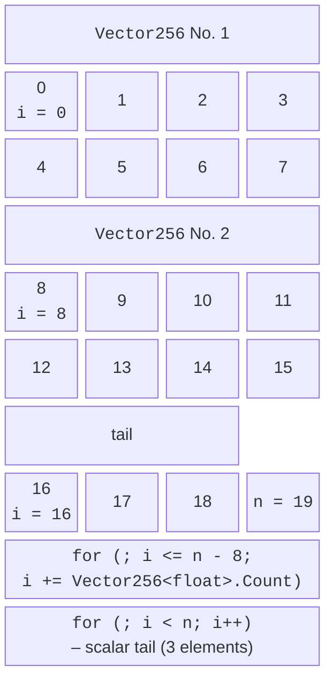

# Memory, the tail, and TensorPrimitives

## Working with memory and handling the tail

A vector loop processes an array in blocks of `Count` elements. The array length is rarely a multiple of `Count`, so the remainder – the **tail** (*tail, remainder*) – is processed separately (Fig. 7.4).



Figure 7.4. A vector loop with tail handling {.caption}

```cs
int i = 0;
for (; i <= x.Length - Vector256<float>.Count; i += 8)
{
    // block x[i..i+8] – vectorized
}
for (; i < x.Length; i++)
{
    // tail – scalar
}
```

The condition `i <= x.Length - Count` guarantees that a block does not extend past the end of the array. Tail bugs are the most common bugs in SIMD code: a forgotten tail produces a wrong result for “non-round” lengths, and loading past the end of the array with unsafe methods reads someone else’s memory. That is why tests always include arrays of length 0, 1, `Count - 1`, `Count`, `Count + 1`, and a large “non-round” length.

For **idempotent** operations (search, minimum, copying), the tail can be handled without a scalar loop: process the last full vector `x[n - Count .. n]` once more, even though it overlaps already processed elements. This cannot be done for a sum: the overlapping elements would be counted twice.

### Loading without copying

The simplest way to create a vector from part of an array is `Vector256.Create(span.Slice(i))`. A faster approach, used by the .NET libraries, is to obtain a managed **reference** to the first element and load vectors at an offset:

```cs
ref float start = ref MemoryMarshal.GetReference(span);
Vector256<float> v = Vector256.LoadUnsafe(ref start, (nuint)i);
(v * 2).StoreUnsafe(ref start, (nuint)i);   // store in place
```

`MemoryMarshal.GetReference` (or `GetArrayDataReference` for an array) returns a reference even for an empty array, and `LoadUnsafe` and `StoreUnsafe` **do not check bounds**: going out of bounds does not throw an exception but corrupts memory. Offsets have type `nuint`; the expression `span.Length - Count` becomes negative for an array shorter than a vector, so check the length before the loop.

The `MemoryMarshal.Cast<TFrom, TTo>` method <https://learn.microsoft.com/dotnet/api/system.runtime.interopservices.memorymarshal> reinterprets a span without copying. This is how types that vectors do not support are vectorized: `char` is read as `ushort`, `bool` as `byte`, and an `int` array as bytes:

### Memory alignment

A vector is **aligned** if its address is a multiple of the register width (32 bytes for AVX, 64 for AVX-512). Older processors loaded aligned data noticeably faster; on modern ones the difference is small, but alignment makes measurements more stable. The garbage collector can move arrays, so aligned memory is allocated outside the managed heap with `NativeMemory.AlignedAlloc` <https://learn.microsoft.com/dotnet/api/system.runtime.interopservices.nativememory.alignedalloc> and must be freed with `NativeMemory.AlignedFree` (the project needs the `<AllowUnsafeBlocks>true</AllowUnsafeBlocks>` property): in an `unsafe` block, the call `float* p = (float*)NativeMemory.AlignedAlloc(count * sizeof(float), 64)` returns an address that is a multiple of 64, from which `Vector512.LoadAligned(p)` can load.

`LoadAligned` does not check alignment: for the address `p + 1`, the program on the i9-11900KF crashed with `AccessViolationException`. Therefore, use it only with memory whose alignment is guaranteed, and use `LoadUnsafe` in all other cases.

## The TensorPrimitives library

For typical array computations, you do not need to write vector loops yourself. The `System.Numerics.Tensors.TensorPrimitives` class <https://learn.microsoft.com/dotnet/api/system.numerics.tensors.tensorprimitives> contains hundreds of vectorized methods over `ReadOnlySpan<T>` and `Span<T>` spans. Internally, they choose the vector width based on the processor’s capabilities and handle the tail and short arrays without loops. The class lives in the `System.Numerics.Tensors` NuGet package (version 10.0.12 as of September 2026), which is added with `dotnet add package System.Numerics.Tensors` or in Rider’s *NuGet* window.

Table 7.3. Selected TensorPrimitives methods {.caption}

| **Method** | **Result** |
| --- | --- |
| `Add(x, y, destination)` | element-wise sum; also `Subtract`, `Multiply`, `Divide` |
| `MultiplyAdd(x, y, addend, destination)` | $x \cdot y + \text{addend}$ element-wise; `y` can be a number |
| `Sum(x)`, `Dot(x, y)`, `Norm(x)` | sum, dot product, Euclidean norm |
| `Max(x)`, `Min(x)`, `IndexOfMax(x)` | largest and smallest values and the index of the largest |
| `CosineSimilarity(x, y)` | cosine of the angle between vectors: $\frac{x \cdot y}{\vert x \vert \vert y \vert}$; also element-wise `Sqrt`, `Abs`, `Exp`, `Log` |

```cs
float[] a = [1, 2, 3, 4], b = [4, 3, 2, 1];
float[] r = new float[4];
TensorPrimitives.Add(a, b, r);                         // 5 5 5 5
float dot = TensorPrimitives.Dot(a, b);                // 20
float cos = TensorPrimitives.CosineSimilarity(a, b);   // 0.6666666
TensorPrimitives.MultiplyAdd(a, b, 1f, r);             // 5 7 7 5
```

The methods are generic: they work with `float`, `double`, and integer types. The `destination` span can coincide with an input (in-place computation), but it must not partially overlap it. For artificial intelligence, the class also has `SoftMax`, `Sigmoid`, and other functions. `TensorPrimitives` is the first choice for BLAS level 1 (see “BLAS levels”): according to measurements in the “Sum and dot product” example and in BenchmarkDotNet, it is no slower than a hand-written vector loop.

## SIMD and multithreading

Vectorization and threads multiply the speedup: the array is divided into $p$ parts (Topic 6), and each part is processed by a vector loop or a `TensorPrimitives` method. The parts must be large (hundreds of thousands of elements) so that work outweighs overhead, and multiples of the vector width so that only the last part has a tail:

However, multiplying the speedups does not always work. Vector code processes data so quickly that the bottleneck becomes **memory bandwidth** – how many gigabytes per second can be transferred between RAM and the processor. The dual-channel DDR4-3600 memory of the computer used for the measurements can theoretically transfer up to 57.6 GB/s. For the sum of a large array, a few threads quickly exhaust this limit, while for small data that fits in the cache, the speedup is almost linear (Table 7.4).

Table 7.4. `TensorPrimitives.Sum` in $p$ threads on the i9-11900KF {.caption}

| **$p$** | **800 MB, ms** | **$S$** | **64 KB × 64,000, ms** | **$S$** |
| --- | --- | --- | --- | --- |
| 1 | 31.5 | 1.0 | 54.1 | 1.0 |
| 2 | 19.9 | 1.6 | 27.6 | 2.0 |
| 4 | 18.8 | 1.7 | 13.9 | 3.9 |
| 8 | 18.1 | 1.7 | 7.2 | 7.5 |
| 16 | 18.2 | 1.7 | 7.0 | 7.7 |

In the first column, the sum of 200 million `float` values (800 MB) runs at 25 GB/s in one thread and reaches 44 GB/s in two to four threads: beyond that, the threads wait for memory, and the speedup stops at 1.7. In the second column, the same number of operations is performed on a 64 KB array that fits in the L2 cache, and the speedup reaches 7.5 on 8 physical cores. Conclusion: for vectorized code, threads pay off only when computation outweighs data movement, that is, when the data are in the cache or the per-element operation is expensive. Blocked matrix multiplication provides exactly that.
