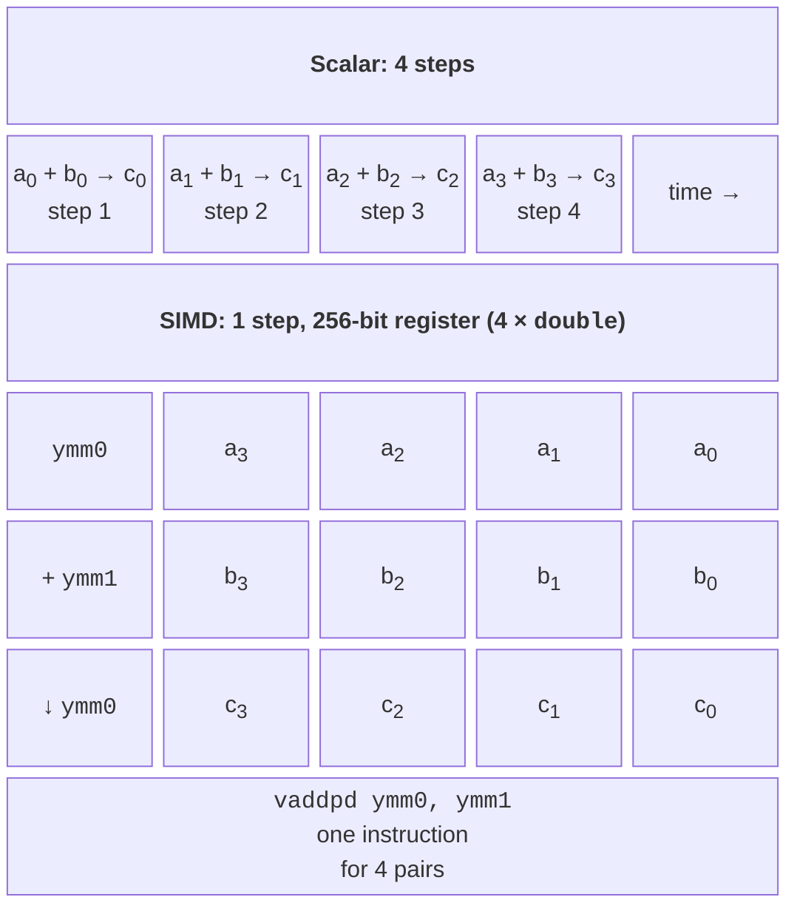
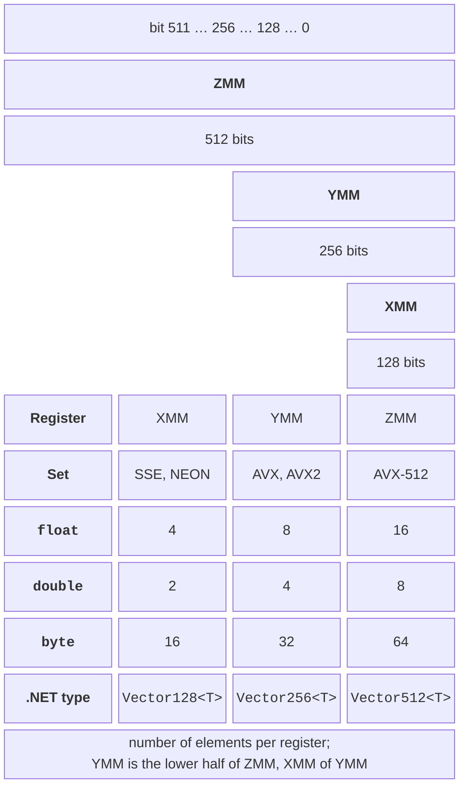

# SIMD and System.Numerics types

## SIMD in modern processors

Topic 1 introduced Flynn’s taxonomy. In the **SIMD** class (*Single Instruction, Multiple Data*), one instruction processes several data elements at once. Modern processors have special wide **vector registers** for this purpose and instructions that perform one operation on all elements of a register (Fig. 7.1). Ordinary **scalar** code adds two arrays one pair of numbers at a time, while the vector instruction `vaddpd` adds four pairs of `double` values in a single cycle. Converting scalar code into vector code is called **vectorization**.

Figure 7.1. Scalar and vector addition {.caption}

Vectorization is parallelism **inside a single core**. It needs no threads or synchronization and has no task-creation overhead, so it combines well with data parallelism (Topic 6): threads divide the data among cores, and each core processes its part with vector instructions. The ideal SIMD speedup equals the number of elements in a register (4, 8, 16), and together with 8 cores it reaches tens of times.

### Registers and instruction sets

x86-64 processors have three generations of vector registers (Fig. 7.2): 128-bit **XMM**, 256-bit **YMM**, and 512-bit **ZMM**. The lower half of a YMM register is the XMM register with the same number, and the lower half of a ZMM register is a YMM register.

Figure 7.2. SIMD register widths {.caption}

Instructions that work with these registers are grouped into **instruction set extensions**, which appeared gradually (Table 7.1). A program can use an instruction set only if the processor it runs on supports it.

Table 7.1. Main SIMD instruction sets {.caption}

| **Set** | **Registers** | **What it adds** |
| --- | --- | --- |
| SSE–SSE4.2 (1999–2008) | XMM, 128 | operations on 4 `float` / 2 `double` values, integers, comparisons, string search |
| AVX (2011) | YMM, 256 | floating-point numbers in 256-bit registers |
| AVX2, FMA (2013) | YMM, 256 | integers in YMM; FMA – fused multiply-add $a \cdot b + c$ in one instruction |
| AVX-512 (2016) | ZMM, 512 | 512-bit registers, **masks** (*opmask*) for conditional processing; the F, BW, DQ, VL subsets, and others |
| AVX10.1, AVX10.2 | XMM–ZMM | a unified set that combines the capabilities of AVX-512 and must be supported identically by all cores of new Intel processors |
| Arm NEON (`AdvSimd`) | 128 | the standard SIMD of 64-bit Arm processors |
| Arm SVE, SVE2 | 128–2048 | **scalable** vectors: the processor determines the width |

AVX-512 is supported by Intel Xeon server processors, AMD processors starting with Zen 4, and some Intel desktop processors, including the Core i9-11900KF in the lab computers (11th generation). Intel desktop processors with hybrid P- and E-cores (starting with the 12th generation) lack AVX-512 because the E-cores do not support it. **AVX10** solves this problem: it is a unified set in which all cores of a processor have the same capabilities. AVX10.1 is supported by Intel Xeon 6 server processors with P-cores, and Intel has announced AVX10.2 for the next Xeon generation (code-named Diamond Rapids). .NET 10 already provides the `Avx10v1` and `Avx10v2` classes for them. Arm processors (smartphones, Apple M, AWS Graviton servers) have 128-bit NEON, and newer ones have SVE/SVE2.

On Linux, the supported extensions are listed in the `/proc/cpuinfo` file (the `flags` line) or by the `lscpu` command (Fig. 7.3); on Windows, use the processor vendor’s utilities. It is more reliable to check capabilities from a program, as in the “CPU capabilities” example.

::: info Screenshot
Ubuntu terminal: `lscpu | grep -o -E 'avx2|avx512[a-z]*|fma|sse4_2' | sort -u`, then `dotnet run -c Release` of the example “CPU capabilities”; flags list and the table of IsHardwareAccelerated / IsSupported
:::

Figure 7.3. Supported SIMD extensions {.caption}

### Auto-vectorization and its limits

C++ compilers (Topic 9) with the `-O3` flag perform **auto-vectorization**: they convert simple loops into vector loops on their own. The .NET 10 JIT compiler (RyuJIT) does not vectorize loops automatically. For the loop `for (…) sum += x[i];` over a `float[]`, it removed the array bounds checks but generated the scalar instruction `vaddss` for a single number (verified with the BenchmarkDotNet disassembler, see “Measuring and analyzing performance”).

Even C++ compilers cannot vectorize a `float` sum automatically without special flags: a vector sum adds the numbers in a different order, and for floating-point numbers $(a + b) + c \ne a + (b + c)$ because of rounding. Auto-vectorization is also hindered by dependencies between iterations (Topic 6), method calls, conditional branches in the loop body, and possible array overlap.

That is why vectorization in .NET is written explicitly with vector types, while typical operations use library methods that are already vectorized: `Span<T>.IndexOf`, `MemoryExtensions.Count`, `SequenceEqual`, `Enumerable.Min`/`Max` for numeric arrays, and the `TensorPrimitives` methods. The .NET documentation describes three levels of such tools <https://learn.microsoft.com/dotnet/standard/simd>: the `System.Numerics` types, the hardware-independent vectors of `System.Runtime.Intrinsics`, and platform intrinsics.

## The Vector&lt;T&gt; type and System.Numerics types

The `System.Numerics.Vector<T>` type is a **variable-width** vector <https://learn.microsoft.com/dotnet/api/system.numerics.vector-1>. The number of elements, `Vector<T>.Count`, is determined by the processor when the program starts and does not change until it exits. The elements are primitive numeric types: `byte`, `short`, `int`, `long`, `float`, `double`, and others. The static `System.Numerics.Vector` class contains the operations:

- `Vector.IsHardwareAccelerated` – whether operations are hardware-accelerated; if not, they are executed in software (correctly, but slowly);
- the element-wise operators `+`, `-`, `*`, `/`, `&`, `|`, `^`;
- `Vector.Dot`, `Vector.Sum`, `Vector.Min`, `Vector.Max`, `Vector.Abs`, `Vector.SquareRoot`;
- the comparisons `Vector.GreaterThan` and `Vector.Equals` (they return masks) and `Vector.ConditionalSelect`;
- creation: `new Vector<T>(value)` (all elements equal), `new Vector<T>(span)` (the first `Count` elements), `Vector<T>.Zero`, `Vector<T>.One`, `Vector<T>.Indices` (0, 1, 2, …).

The value of `Vector<T>.Count` depends on the PC: on the i9-11900KF, `Vector<float>.Count` is 8 even though the processor supports AVX-512. By default, .NET limits `Vector<T>` to 256 bits: 512-bit registers do not benefit every task, and for short arrays a 16-element vector is filled less often. Setting the environment variable `DOTNET_MaxVectorTBitWidth=512` before starting the program raises `Vector<float>.Count` to 16 (verified on the i9-11900KF).

Code written with `Vector<T>` is portable (4 elements with SSE or NEON, 8 with AVX2), but the width is unknown when the code is written.

For graphics and geometry, the `System.Numerics` namespace provides hardware-accelerated fixed-shape types: `Vector2`, `Vector3`, `Vector4` (2–4 `float` numbers), `Matrix3x2`, `Matrix4x4`, `Plane`, and `Quaternion`. They are convenient when the data are naturally points or transformations: `Vector3.Transform(p, matrix)` transforms a point, and `Vector3.Normalize(p)` returns a vector of length 1 (lab, Example 3).
