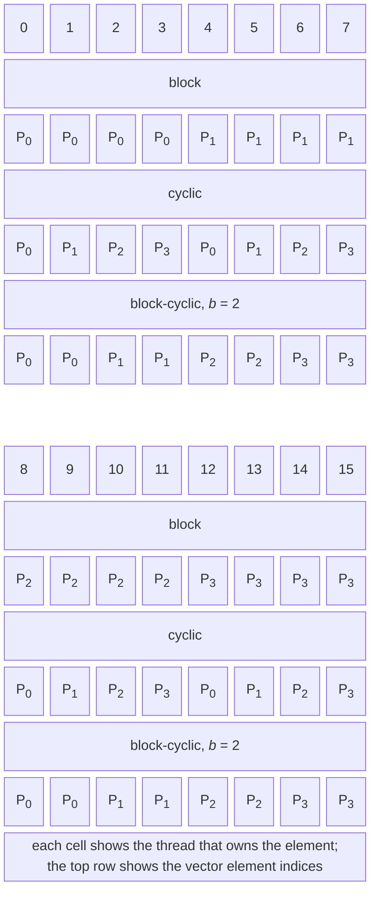
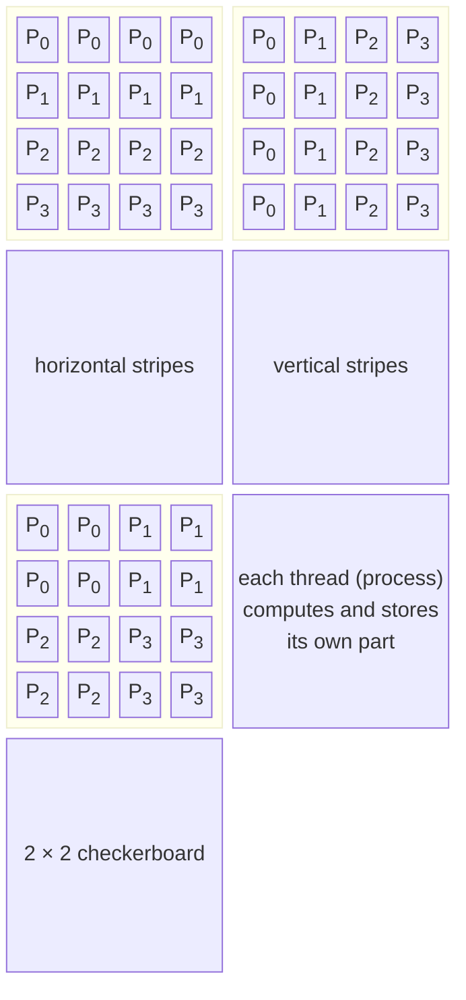
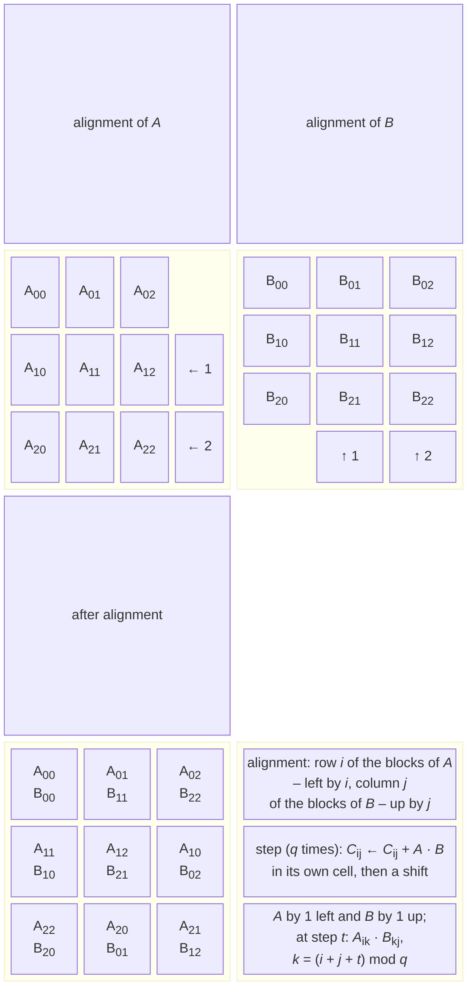
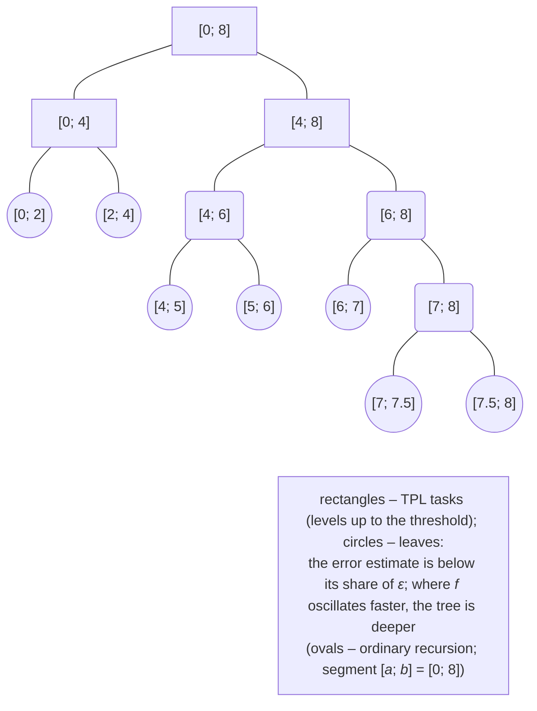

# Data decomposition and integration

## Vector decomposition

A vector of $n$ elements is distributed among $p$ threads (processes) in three main ways (Fig. 8.7). The threads are numbered $t = 0 , … , p - 1$.



Figure 8.7. Distributions of a vector among threads {.caption}

- **Block**: thread $t$ gets a contiguous range of indices $[ t n / p ; (t + 1) n / p )$ (integer division). The owner of element $i$ is approximately $\lfloor i p / n \rfloor$. Memory access is sequential, and each thread works with its own cache lines. This is the typical distribution of `Parallel.For` with ranges and of MPI programs.
- **Cyclic**: thread $t$ gets elements $t , t + p , t + 2 p , …$, that is, the owner is $i \bmod p$. It balances the load well when the “weight” of the elements changes smoothly along the vector (for example, working with a row of a triangular matrix), but neighboring elements belong to different threads: in shared memory each thread reads all cache lines, and SIMD is impossible in vector code.
- **Block-cyclic** with block size $b$: blocks of $b$ elements are dealt out in a round-robin fashion, and the owner is $\lfloor i / b \rfloor \bmod p$. It combines the advantages of both: access is sequential within a block, and the load is balanced across the whole vector. This is how the ScaLAPACK library distributes matrices.

For the **dot product** $x \cdot y = \sum_{i} x_{i} y_{i}$, each thread computes a partial sum of its elements, and then the partial sums are added (a **reduction**, Topic 6). The **Euclidean norm** $| | x | | = \sqrt{x \cdot x}$ is computed by the same code, and the maximum absolute value by the same kind of reduction with the `Math.Max` operation. In the “Dot product and vector distributions” example (vectors of 20 million `double` values), the block and block-cyclic distributions reached a speedup of 2.5 already on 4 threads, after which it stopped growing: 320 MB of data are read at about 45 GB/s, and memory bandwidth becomes the limit, as in Topic 7. On 8 and 16 threads, the cyclic distribution turned out to be **slower** than the sequential loop: each thread uses only one of the eight `double` numbers in each cache line, so memory and the cache have to transfer $p$ times more data.

### Nondeterminism of floating-point sums

Floating-point addition is not associative: $(a + b) + c$ and $a + (b + c)$ can differ in the last digits (Topic 7). A parallel sum changes the order of the additions, so the result depends on the number of threads and the distribution. This is not a bug but a property of the arithmetic, but it has two consequences:

- a result that depends on $p$ but is **the same between runs** (a fixed distribution and adding the partial sums in the order of the thread numbers) is reproducible: it can be debugged and compared;
- a result that depends on the **order in which threads finish** (partial sums added under a `lock` in `localFinally`, `Interlocked` addition of floating-point numbers via `CompareExchange`) changes from run to run even on the same computer.

In the “Dot product and vector distributions” example, the block distribution on 4 threads gives −111.15502539965507 every time, while `Parallel.For` with local sums and a `lock` gave five different values in five runs, differing in the 13th significant digit. For reproducible results:

- divide the data into a **fixed** number of parts that does not depend on the number of threads (64 parts in the conjugate gradient method of the lab) and add the partial sums in the order of the part numbers: then the result is the same for any $p$;
- split a recursive sum in half by indices (as in the `Sum` function above) rather than by execution order: the addition tree then depends only on the data;
- compare the parallel and sequential results with a relative tolerance rather than the `==` operator;
- for very long sums, use Kahan compensated summation (*Kahan summation*), which reduces the rounding error.

## Matrix decomposition

An $n \times n$ matrix is stored by rows (Topic 7) and distributed in three main ways (Fig. 8.8):

- **horizontal stripes** (*row-wise*): a thread gets $n / p$ contiguous rows;
- **vertical stripes** (*column-wise*): a thread gets $n / p$ contiguous columns;
- **checkerboard** (*checkerboard, 2D block*): $p = r \times c$ threads form a grid, and thread $(i , j)$ gets a block of $n / r$ rows and $n / c$ columns.



Figure 8.8. Matrix decomposition schemes {.caption}

### Matrix–vector multiplication

For $y = A x$, the three schemes give different amounts of computation and communication (Table 8.4).

Table 8.4. Matrix–vector multiplication with the three schemes {.caption}

| **Scheme** | **Computation per thread** | **Communication (in distributed memory)** |
| --- | --- | --- |
| horizontal stripes | $n / p$ dot products of length $n$: $y_{i}$ for its own rows | each process needs the **whole** vector $x$: gathering all parts (*all-gather*), $n$ numbers per process |
| vertical stripes | a partial vector $z^{(t)}$ of length $n$ from its own columns and its part of $x$ | a reduction of the partial vectors: $y = \sum_{t} z^{(t)}$, $n$ numbers from each process |
| checkerboard $\sqrt{p} \times \sqrt{p}$ | a partial vector of length $n / \sqrt{p}$ from its own block | broadcasting part of $x$ along a grid column and a reduction along a row: $n / \sqrt{p}$ numbers each |

The amount of computation is the same: $n^{2} / p$ multiplications and additions per thread. For stripes, the communication per process is proportional to $n$ and does not decrease as $p$ grows, whereas for the checkerboard scheme it is only $n / \sqrt{p}$. Therefore, on a cluster with many processes, the checkerboard scheme scales better. In shared memory, “communication” is cheap: row stripes need no reduction, while vertical stripes and the checkerboard scheme need an extra pass over the partial vectors and another parallel loop.

The “Matrix–vector multiplication” example measures all three schemes for two matrix sizes. For an $8000 \times 8000$ matrix (488 MB), all schemes are limited by memory: a speedup of 4.3–4.6 on 8 threads and no more than 4.8 on 16, which matches the prediction that accounts for bandwidth (see “Analytical performance prediction”). For a $1000 \times 1000$ matrix (8 MB, in the L3 cache), one product takes less than a millisecond, and the speedup is limited by the overhead of starting a parallel loop: 2.8–3.7 instead of the predicted 10–14.

### Matrix multiplication

The product $C = A B$ of $n \times n$ matrices performs $2 n^{3}$ operations on $3 n^{2}$ numbers, so computation outweighs communication, and it scales well even on clusters. Sequential optimizations (loop order, tiles, SIMD) were covered in Topic 7; here we consider distribution among processors. Let there be $p = q^{2}$ processors, and let the matrices be divided into $q \times q$ blocks of size $n / q \times n / q$.

**The striped algorithm**. Process $t$ has a horizontal stripe of $A$ and $C$, and a stripe of $B$. In shared memory, each thread simply reads the whole matrix $B$. In distributed memory, the stripes of $B$ move around a ring of processes: in $p$ steps, each process multiplies its stripe of $A$ by each stripe of $B$ and passes the stripe of $B$ to its neighbor. Each process forwards $n^{2}$ numbers (all stripes of $B$) in $p$ messages.

**Fox’s algorithm** (1987). The processes form a $q \times q$ grid; process $(i , j)$ holds blocks $A_{i j}$ and $B_{i j}$ and computes $C_{i j} = \sum_{k} A_{i k} B_{k j}$. At step $t = 0 , … , q - 1$:

1. process $(i , k)$, where $k = (i + t) \bmod q$, **broadcasts** its block $A_{i k}$ along row $i$ of the grid;
2. each process of the row multiplies the received block by its current block of $B$ and adds the result to $C_{i j}$;
3. the blocks of $B$ are **cyclically shifted** up one position within the column.

**Cannon’s algorithm** (1969) replaces the broadcast with cyclic shifts (Fig. 8.9). First, an alignment (**skew**) is performed: row $i$ of the blocks of $A$ is shifted left by $i$ positions, and column $j$ of the blocks of $B$ is shifted up by $j$ positions. After the alignment, process $(i , j)$ holds $A_{i , (i + j) \bmod q}$ and $B_{(i + j) \bmod q , j}$ – a pair of blocks with the same inner index. Then the following is repeated $q$ times: multiplying its own blocks and adding the result to $C_{i j}$, and shifting $A$ one block left and $B$ one block up. Each process communicates only with its four grid neighbors, and the memory per process is only three blocks.



Figure 8.9. Cannon’s algorithm on a $3 \times 3$ grid {.caption}

Table 8.5. Computation and communication of matrix multiplication algorithms {.caption}

| **Algorithm** | **Computation** | **Communication per process** | **Memory** |
| --- | --- | --- | --- |
| striped | $2 n^{3} / p$ | $p$ messages, $n^{2}$ numbers | $3 n^{2} / p$ |
| Fox | $2 n^{3} / p$ | $q$ broadcasts and $q$ shifts, $\approx 2 n^{2} / \sqrt{p}$ numbers | $4 n^{2} / p$ |
| Cannon | $2 n^{3} / p$ | $2 q$ shifts (excluding alignment), $2 n^{2} / \sqrt{p}$ numbers | $3 n^{2} / p$ |

The communication volume of Fox’s and Cannon’s algorithms is $\sqrt{p} / 2$ times smaller than that of the striped algorithm (Table 8.5), which is why distributed linear algebra libraries (ScaLAPACK, the SUMMA algorithm) are based on them. In the lab (Example 1), all three schemes are implemented in shared memory: Cannon’s algorithm uses separate threads, a “message” is copying a neighbor’s block, and the end of a step is a `Barrier`. In shared memory there is no communication advantage, and the stripes turned out to be the fastest: all threads read the same matrix $B$ from the shared L3 cache. An MPI implementation of Cannon’s algorithm with a Cartesian topology is one of the tasks of Topic 12.

## Parallel numerical integration

A definite integral $I = \int_{a}^{b} f (x) d x$ is approximated by **quadrature formulas** on a grid $x_{i} = a + i h$, $h = (b - a) / n$:

- the **rectangle** (midpoint) rule: $I \approx h \sum_{i = 0}^{n - 1} f (x_{i} + h / 2)$, error $O (h^{2})$;
- the **trapezoidal** rule: $I \approx h (f (a) / 2 + \sum_{i = 1}^{n - 1} f (x_{i}) + f (b) / 2)$, error $O (h^{2})$;
- **Simpson’s** rule ($n$ even): $I \approx h / 3 (f (a) + 4 \sum_{\text{odd}} f (x_{i}) + 2 \sum_{\text{even}} f (x_{i}) + f (b))$, error $O (h^{4})$.

Each formula is a weighted sum of values of $f$, that is, data parallelism with a reduction: the nodes are divided among threads, each thread computes a partial sum, and the partial sums are added. On a cluster, each process gets its own segment $[ a_{t} ; b_{t} ]$ and computes the integral over it, and process 0 collects the sum (`MPI_Reduce`, Topic 12) – exchanging just one number.

**Runge’s rule** estimates the error without the exact value. If a formula has order $k$ (for Simpson, $k = 4$), and $I_{n}$ and $I_{2 n}$ are the results with step $h$ and $h / 2$, then $$I - I_{2 n} \approx \frac{I_{2 n} - I_{n}}{2^{k} - 1} .$$ The computation is repeated, doubling $n$, until this estimate becomes smaller than the specified tolerance; adding the estimate to $I_{2 n}$ gives an even more accurate value (Richardson extrapolation). The parallel composite Simpson’s rule:

```cs
static double Simpson(Func<double, double> f, double a, double b,
    int n)                               // n is even
{
    double h = (b - a) / n;
    double sum = 0;
    object gate = new();
    var ranges = Partitioner.Create(1, n, 100_000);
    Parallel.ForEach(ranges, () => 0.0, (range, _, local) =>
    {
        for (int i = range.Item1; i < range.Item2; i++)
            local += (i % 2 == 1 ? 4 : 2) * f(a + i * h);
        return local;
    }, local => { lock (gate) sum += local; });
    return h / 3 * (f(a) + sum + f(b));
}

double i1 = Simpson(Math.Sin, 0, Math.PI, 100);
double i2 = Simpson(Math.Sin, 0, Math.PI, 200);
double runge = (i2 - i1) / 15;           // estimate of I − I(2n)
Console.WriteLine($"I(n) = {i1:F12}, I(2n) = {i2:F12}");
Console.WriteLine($"Runge: {runge:E2}, true error " +
    $"{2 - i2:E2}");
Console.WriteLine($"Refined value: {i2 + runge:F12}");
```

For $\int_{0}^{\pi} \sin x d x = 2$, the Runge estimate almost exactly matches the true error, and the refined value is correct to 12 digits:

```
I(n) = 2,000000010825, I(2n) = 2,000000000676
Runge: -6,77E-010, true error -6,76E-010
Refined value: 2,000000000000
```

### Adaptive integration

A uniform grid spends equally much computation both where the function is almost constant and where it changes rapidly. **Adaptive quadrature** halves a segment only where the error estimate is large (Fig. 8.10). For Simpson’s rule on a segment $[ a ; b ]$ with midpoint $m$, $S (a , b)$ is compared with the sum $S (a , m) + S (m , b)$: if the difference is less than $15 \epsilon$ (Runge’s rule with $2^{4} - 1 = 15$), the segment is accepted; otherwise, each half is processed in the same way with tolerance $\epsilon / 2$.



Figure 8.10. Adaptive integration: partitioning and the recursion tree {.caption}

The adaptive algorithm is a divide-and-conquer recursion in which the amount of work in different parts is **unknown** in advance. A static distribution of the segment into $p$ equal parts causes imbalance: in the “Adaptive integration” example for the function $2 x \cos x^{2}$ on $[ 0 ; 200 ]$, whose oscillations become more frequent to the right, the lightest of 16 parts takes 0.4 ms and the heaviest 33 ms. The natural solution is **dynamic load balancing with tasks**: both halves of a segment become `Parallel.Invoke` tasks, and free pool threads take them by work stealing. To keep the tasks from being too small, a **threshold** is introduced: tasks are created up to a certain recursion depth, and beyond it ordinary sequential recursion is used. With a threshold of $2^{8}$ (510 tasks) the speedup is 7.3; with $2^{4}$ (30 tasks) there are too few tasks for balancing (4.3); and with $2^{16}$ (130 thousand tasks) the overhead reduces it to 5.3.

### Multiple integrals and the Monte Carlo method

A **multiple integral** $\iint_{D} f (x , y) d x d y$ over a rectangle is computed with a two-dimensional grid: the outer loop over grid rows is a `Parallel.For`, and the inner loop is an ordinary sum by the formula in one direction, as a two-dimensional decomposition. The number of nodes grows as $n^{d}$ for dimension $d$, so for $d \gt 3$ grids become impractical (the “curse of dimensionality”).

The **Monte Carlo method** estimates an integral by the mean value of the function at random points: $I \approx V \cdot \frac{1}{N} \sum f (\xi_{k})$, where $V$ is the volume of the domain. The error decreases as $1 / \sqrt{N}$ regardless of the dimension, and all points are independent, so the method is perfectly parallel. A separate generator is needed for each block of points because `Random` is not thread-safe, and for reproducibility the blocks are fixed (Topic 6). For example, the volume of a ball of radius 1 as the fraction of 64 million random points of the cube $[ - 1 ; 1 ]^{3}$ that fall inside the ball:

```cs
const int Blocks = 64, PerBlock = 1_000_000;
long[] hits = new long[Blocks];
Parallel.For(0, Blocks, k =>
{
    Random random = new(2026 + k);       // a generator per block
    long inside = 0;
    for (int i = 0; i < PerBlock; i++)
    {
        double x = random.NextDouble() * 2 - 1;
        double y = random.NextDouble() * 2 - 1;
        double z = random.NextDouble() * 2 - 1;
        if (x * x + y * y + z * z <= 1) inside++;
    }
    hits[k] = inside;
});
double share = (double)hits.Sum() / ((long)Blocks * PerBlock);
double volume = 8 * share;
double sigma = 8 * Math.Sqrt(share * (1 - share)
    / ((long)Blocks * PerBlock));
Console.WriteLine($"V = {volume:F5} ± {1.96 * sigma:F5} " +
    $"(exact {4 * Math.PI / 3:F5})");
```

The result contains the 95% confidence interval $\pm 1 {,} 96 \sigma$, where $\sigma$ is the standard deviation of the fraction estimate:

```
V = 4,18884 ± 0,00098 (exact 4,18879)
```
