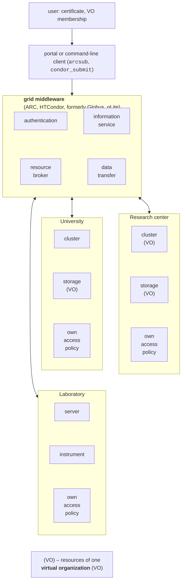
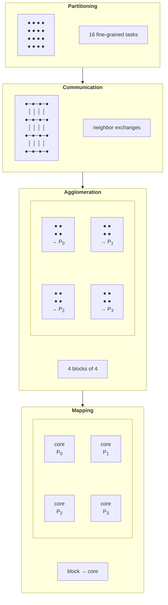

# Grid systems and Foster’s methodology

## Grid systems

When there is so much computation that one cluster is not enough, the resources of many organizations are combined. A **grid** (from *power grid*) assumes that computing resources can be “plugged into the wall” just like electricity, without knowing which power plant produced it. The term was popularized by Ian Foster and Carl Kesselman in the book “The Grid: Blueprint for a New Computing Infrastructure” (1998). The article “The Anatomy of the Grid” (Foster, Kesselman, Tuecke, 2001) defines a grid as **coordinated resource sharing and problem solving in dynamic, multi-institutional virtual organizations**. Foster (2002) proposed three criteria of a grid:

1. it coordinates resources that are **not subject to centralized control**: they belong to different organizations with different access rules;
2. it uses **standard, open, general-purpose protocols** and interfaces (authentication, resource discovery, job submission, data transfer);
3. it delivers **nontrivial qualities of service**: throughput, availability, and security that no single resource provides on its own.

### Virtual organizations and middleware

A **virtual organization** (VO) is a group of people and institutions that, under common rules, use part of the resources of different organizations for a common goal (for example, an accelerator experiment or climate modeling). One institution can provide resources to several VOs, and a VO can combine the resources of many institutions (Fig. 8.4).

Figure 8.4. Architecture of a grid system {.caption}

**Grid middleware** works between the user and the resources:

- **authentication and authorization**: the user has an X.509 digital certificate and VO membership; one login is enough to access the resources of all organizations (*single sign-on*), while each organization keeps its own access policy;
- **information service**: which resources exist, how many cores are free, which software is installed;
- **resource broker** (the grid scheduler): chooses the cluster on which to run a job and passes it to the local scheduler (Slurm, HTCondor – Topic 13);
- **data transfer and replication**: input files are copied to the computing resource, and results to storage.

The best-known implementations:

- **Globus Toolkit** – historically the first set of grid protocols (GRAM for job submission, GridFTP for data transfer, GSI for security). Support for the open-source version ended in January 2018 <https://www.globus.org/blog/support-open-source-globus-toolkit-ends-january-2018>; the community continues it as the Grid Community Toolkit <https://gridcf.org/>;
- **ARC** (*Advanced Resource Connector*) of the NorduGrid community – open-source middleware with the ARC-CE computing element, which downloads input data and uploads results itself; as of September 2026, the current version is ARC 7.2.0, Apache 2.0 license <https://www.nordugrid.org/arc/>;
- **HTCondor** (Center for High Throughput Computing, University of Wisconsin–Madison) – a **high-throughput computing** (*HTC*) system whose goal is to run as many independent jobs as possible over a long time rather than to speed up a single job. Machines advertise their characteristics, and jobs advertise their requirements in the **ClassAds** format, and HTCondor matches “job – machine” pairs like classified ads in a newspaper <https://htcondor.org/htcondor/overview/>;
- **gLite** – the middleware of the European EGEE projects on which EGI ran for a time; its components have gradually been replaced.

### Grid infrastructures

**EGI** (*European Grid Infrastructure*) is a federation of computing and storage providers for research, coordinated by the nonprofit EGI Foundation in Amsterdam <https://www.egi.eu/>. According to the EGI website in September 2026, the infrastructure combines almost 300 data centers, mostly in Europe, with 580 PB of online storage and serves 163 thousand users; in addition to grid computing, EGI provides cloud resources and data processing services.

**WLCG** (*Worldwide LHC Computing Grid*) is the largest scientific grid, built to process data from CERN’s Large Hadron Collider <https://wlcg.web.cern.ch/>. According to CERN, it combines about 1.4 million cores and 1.5 exabytes of storage in more than 170 centers in 42 countries and runs more than 2 million jobs per day <https://home.cern/science/computing/grid>. WLCG centers form **tiers**: Tier 0 at CERN records and performs the initial processing of the data, the large national Tier 1 centers store copies and reprocess them, and university Tier 2 centers perform simulation and analysis. WLCG runs on the resources of EGI, the American OSG, and other national grids.

**Volunteer computing** uses the idle time of ordinary people’s personal computers. The **BOINC** platform (*Berkeley Open Infrastructure for Network Computing*) of the University of California, Berkeley <https://boinc.berkeley.edu/> serves about 30 scientific projects: searching for gravitational waves and pulsars (Einstein@Home), research on proteins, diseases, and climate. The BOINC client (version 8.2.11 for Windows as of September 2026) downloads **work units** from the project server, computes them in the background at low priority, and returns the results (Fig. 8.5). Volunteer computers are unreliable and uncontrolled, so the server sends each work unit to several clients and accepts a result only when several of them agree (a **quorum**); slow or vanished clients get a deadline after which the work is passed to others.

::: info Screenshot
BOINC Manager 8.2: View → Advanced View, tab Tasks: several tasks of an attached project (e.g. Einstein@Home) with progress, elapsed and remaining time; tab Projects optional (only if the author installs BOINC)
:::

Figure 8.5. The BOINC volunteer computing client {.caption}

The **Ukrainian National Grid** (UNG) was created under the State Targeted Scientific and Technical Program for the Implementation and Application of Grid Technologies for 2009–2013 (Resolution No. 1020 of the Cabinet of Ministers of Ukraine of September 23, 2009). According to the description on the Base Coordination Center website, UNG combines 24 resource centers of research institutions, 16 of them institutions of the National Academy of Sciences of Ukraine; the Base Coordination Grid Center operates at the Bogolyubov Institute for Theoretical Physics of the NAS of Ukraine and represents UNG in international grid communities; the resources are accessible through ARC and gLite middleware <http://ung.bitp.kiev.ua/ua/>. Ukrainian grid sites took part, in particular, in processing data from Large Hadron Collider experiments.

### Cluster, grid, and cloud

Grids, clusters, and clouds solve similar problems but in different ways (Table 8.3).

Table 8.3. Comparison of a cluster, a grid, and a cloud {.caption}

| **Feature** | **Cluster** | **Grid** | **Cloud** |
| --- | --- | --- | --- |
| owner | one organization | many organizations, VOs | a service provider |
| management | centralized (Slurm) | decentralized, the policies of each organization | centralized by the provider |
| nodes | homogeneous, fast network (InfiniBand, 10–100 Gbit/s) | heterogeneous, the Internet | virtual machines and containers |
| access | an account, a queue | an X.509 certificate, VO membership | an account, pay-per-use |
| typical workloads | tightly coupled parallel programs (MPI) | large numbers of independent jobs and data (HTC) | web services, elastic scaling, also HPC |
| in the course | Topic 13 | this topic | Topic 17 |

The main takeaway for algorithm design: there is no fast network between grid nodes, so a grid runs **coarse-grained** independent jobs (parametric computations, processing of separate data files), while tightly coupled algorithms (the Jacobi method with halo exchanges, Cannon’s matrix multiplication) run within a single cluster. Modern infrastructures (EGI, WLCG) are gradually combining grid and cloud: the same user runs batch jobs and virtual machines.

## Foster’s PCAM methodology

A parallel algorithm can rarely be written right away. In the book “Designing and Building Parallel Programs” (1995; the full text is available on the Argonne National Laboratory website <https://www.mcs.anl.gov/~itf/dbpp/>), Ian Foster proposed a four-stage methodology, named **PCAM** after the first letters of the stages (Fig. 8.6). The first two stages reveal **all** the parallelism of a problem regardless of the computer; the last two adapt the algorithm to a specific number of cores or nodes.

Figure 8.6. Foster’s PCAM methodology {.caption}

1. **Partitioning**. The problem is divided into the finest possible **primitive tasks**. **Domain decomposition** first divides the data (vector elements, grid nodes, matrix rows) and then associates the computation on each part with it. **Functional decomposition** divides the computation into different functions (pipeline stages, atmosphere and ocean models). A good partitioning has an order of magnitude more tasks than processors, and tasks of roughly equal size.
2. **Communication**. Determine what data each task needs from the others. Communication can be **local** (with a few neighbors, as in the Jacobi method) or **global** (with everyone, as in a sum reduction); **structured** (a regular lattice) or **unstructured** (an arbitrary graph); **static** (partners known in advance) or **dynamic**; **synchronous** or **asynchronous**.
3. **Agglomeration**. Primitive tasks are combined into larger ones to reduce communication and overhead. For a grid, it pays to group nodes into square blocks: computation is proportional to the block’s **area**, and communication to its **perimeter** (the *surface-to-volume effect*). The goal is to find a granularity at which communication is small compared with computation, but there are still enough tasks for all processors.
4. **Mapping**. The agglomerated tasks are assigned to processors so that the load is even and tasks that communicate often are close to each other.

At each stage, Foster recommends checking a list of questions: are there more tasks than processors, are they of equal size, does the number of tasks scale with the problem size (rather than with the number of processors), is communication concentrated in one task, and can computation and communication overlap.

### Static and dynamic load balancing

**Static mapping** decides who computes what **before** the work starts: a block or cyclic distribution of indices, fixed matrix stripes. It requires no synchronization during the work, but it is effective only when the time of each task is known and equal. **Dynamic load balancing** hands out work during execution:

- a **shared queue** (a *bag of tasks*) or a shared counter: a free thread takes the next task; this is simple, but the queue becomes a bottleneck if the tasks are small;
- **master–worker**: a separate process hands out tasks and collects results (MPI, Topic 12; RabbitMQ, Topic 15);
- **work stealing**: each thread has its own queue, and a free thread “steals” tasks from the end of another thread’s queue. This is how the .NET thread pool (Topic 2), the TPL scheduler, and `Parallel.For` work: during execution, iteration ranges are split, and free threads take parts of other threads’ ranges.

Load imbalance is measured by the ratio of the longest thread time to the average. If one thread works for 33 ms and the average is 10 ms, the speedup cannot exceed $p \cdot 10 / 33$, no matter how many cores there are (the “Adaptive integration” example).

### Example: PCAM for integration and matrix–vector multiplication

The **integral** $\int_{a}^{b} f (x) d x$ by a composite formula. Partitioning: a primitive task is evaluating $f$ at one grid node. Communication: a global sum reduction (Topic 6). Agglomeration: nodes are combined into segments of several thousand, so that invoking a task costs less than its work. Mapping: if $f$ is evaluated equally fast everywhere, a static block distribution of segments is enough; if not (singularities, more frequent oscillations), or if the grid is adaptive, dynamic load balancing is needed.

The **product $y = A x$** of an $n \times n$ matrix. Partitioning: a primitive task is the product $a_{i j} x_{j}$ ($n^{2}$ in total). Communication: the tasks of row $i$ sum their products (a reduction along the row), and the tasks of column $j$ need the same $x_{j}$ (a broadcast). Agglomeration: grouping by rows, columns, or blocks gives the three schemes of the next section. Mapping: blocks of equal size – static, one per thread.
