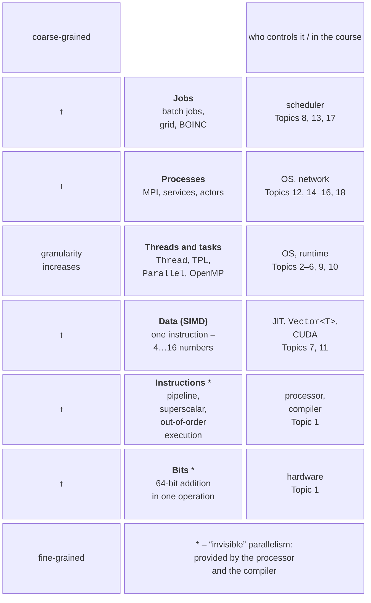
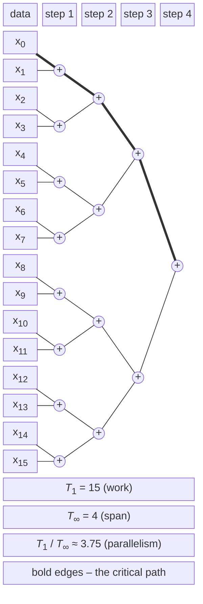
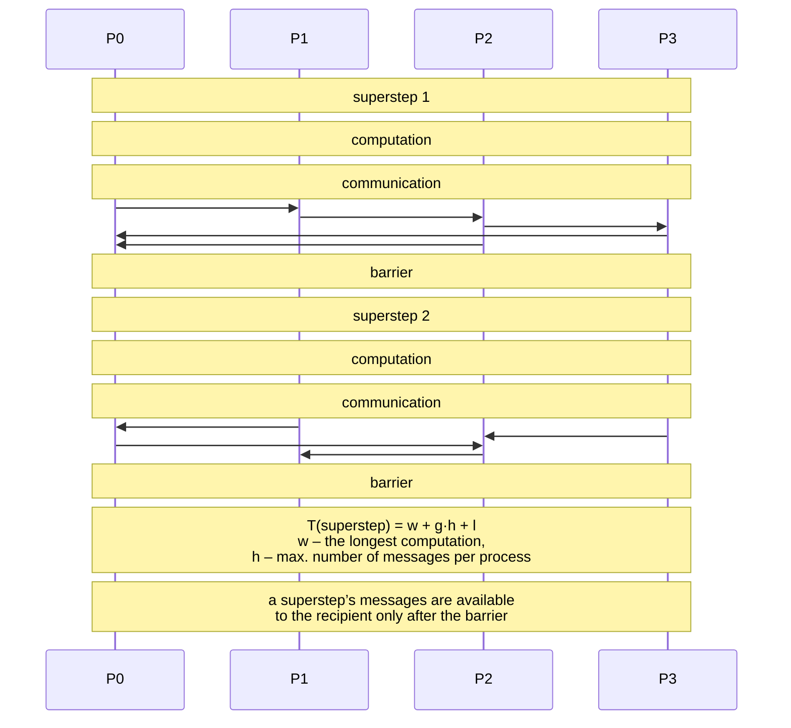

# Levels and models of parallelism

## Levels of parallelism

Parallelism exists at several **levels** (*levels of parallelism*) – from individual bits inside a processor to thousands of independent jobs on different computers (Fig. 8.1). The levels differ in **who** detects the parallelism (hardware, compiler, programmer, scheduler) and in how large the independent pieces of work are.



Figure 8.1. Levels of parallelism {.caption}

- **Bit-level parallelism**. The arithmetic logic unit processes all bits of a word simultaneously: a 64-bit processor adds two 64-bit numbers in one operation, whereas an 8-bit processor would need eight operations with carries. Increasing the word size (8 → 16 → 32 → 64 bits) was the first source of speedup; this level is now exhausted.
- **Instruction-level parallelism** (*ILP*). A **pipeline** divides the execution of an instruction into stages (fetch, decode, execute, write back), and different instructions are at different stages at the same time. A **superscalar** processor issues several independent instructions per cycle to several execution units. **Out-of-order execution** reorders instructions so as not to wait for slow operations (memory reads) when the following instructions do not depend on them. The programmer does not see this level but can help it: a summation loop with a single accumulator, `sum += x[i]`, forms a chain of dependent additions, while four independent accumulators give the processor four chains that execute simultaneously.
- **Data parallelism** at the SIMD level: one vector instruction processes 4–16 numbers (Topic 7); GPUs extend the same principle to thousands of threads (Topic 11).
- **Threads and tasks**: parts of one program run on different cores with shared memory (Topics 2–6, 9, 10).
- **Processes**: separate programs with their own memory interact through messages on one or many computers (MPI, remote calls, message brokers, actors – Topics 12, 14–16, 18).
- **Jobs**: completely independent program runs (parametric computations, file processing) on a cluster managed by a scheduler (Topic 13), in a grid, or in the cloud (Topic 17).

The lower levels (bits and instructions) are **implicit**: the processor and the compiler provide them. The upper levels are **explicit**: the programmer or user must express the parallelism. Real programs combine several levels: in Topic 7, matrix multiplication was sped up by the cache, SIMD, and threads at the same time, and a hybrid MPI + OpenMP program (Topic 12) also adds the process level.

### Granularity

**Granularity** was defined in Topic 1 as the ratio between the amount of computation in a parallel part and the amount of interaction between parts. It is estimated by the quantity $$G = \frac{T_{\text{comp}}}{T_{\text{interaction}}} ,$$ where $T_{\text{comp}}$ is the computation time of a part, and $T_{\text{interaction}}$ is the time of communication, synchronization, and creating the part. There are:

- **fine-grained** parallelism: parts of a few to hundreds of operations, with interaction after each one (instructions, SIMD, GPU threads); it is effective only when interaction is almost free, that is, done in hardware;
- **medium-grained** parallelism: parts of thousands to millions of operations (iterations of a parallel loop, TPL tasks, matrix blocks); the typical level for threads in shared memory;
- **coarse-grained** parallelism: parts that run for seconds to hours and rarely exchange data (MPI processes, cluster jobs, grid).

The more expensive the interaction at a given level, the coarser the parts must be. Creating a TPL task costs microseconds, so a task should run for at least tens of microseconds; a message between cluster nodes costs tens of microseconds (the α–β model, Topic 12), so a process should compute for milliseconds between exchanges; a grid job waits in a queue for minutes, so it should run for hours. The “Adaptive integration” example at the end of the lecture shows how the run time of a problem changes as the parts become coarser.

## Models of parallel computation

A **model of parallel computation** is a simplified description of a parallel computer that allows algorithms to be analyzed without tying them to a specific processor. Flynn’s taxonomy (Topic 1) describes architectures; the models in this section describe the **cost** of an algorithm: how many operations, steps, and exchanges it requires.

### Dependency graph and critical path

Any computation can be represented by a **dependency graph** – a directed acyclic graph (*DAG*). The vertices are operations, and an edge $u \to v$ means that operation $v$ uses the result of $u$ and cannot start earlier. Operations with no path between them are independent and can run simultaneously. Figure 8.2 shows the graph of the sum of 16 numbers as a tree of pairwise additions (this is how the parallel reduction from Topic 6 works).



Figure 8.2. Dependency graph of the sum of 16 numbers: work and span {.caption}

The **critical path** is the longest path in the graph from the input data to the result. Even an unlimited number of processors cannot finish the computation faster than the length of the critical path, because the operations on it depend on one another. For the summation tree, the critical path has $\log_{2} 16 = 4$ additions, whereas the sequential loop `sum += x[i]` is a chain of 15 dependent additions: its critical path equals all the work. The same sum written differently has a different graph and different parallelism.

### The PRAM model

**PRAM** (*Parallel Random Access Machine*) is an idealized computer with $p$ processors that work synchronously (on a common clock) and can read or write any cell of shared memory in one cycle. The model ignores caches, memory latency, and synchronization, so it shows the **inherent parallelism** of an algorithm. PRAM variants differ in the rules for simultaneous access to one cell (Table 8.1).

Table 8.1. Variants of the PRAM model {.caption}

| **Model** | **Rule for access to one cell** | **Example** |
| --- | --- | --- |
| EREW | *Exclusive Read, Exclusive Write*: several processors can neither read nor write simultaneously | the sum of $n$ numbers by a tree in $\log_{2} n$ steps |
| CREW | *Concurrent Read, Exclusive Write*: all can read simultaneously, but only one can write | matrix multiplication: all processors read the same row |
| CRCW | *Concurrent Read, Concurrent Write*: simultaneous writes are allowed; a rule determines the result: **common** (all write the same value), **arbitrary** (one of the values is written), **priority** (the processor with the lower number wins) | finding the maximum in $O (1)$ steps on $n^{2}$ processors |

An example of the difference between the models is finding the maximum of $n$ numbers. On an EREW PRAM, a comparison tree takes $\log_{2} n$ steps on $n / 2$ processors. On a CRCW PRAM (common write), $n^{2}$ processors compare all pairs $(i , j)$ in one step and write “$x_{i}$ is not the maximum” if $x_{i} \lt x_{j}$; in the second step, the only unmarked element writes itself to the result. That is $O (1)$ steps but $n^{2}$ processors: the algorithm is fast but very inefficient. The real-world analog of “concurrent write” is the `Interlocked` atomic operations (Topic 3), each of which costs tens of cycles in practice, so the PRAM model is **optimistic**.

### Work and span

A more practical model for shared-memory programs with tasks (TPL, OpenMP `task`, Cilk) is the **work–span model**. For a dependency graph, we define:

- the **work** $T_{1}$ – the number of all operations, that is, the time on one processor;
- the **span** (*span, depth*) $T_{\infty}$ – the length of the critical path, that is, the time on an unlimited number of processors;
- the **parallelism** $T_{1} / T_{\infty}$ – the largest possible speedup: more processors than $T_{1} / T_{\infty}$ will not help.

For the sum of 16 numbers (Fig. 8.2), $T_{1} = 15$, $T_{\infty} = 4$, and the parallelism is 3.75. For the sum of $n$ numbers, $T_{1} = n - 1$ and $T_{\infty} = \log_{2} n$: for a million numbers, the parallelism is 50,000, so the problem has enough parallelism for any modern processor.

Two **laws** follow from the definitions: $T_{p} \ge T_{1} / p$ (the work law: $p$ processors perform at most $p$ operations per step) and $T_{p} \ge T_{\infty}$ (the span law). **Brent’s theorem** (1974) gives an upper bound: a **greedy scheduler**, which at each step executes as many ready operations as there are free processors, achieves $$T_{p} \le \frac{T_{1}}{p} + T_{\infty} .$$ For the sum of 16 numbers on $p = 4$ processors, the bound is $15 / 4 + 4 = 7 {,} 75$ steps, but actually 5 are needed: the 8 additions of the first level take 2 steps, and each of the remaining three levels takes one step. For a million numbers on 16 cores, $T_{16} \le 62 \, 500 + 20$, which means a speedup of almost 16. Conclusion: if the parallelism $T_{1} / T_{\infty}$ is much larger than $p$ (in practice, at least 10 times), greedy scheduling gives an almost linear speedup, and the time is determined by the work, not the span.

The .NET thread pool with local queues and **work stealing** (Topic 2) approximately implements greedy scheduling: an idle thread immediately takes a ready task from another thread’s queue. Therefore, a recursive divide-and-conquer algorithm with `Parallel.Invoke` achieves a speedup close to Brent’s theorem if the tasks are not too small:

```cs
static long Sum(int[] a, int lo, int hi)
{
    if (hi - lo <= 100_000)              // threshold: an ordinary loop
    {
        long s = 0;
        for (int i = lo; i < hi; i++) s += a[i];
        return s;
    }
    int mid = (lo + hi) / 2;
    long left = 0, right = 0;
    Parallel.Invoke(() => left = Sum(a, lo, mid),
                    () => right = Sum(a, mid, hi));
    return left + right;               // a “+” vertex of the graph
}
```

The work of this function is $O (n)$, and the span is $O (\log n)$ recursion levels plus the loop of one leaf. The leaf threshold (100,000 elements) makes the problem medium-grained: without it, there would be as many tasks as elements, and the overhead would exceed the work itself.

### The BSP model

The **BSP** model (*Bulk Synchronous Parallel*, Leslie Valiant, 1990) describes a computer as $p$ processors with their own memory, a network for exchanging messages, and a **barrier synchronization** mechanism. A program consists of **supersteps** (Fig. 8.3). Each superstep has three phases:

1. **local computation** by each processor on its own data;
2. **communication**: the processors send messages, but the recipients can use them only in the next superstep;
3. **barrier**: all processors wait until the others finish the superstep.



Figure 8.3. Supersteps of the BSP model {.caption}

The cost of a superstep is estimated by the formula $$T = w + g \cdot h + l ,$$ where $w$ is the longest local computation among the processors, $h$ is the largest number of messages (words) that one processor sends or receives (the **h-relation**), $g$ is the time to transfer one word under full network load, and $l$ is the cost of a barrier. The cost of a program is the sum of the costs of its supersteps. The model immediately shows three sources of loss: load imbalance ($w$ includes the slowest processor), the volume of communication, and the number of barriers.

Supersteps are convenient to model in shared memory with the `Barrier` class (<https://learn.microsoft.com/dotnet/standard/threading/barrier>). Each of the four “processors” is a separate thread; messages are written to the neighbor’s “mailbox,” and two sets of mailboxes (by superstep parity) guarantee that the recipient reads a message only after the barrier:

```cs
const int P = 4;
double[] value = [1, 2, 3, 4];
double[][] inbox = [new double[P], new double[P]];
using Barrier barrier = new(P, b =>
    Console.WriteLine($"  after superstep {b.CurrentPhaseNumber}: " +
        string.Join(" ", value)));
Thread[] workers = new Thread[P];
for (int r = 0; r < P; r++)
{
    int rank = r;
    workers[r] = new Thread(() =>
    {
        for (int step = 0; step < 3; step++)
        {
            int cur = step % 2;
            value[rank] += inbox[cur][rank];  // local computation
            inbox[1 - cur][(rank + 1) % P] = value[rank]; // communication
            barrier.SignalAndWait();          // end of the superstep
        }
    });
    workers[r].Start();
}
foreach (Thread worker in workers) worker.Join();
```

The post-phase action (`postPhaseAction` of the `Barrier` constructor) runs on one thread when all threads have reached the barrier, so it prints a consistent state. Each processor adds the value received from its left neighbor in the previous superstep:

```
after superstep 0: 1 2 3 4
after superstep 1: 5 3 5 7
after superstep 2: 12 8 8 12
```

::: tip Warning
A barrier for $p$ participants requires all $p$ threads to run **simultaneously**. `Parallel.For` and TPL tasks do not guarantee this: the pool may execute some iterations later, and the threads already started will wait at the barrier forever. Therefore, algorithms with barriers (BSP, Cannon’s algorithm, explicit schemes on grids) create $p$ separate `Thread` threads or tasks with the `TaskCreationOptions.LongRunning` option.
:::

BSP is the model of MPI programs with the “compute – communicate – synchronize” pattern (Topic 12) and of many graph processing systems (Apache Giraph, Google Pregel).

### The LogP model

The **LogP** model (Culler et al., 1993) refines the cost of messages with four parameters that give it its name: $L$ (*latency*) – the delay of transferring a short message over the network; $o$ (*overhead*) – the processor time to send or receive a message, during which it cannot compute; $g$ (*gap*) – the minimum interval between two messages of one processor (the reciprocal of bandwidth); $P$ – the number of processors. Sending a short message takes $o + L + o$. Unlike BSP, LogP has no barriers, so the model suits asynchronous algorithms, and unlike the α–β model (Topic 12), it accounts separately for processor occupancy ($o$) and network occupancy ($g$). For example, broadcasting a value from one processor to all others is optimal not with sequential sends but with a tree whose shape depends on the ratio of $L$, $o$, and $g$.

### Shared- and distributed-memory models

In practice, an algorithm is designed for one of two **programming models** (Table 8.2), which correspond to the architectures from Topic 1.

Table 8.2. Shared- and distributed-memory models {.caption}

| **Feature** | **Shared memory** | **Distributed memory** |
| --- | --- | --- |
| data | shared by all threads | each process has its own |
| interaction | reading and writing shared variables | messages (MPI, gRPC, broker) |
| synchronization | locks, barriers, atomic operations (Topics 3, 4) | implicit: receiving a message |
| cost of “communication” | cache and memory traffic, false sharing (Topic 4) | network latency and bandwidth (α–β, LogP) |
| typical errors | race conditions, deadlocks | communication deadlocks, imbalance |
| scale | one core to one node (up to hundreds of cores) | thousands of nodes |
| course tools | C# TPL, C++ threads, OpenMP (Topics 2–10) | MPI, sockets, gRPC, RabbitMQ, Orleans (Topics 12, 14–16) |

An important observation for this topic: even in shared memory, “communication” is not free. If a thread reads data written by another core, the data are transferred between caches; if all threads read large arrays, memory bandwidth becomes the limit (Topic 7). Therefore, an algorithm in which each thread works with its **own** part of the data (like an MPI process) is usually faster even in shared memory, and it is much easier to port to a cluster.
