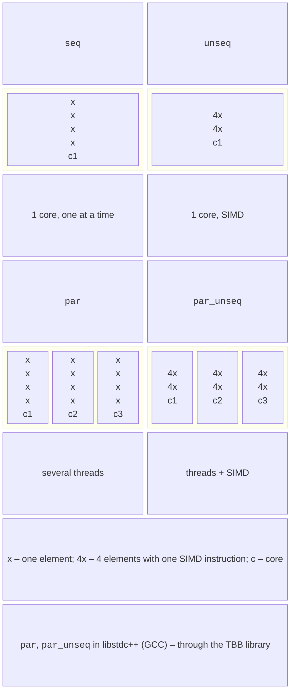

# Parallel algorithms and diagnostics

## Parallel algorithms of the standard library

Since C++17, most algorithms in the `<algorithm>` and `<numeric>` headers take an **execution policy** from the `<execution>` header as their first argument (<https://en.cppreference.com/w/cpp/algorithm/execution_policy_tag_t>), as shown in Fig. 9.7:

- `std::execution::seq` – sequentially, as without a policy;
- `std::execution::unseq` (C++20) – in one thread, but with SIMD vectorization allowed (Topic 7);
- `std::execution::par` – in parallel in several threads;
- `std::execution::par_unseq` – in several threads and with vectorization.



Figure 9.7. Execution policies of parallel algorithms {.caption}

```cpp
std::sort(std::execution::par, v.begin(), v.end());
double sum = std::transform_reduce(std::execution::par_unseq,
    v.begin(), v.end(), 0.0, std::plus<>{},
    [](double x) { return x * x; });
std::for_each(std::execution::par, v.begin(), v.end(),
    [](double& x) { x = std::sqrt(x); });
```

A policy is a **permission**, not an order: the implementation may also run the algorithm sequentially. The programmer guarantees that the functions do not modify shared data without synchronization, and for `par_unseq` and `unseq`, that they do not lock mutexes or allocate memory at all. The `std::reduce` and `transform_reduce` operations group elements in an arbitrary order, so the operation must be associative and commutative (as in PLINQ, Topic 6). An exception thrown from a function of a parallel algorithm calls `std::terminate`.

**Parallel algorithms in GCC.** The libstdc++ library implements the `par` and `par_unseq` policies through the **TBB** library: if the `<tbb/tbb.h>` header is found at compile time, the TBB backend is selected, and the program must be linked with TBB (`-ltbb`); if the header is missing, the sequential backend is selected **without any warning**. In Ubuntu, install the `libtbb-dev` package, and in CMake link the `TBB::tbb` target:

```cmake
find_package(TBB REQUIRED)
target_link_libraries(app PRIVATE TBB::tbb)
```

MinGW bundled with CLion has no TBB, so there `std::sort(std::execution::par, …)` runs in a single thread. The Microsoft Visual C++ compiler (Visual Studio 2026) has its own implementation of parallel algorithms on the Windows thread pool and does not need TBB. The “STL parallel algorithms” example compares both cases.

### The std::execution model in C++26

The C++26 standard adds the **`std::execution`** library (*senders/receivers*, proposal P2300): a **scheduler** determines where work runs (a thread pool, a GPU), a **sender** describes an asynchronous operation, and the `then`, `when_all`, `bulk`, and `sync_wait` algorithms build a pipeline from them, roughly like `ContinueWith` and `Task.WhenAll` in the TPL. As of September 2026, the libstdc++ library of GCC 15 and GCC 16 does not implement this model (the `__cpp_lib_senders` macro is not defined). You can try it with NVIDIA’s reference implementation, stdexec. In this course, the model is covered only as an overview.

## Finding bugs: ThreadSanitizer and the debugger

A data race can remain hidden for years and show up on a different processor or with different compiler flags. **ThreadSanitizer** (TSan) instruments the program to check every memory access and reports races, including those that did not change the result (<https://gcc.gnu.org/onlinedocs/gcc/Instrumentation-Options.html>). The program is built with the `-fsanitize=thread` flag and debug information `-g`:

```bash
cmake -S . -B build/tsan -G Ninja -DCMAKE_BUILD_TYPE=Debug \
      -DCMAKE_CXX_FLAGS="-fsanitize=thread -g -O1"
cmake --build build/tsan
./build/tsan/bank
```

When a race occurs, TSan prints a `WARNING: ThreadSanitizer: data race` block with two call stacks – a write in one thread and a previous read or write in another, with file names and line numbers – as well as the place where the threads were created (Fig. 9.8). A program with TSan runs 5–15 times slower and needs more memory, so it is used only for tests. ThreadSanitizer works on Linux (including WSL2) and macOS; it is not available in MinGW for Windows.

::: info Screenshot
Ubuntu terminal: bank example built with `-fsanitize=thread -g -O1`; block "WARNING: ThreadSanitizer: data race" with two stack traces and file:line
:::

Figure 9.8. A ThreadSanitizer report {.caption}

**Debugging in CLion.** A breakpoint in a thread function stops the program when any thread reaches it. The *Debug* window has the *Frames* tab (the stack of the selected thread and the thread list), *Variables*, *Threads*, and *Parallel Stacks* – the call stacks of all threads in a single diagram (<https://www.jetbrains.com/help/clion/debugging-code.html>). For a thread pool, you can see that most workers are waiting in `condition_variable::wait` while one is executing a task (Fig. 9.9).

::: info Screenshot
CLion: breakpoint in `count_primes` of the thread pool example → Debug tool window, Frames tab with the thread list (and Parallel Stacks tab)
:::

Figure 9.9. Threads in the CLion debugger {.caption}

## Measuring performance

To measure time in C++, use the **`std::chrono::steady_clock`** clock, which never goes backward (unlike `system_clock`, which is adjusted by time synchronization); the difference between two time points is converted to `std::chrono::duration<double, std::milli>` (see the program examples). The methodology is the same as in Topic 1: the Release configuration (`-O2` or `-O3`), a warmup (C++ has no JIT, but the cache and memory pages start out “cold”), and the median of several runs. Without optimization (`-O0`, the Debug profile), C++ code is several times slower: in the “Parallel vector sum” example, the sequential time grows from 134 to 1081 ms. The `std::format` and `std::println` formatting functions do not depend on regional settings, so fractional numbers are printed with a decimal point.

**`perf` counters.** On Linux, the `perf stat` utility (<https://man7.org/linux/man-pages/man1/perf-stat.1.html>) runs a program and shows hardware and software counters: the CPU time used (`task-clock`), the number of context switches and of thread migrations between cores, and the total time (Fig. 9.10). The ratio of `task-clock` to the total time shows how many processors were busy on average:

```bash
sudo apt install -y linux-tools-common linux-tools-$(uname -r)
perf stat -e task-clock,context-switches,cpu-migrations \
    ./build/release/parallel_sum
```

In WSL2, the `linux-tools` package for the Microsoft kernel is usually unavailable, so `perf` is run on a regular Ubuntu installation, in a virtual machine, or on a cluster node (Topic 13).

::: info Screenshot
Ubuntu (VM or cluster node): `perf stat -e task-clock,context-switches,cpu-migrations ./build/release/parallel_sum`; counters, "CPUs utilized", "seconds time elapsed"
:::

Figure 9.10. `perf stat` statistics {.caption}
