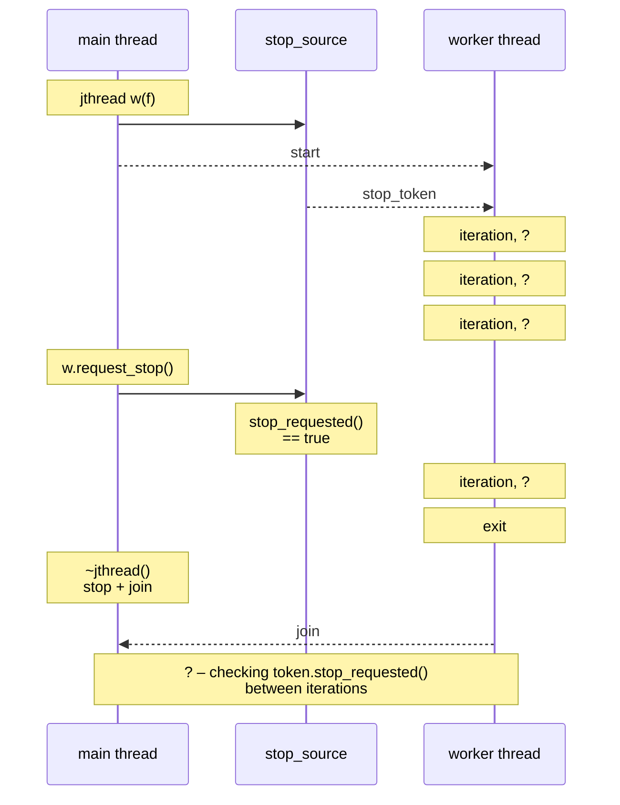
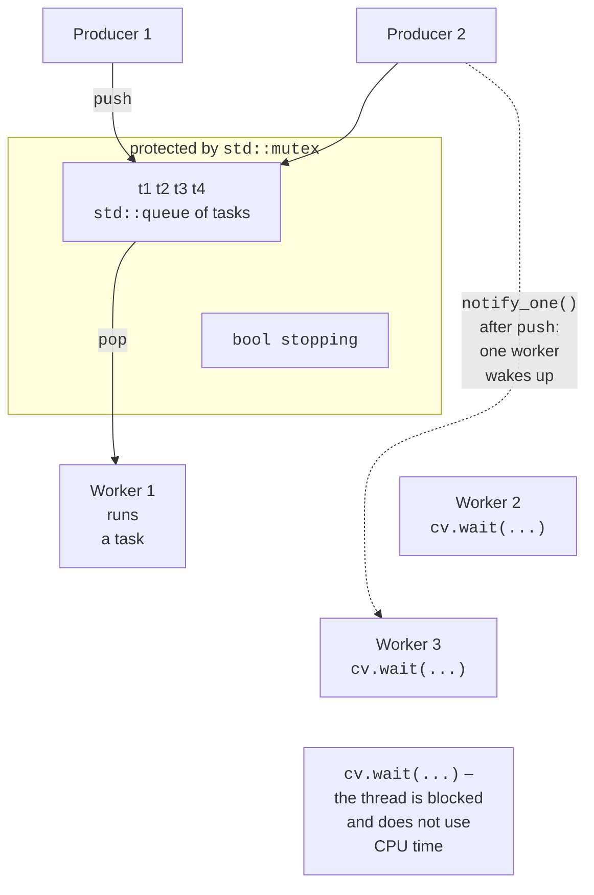

# Threads and synchronization in C++

## std::thread and std::jthread threads

The C++ thread support library (<https://en.cppreference.com/w/cpp/thread>) appeared in C++11 and works on top of operating system threads (POSIX threads on Linux). A **`std::thread`** object starts a thread immediately when it is created. The thread function and its arguments are passed to the constructor:

```cpp
void sum_range(int from, int to, long long& result) {
    long long sum = 0;
    for (int i = from; i <= to; ++i) sum += i;
    result = sum;
}

long long a = 0, b = 0;
std::thread t1(sum_range, 1, 50, std::ref(a));      // function
std::thread t2([&b] { sum_range(51, 100, b); });    // lambda
t1.join();                                          // wait
t2.join();
std::println("{} + {} = {}", a, b, a + b);  // 1275 + 3775 = 5050
```

Rules for working with `std::thread`:

- the `join()` method waits for the thread to finish; `detach()` detaches the thread, which then runs on its own (it cannot be waited for, so `detach` is rarely used);
- if a `std::thread` object is destroyed while the thread is **joinable** (`joinable()`), that is, neither `join` nor `detach` has been called, the program terminates abnormally through `std::terminate`;
- arguments are **copied** into the thread; to pass a reference, use `std::ref`, and a lambda captures references with `[&]`. A reference must not outlive the object it refers to;
- an exception not caught in the thread function also calls `std::terminate`.

`std::thread::hardware_concurrency()` returns the number of logical processors (16 on the i9-11900KF), or 0 if it is unknown. A variable with the `thread_local` specifier has a separate copy in each thread, for example a random number generator: `thread_local std::mt19937 gen(seed);`.

### std::jthread and cooperative cancellation

C++20 added the **`std::jthread`** class (*joining thread*), which fixes two inconveniences of `std::thread` (<https://en.cppreference.com/w/cpp/thread/jthread>):

- the destructor calls `request_stop()` and `join()` itself, so it is impossible to forget `join`;
- the thread has a built-in **cooperative cancellation** mechanism, the analog of `CancellationToken` in C# (Topic 5).

If the first parameter of the thread function is a `std::stop_token`, `jthread` passes it automatically (Fig. 9.5). The shared stop state is held by `std::stop_source`; the `request_stop()` method only sets a flag, and the thread itself checks `stop_requested()` at a convenient moment:

```cpp
std::jthread worker([](std::stop_token token) {
    int iterations = 0;
    while (!token.stop_requested()) {    // check between chunks of work
        ++iterations;
        std::this_thread::sleep_for(10ms);
    }
    std::println("Stopped after {} iterations", iterations);
});
std::this_thread::sleep_for(100ms);
worker.request_stop();       // optional: the destructor will do it
```



Figure 9.5. Cooperative cancellation of `std::jthread` {.caption}

The condition variable `std::condition_variable_any` has a `wait(lock, token, pred)` overload that wakes up after `request_stop()`.

## Mutexes and locking

A **race condition** (Topic 3) is even more dangerous in C++ than in C#: simultaneous writes to a variable from several threads without synchronization are **undefined behavior**, and an optimizing compiler may produce any result. Shared data is protected by a **mutex**, `std::mutex`. Calling `lock()` and `unlock()` manually is not recommended: if an exception occurs between them, the mutex stays locked. Instead, **guard** classes (RAII) are used, which release the mutex in their destructor:

- `std::lock_guard` – the simplest: locks in the constructor and unlocks in the destructor;
- `std::unique_lock` – can be unlocked and locked again and moved to another variable; required for condition variables;
- `std::scoped_lock` (C++17) – locks **several** mutexes at once using a deadlock avoidance algorithm, so the order of the arguments does not matter;
- `std::shared_lock` together with `std::shared_mutex` – reader–writer locking: many threads read simultaneously, and only one writes (the analog of `ReaderWriterLockSlim`).

For example, a cache reads data under `std::shared_lock lock(mutex_)` and writes under `std::unique_lock lock(mutex_)`; the mutex is declared `mutable` so that it can be locked in const methods. A transfer between two accounts, each with its own mutex, is written as `std::scoped_lock lock(from.m, to.m)`: two opposite transfers will not cause a deadlock (the “Bank account” example).

## Condition variables, semaphores, latch, and barrier

A **condition variable**, `std::condition_variable`, lets a thread sleep until another thread changes the shared state, without wasting CPU time on busy waiting (<https://en.cppreference.com/w/cpp/thread/condition_variable>). It always works together with a mutex and a **predicate** – the condition being waited for:

```cpp
std::mutex m;
std::condition_variable cv;
std::queue<int> jobs;

// Consumer: sleep while the queue is empty.
std::unique_lock lock(m);
cv.wait(lock, [] { return !jobs.empty(); });
int job = jobs.front();
jobs.pop();

// Producer: change the state under the mutex, then notify.
{
    std::lock_guard lock(m);
    jobs.push(42);
}
cv.notify_one();
```

The `wait(lock, pred)` method atomically releases the mutex and goes to sleep; after waking up, it locks the mutex again and checks the predicate. The predicate is mandatory: a thread can wake up **spuriously** (*spurious wakeup*) without a notification, and a notification sent before the wait begins is lost. The `notify_one()` method wakes one thread, and `notify_all()` wakes all of them. Task queues and thread pools are built on condition variables (Fig. 9.6).



Figure 9.6. A task queue on a condition variable {.caption}

C++20 added three more primitives:

- **`std::counting_semaphore<N>`** – a counter of permits: `acquire()` decrements it or waits, and `release()` increments it; `std::binary_semaphore` has one permit. A semaphore limits the number of threads that use a resource simultaneously and has no owner: another thread can release it;
- **`std::latch`** – a single-use “latch”: `count_down()` decrements the counter, and `wait()` waits until it reaches zero (a synchronized start or waiting for N workers to finish);
- **`std::barrier`** – a reusable barrier for a group with a known number of threads: `arrive_and_wait()` waits until all threads of the group reach the barrier, after which the next phase begins (generations of the Game of Life, iterations of a numerical method).

The C++ synchronization facilities and their .NET analogs are listed in Table 9.2.

Table 9.2. C++ synchronization facilities and their .NET analogs {.caption}

| **C++ (header)** | **.NET (Topics 3–4)** | **Purpose** |
| --- | --- | --- |
| `mutex` + `lock_guard` (`<mutex>`) | `lock`, `Monitor` | mutual exclusion |
| `scoped_lock` | ordered locking | several mutexes without deadlock |
| `shared_mutex` (`<shared_mutex>`) | `ReaderWriterLockSlim` | readers–writer |
| `condition_variable` | `Monitor.Wait/Pulse` | waiting for a condition |
| `counting_semaphore` (`<semaphore>`) | `SemaphoreSlim` | limiting the number of threads |
| `latch` (`<latch>`) | `CountdownEvent` | waiting for N events |
| `barrier` (`<barrier>`) | `Barrier` | phases of a group of threads |
| `atomic` (`<atomic>`) | `Interlocked` | atomic operations |
| `stop_token` (`<stop_token>`) | `CancellationToken` | cooperative cancellation |
