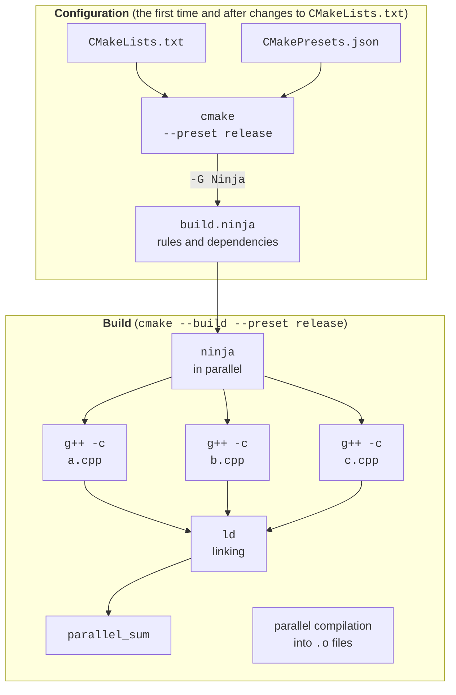

# GCC, CMake, Ninja, and CLion

## Tools: GCC, CMake, Ninja, and CLion

Module 2 of the course is devoted to high-performance computing in C++. In Topics 1–7, parallel programs were written in C#, where the .NET runtime itself manages memory, the thread pool, and JIT compilation. A C++ program is compiled directly to machine code: there is no garbage collector and no JIT warmup, the compiler can vectorize for a specific processor, and the programmer has full control over data layout. That is why C++, together with C and Fortran, is the main language of the OpenMP, CUDA, and MPI libraries (Topics 10–12).

The labs are done in **Ubuntu 26.04 LTS** (in WSL2 or on cluster nodes, Topic 13) with the following tools (Table 9.1):

- **GCC** (*GNU Compiler Collection*, <https://gcc.gnu.org/onlinedocs/>) – the `g++` compiler;
- **CMake** (<https://cmake.org/cmake/help/latest/>) – a **build system generator**: from the project description in `CMakeLists.txt`, it creates files for a specific build tool;
- **Ninja** (<https://ninja-build.org/manual.html>) – a fast build tool that runs compilation commands in parallel;
- **GDB** – the debugger; **TBB** (*Threading Building Blocks*) – the Intel/UXL parallelism library required by the parallel algorithms of the GCC standard library.

Table 9.1. The course’s C++ tools (as of September 2026) {.caption}

| **Tool** | **Ubuntu 26.04 LTS (apt package)** | **Windows: CLion 2026.2 (bundled)** |
| --- | --- | --- |
| Compiler | `g++` 15.2.0 (GCC 15) | MinGW-w64 GCC 15.2.0 |
| CMake | `cmake` 4.2.3 | CMake 4.3.1 |
| Ninja | `ninja-build` 1.13.2 | Ninja 1.13.2 |
| Debugger | `gdb` 17.1 | GDB 17.1 |
| TBB | `libtbb-dev` 2022.3.0 | none |

In Ubuntu, everything you need is installed with one command:

```bash
sudo apt update
sudo apt install -y build-essential cmake ninja-build gdb libtbb-dev
g++ --version && cmake --version && ninja --version
```

**Language standard.** By default, GCC 15 compiles in `-std=gnu++17` mode, so the standard must be specified explicitly. GCC 15 supports the C++20 and C++23 features used in this topic (`std::print`, `std::jthread`, `std::move_only_function`), and with the `-std=c++26` flag some C++26 features are available (<https://gcc.gnu.org/projects/cxx-status.html>). In GCC 16 (May 2026), C++20 became the default standard, and its support in libstdc++ was declared stable. In Ubuntu 26.04, GCC 16 is available only as the prerelease build `g++-16`, so the course uses GCC 15 and the C++23 standard. All examples in this topic also compile with `-std=c++26`.

**JetBrains CLion** (<https://www.jetbrains.com/clion/>) is a C++ IDE from JetBrains, free for noncommercial use and education. CLion projects are CMake projects: the IDE reads `CMakeLists.txt`, so the same project builds from the command line without changes. CLion takes the compiler, CMake, and debugger from a **toolchain**, which is configured in *File → Settings → Build, Execution, Deployment → Toolchains* (Fig. 9.1):

- **MinGW** (*bundled*) – GCC for Windows bundled with CLion; convenient for a first introduction;
- **WSL** – the compiler and CMake from Ubuntu in WSL2 (<https://www.jetbrains.com/help/clion/how-to-use-wsl-development-environment-in-product.html>): CLion runs in Windows, while the program is built and run in Linux. This is the main toolchain, because ThreadSanitizer, `perf`, and TBB are available only in Linux.

::: info Screenshot
CLion: File → Settings → Build, Execution, Deployment → Toolchains; WSL toolchain Ubuntu-26.04 with detected CMake, C/C++ compilers, GDB
:::

Figure 9.1. The WSL toolchain in CLion {.caption}

## Building a project: CMake and Ninja

A large C++ project consists of many `.cpp` files; each is compiled separately into an object file, and then the linker combines them into an executable. Writing these commands by hand is inconvenient, so the build is done in two stages (Fig. 9.2):

1. **configuration**: `cmake` reads `CMakeLists.txt`, finds the compiler and libraries, and generates a `build.ninja` file with build rules;
2. **build**: `ninja` compares file modification times, recompiles only the changed files, and runs independent compilation commands in parallel (by default, as many as there are processors).



Figure 9.2. The C++ project build process {.caption}

### The CMakeLists.txt file

A multithreaded program project (used by the “Parallel vector sum” example):

```cmake
cmake_minimum_required(VERSION 3.30)
project(ParallelSum LANGUAGES CXX)

find_package(Threads REQUIRED)

add_executable(parallel_sum main.cpp)
target_compile_features(parallel_sum PRIVATE cxx_std_23)
target_compile_options(parallel_sum PRIVATE
    -Wall -Wextra "$<$<CONFIG:Release>:-O3;-march=native>")
target_link_libraries(parallel_sum PRIVATE Threads::Threads)

# std::print in MinGW (Windows) requires an additional library.
if(MINGW)
    target_link_libraries(parallel_sum PRIVATE stdc++exp)
endif()
```

- `cmake_minimum_required` – the minimum CMake version; the `cxx_std_26` feature appeared in version 3.30.
- `project` – the project name and languages.
- `find_package(Threads)` – finds the platform’s thread library and creates the **imported target** `Threads::Threads` (<https://cmake.org/cmake/help/latest/module/FindThreads.html>); on Linux, it adds the `-pthread` flag.
- `add_executable` – a **target**: an executable and its source files.
- `target_compile_features(… cxx_std_23)` – a requirement on the standard; CMake adds `-std=gnu++23` itself.
- `target_compile_options` – compiler flags. The **generator expression** `$<$<CONFIG:Release>:…>` adds `-O3` (the highest optimization level) and `-march=native` (the instructions of the current processor, including AVX-512) only for the Release configuration. A program built with `-march=native` may fail to run on an older processor.
- `target_link_libraries` – the libraries the target is linked with; the `if(MINGW)` condition adds the library only for the MinGW compiler.

The word `PRIVATE` means that the settings apply only to this target and are not propagated to targets that depend on it (`PUBLIC` propagates them too). Modern CMake describes everything through targets rather than through global variables such as `CMAKE_CXX_FLAGS`.

### CMakePresets.json presets

Configuration parameters (generator, build type, directory) are conveniently stored in a `CMakePresets.json` file next to `CMakeLists.txt` (<https://cmake.org/cmake/help/latest/manual/cmake-presets.7.html>). Then all team members, CLion, and the continuous integration server build the project the same way:

```json
{
  "version": 6,
  "configurePresets": [
    {
      "name": "debug",
      "generator": "Ninja",
      "binaryDir": "${sourceDir}/build/debug",
      "cacheVariables": { "CMAKE_BUILD_TYPE": "Debug" }
    },
    {
      "name": "release",
      "inherits": "debug",
      "binaryDir": "${sourceDir}/build/release",
      "cacheVariables": { "CMAKE_BUILD_TYPE": "Release" }
    }
  ],
  "buildPresets": [
    { "name": "debug", "configurePreset": "debug" },
    { "name": "release", "configurePreset": "release" }
  ]
}
```

Schema version 6 is supported by CMake 3.25 and later, that is, both in Ubuntu and in CLion. The `release` preset inherits the generator from `debug` and changes only the build type and directory. Building from the command line (Fig. 9.3):

```bash
cmake --list-presets               # available presets
cmake --preset release             # configuration: build/release
cmake --build --preset release     # Ninja build
./build/release/parallel_sum       # run
```

Without presets, the same actions are performed by `cmake -S . -B build -G Ninja -DCMAKE_BUILD_TYPE=Release` and `cmake --build build`.

::: info Screenshot
Ubuntu 26.04 terminal: `cmake --preset release`, then `cmake --build --preset release`; Ninja progress lines `[1/4]`…`[4/4]` and the final link line
:::

Figure 9.3. Building from the command line {.caption}

**CMake profiles in CLion.** CLion configures the project automatically. Each **CMake profile** has the fields *Name*, *Build type*, *Toolchain*, *Generator*, *CMake options*, and *Build directory*, and is set in *Settings → Build, Execution, Deployment → CMake* (Fig. 9.4). The “+” button adds a *Release* profile to the default *Debug*; the current profile is selected on the toolbar. CLion shows the presets from `CMakePresets.json` as separate profiles that are initially disabled: they are enabled with the *Enable profile* checkbox (<https://www.jetbrains.com/help/clion/cmake-profile.html>).

::: info Screenshot
CLion: Settings → Build, Execution, Deployment → CMake; profiles Debug and Release, Toolchain WSL, Generator Ninja, CMake options field
:::

Figure 9.4. Debug and Release CMake profiles with Ninja {.caption}

::: tip Tip
In MinGW (Windows), the `std::print` and `std::println` functions require the additional `stdc++exp` library; otherwise, the linker reports `std::__open_terminal`. On Linux, it is not needed.
:::
