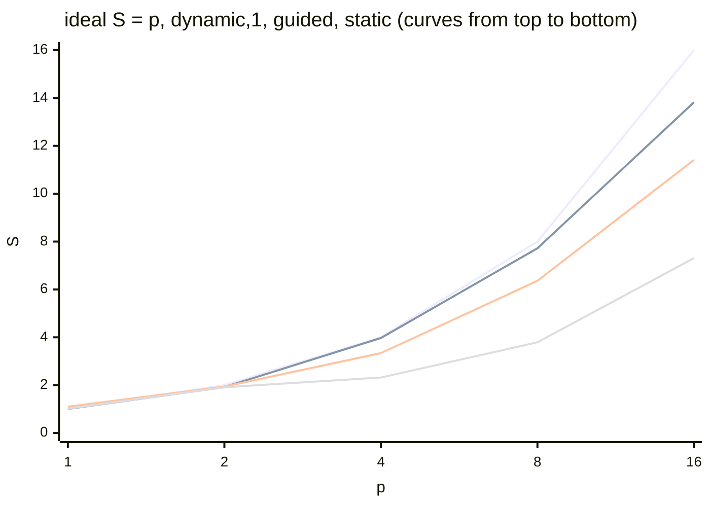

# Examples and common mistakes

## Program examples

All programs were built with the GCC 15.2 compiler (MinGW-w64 from CLion 2026.2.1) with the flags `-std=c++23 -O2 -fopenmp` and run on an Intel Core i9-11900KF (8 cores, 16 logical processors) under Windows 11; the time varies by 10–20% between runs. In Ubuntu, the programs build without changes (the `-lstdc++exp` flag is needed only for MinGW).

### Hello OpenMP

The project consists of `CMakeLists.txt` (shown in the “A CMake project” section) and a `main.cpp` file. The program prints the OpenMP version, the number of processors, and a greeting from each thread of a team of 8 threads.

```cpp
#include <omp.h>
#include <print>

int main()
{
    std::println("OpenMP {}, processors: {}, threads: {}",
                 _OPENMP, omp_get_num_procs(),
                 omp_get_max_threads());

    // Sequential part: only the primary thread runs.
    int answer = 42;

    #pragma omp parallel num_threads(8)
    {
        // Variables declared inside the region are private.
        int id = omp_get_thread_num();
        int count = omp_get_num_threads();
        #pragma omp critical
        std::println("Hello from thread {} of {} (answer = {})",
                     id, count, answer);
    }

    std::println("Single thread again: {} of {}",
                 omp_get_thread_num(), omp_get_num_threads());
}
```

The project is built with the commands `cmake -S . -B build -G Ninja` and `cmake --build build` (Topic 9). The variable `answer` is shared (declared before the region), `id` and `count` are private, and `critical` keeps the lines from different threads from getting mixed up. Output (the order of the lines is different each time; 5 lines omitted):

```
OpenMP 201511, processors: 16, threads: 16
Hello from thread 4 of 8 (answer = 42)
Hello from thread 5 of 8 (answer = 42)
Hello from thread 2 of 8 (answer = 42)
…
Hello from thread 3 of 8 (answer = 42)
Single thread again: 0 of 1
```

### An integral and the number π

The program computes $\pi = \int_{0}^{1} 4 / (1 + x^{2}) \mathrm{d} x$ by the midpoint rule with $10^{9}$ steps, measures the median of five runs for 1, 2, 4, 8, and 16 threads, and prints the speedup, efficiency, and error.

```cpp
#include <omp.h>
#include <algorithm>
#include <cmath>
#include <numbers>
#include <print>

const long long Steps = 1'000'000'000;

// π as the integral of 4/(1 + x²) on [0; 1] by the midpoint rule.
double ComputePi(int threads)
{
    const double h = 1.0 / Steps;
    double sum = 0.0;
    #pragma omp parallel for num_threads(threads) reduction(+:sum)
    for (long long i = 0; i < Steps; ++i)
    {
        double x = (i + 0.5) * h;
        sum += 4.0 / (1.0 + x * x);
    }
    return sum * h;
}

// The median of five measurements with the omp_get_wtime clock.
double MedianTime(int threads, double& pi)
{
    double t[5];
    for (double& ti : t)
    {
        double start = omp_get_wtime();
        pi = ComputePi(threads);
        ti = omp_get_wtime() - start;
    }
    std::sort(t, t + 5);
    return t[2];
}

int main()
{
    int maxThreads = omp_get_num_procs();
    double pi = 0.0;
    ComputePi(1);                               // warmup
    ComputePi(maxThreads);
    double t1 = MedianTime(1, pi);

    std::println("Steps: {}, processors: {}", Steps, maxThreads);
    std::println("{:>3} {:>9} {:>6} {:>6} {:>14}",
                 "p", "Tp, s", "S", "E", "error");
    for (int p = 1; p <= maxThreads; p *= 2)
    {
        double tp = p == 1 ? t1 : MedianTime(p, pi);
        double s = t1 / tp;
        std::println("{:>3} {:>9.3f} {:>6.2f} {:>5.0f}% {:>14.2e}",
                     p, tp, s, 100 * s / p,
                     std::abs(pi - std::numbers::pi));
    }
}
```

The variables `x` and `i` are private, `h` is a shared constant, and `sum` has its own copy in each thread, which the `reduction` clause adds up at the end. Output:

```
Steps: 1000000000, processors: 16
  p     Tp, s      S      E          error
  1     0.831   1.00   100%       1.78e-13
  2     0.658   1.26    63%       1.08e-13
  4     0.397   2.09    52%       2.80e-14
  8     0.209   3.98    50%       2.40e-14
 16     0.114   7.29    46%       3.95e-14
```

The error differs for different $p$ because the order in which the floating-point numbers are added changes. The efficiency is only about 50%: without binding, Windows places the `libgomp` threads on both logical processors of the same core, and floating-point division does not benefit from SMT. The same program built with Clang and run with `OMP_PLACES=cores` and `OMP_PROC_BIND=spread` scales almost linearly up to 8 threads, while 16 threads on 8 cores add nothing:

```
 p     Tp, s      S      E          error
 1     0.886   1.00   100%       1.78e-13
 2     0.476   1.86    93%       1.08e-13
 4     0.229   3.86    97%       2.80e-14
 8     0.115   7.68    96%       2.44e-14
16     0.118   7.53    47%       3.95e-14
```

### The Mandelbrot set and schedule

The program computes the number of iterations for a 2400×1600-point image of the Mandelbrot set (at most 2000 iterations per point). Rows that cross the set take hundreds of times longer to compute than rows at the edges, so the loop iterations are uneven. The schedule kind is changed with the `omp_set_schedule` function for `schedule(runtime)`; for each kind, the program prints the median of three runs, the speedup relative to the sequential program, the ratio of the working times of the least and most loaded threads $T_{\text{min}} / T_{\text{max}}$, and a check of the total number of iterations.

```cpp
#include <omp.h>
#include <algorithm>
#include <print>
#include <string>
#include <vector>

const int Width = 2400, Height = 1600, MaxIter = 2000;

// Number of iterations for row y: the black points of the set take the longest.
long long Row(int y)
{
    long long total = 0;
    double ci = -1.0 + 2.0 * y / Height;
    for (int x = 0; x < Width; ++x)
    {
        double cr = -2.2 + 3.0 * x / Width;
        double zr = 0, zi = 0;
        int k = 0;
        while (k < MaxIter && zr * zr + zi * zi <= 4.0)
        {
            double t = zr * zr - zi * zi + cr;
            zi = 2 * zr * zi + ci;
            zr = t;
            ++k;
        }
        total += k;
    }
    return total;
}

// The distribution of rows is set by schedule(runtime) – see omp_set_schedule.
long long Render(std::vector<double>& busy)
{
    long long total = 0;
    #pragma omp parallel reduction(+:total)
    {
        double start = omp_get_wtime();
        #pragma omp for schedule(runtime) nowait
        for (int y = 0; y < Height; ++y)
            total += Row(y);
        busy[omp_get_thread_num()] = omp_get_wtime() - start;
    }
    return total;
}

struct Mode { std::string name; omp_sched_t kind; int chunk; };

int main()
{
    int p = omp_get_max_threads();
    double start = omp_get_wtime();
    long long expected = 0;
    for (int y = 0; y < Height; ++y) expected += Row(y);
    double t1 = omp_get_wtime() - start;
    std::println("Sequential: {:.3f} s, iterations {}", t1, expected);
    std::println("{:<12} {:>7} {:>6} {:>10}  {}",
                 "schedule", "T, s", "S", "Tmin/Tmax", "check");

    std::vector<Mode> modes = {
        {"static", omp_sched_static, 0},
        {"static,8", omp_sched_static, 8},
        {"dynamic,1", omp_sched_dynamic, 1},
        {"guided", omp_sched_guided, 0}};
    for (const Mode& m : modes)
    {
        omp_set_schedule(m.kind, m.chunk);
        std::vector<double> busy(p);
        double t[3];
        long long total = 0;
        for (double& ti : t)
        {
            double s = omp_get_wtime();
            total = Render(busy);
            ti = omp_get_wtime() - s;
        }
        std::sort(t, t + 3);
        auto [lo, hi] = std::minmax_element(busy.begin(), busy.end());
        std::println("{:<12} {:>7.3f} {:>6.2f} {:>10.2f}  {}",
                     m.name, t[1], t1 / t[1], *lo / *hi,
                     total == expected ? "yes" : "NO");
    }
}
```

The `nowait` clause removes the barrier, so `busy` receives the working time of the thread itself; each thread writes its own element once, so there is no false sharing. Output for 16 threads:

```
Sequential: 5.423 s, iterations 1955911157
schedule        T, s      S  Tmin/Tmax  check
static         0.757   7.16       0.01  yes
static,8       0.379  14.31       0.92  yes
dynamic,1      0.376  14.42       1.00  yes
guided         0.443  12.24       0.78  yes
```

With `static`, each thread gets 100 adjacent rows; the threads with rows at the edges of the image finish their work in 1% of the time of the slowest one. Small chunks (`static,8`, `dynamic`) mix “heavy” and “light” rows, and the load evens out. The speedup of 14.4 on 8 cores is explained by the fact that this loop hardly accesses memory, and the SMT logical processors work almost like separate cores. Runs for 1–16 threads (`OMP_NUM_THREADS`) gave the speedup plot in Fig. 10.11 (the `dynamic` schedule with a chunk of 16 showed almost the same time as `dynamic,1`).



Figure 10.11. Speedup of the “Mandelbrot set” program (i9-11900KF, 2400×1600) {.caption}

### Quicksort with tasks

The program sorts 50 million random `int` numbers with a recursive quicksort with Hoare partitioning. The two halves are sorted as OpenMP tasks if the fragment is longer than the threshold, and otherwise by ordinary recursive calls. For comparison, it prints the time of `std::sort` and of sorting without tasks.

```cpp
#include <omp.h>
#include <algorithm>
#include <print>
#include <random>
#include <utility>
#include <vector>

// Hoare partitioning around the middle element.
long long Partition(std::vector<int>& a, long long lo, long long hi)
{
    int pivot = a[lo + (hi - lo) / 2];
    long long i = lo - 1, j = hi + 1;
    while (true)
    {
        do ++i; while (a[i] < pivot);
        do --j; while (a[j] > pivot);
        if (i >= j) return j;
        std::swap(a[i], a[j]);
    }
}

// Tasks are created only for fragments longer than the threshold.
void QuickSort(std::vector<int>& a, long long lo, long long hi,
               long long cutoff)
{
    if (lo >= hi) return;
    long long mid = Partition(a, lo, hi);
    if (hi - lo > cutoff)
    {
        #pragma omp task shared(a)
        QuickSort(a, lo, mid, cutoff);
        #pragma omp task shared(a)
        QuickSort(a, mid + 1, hi, cutoff);
        #pragma omp taskwait
    }
    else
    {
        QuickSort(a, lo, mid, cutoff);
        QuickSort(a, mid + 1, hi, cutoff);
    }
}

double SortTime(std::vector<int> a, long long cutoff)
{
    double start = omp_get_wtime();
    #pragma omp parallel
    #pragma omp single
    QuickSort(a, 0, (long long)a.size() - 1, cutoff);
    double time = omp_get_wtime() - start;
    if (!std::is_sorted(a.begin(), a.end()))
        std::println(stderr, "Error: the array is not sorted");
    return time;
}

int main()
{
    const int N = 50'000'000;
    std::mt19937 gen(2026);
    std::vector<int> data(N);
    for (int& x : data) x = (int)gen();

    std::vector<int> copy = data;
    double start = omp_get_wtime();
    std::sort(copy.begin(), copy.end());
    double tStd = omp_get_wtime() - start;
    std::println("N = {}, threads: {}", N, omp_get_max_threads());
    std::println("std::sort: {:.3f} s", tStd);

    double t0 = SortTime(data, N);        // no tasks
    std::println("{:>10} {:>8} {:>7}", "threshold", "T, s", "S");
    for (long long cutoff : {N, 1'000'000, 100'000, 10'000,
                             1'000, 100, 10})
    {
        double t = cutoff == N ? t0 : SortTime(data, cutoff);
        std::println("{:>10} {:>8.3f} {:>7.2f}", cutoff, t, t0 / t);
    }
}
```

The vector `a` is passed to the tasks as `shared`: the two tasks work with nonoverlapping parts of the same array, so no synchronization is needed. The `parallel` and `single` directives create a team of threads and the first task; the other threads of the team wait at the barrier of the `single` block and execute the created tasks. The `SortTime` function receives a copy of the array, so each threshold sorts the same data. Output:

```
N = 50000000, threads: 16
std::sort: 3.100 s
 threshold     T, s       S
  50000000    3.862    1.00
   1000000    0.709    5.45
    100000    0.683    5.65
     10000    0.696    5.55
      1000    0.729    5.30
       100    1.530    2.52
        10   10.068    0.38
```

The speedup is limited by the first partitions: partitioning the whole array is done by a single thread (Amdahl’s law). Thresholds from 1000 to 1,000,000 give almost the same time, whereas with a threshold of 10 millions of tiny tasks are created, and sorting becomes 2.6 times **slower** than the sequential version.

## Common mistakes

The most common mistakes in OpenMP programs and ways to fix them are collected in Table 10.7.

Table 10.7. Common mistakes in OpenMP programs {.caption}

| **Problem** | **Cause and fix** |
| --- | --- |
| the program runs in one thread, and `omp_get_num_threads()` returns 1 | OpenMP is not enabled (no `-fopenmp` or `OpenMP::OpenMP_CXX`), or the call is outside a parallel region; check the `_OPENMP` macro |
| `undefined reference to omp_get_thread_num` in MinGW | the `-fopenmp` flag was not passed to the linker; add `target_link_options(… -fopenmp)` |
| the result is different and wrong every time | a shared variable is modified without synchronization; use `reduction`, `private`, or a variable inside the loop, and check with `default(none)` |
| the parallel version is slower than the sequential one | too little work, `critical` in a hot loop, too many tasks; use an `if` clause, `reduction`, or a threshold for tasks |
| some threads sit idle | uneven iterations with `schedule(static)`; use `dynamic` or `guided` |
| the speedup stops at 3–5 | memory bandwidth limits, false sharing, NUMA; use local variables, first touch, `OMP_PROC_BIND=spread` |
| `libgomp: Affinity not supported on this configuration` | binding does not work in MinGW for Windows; measure on Linux or with Clang and `libomp` |
| the time of short fragments on Windows is 0 or 0.001 s | the resolution of `omp_get_wtime` in MinGW is 1 ms; use `std::chrono::steady_clock` |
| a task accesses a destroyed local variable | there is no `taskwait` or `taskgroup` before returning from the function; wait for the tasks |
