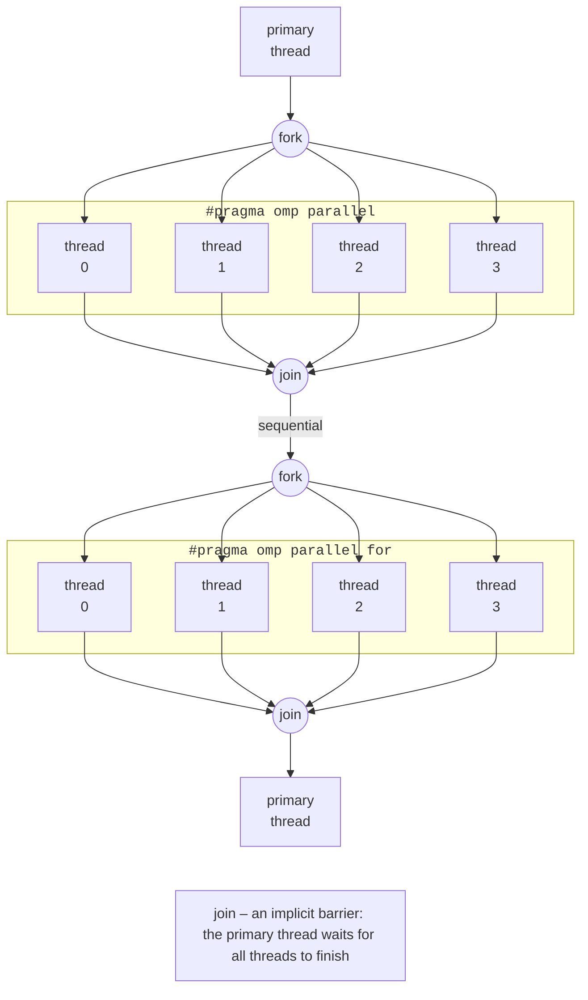

# The fork–join model and parallel regions

## The fork–join model and building OpenMP programs

**OpenMP** (*Open Multi-Processing*, <https://www.openmp.org/>) is an open standard for parallel programming of shared-memory systems in C, C++, and Fortran. The standard is developed by the OpenMP ARB (*Architecture Review Board*) consortium, which includes AMD, Intel, NVIDIA, Arm, IBM, HPE, and others. In Topic 9, threads were created explicitly (`std::thread`), and the programmer divided the work among them by hand. OpenMP makes it possible to parallelize an existing sequential program with **compiler directives**: the programmer marks **what** can run in parallel, and the compiler and library decide **how** to do it.

OpenMP consists of three parts:

- **directives** `#pragma omp …` with **clauses**, for example `#pragma omp parallel for reduction(+:sum)`;
- a **runtime library** of functions from the `<omp.h>` header: `omp_get_thread_num()`, `omp_get_wtime()`, and so on;
- **environment variables**: `OMP_NUM_THREADS`, `OMP_SCHEDULE`, `OMP_PROC_BIND`, and others, which change the program’s behavior without recompiling.

An OpenMP program works according to the **fork–join** model (Fig. 10.1). Execution starts with a single **primary thread**. When it reaches a parallel region, it **forks**: it creates a **team** of threads, and all of them execute the code of the region. At the end of the region, there is an **implicit barrier**: the primary thread waits until all threads of the team finish (**join**), and then the program runs sequentially again. The runtime does not destroy the threads after the region but reuses them, so the next parallel region starts quickly.



Figure 10.1. The fork–join model {.caption}

If the compiler does not support OpenMP or it is not enabled, the `#pragma` directives are ignored and the program remains a correct sequential one: parallelization is incremental, and a sequential version is easy to obtain for comparison.

### Versions of the standard and compilers

The latest versions of the specification (<https://www.openmp.org/specifications/>) are OpenMP 5.2 (November 2021) and OpenMP 6.0 (November 2024); in July 2026, a draft of OpenMP 6.1 was published for public comment. Compilers implement new features gradually, and the version a compiler fully supports is reported by the `_OPENMP` macro – the date of the specification in `yyyymm` format (Table 10.1).

Table 10.1. OpenMP support in compilers {.caption}

| **Compiler** | **`_OPENMP`** | **Support (September 2026)** |
| --- | --- | --- |
| GCC 15.2 (Ubuntu 26.04, MinGW in CLion) | `201511` | OpenMP 4.5 fully, most features of 5.0 and 5.1, part of 5.2 and 6.0; the `libgomp` library |
| GCC 16.2 | `202111` | the macro corresponds to OpenMP 5.2; warnings about deprecated directives |
| Clang 23 (LLVM) | `202011` | OpenMP 5.1; the `libomp` library |

For GCC, support is enabled by the `-fopenmp` flag: the compiler processes the directives and links the program with the `libgomp` library (<https://gcc.gnu.org/onlinedocs/libgomp/>). For a single file in Ubuntu, one command is enough:

```bash
g++ -std=c++23 -O2 -fopenmp pi.cpp -o pi
OMP_NUM_THREADS=8 ./pi
```

### A CMake project

The structure of a CMake project and building with the Ninja generator were covered in Topic 9. For OpenMP, in the `CMakeLists.txt` file, the `FindOpenMP` module (<https://cmake.org/cmake/help/latest/module/FindOpenMP.html>) finds the necessary compiler flags and creates the imported target `OpenMP::OpenMP_CXX`, which is linked to the program:

```cmake
cmake_minimum_required(VERSION 3.28)
project(HelloOpenMP LANGUAGES CXX)

set(CMAKE_CXX_STANDARD 23)
set(CMAKE_CXX_STANDARD_REQUIRED ON)

find_package(OpenMP REQUIRED)

add_executable(hello main.cpp)
target_link_libraries(hello PRIVATE OpenMP::OpenMP_CXX)

if(MINGW)
    # MinGW on Windows: CMake does not add libgomp when linking,
    # and std::print requires the libstdc++exp library.
    target_link_options(hello PRIVATE -fopenmp)
    target_link_libraries(hello PRIVATE stdc++exp)
endif()
```

During configuration, CMake prints the line `Found OpenMP_CXX: -fopenmp (found version "4.5")`. In Ubuntu, the `OpenMP::OpenMP_CXX` target adds `-fopenmp` both at compile time and at link time. For MinGW bundled with CLion, CMake 4.4 does not recognize the linker libraries and adds the flag only to compilation, so without the `if(MINGW)` block the build fails with the error `undefined reference to omp_get_thread_num`. In CLion, the project is opened with *File → Open* (the folder with `CMakeLists.txt`) and run with the *Run* button (Fig. 10.2).

::: info Screenshot
CLion: `CMakeLists.txt` with `find_package(OpenMP REQUIRED)` and `OpenMP::OpenMP_CXX` in the editor; Run tool window with «Hello from thread N of 8» lines
:::

Figure 10.2. An OpenMP project in CLion {.caption}

## The parallel region

A **parallel region** is the block of code after the `#pragma omp parallel` directive, which every thread of the team executes:

In it, each thread gets its own number `omp_get_thread_num()` (starting at 0; the primary thread is 0) and sees the team size `omp_get_num_threads()`; the “Hello OpenMP” example is given below. The number of threads is determined by priority (from highest):

1. the `num_threads(n)` clause of the directive;
2. a call to `omp_set_num_threads(n)` before the region;
3. the `OMP_NUM_THREADS` environment variable, for example `OMP_NUM_THREADS=8 ./app`;
4. the default value – the number of logical processors (16 on the i9-11900KF).

The `if(condition)` clause lets a region run in parallel only when it pays off, for example `#pragma omp parallel if(n > 10000)`: for small data, creating a team of threads is not worthwhile. Other frequently used functions: `omp_get_max_threads()` – how many threads the next region will get, `omp_set_num_threads(n)`, `omp_get_num_procs()` – the number of logical processors, and `omp_in_parallel()` – whether the code is running in a parallel region.

**Measuring time.** The `omp_get_wtime()` function returns a `double` – the “wall-clock” time in seconds, so an interval equals the difference between two calls. The resolution of the clock is returned by `omp_get_wtick()`: in Ubuntu it is nanoseconds, but in `libgomp` for MinGW only 0.001 s. Short fragments (milliseconds) on Windows are measured with the `std::chrono::steady_clock` clock.

**Nested regions.** A `parallel` directive inside a parallel region is, by default, executed by a team of one thread (the maximum number of active levels is 1). Nested parallelism is enabled with the `omp_set_max_active_levels(2)` function or the `OMP_MAX_ACTIVE_LEVELS=2` variable; the number of threads then equals the product of the team sizes and easily overloads the processor.
