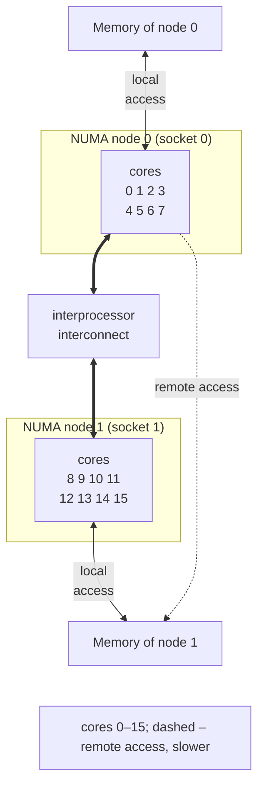
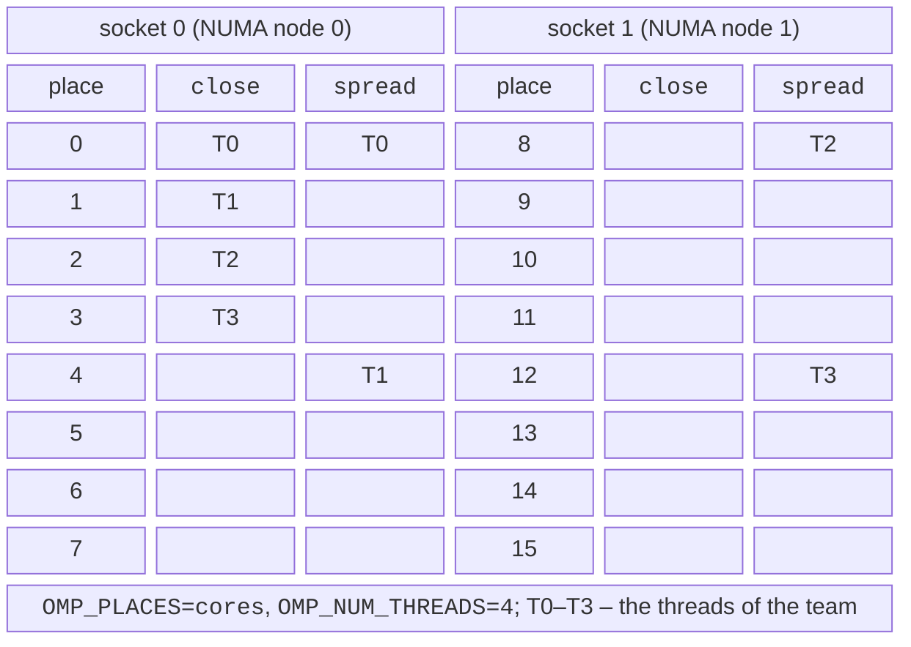

# Performance, NUMA, and thread affinity

## Performance and scalability

The speedup of OpenMP programs is evaluated the same way as in Topic 1: measure the time for $p = 1 , 2 , 4 , \dots$ threads and build a table and a plot of the speedup $S_{p}$ and efficiency $E_{p}$. The number of threads is changed with the `OMP_NUM_THREADS` variable, and the schedule kind with `OMP_SCHEDULE`, so a series of runs does not require recompiling:

```bash
for p in 1 2 4 8 16; do
    OMP_NUM_THREADS=$p ./mandel
done
```

While the program runs, core utilization is shown by `htop` in Ubuntu (Fig. 10.5) or by the Windows Task Manager. Evenly loaded cores do not yet mean useful work: after a parallel region, OpenMP threads **spin** (busy-wait) for a while so that they can start the next one quickly. In `libgomp`, this wait lasts 300,000 cycles; it is changed with the `OMP_WAIT_POLICY=passive` (go to sleep immediately) or `GOMP_SPINCOUNT` variables.

::: info Screenshot
Ubuntu terminal: `htop` while `OMP_NUM_THREADS=8 ./mandel` runs; CPU meters at the top, the process threads (press H to show threads)
:::

Figure 10.5. Core utilization while an OpenMP program runs {.caption}

Typical reasons for a weak speedup:

- **too little work**: a loop of 1000 multiplications takes 0.001 ms, while creating a team of threads takes 0.05 ms; a threshold is set with the `if(n > …)` clause;
- **false sharing** (Topic 4): threads write to adjacent elements of a shared array, for example `counts[omp_get_thread_num()]++`, and constantly invalidate each other’s cache line; a thread’s counter should be kept in a local variable, or `reduction` should be used;
- **memory-bandwidth limits** (*memory bound*): when the data does not fit in the cache, the cores wait for RAM, and the speedup stops at 3–5 regardless of the number of threads;
- **SMT logical processors** and **oversubscription**: there are more threads than physical cores (nested regions, several OpenMP processes on a node), and the gain depends on the problem or disappears altogether;
- **uneven iterations** with `schedule(static)`;
- **NUMA**: threads access the memory of another processor (the next section).

The `target` directive offloads computation to an accelerator (a GPU) within the same OpenMP standard; GPU computing is covered in Topic 11.

## The NUMA architecture

A server with several processors (sockets) has **non-uniform memory access** (*NUMA*, Topic 1): each processor has its own memory modules and accesses the memory of another processor through an interprocessor interconnect (Intel UPI, AMD HyperTransport), tens of percent more slowly (Fig. 10.6). A processor together with “its own” memory forms a **NUMA node**. Cluster nodes (Topic 13) usually have two sockets; a single-processor desktop computer has one NUMA node, as does the lab’s i9-11900KF.



Figure 10.6. A two-socket NUMA system {.caption}

On Linux, the system topology is shown by the following commands (the `numactl` and `hwloc` packages in Ubuntu 26.04):

```bash
lscpu | grep -i numa          # number of nodes and their processors
numactl --hardware            # node memory and distance matrix
lstopo --of ascii             # sockets, caches, cores, logical processors
```

The `lstopo` utility from the **hwloc** library (*Portable Hardware Locality*, <https://www.open-mpi.org/projects/hwloc/>) draws a tree of hardware resources: packages (sockets), NUMA nodes, L3/L2/L1 caches, cores, and logical processors (Fig. 10.7). The `numactl --hardware` command (<https://man7.org/linux/man-pages/man8/numactl.8.html>) prints for each node the list of processors, the total and free memory, and the **distance matrix** (*node distances*): 10 means local access, and 20–32 a relatively slower remote access (Fig. 10.8).

::: info Screenshot
Ubuntu on a two-socket cluster node: `lstopo --of ascii` (or `lstopo topo.png`); Packages, NUMA nodes, L3/L2/L1 caches, cores, PUs
:::

Figure 10.7. The system topology in hwloc {.caption}

::: info Screenshot
Ubuntu terminal on the cluster node: `numactl --hardware`; node N cpus, node N size / free, node distances matrix
:::

Figure 10.8. Information about NUMA nodes {.caption}

### The first-touch policy

The operating system allocates virtual memory to a process immediately, but **physical pages** only on the first write to them. By default, Linux places a page in the NUMA node of the thread that **first** wrote to it: this is the **first-touch policy** (<https://www.kernel.org/doc/html/latest/admin-guide/mm/numa_memory_policy.html>). Hence a typical mistake in parallel programs: an array is initialized sequentially in the primary thread, all the memory ends up in node 0, and half of the threads then work with remote memory.

The rule: **initialize data in parallel with the same distribution as the computation**:

```cpp
double* u = new double[n * n];          // the pages are not allocated yet
#pragma omp parallel for schedule(static)
for (long i = 0; i < n; ++i)
    for (long j = 0; j < n; ++j)
        u[i * n + j] = 0.0;      // first touch – "its own" node
```

The `std::vector<double> v(n)` container fills its elements with zeros already in the constructor, that is, in the primary thread. For NUMA systems, memory is allocated without initialization (`new double[n]`, `std::make_unique_for_overwrite<double[]>(n)`) and filled in a parallel loop.

## Thread affinity

By default, the OS scheduler can move threads between cores and sockets. After a move, a thread loses its “warm” cache, and on a NUMA system also its local memory. That is why in high-performance computing threads are **bound** to processors (*thread affinity, binding*) with two environment variables (Table 10.6).

- `OMP_PLACES` specifies the **places** – sets of logical processors: `threads` (each logical processor), `cores` (a core with all its logical processors), `ll_caches` (cores sharing a last-level cache), `numa_domains`, `sockets`, or an explicit list `"{0,1},{2,3}"`.
- `OMP_PROC_BIND` specifies the **policy** for placing the threads of a team on the places: `close`, `spread`, `primary`, as well as `true` (bind without specifying how) and `false` (do not bind).

Table 10.6. `OMP_PROC_BIND` policies {.caption}

| **Value** | **Thread placement** |
| --- | --- |
| `close` | in neighboring places next to the primary thread; a shared cache, one NUMA node |
| `spread` | evenly across all places: threads on different cores and sockets, maximum memory bandwidth |
| `primary` | in the same place as the primary thread (for nested regions) |
| `false` | no binding: the operating system places the threads |

In `libgomp`, setting the `OMP_PLACES` variable automatically enables binding. The difference between `close` and `spread` for 4 threads on a two-socket node is shown in Fig. 10.9.



Figure 10.9. `close` and `spread` thread binding {.caption}

The `close` policy is chosen when threads exchange data intensively (a shared cache), and `spread` for memory-bound computations and for nested regions (the outer team `spread` across sockets, the inner one `close` within a socket: `OMP_PROC_BIND=spread,close`). The actual placement is checked with the variables `OMP_DISPLAY_ENV=true` (prints all OpenMP settings at startup) and `OMP_DISPLAY_AFFINITY=true` (a binding line for each thread), Fig. 10.10:

```bash
export OMP_NUM_THREADS=16 OMP_PLACES=cores OMP_PROC_BIND=spread
OMP_DISPLAY_ENV=true OMP_DISPLAY_AFFINITY=true ./heat
```

::: info Screenshot
Ubuntu cluster node: `OMP_PLACES=cores OMP_PROC_BIND=spread OMP_DISPLAY_ENV=true OMP_DISPLAY_AFFINITY=true ./heat`; the OPENMP DISPLAY ENVIRONMENT block and one affinity line per thread
:::

Figure 10.10. The actual binding of OpenMP threads {.caption}

The `numactl` utility binds an entire process to the processors and memory of a node without changing the program: running `numactl --cpunodebind=0 --membind=1 ./heat` (the processors of node 0, the memory of node 1) compared with `--membind=0` shows how much slower remote access is, and `--interleave=all` places the pages in turn on all nodes.

### Binding on Windows

The `libgomp` library from MinGW does not support binding on Windows: with `OMP_PROC_BIND`, the program prints `libgomp: Affinity not supported on this configuration` and runs without binding. The `libomp` library of the Clang compiler (LLVM, <https://openmp.llvm.org/>) does perform binding on Windows. The `omp_display_affinity(format)` function prints the placement of the current thread: `%n` is the thread number, and `%A` its logical processors.

```cpp
#pragma omp parallel
{
    #pragma omp critical
    omp_display_affinity("thread %n -> processors {%A}");
}
```

A program with this fragment was built with the command `clang++ -std=c++23 -O2 -fopenmp` (Clang 23.1) and run in PowerShell with `$env:OMP_NUM_THREADS = 4` and `$env:OMP_PLACES = "cores"`. The output of two runs is shown side by side; each of the 8 cores of the i9-11900KF is a place of two logical processors `{0,1} {2,3} … {14,15}`:

```
OMP_PROC_BIND = close             OMP_PROC_BIND = spread
thread 0 -> processors {0,1}      thread 0 -> processors {0,1}
thread 2 -> processors {4,5}      thread 1 -> processors {4,5}
thread 3 -> processors {6,7}      thread 2 -> processors {8,9}
thread 1 -> processors {2,3}      thread 3 -> processors {12,13}
```

The `close` policy occupies four consecutive cores, while `spread` distributes the threads to every other core.
