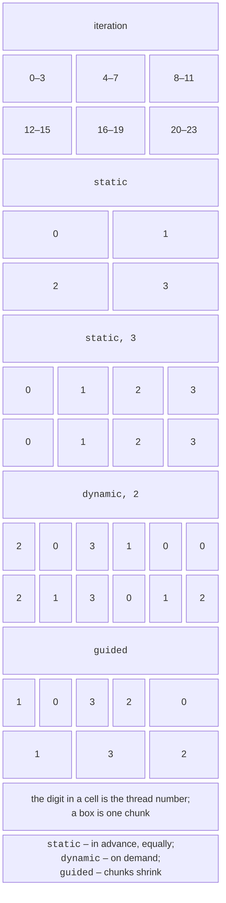

# Variables, loops, and reductions

## Variable scope

All threads execute the code of a region in a shared address space, so for each variable it matters whether it is **shared** (one instance for all threads) or **private** (a separate instance in each thread). The default rules:

- variables declared **before** the region (including global and static ones) are shared;
- variables declared **inside** the region are private;
- the counter of a loop parallelized with the `for` directive is private.

The scope clauses (*data-sharing attributes*) change these rules (Table 10.2).

Table 10.2. Variable scope clauses {.caption}

| **Clause** | **Effect** |
| --- | --- |
| `shared(x)` | one instance of `x` for all threads; access must be synchronized |
| `private(x)` | a separate **uninitialized** copy in each thread; the value after the region does not change |
| `firstprivate(x)` | a separate copy initialized with the value of `x` before the region |
| `lastprivate(x)` | after the loop, `x` gets the value from the **last** iteration (in index order) |
| `default(none)` | requires the scope of every variable to be specified explicitly |

```cpp
int base = 10, last = -1, temp = 0;
#pragma omp parallel for firstprivate(base) lastprivate(last) \
    private(temp) num_threads(4)
for (int i = 0; i < 8; ++i)
{
    temp = base + i;          // temp is the thread's copy, base = 10
    last = temp * temp;
}
std::println("last = {}", last);   // last = 289 (iteration i = 7)
```

The directive continues on the next line after the `\` character. The most common mistake is a forgotten shared variable: the helper variable `temp`, declared before the loop without `private`, would become shared, and the threads would overwrite each other’s values (a **race condition**, Topic 3). Therefore, it is more reliable to declare temporary variables inside the loop body or to write `default(none)`: then the compiler reports every variable without an explicit clause, for example `error: 'temp' not specified in enclosing 'parallel'`.

::: tip Tip
Constants declared as `const` need not be listed in a region with `default(none)`. Pass large arrays as `shared`: the `private` clause for a `std::vector` creates an empty copy in each thread, and `firstprivate` a full copy.
:::

## Parallel loops

The `#pragma omp for` directive inside a parallel region **distributes the iterations** of a loop among the threads of the team (*worksharing*). The combined `#pragma omp parallel for` directive creates a team and immediately distributes the loop. The loop must have a **canonical form**: an integer counter or a random-access iterator, a comparison condition `<`, `<=`, `>`, `>=`, or `!=` with an unchanging bound, and a step `++`, `--`, `+= c`, or `-= c`. The number of iterations must be known before the loop starts, so `break` and modifying the counter in the body are forbidden. The range-based loop `for (auto& x : v)` is allowed since OpenMP 5.0 and is supported by GCC.

```cpp
#pragma omp parallel for
for (std::size_t i = 0; i < a.size(); ++i)
    c[i] = a[i] + b[i];            // the iterations are independent
```

Only loops with **independent iterations** can be parallelized. The loop `a[i] = a[i - 1] + 1` has a **loop-carried dependency**: the directive will not break it syntactically, but the result will be wrong.

### Iteration scheduling: schedule

The `schedule(kind[, chunk])` clause determines how the iterations are divided into **chunks** and how the chunks are assigned to threads (Fig. 10.3, Table 10.3).



Figure 10.3. Distribution of 24 loop iterations among 4 threads with different `schedule` kinds {.caption}

Table 10.3. Kinds of iteration scheduling {.caption}

| **Kind** | **Distribution** | **When to use** |
| --- | --- | --- |
| `static` | the iterations are divided in advance into chunks of equal size (without a chunk size, about $n / p$ per thread); the lowest overhead | iterations of equal cost |
| `dynamic` | a thread takes the next chunk (by default, of 1 iteration) when it becomes free | iterations of unequal cost |
| `guided` | like `dynamic`, but the chunks start large and shrink to the given minimum | unequal cost, many iterations |
| `auto` | the choice is left to the compiler and the runtime | experiments |
| `runtime` | the kind is set by the `OMP_SCHEDULE` variable or the `omp_set_schedule` function | comparisons without recompiling |

For `schedule(runtime)`, the value is set like this: `OMP_SCHEDULE="dynamic,16" ./mandel`. If the variable is not set, `libgomp` uses `dynamic` with a chunk of 1. Without a `schedule` clause, GCC distributes the loop statically. For a problem with uneven iterations (the Mandelbrot set, finding primes), `static` without a chunk size leaves some threads without work: in this lecture’s program examples, the fastest thread sits idle 99% of the time, and `dynamic` speeds up the computation almost twofold.

### The collapse and nowait clauses

The `collapse(n)` clause merges $n$ nested loops into a single iteration space. This is useful when the outer loop has few iterations compared with the number of threads:

```cpp
#pragma omp parallel for collapse(2) schedule(static)
for (int i = 0; i < rows; ++i)
    for (int j = 0; j < cols; ++j)
        image[i * cols + j] = Shade(i, j);
```

The loops must be **perfectly nested**: there are no other statements between the loop headers, and the bounds of the inner loop do not depend on the outer counter (OpenMP 5.0 allows simple dependencies, but not all compilers optimize them).

Each `for` directive ends with an implicit barrier. If after the loop there is no code in the region that depends on its results (for example, another independent loop follows), the `nowait` clause removes the wait; it is used in the “Mandelbrot set” example.

## Reductions

A typical task is to compute a single value (a sum, a maximum) over all iterations. A shared variable `sum += …` without synchronization causes a race, and synchronizing every addition destroys the speedup. The `reduction(operator:variables)` clause creates a private copy in each thread, initialized with the **identity element** of the operation, and at the end combines the copies with the original value of the variable (Table 10.4):

```cpp
double sum = 0.0, lo = INFINITY, hi = -INFINITY;
#pragma omp parallel for reduction(+:sum) reduction(min:lo) \
    reduction(max:hi)
for (int i = 0; i < n; ++i)
{
    sum += a[i];
    lo = std::min(lo, a[i]);
    hi = std::max(hi, a[i]);
}
```

Table 10.4. Reduction operators {.caption}

| **Operator** | **Initial value of a copy** | **Example** |
| --- | --- | --- |
| `+`, `-`, `\|`, `^`, `\|\|` | `0` (`false` for `\|\|`) | a sum, a count, combining flags |
| `*`, `&&` | `1` (`true` for `&&`) | a product, “all elements satisfy the condition” |
| `&` | all bits `1` | intersecting bit masks |
| `min`, `max` | the largest / smallest value of the type | the minimum and the maximum |

The operator must be associative: the order in which the copies are combined is unspecified. For floating-point numbers, this changes the last digits of the sum, so the sequential and parallel results are compared with a tolerance. A reduction is also possible for an **array section**, for example a histogram `reduction(+:hist[0:10])`: each thread gets its own array of 10 counters.

### A user-defined reduction: declare reduction

For user-defined types (a dictionary, a vector, a statistics structure), the operator is declared with the `declare reduction(name : type : expression) initializer(…)` directive: in the expression, `omp_out` is the accumulated value and `omp_in` is the value of another copy, and `omp_priv` in the initializer is the initial value of a copy. An example of a reduction for a word dictionary is given in the lab.
