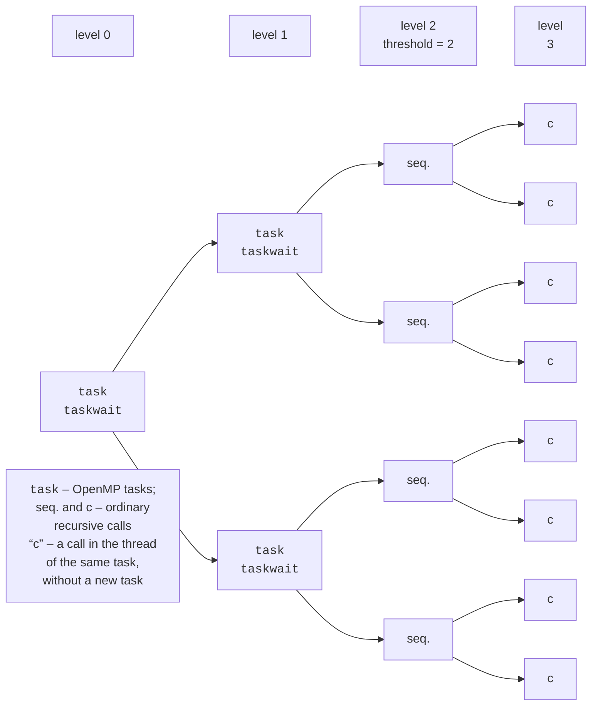

# Synchronization, tasks, and simd

## Synchronization

When threads do modify shared data, OpenMP provides synchronization directives (Table 10.5).

Table 10.5. OpenMP synchronization facilities {.caption}

| **Facility** | **Purpose** |
| --- | --- |
| `critical [(name)]` | at most one thread executes the block; blocks with the same name share a lock, and unnamed ones share one global lock |
| `atomic` | an atomic simple operation on a variable (`x++`, `x += v`, a read, a write); much faster than `critical` |
| `single` | only one (any) thread executes the block; the others wait at a barrier |
| `masked` | only the primary thread executes the block, without a barrier (a replacement for the deprecated `master`) |
| `barrier` | a point at which each thread waits for all the others |
| `ordered` | executes part of the body of a `for ordered` loop in iteration order |
| `omp_lock_t` | explicit locking: `omp_init_lock`, `omp_set_lock`, `omp_unset_lock`, `omp_destroy_lock` |

```cpp
long hits = 0;
std::vector<int> found;
#pragma omp parallel for
for (int i = 0; i < n; ++i)
{
    if (!IsPrime(i)) continue;
    #pragma omp atomic
    hits++;
    #pragma omp critical(found_list)
    found.push_back(i);
}
```

The `hits++` operation is protected by `atomic`: the compiler uses the processor’s atomic instructions, like `std::atomic` in Topic 9. The `push_back` call changes the structure of the vector and is not a simple operation, so it requires `critical`. The name `found_list` separates this lock from the program’s other critical sections. The best solution, however, is to avoid synchronization in a hot loop: count with `reduction`, and collect the found values in per-thread local vectors and merge them once.

In GCC 16, the `master` directive and the `OMP_PROC_BIND=master` value produce deprecated-syntax warnings, so new programs use `masked` and `primary`.

## Sections and tasks

**Sections** are the simplest way to run several different fragments in parallel: in a `#pragma omp parallel sections` block, each fragment is marked with the `#pragma omp section` directive, for example finding the minimum, maximum, and median of the same array. The number of sections is fixed in the program text, so for recursive algorithms and loops with an unknown number of steps (traversing a tree or a list), **tasks** are used. The `#pragma omp task` directive creates a task – a fragment of code together with its data; any free thread of the team executes the task. Tasks are created inside a parallel region, usually in a `single` block, so that one thread creates the initial task.

```cpp
long Fib(int n)
{
    if (n < 25) return FibSerial(n);       // threshold: no tasks
    long a, b;
    #pragma omp task shared(a)
    a = Fib(n - 1);
    #pragma omp task shared(b)
    b = Fib(n - 2);
    #pragma omp taskwait                   // wait for both tasks
    return a + b;
}

// Call:
#pragma omp parallel
#pragma omp single
result = Fib(40);
```

Variables that were private at the point where a task is created (like `n`) are `firstprivate` in the task by default: the task gets a copy of them. That is why the result is returned through `shared(a)`, and `taskwait` guarantees that the variables `a` and `b` still exist when the tasks write to them.

Task management facilities:

- `taskwait` – wait for the **child** tasks of the current task to finish;
- `taskgroup { … }` – wait for all tasks created in the block, together with their descendants;
- `taskloop` – split a loop into tasks (the `grainsize(g)` clause – iterations per task, or `num_tasks(k)`); unlike `for`, it can be nested in other tasks;
- `depend(in: x) depend(out: y)` – a task with `in` waits for a task with `out` for the same variable to finish; this is how pipelines and dependency graphs are built;
- `if(condition)` and `final(condition)` – execute the task immediately, without deferring it (the overhead is lower, but not zero).

**Cut-off**. Creating a task costs hundreds of nanoseconds, while sorting a few elements costs a few. If a task is created for every recursive call, the overhead will exceed the useful work. Therefore, tasks are created only at the top levels of the recursion (by depth or by fragment size), and below the threshold the function is called normally (Fig. 10.4).



Figure 10.4. The task tree of a recursive algorithm with a depth threshold {.caption}

A threshold based on fragment size is more reliable than a depth threshold: in quicksort, partitioning can be uneven, and at depth 2 one branch can contain 90% of the array. The lecture’s program examples compare thresholds from 10 to 1,000,000 elements.

## simd vectorization

Threads provide parallelism across cores, and SIMD instructions (Topic 7) within a single core. GCC with `-O2` already vectorizes simple loops but often refuses: for example, accumulating a sum of floating-point numbers cannot be reordered without permission (the order of addition changes the result), and pointers may overlap. The `#pragma omp simd` directive tells the compiler that vectorization is safe:

```cpp
double sum = 0.0;
#pragma omp simd reduction(+:sum)
for (int i = 0; i < n; ++i)
    sum += x[i] * y[i];
```

- `simd` allows the loop to be vectorized; the `safelen(k)` clause means that iterations less than $k$ apart are independent; `aligned(p:64)` means the memory is aligned.
- `parallel for simd` – the iterations are divided among threads, and each thread’s chunk is vectorized.
- `declare simd` before a function asks the compiler to create a vector version of it that can be called from a `simd` loop:

```cpp
#pragma omp declare simd
inline float Gauss(float x) { return std::exp(-x * x / 2); }
```

The `-fopenmp-simd` flag enables only the `simd` directives without multithreading. For the compiler to use the processor’s AVX2 or AVX-512, add `-march=native` (the program may then fail to run on an older processor). The `-fopt-info-vec-optimized` flag prints a report on the vectorized loops.
