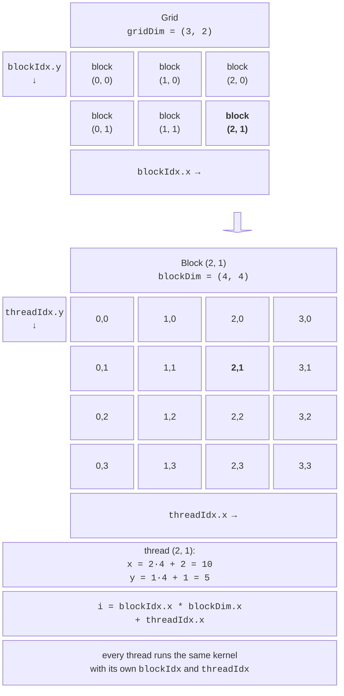
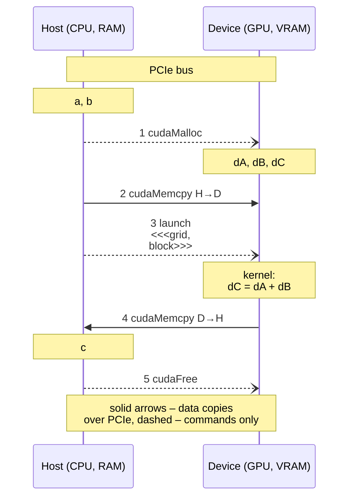
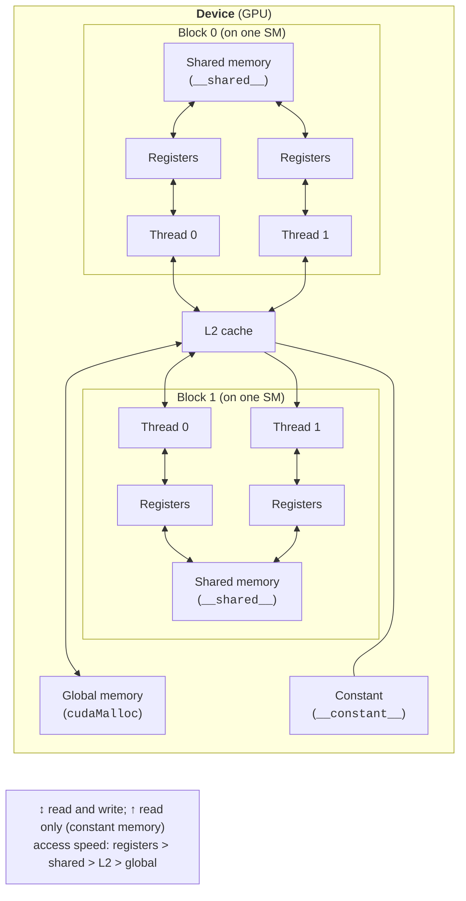

# The CUDA C++ programming model

## The CUDA C++ programming model

A CUDA C++ program is an ordinary C++ program (*host code*, running on the CPU, the **host**) that calls **kernels**: functions that run on the GPU (the **device**) in a large number of threads. Files with CUDA code have the `.cu` extension, and headers use `.cuh`. The `nvcc` compiler splits a file into two parts: it compiles device code itself (into PTX and SASS machine code) and passes host code to the system C++ compiler (GCC on Linux, MSVC on Windows). Functions are marked with **qualifiers** (Table 11.2).

Table 11.2. CUDA function qualifiers {.caption}

| **Qualifier** | **Runs on** | **Called from** | **Note** |
| --- | --- | --- | --- |
| `__global__` | the GPU | the host (kernel launch) | a kernel; returns `void` |
| `__device__` | the GPU | GPU code | a kernel helper function |
| `__host__` | the CPU | CPU code | the default for all functions |
| `__host__ __device__` | both | both | one function for CPU and GPU |

### Grid, blocks, and threads

A kernel is launched with the special syntax `Kernel<<<grid, block>>>(arguments)`. Threads are organized into a hierarchy (Fig. 11.3):

- a **grid** is all the threads of one kernel launch;
- a **block** (*thread block*) is a group of up to 1024 threads that runs on one SM and can synchronize and exchange data through shared memory;
- a **thread** executes the kernel code for “its own” data.

Grid and block dimensions have type `dim3` (three dimensions `x`, `y`, `z`; unspecified ones equal 1). Built-in variables are available in a kernel: `threadIdx` is the thread index within the block, `blockIdx` is the block index within the grid, `blockDim` is the block size, and `gridDim` is the grid size.



Figure 11.3. The CUDA thread hierarchy {.caption}

The **global index** of a thread in a one-dimensional grid is computed as `i = blockIdx.x * blockDim.x + threadIdx.x`. The number of blocks is rounded up: `blocks = (n + threads - 1) / threads`, so some threads in the last block are “extra,” and the kernel must **check bounds** with `if (i < n)`. The block size is usually a multiple of 32 (the warp size): 128, 256, or 512 threads. The order in which blocks execute is undefined, so blocks must be independent. The limits of the lab GPU are listed in Table 11.3.

Table 11.3. RTX 3060 limits (`cudaGetDeviceProperties`) {.caption}

| **Limit (CC 8.6)** | **Value** |
| --- | --- |
| threads per block, at most | 1024 |
| block dimensions `x`, `y`, `z`, at most | 1024, 1024, 64 |
| blocks per grid in `x` / `y`, `z` | $2^{31} - 1$ / 65,535 |
| threads per SM / blocks per SM | 1536 / 16 |
| shared memory per block (default) | 48 KB |
| 32-bit registers per SM | 65,536 |

### A first program: vector addition

The program consists of two files. The `common.cuh` header contains an error-checking macro and timing functions used by all examples in the lecture and the lab.

```cpp
// common.cuh – CUDA error checking and timing.
#pragma once
#include <algorithm>
#include <chrono>
#include <cstdio>
#include <cstdlib>
#include <vector>
#include <cuda_runtime.h>

// CUDA Runtime API call: on error, print a message and exit.
#define CUDA_CHECK(call)                                          \
    do {                                                          \
        cudaError_t err = (call);                                 \
        if (err != cudaSuccess) {                                 \
            std::fprintf(stderr, "CUDA: %s (%s) at %s:%d\n",      \
                         cudaGetErrorString(err),                 \
                         cudaGetErrorName(err), __FILE__,         \
                         __LINE__);                               \
            std::exit(EXIT_FAILURE);                              \
        }                                                         \
    } while (0)

// Median of 5 measurements after warmup; run() returns ms.
template <class F> float MedianMs(F run)
{
    run();
    std::vector<float> t;
    for (int r = 0; r < 5; ++r) t.push_back(run());
    std::sort(t.begin(), t.end());
    return t[2];
}

// Time of a code fragment on the CPU, ms.
template <class F> float CpuMs(F body)
{
    auto start = std::chrono::steady_clock::now();
    body();
    std::chrono::duration<float, std::milli> d =
        std::chrono::steady_clock::now() - start;
    return d.count();
}

// Time of a fragment on the GPU using CUDA events, ms.
template <class F> float GpuMs(F body)
{
    cudaEvent_t start, stop;
    CUDA_CHECK(cudaEventCreate(&start));
    CUDA_CHECK(cudaEventCreate(&stop));
    CUDA_CHECK(cudaEventRecord(start));      // marker in the GPU queue
    body();
    CUDA_CHECK(cudaEventRecord(stop));
    CUDA_CHECK(cudaEventSynchronize(stop));  // wait for the stop marker
    float ms = 0;
    CUDA_CHECK(cudaEventElapsedTime(&ms, start, stop));
    CUDA_CHECK(cudaEventDestroy(start));
    CUDA_CHECK(cudaEventDestroy(stop));
    return ms;
}
```

The `vector_add.cu` file computes $c_{i} = a_{i} + b_{i}$ for 50 million numbers, where $a_{i} = \sin^{2} i$ and $b_{i} = \cos^{2} i$, so every result should equal 1.

```cpp
// vector_add.cu – vector addition c = a + b on the GPU.
#include <cmath>
#include <cstdio>
#include <vector>
#include "common.cuh"

// Kernel: each thread computes one element.
__global__ void VectorAdd(const float* a, const float* b, float* c,
                          int n)
{
    int i = blockIdx.x * blockDim.x + threadIdx.x;  // thread index
    if (i < n)                                       // bounds check
        c[i] = a[i] + b[i];
}

int main()
{
    cudaDeviceProp prop;
    CUDA_CHECK(cudaGetDeviceProperties(&prop, 0));
    std::printf("GPU: %s, CC %d.%d, SM: %d, "
                "memory: %.1f GB\n", prop.name, prop.major,
                prop.minor, prop.multiProcessorCount,
                prop.totalGlobalMem / 1073741824.0);

    const int n = 50'000'000;
    const size_t bytes = n * sizeof(float);
    std::vector<float> a(n), b(n), c(n);
    for (int i = 0; i < n; ++i)
    {
        a[i] = std::sin(i) * std::sin(i);
        b[i] = std::cos(i) * std::cos(i);
    }

    // 1. Device memory.
    float *dA, *dB, *dC;
    CUDA_CHECK(cudaMalloc(&dA, bytes));
    CUDA_CHECK(cudaMalloc(&dB, bytes));
    CUDA_CHECK(cudaMalloc(&dC, bytes));

    // 2. Copy host -> device.
    CUDA_CHECK(cudaMemcpy(dA, a.data(), bytes,
                          cudaMemcpyHostToDevice));
    CUDA_CHECK(cudaMemcpy(dB, b.data(), bytes,
                          cudaMemcpyHostToDevice));

    // 3. Launch the kernel: blocks of 256 threads.
    int threads = 256;
    int blocks = (n + threads - 1) / threads;
    VectorAdd<<<blocks, threads>>>(dA, dB, dC, n);
    CUDA_CHECK(cudaGetLastError());          // launch error
    CUDA_CHECK(cudaDeviceSynchronize());     // execution error

    // 4. Copy device -> host (waits for the kernel to finish).
    CUDA_CHECK(cudaMemcpy(c.data(), dC, bytes,
                          cudaMemcpyDeviceToHost));

    // 5. Free device memory.
    CUDA_CHECK(cudaFree(dA));
    CUDA_CHECK(cudaFree(dB));
    CUDA_CHECK(cudaFree(dC));

    // sin² + cos² = 1 for every element.
    float maxError = 0.0f;
    for (int i = 0; i < n; ++i)
        maxError = std::fmax(maxError, std::fabs(c[i] - 1.0f));
    std::printf("n = %d, blocks: %d, threads per block: %d\n",
                n, blocks, threads);
    std::printf("Max error: %g\n", maxError);
}
```

A kernel launch is **asynchronous**: the host continues immediately while the GPU runs the kernel in the background. The `cudaMemcpy` function in the default CUDA stream waits for preceding commands to finish, so the result is copied only after the kernel completes. Output in Ubuntu under WSL2:

```
GPU: NVIDIA GeForce RTX 3060, CC 8.6, SM: 28, memory: 12.0 GB
n = 50000000, blocks: 195313, threads per block: 256
Max error: 0
```

## Host and device memory

The GPU has separate **device memory** (video memory), so a typical program performs five steps (Fig. 11.4): it allocates memory with `cudaMalloc`, copies input data with `cudaMemcpy(…, cudaMemcpyHostToDevice)`, launches the kernel, copies the result with `cudaMemcpy(…, cudaMemcpyDeviceToHost)`, and frees memory with `cudaFree`. A pointer obtained from `cudaMalloc` cannot be dereferenced on the host, and a pointer to host memory cannot be dereferenced in a kernel.



Figure 11.4. Data exchange between host and device {.caption}

**Pinned memory** (*pinned, page-locked*). The OS can page ordinary host memory out to disk, so the driver copies it through an intermediate pinned buffer. Memory allocated with `cudaMallocHost` (freed with `cudaFreeHost`) is locked in physical memory, and the GPU reads it directly. Measurements of a 128 MB copy in WSL2: ordinary memory gives 11.7 GB/s to the GPU and 9.2 GB/s back, pinned memory gives 24.6 and 25.2 GB/s. Pinned memory is also required for asynchronous copies (see the section on CUDA streams). A large amount of pinned memory reduces the memory available to the OS, so it is allocated only for transfer buffers.

**Unified Memory**. The `cudaMallocManaged` function allocates memory that is accessible through the same pointer on both host and device; the driver migrates pages automatically:

```cpp
float* x;
CUDA_CHECK(cudaMallocManaged(&x, n * sizeof(float)));
for (int i = 0; i < n; ++i) x[i] = 1.0f;       // write on the CPU
Scale<<<(n + 255) / 256, 256>>>(x, 3.0f, n);    // process on the GPU
CUDA_CHECK(cudaDeviceSynchronize());            // mandatory
std::printf("x[0] = %.1f\n", x[0]);             // x[0] = 3.0
CUDA_CHECK(cudaFree(x));
```

The code is shorter, but you can no longer control transfers. On Windows and WSL2 the `cudaDevAttrConcurrentManagedAccess` attribute equals 0: while the GPU is working, the CPU must not access unified memory, so `cudaDeviceSynchronize` before reading is mandatory, and page prefetching (`cudaMemPrefetchAsync`) is unavailable.

### The device memory hierarchy

Kernel code has access to several kinds of memory with different speeds and scopes (Fig. 11.5, Table 11.4).



Figure 11.5. Kinds of CUDA device memory {.caption}

Table 11.4. Kinds of CUDA memory {.caption}

| **Memory** | **Declaration** | **Visibility** | **Characteristics** |
| --- | --- | --- | --- |
| registers | kernel local variables | thread | fastest; 64 K registers per SM shared by all threads |
| shared | `__shared__` | block | on the SM chip, tens of times faster than global; up to 48 KB per block |
| global | `cudaMalloc`, `__device__` | all threads and the host | 12 GB, latency of hundreds of cycles; cached in L2 |
| constant | `__constant__`, `cudaMemcpyToSymbol` | all threads (read) | 64 KB, cached; fast when a warp’s threads read the same address |
| local | large arrays in a kernel | thread | physically in global memory; avoid |

Global memory speed depends on **coalescing**: when the 32 threads of a warp read 32 adjacent elements (`a[i]` with `i` equal to the thread index), the hardware performs a few large transactions. Strided accesses (for example, a matrix column `a[i * n]`) split into separate transactions and are many times slower.
