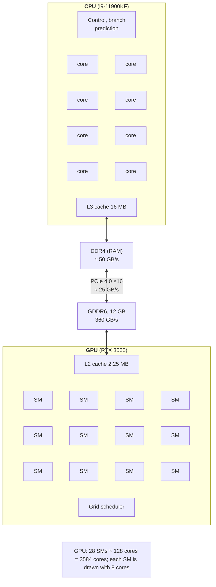

# GPU architecture and the CUDA ecosystem

## GPU and CPU architecture

The **graphics processing unit** (*GPU*) was designed to process millions of pixels with the same algorithm. Today it is also used for general-purpose computing (*GPGPU*): linear algebra, image processing, simulation, and neural network training. The central processor and the graphics processor are optimized for different goals (Fig. 11.1):

- the **CPU** is optimized for low **latency** of a single thread: a few powerful cores, large caches, out-of-order execution, and branch prediction;
- the **GPU** is optimized for **throughput**: thousands of simple cores, little control logic, and fast memory. The GPU hides the latency of an individual operation because while some threads wait for memory, others compute.



Figure 11.1. Comparing CPU and GPU architectures {.caption}

An NVIDIA GPU consists of **streaming multiprocessors** (*SM, Streaming Multiprocessor*). Each SM has its own compute cores, register file, shared memory, and schedulers. Threads execute in groups of 32 called **warps**: all threads of a warp execute the same instruction on different data. NVIDIA calls this model **SIMT** (*Single Instruction, Multiple Threads*): the programmer writes code for a single thread, and the hardware combines threads into warps.

**Branch divergence.** If threads of one warp take different branches of an `if`, the warp executes both branches in turn, disabling the “other” threads. Therefore a condition that depends on the thread index within a warp (for example, `if (i % 2 == 0)`) reduces speed, while a condition that is the same for the whole warp costs almost nothing.

The specifications of the lab PC are listed in Table 11.1. The GPU values were obtained with the `cudaGetDeviceProperties` function.

Table 11.1. CPU and GPU specifications of the lab PC {.caption}

| **Specification** | **i9-11900KF** | **RTX 3060 (CC 8.6)** |
| --- | --- | --- |
| cores | 8 cores, 16 logical processors | 28 SMs × 128 = 3584 cores |
| concurrent threads | 16 | 28 × 1536 = 43,008 |
| memory | DDR4, up to 128 GB | GDDR6, 12 GB |
| memory bandwidth | ≈ 50 GB/s | 360 GB/s |
| peak `float` performance | ≈ 1 TFLOPS (AVX-512) | ≈ 13 TFLOPS |
| interconnect | – | PCIe 4.0 ×16, measured ≈ 25 GB/s |

The main limitation of the GPU is the **PCIe bus**: data reaches video memory through it at about 25 GB/s, which is 14 times slower than the GPU’s access to its own memory. Therefore the GPU pays off for problems that perform many computations per transferred byte, or problems whose data stays on the GPU for a long time.

## The NVIDIA ecosystem and CUDA in WSL2

**CUDA** (*Compute Unified Device Architecture*, <https://developer.nvidia.com/cuda-toolkit>) is NVIDIA’s platform for GPU computing. It consists of:

- the GPU **driver**, which contains the `libcuda` library (*Driver API*) and loads code onto the device;
- the **CUDA Toolkit**: the `nvcc` compiler, the **CUDA Runtime** library (`cudart`), math libraries (cuBLAS, cuFFT, cuRAND, Thrust), profilers, and `compute-sanitizer`;
- the utilities `nvidia-smi` (GPU state, driver, utilization, processes) and `nvcc --version`.

**Compute capability** (CC) is the GPU architecture version in “major.minor” format: 7.5 is Turing, 8.0 and 8.6 are Ampere, 8.9 is Ada Lovelace, 9.0 is Hopper, and 10.x and 12.x are Blackwell. CC determines the available instructions and limits (Table 11.3). CUDA 13 supports GPUs with CC 7.5 and newer: Maxwell, Pascal, and Volta were removed in version 13.0 (<https://docs.nvidia.com/cuda/cuda-toolkit-release-notes/index.html>). The lab GeForce RTX 3060 has CC 8.6.

**Version compatibility.** A driver supports a certain CUDA version, which `nvidia-smi` shows in its header (`CUDA UMD Version`). A program built with a newer toolkit of the same major version also works: CUDA 13 provides **minor version compatibility** with drivers starting from 580. For example, driver 610.88 on the lab PC reports CUDA 13.3, and programs built with CUDA 13.4 on Windows run on it.

### CUDA in WSL2

The course uses CUDA in Ubuntu 26.04 under WSL2 (<https://docs.nvidia.com/cuda/wsl-user-guide/index.html>). The driver is installed **only on Windows**: WSL2 automatically exposes it to Linux as the `libcuda.so` library. You **must not** install the NVIDIA Linux driver inside WSL: it would replace this library and break GPU access. In WSL you install only the toolkit from NVIDIA’s **WSL-Ubuntu** repository (in September 2026 it contains CUDA 13.3, so the course uses 13.3 in WSL and 13.4 on Windows):

```bash
wget https://developer.download.nvidia.com/compute/cuda/repos/\
wsl-ubuntu/x86_64/cuda-keyring_1.1-1_all.deb
sudo dpkg -i cuda-keyring_1.1-1_all.deb
sudo apt-get update
sudo apt-get install cuda-toolkit-13-3   # toolkit only, no driver
echo 'export PATH=/usr/local/cuda/bin:$PATH' >> ~/.bashrc
```

Do not install the `cuda`, `cuda-13-3`, or `cuda-drivers` packages in WSL, because they contain the driver. After installation, `nvcc --version` reports `release 13.3, V13.3.73`, and `nvidia-smi` in WSL shows the same GPU as on Windows (Fig. 11.2). As of September 2026, the toolkit also installs `nsys` (Nsight Systems) and `compute-sanitizer`. WSL2 limitations: unified memory works without concurrent CPU and GPU access, the amount of pinned memory is limited, and some `nvidia-smi` features are unavailable.

::: info Screenshot
Windows Terminal, Ubuntu-26.04 (WSL2): `nvidia-smi` and `nvcc --version`; GPU name, driver 610.xx, CUDA UMD 13.3, memory usage; nvcc release 13.3
:::

Figure 11.2. GPU and driver information in WSL {.caption}
