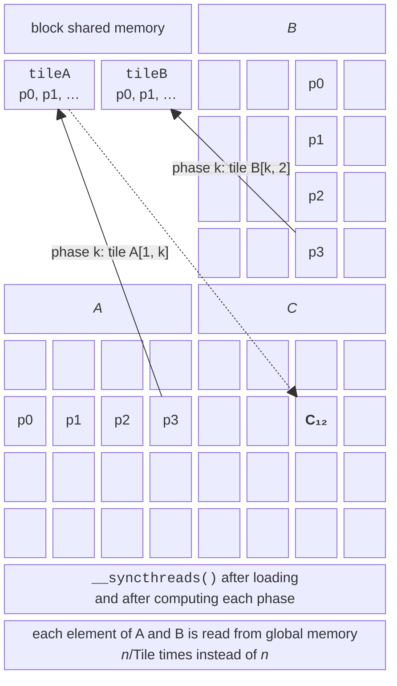

# Shared memory, CUDA streams, and libraries

## Shared memory and block synchronization

A variable with the `__shared__` qualifier exists in a single instance per block. The threads of a block fill it together, and the `__syncthreads()` function is a **barrier** for all threads of the block: no thread proceeds until the others reach this point. A barrier must not be placed in an `if` branch that not all threads of the block enter: the program will hang or behave unpredictably. There is no barrier between different blocks: blocks synchronize only when the kernel finishes.

### Tiling in matrix multiplication

**Tiling** divides matrices into square **tiles** of size $\text{Tile} \times \text{Tile}$ (Fig. 11.7). A thread block computes one tile of $C$ in $n / \text{Tile}$ **phases**. In each phase, every thread copies one element of the $A$ tile and one of the $B$ tile into shared memory, the block synchronizes, and the threads compute part of the sum by reading the tiles from shared memory. Each element of global memory is now read $\text{Tile}$ times less often.



Figure 11.7. Matrix multiplication with tiles {.caption}

```cpp
// Tiled kernel: a block of Tile×Tile threads loads tiles of A and B
// into shared memory one after another (n is a multiple of Tile).
template <int Tile>
__global__ void MatMulTiled(const float* a, const float* b, float* c,
                            int n)
{
    __shared__ float tileA[Tile][Tile];
    __shared__ float tileB[Tile][Tile];
    int tx = threadIdx.x, ty = threadIdx.y;
    int row = blockIdx.y * Tile + ty;
    int col = blockIdx.x * Tile + tx;
    float sum = 0.0f;
    for (int phase = 0; phase < n / Tile; ++phase)
    {
        // Each thread copies one element of A and one of B.
        tileA[ty][tx] = a[row * n + phase * Tile + tx];
        tileB[ty][tx] = b[(phase * Tile + ty) * n + col];
        __syncthreads();                 // tiles are loaded
        for (int k = 0; k < Tile; ++k)
            sum += tileA[ty][k] * tileB[k][tx];
        __syncthreads();                 // tiles no longer needed
    }
    c[row * n + col] = sum;
}
```

The first `__syncthreads()` guarantees that the tiles are fully loaded, and the second guarantees that no thread starts overwriting the tiles for the next phase while others are still reading them. The kernel is simplified: $n$ must be a multiple of `Tile`; otherwise, bounds checks are needed when loading tiles.

The complete program `matmul.cu` contains both kernels and a `MatMulCpu` function (loops in `i-k-j` order, rows distributed among OpenMP threads); it generates two random matrices (seed 10), measures each method (`MedianMs` with `GpuMs` or `CpuMs`), and compares the GPU results with the CPU:

```cpp
// matmul.cu – matrix multiplication C = A·B: CPU (OpenMP), a naive
// kernel, and a kernel with tiles in shared memory. Argument: n
// (a multiple of 32).
#include <omp.h>
#include <cmath>
#include <random>
#include "common.cuh"

// Naive kernel: each thread reads a row of A and a column of B
// from global memory.
__global__ void MatMulNaive(const float* a, const float* b, float* c,
                            int n)
{
    int row = blockIdx.y * blockDim.y + threadIdx.y;
    int col = blockIdx.x * blockDim.x + threadIdx.x;
    if (row < n && col < n)
    {
        float sum = 0.0f;
        for (int k = 0; k < n; ++k)
            sum += a[row * n + k] * b[k * n + col];
        c[row * n + col] = sum;
    }
}

// Tiled kernel: a block of Tile×Tile threads loads tiles of A and B
// into shared memory one after another (n is a multiple of Tile).
template <int Tile>
__global__ void MatMulTiled(const float* a, const float* b, float* c,
                            int n)
{
    __shared__ float tileA[Tile][Tile];
    __shared__ float tileB[Tile][Tile];
    int tx = threadIdx.x, ty = threadIdx.y;
    int row = blockIdx.y * Tile + ty;
    int col = blockIdx.x * Tile + tx;
    float sum = 0.0f;
    for (int phase = 0; phase < n / Tile; ++phase)
    {
        // Each thread copies one element of A and one of B.
        tileA[ty][tx] = a[row * n + phase * Tile + tx];
        tileB[ty][tx] = b[(phase * Tile + ty) * n + col];
        __syncthreads();                 // tiles are loaded
        for (int k = 0; k < Tile; ++k)
            sum += tileA[ty][k] * tileB[k][tx];
        __syncthreads();                 // tiles no longer needed
    }
    c[row * n + col] = sum;
}

// CPU: rows of C among OpenMP threads, loop order i-k-j.
void MatMulCpu(const std::vector<float>& a,
               const std::vector<float>& b, std::vector<float>& c,
               int n)
{
    #pragma omp parallel for
    for (int i = 0; i < n; ++i)
    {
        float* ci = &c[(size_t)i * n];
        std::fill(ci, ci + n, 0.0f);
        for (int k = 0; k < n; ++k)
        {
            float aik = a[(size_t)i * n + k];
            const float* bk = &b[(size_t)k * n];
            for (int j = 0; j < n; ++j) ci[j] += aik * bk[j];
        }
    }
}

int main(int argc, char* argv[])
{
    const int n = argc > 1 ? std::atoi(argv[1]) : 2048;
    if (n <= 0 || n % 32 != 0)
    {
        std::fprintf(stderr, "n must be positive and a multiple of 32\n");
        return 1;
    }
    const size_t bytes = (size_t)n * n * sizeof(float);
    std::mt19937 gen(10);
    std::uniform_real_distribution<float> dist(-1.0f, 1.0f);
    std::vector<float> a((size_t)n * n), b(a.size()), c(a.size()),
        ref(a.size());
    for (float& x : a) x = dist(gen);
    for (float& x : b) x = dist(gen);

    float *dA, *dB, *dC;
    CUDA_CHECK(cudaMalloc(&dA, bytes));
    CUDA_CHECK(cudaMalloc(&dB, bytes));
    CUDA_CHECK(cudaMalloc(&dC, bytes));
    float copyMs = MedianMs([&] { return GpuMs([&] {
        CUDA_CHECK(cudaMemcpy(dA, a.data(), bytes,
                              cudaMemcpyHostToDevice));
        CUDA_CHECK(cudaMemcpy(dB, b.data(), bytes,
                              cudaMemcpyHostToDevice));
        CUDA_CHECK(cudaMemcpy(c.data(), dC, bytes,
                              cudaMemcpyDeviceToHost)); }); });
    float cpuMs = MedianMs([&] {
        return CpuMs([&] { MatMulCpu(a, b, ref, n); }); });

    const double flop = 2.0 * n * n * n;
    std::printf("n = %d, CPU: %d OpenMP threads\n", n,
                omp_get_max_threads());
    std::printf(" time, ms  GFLOPS       S     error  method\n");
    std::printf("%9.2f %7.1f %7.1f %9s  CPU, OpenMP\n", cpuMs,
                flop / cpuMs / 1e6, 1.0, "-");
    // Kernel run: median time, check against the CPU result.
    auto run = [&](const char* name, auto kernel, int tile) {
        dim3 block(tile, tile), grid(n / tile, n / tile);
        float ms = MedianMs([&] { return GpuMs([&] {
            kernel<<<grid, block>>>(dA, dB, dC, n);
            CUDA_CHECK(cudaGetLastError()); }); });
        CUDA_CHECK(cudaMemcpy(c.data(), dC, bytes,
                              cudaMemcpyDeviceToHost));
        float err = 0.0f;
        for (size_t i = 0; i < c.size(); ++i)
            err = std::max(err, std::fabs(c[i] - ref[i]));
        std::printf("%9.2f %7.1f %7.1f %9.1e  %s\n", ms,
                    flop / ms / 1e6, cpuMs / ms, err, name);
    };
    run("GPU, naive kernel 16x16", MatMulNaive, 16);
    run("GPU, tiles 16x16", MatMulTiled<16>, 16);
    run("GPU, tiles 32x32", MatMulTiled<32>, 32);
    std::printf("Copying A, B to the GPU and C back: %.2f ms\n",
                copyMs);
    CUDA_CHECK(cudaFree(dA));
    CUDA_CHECK(cudaFree(dB));
    CUDA_CHECK(cudaFree(dC));
}
```

Output for $n = 2048$ in WSL2:

```
n = 2048, CPU: 16 OpenMP threads
 time, ms  GFLOPS       S     error  method
   151.41   113.5     1.0         -  CPU, OpenMP
    21.69   792.2     7.0   3.4e-05  GPU, naive kernel 16x16
    16.73  1026.7     9.0   3.4e-05  GPU, tiles 16x16
    17.80   965.3     8.5   3.4e-05  GPU, tiles 32x32
Copying A, B to the GPU and C back: 5.05 ms
```

16×16 tiles speed up the kernel by 30 %, and even with copying (5 ms) the GPU is 7 times faster than 16 CPU threads: matrix multiplication performs $2 n^{3}$ operations on $3 n^{2}$ transferred numbers. 32×32 tiles are slower than 16×16: only one block of 1024 threads fits on an SM (1024 of 1536 possible), and while the block waits at a barrier, the SM sits idle; with 16×16 blocks, six blocks run on an SM, and the GPU hides latency better. The error of $3 {,} 4 \cdot 10^{- 5}$ is due to a different order of adding `float` numbers. The cuBLAS library reaches 8.6 TFLOPS on the same matrices (see the “Libraries” section), so our best kernel uses only 12 % of the GPU’s capability.

### Parallel reduction

A **reduction** (sum, maximum) is performed on the GPU as a tree: in the block’s shared memory, at each step half of the threads add to their element the element at distance `step`, and `step` is halved. For 256 threads, 8 steps with `__syncthreads()` between them are needed. Thread 0 adds the block sum to the overall result with an atomic operation or writes it to an array of partial sums. Performance depends on how the active threads are chosen:

- **interleaved addressing**: threads with indices that are multiples of $2 \cdot \text{step}$ work (`if (tid % (2 * step) == 0)`), so only some threads in each warp are active, causing divergence;
- **sequential addressing**: threads $0 \dots \text{step} - 1$ work (`if (tid < step)`), so warps are either fully active or fully idle.

Both variants and comparisons with the Thrust library and OpenMP are given in the lab: sequential addressing is twice as fast as interleaved addressing.

### Atomic operations and a histogram

**Atomic operations** such as `atomicAdd`, `atomicMin`, `atomicMax`, and `atomicCAS` perform “read – modify – write” on global or shared memory indivisibly. They are needed when threads write to the same location, for example when building a **histogram** (`atomicAdd(&hist[pixel], 1u)`). If many threads increment **the same** counter, the operations execute sequentially and the kernel slows down. The solution is **local histograms**: each block counts its own histogram in shared memory (atomic operations are much faster there) and then adds it to the global histogram with one `atomicAdd` per bin. In the lab, this approach speeds up the histogram of an 8K image by a factor of 14.

## Asynchronous execution: CUDA streams and events

A **CUDA stream** (not to be confused with a thread of execution) is a queue of GPU commands: commands in one stream execute in order, while commands in different streams can execute concurrently. Commands without an explicit stream go to the **default stream**, which synchronizes with the others. Streams are created with `cudaStreamCreate(&s)`, passed as the fourth launch parameter `Kernel<<<grid, block, 0, s>>>` and to `cudaMemcpyAsync(…, s)`, and waited on with `cudaStreamSynchronize(s)` or `cudaDeviceSynchronize()`.

To overlap copying with computation, data is split into chunks, and each chunk is processed in its own stream: while a kernel processes chunk 1, chunk 2 is being copied. Asynchronous copying works only with **pinned** memory. How many copies can run concurrently is determined by the number of **copy engines** (`asyncEngineCount`). On Windows and WSL2, the RTX 3060 driver reports one engine, so copies to the GPU and back run one after another, and the **order** of commands matters: first all copies to the GPU, then all kernels, then all copies back.

```cpp
for (int s = 0; s < count; ++s)          // 1. all chunks to the GPU
    CUDA_CHECK(cudaMemcpyAsync(d + s * chunk, pinned + s * chunk,
        chunkBytes, cudaMemcpyHostToDevice, streams[s]));
for (int s = 0; s < count; ++s)          // 2. kernels
    Process<<<(chunk + 255) / 256, 256, 0, streams[s]>>>(
        d + s * chunk, chunk);
for (int s = 0; s < count; ++s)          // 3. results back
    CUDA_CHECK(cudaMemcpyAsync(pinned + s * chunk, d + s * chunk,
        chunkBytes, cudaMemcpyDeviceToHost, streams[s]));
CUDA_CHECK(cudaDeviceSynchronize());
```

For 128 MB and a kernel performing 1000 operations per element (5.3 ms), the measurements were:

```
Kernel: 5.3 ms; without streams: 16.6 ms
Copy engines: 1
CUDA streams: 2, time 11.1 ms, S = 1.50
  sequential in each stream: 16.2 ms, S = 1.02
CUDA streams: 4, time 10.8 ms, S = 1.53
  sequential in each stream: 16.9 ms, S = 0.98
```

The kernel is almost completely hidden behind the copies (Fig. 11.8): the time of 10.8 ms is close to the sum of the two copies (5.5 + 5.3 ms). If instead each stream issues “copy – kernel – copy” in sequence, the copy back of chunk 1 gets queued on the engine before the copy of chunk 2, and there is no speedup.

```mermaid
gantt
  title Time, ms. H – copy to the GPU, K – kernel, D – copy to the host. One copy engine: all H and D run one after another
  dateFormat x
  axisFormat %-S
  tickInterval 2second
  section no streams
    H2D : 0, 5500
    kernel : 5500, 10800
    D2H : 10800, 16300
  section 4 CUDA streams: copies
    H1 : 0, 1375
    H2 : 1375, 2750
    H3 : 2750, 4125
    H4 : 4125, 5500
    D1 : 5500, 6875
    D2 : 6875, 8250
    D3 : 8250, 9625
    D4 : 9625, 11000
  section 4 CUDA streams: compute
    K1 : 1375, 2700
    K2 : 2750, 4075
    K3 : 4125, 5450
    K4 : 5500, 6825
```



Figure 11.8. Overlapping copies and computation in CUDA streams {.caption}

**Events** (`cudaEvent_t`) are markers in the GPU queue. The `cudaEventRecord(e, s)` function places a marker in stream `s`, `cudaEventSynchronize(e)` waits until the GPU reaches it, and `cudaEventElapsedTime(&ms, start, stop)` returns the time between markers according to the GPU clock (resolution about 0.5 µs). This is how the `GpuMs` function from `common.cuh` works. The CPU clock (`std::chrono`) for a kernel without synchronization shows only the **launch** time, not the execution time. Rules for correct measurement:

- the first CUDA call creates the context (hundreds of milliseconds), so the first run is a warmup; in addition, the GPU does not raise its clocks immediately;
- measure the median of several runs;
- when comparing with the CPU, include the **copy time** if the data does not stay on the GPU.

## CUDA libraries and profiling

For typical tasks, it is better to use an NVIDIA library than to write your own kernel:

- **Thrust** (part of the CUDA Core Compute Libraries, headers in `<thrust/…>`) provides the `device_vector` container and STL-style algorithms: `reduce`, `sort`, `transform`, `inclusive_scan`;
- **cuBLAS** (<https://docs.nvidia.com/cuda/cublas/index.html>) provides linear algebra (BLAS), including `cublasSgemm` for matrix multiplication; CMake target `CUDA::cublas`;
- **cuFFT**, **cuRAND**, **cuSPARSE**, and **cuSOLVER** provide Fourier transforms, random numbers, sparse matrices, and solvers for systems of equations.

```cpp
thrust::host_vector<int> h(n);            // 10 million numbers 0 to 999
thrust::device_vector<int> d = h;         // copy to the GPU
long long sum = thrust::reduce(d.begin(), d.end(), 0LL);
int maxValue = thrust::reduce(d.begin(), d.end(), 0,
                              cuda::maximum<int>());
thrust::sort(d.begin(), d.end());         // sort on the GPU
int median = d[n / 2];                    // copies a single element
// sum 4996362961, max 999, median 500
```

In CUDA 13 the `thrust::maximum` functor is deprecated; use `cuda::maximum` (header `<cuda/functional>`) instead. The `cublasSgemm` function on $2048 \times 2048$ matrices ran in 1.99 ms (8.6 TFLOPS), and with tensor cores in TF32 mode (`cublasSetMathMode` with `CUBLAS_TF32_TENSOR_OP_MATH`, lower precision) in 1.38 ms (12.4 TFLOPS), which is 8–12 times faster than our tiled kernel.

### Nsight Systems

**Nsight Systems** (<https://docs.nvidia.com/nsight-systems/>) is a system-wide profiler: it shows CUDA API calls, copies, kernels, and CPU threads on a timeline. The `nsys profile` command creates a report, and the `--stats=true` option immediately prints summary tables:

```bash
nsys profile -o matmul --stats=true ./matmul 1024
```

Abbreviated tables for the matrix multiplication program ($n = 1024$, WSL2, Nsight Systems 2026.1.3):

```
Time (%)  Total Time (ns)  Num Calls  Name       (cuda_api_sum)
    68.5        129083383          3  cudaMalloc
    23.7         44727663         24  cudaEventSynchronize
     5.4         10217122         21  cudaMemcpy
Time (%)  Total Time (ns)  Instances  Name   (cuda_gpu_kern_sum)
    37.6         16644527          6  MatMulNaive(...)
    33.3         14755962          6  void MatMulTiled<(int)32>(...)
    29.1         12882504          6  void MatMulTiled<(int)16>(...)
Time (%)  Total Time (ns)  Count  Operation   (cuda_gpu_mem_time_sum)
    56.7          4369174     12  [CUDA memcpy Host-to-Device]
    43.3          3330928      9  [CUDA memcpy Device-to-Host]
```

The report confirms the program’s measurements (the median of the 16×16 tiled kernel is 2.0 ms) and reveals something non-obvious: the first `cudaMalloc` takes 128 ms because it includes CUDA context creation. The `matmul.nsys-rep` file is opened in the graphical Nsight Systems for Windows (*File → Open*), which shows the timeline (Fig. 11.9). A different tool, **Nsight Compute** (`ncu`), is intended for analyzing a single kernel (SM utilization, access coalescing).

::: info Screenshot
Nsight Systems GUI (Windows) with `matmul.nsys-rep` from `nsys profile ./matmul 1024`; timeline rows CUDA API, Memory (HtoD, DtoH) and Kernels; transfer vs kernel segments
:::

Figure 11.9. Timeline in Nsight Systems {.caption}
