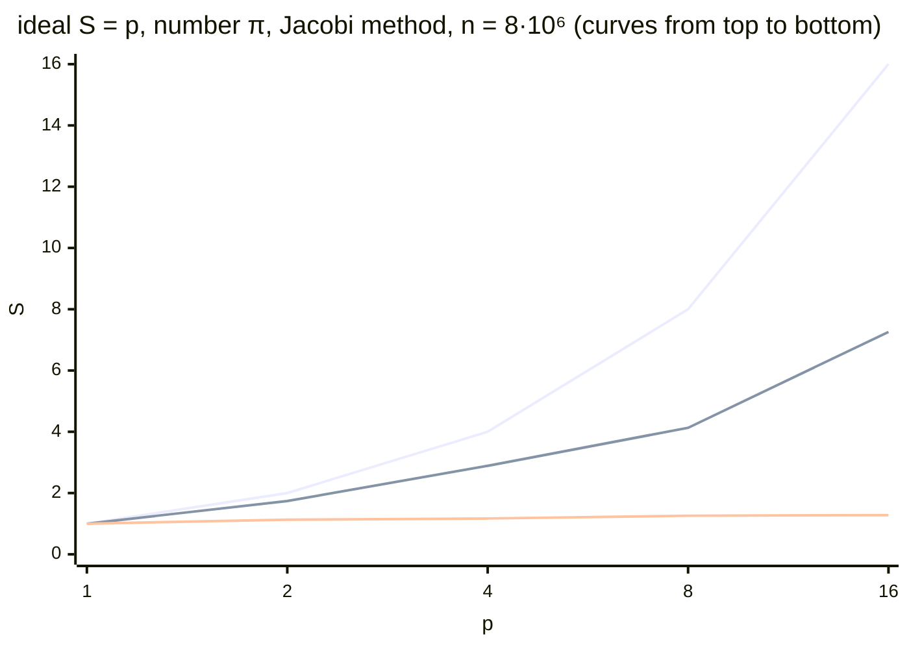

# Examples and common mistakes

## Program examples

All programs were built with the CMake project from the “A CMake project” section (GCC 15.2, Open MPI 5.0.10, Release configuration, `-O3`) and run in WSL2 (Ubuntu 26.04) on an Intel Core i9-11900KF (8 cores, 16 logical processors). Times are the median of 5 runs; other programs were running in WSL during the measurements, so the values fluctuate by 5–15 %.

### Computing π: Bcast and Reduce

The program computes $\pi = \int_{0}^{1} 4 / (1 + x^{2}) \mathrm{d} x$ with the midpoint rule (as in Topic 10). The number of steps is given as an argument to rank 0, which broadcasts it to everyone with `MPI_Bcast`; each rank sums its steps, and `MPI_Reduce` collects the total. The time is measured five times between `MPI_Barrier` calls, for each run the time of the slowest rank (`MPI_MAX`) is taken, and rank 0 prints the median.

```cpp
#include <mpi.h>
#include <algorithm>
#include <cmath>
#include <cstdlib>
#include <numbers>
#include <print>

// This rank's part of the midpoint-rule sum:
// iterations rank, rank + size, rank + 2·size, … (cyclic distribution).
double PartialSum(long long steps, int rank, int size)
{
    const double h = 1.0 / steps;
    double sum = 0.0;
    for (long long i = rank; i < steps; i += size)
    {
        double x = (i + 0.5) * h;
        sum += 4.0 / (1.0 + x * x);
    }
    return sum * h;
}

int main(int argc, char* argv[])
{
    MPI_Init(&argc, &argv);
    int rank = 0, size = 0;
    MPI_Comm_rank(MPI_COMM_WORLD, &rank);
    MPI_Comm_size(MPI_COMM_WORLD, &size);

    // Only rank 0 knows the number of steps and broadcasts it.
    long long steps = 0;
    if (rank == 0)
        steps = argc > 1 ? std::atoll(argv[1]) : 2'000'000'000LL;
    MPI_Bcast(&steps, 1, MPI_LONG_LONG, 0, MPI_COMM_WORLD);

    double pi = 0.0, times[5];
    for (double& t : times)                   // median of 5 runs
    {
        MPI_Barrier(MPI_COMM_WORLD);          // common start
        double start = MPI_Wtime();
        double local = PartialSum(steps, rank, size);
        MPI_Reduce(&local, &pi, 1, MPI_DOUBLE, MPI_SUM, 0,
                   MPI_COMM_WORLD);
        t = MPI_Wtime() - start;
    }
    // The time of a run is the time of the slowest rank.
    double slowest[5];
    MPI_Reduce(times, slowest, 5, MPI_DOUBLE, MPI_MAX, 0,
               MPI_COMM_WORLD);
    if (rank == 0)
    {
        std::sort(slowest, slowest + 5);
        std::println("{} {:.4f} {:.12f} {:.1e}", size, slowest[2], pi,
                     std::abs(pi - std::numbers::pi));
    }
    MPI_Finalize();
}
```

The program prints a single line: the number of processes, the time, $\pi$, and the error. The speedup table is built by the `scale.sh` script, which runs the program for 1–16 processes and computes $S$ and $E$ with `awk`. For 16 processes on 8 cores, the `--use-hwthread-cpus` option is required (slots are logical processors):

```bash
#!/bin/bash
# A series of runs for 1, 2, 4, 8, 16 processes and a table of S and E.
for np in 1 2 4 8 16; do
    # 16 ranks on 8 cores: SMT logical processors as separate slots.
    opts=""; [ $np -gt 8 ] && opts="--use-hwthread-cpus"
    mpirun -np $np $opts ./build/pi
done | awk 'NR == 1 { t1 = $2
                      printf "%3s %8s %6s %5s %16s %8s\n",
                             "np", "T, s", "S", "E", "pi", "error" }
            { s = t1 / $2
              printf "%3d %8.3f %6.2f %4.0f%% %16s %8s\n",
                     $1, $2, s, 100 * s / $1, $3, $4 }'
```

Output of `bash scale.sh` (Fig. 12.11):

```
np     T, s      S     E               pi    error
 1    1.604   1.00  100%   3.141592653590  4.6e-14
 2    0.919   1.74   87%   3.141592653590  1.3e-13
 4    0.554   2.89   72%   3.141592653590  4.6e-14
 8    0.388   4.13   52%   3.141592653590  1.8e-15
16    0.221   7.26   45%   3.141592653590  1.0e-13
```

::: info Screenshot
Ubuntu terminal (WSL2): `bash scale.sh` in the folder of the lecture project; the table np, T, S, E, pi, error for 1, 2, 4, 8, 16 processes
:::

Figure 12.11. The scalability table of an MPI program {.caption}

The result does not depend on the number of processes within 12 digits, and the error changes because of a different order of addition. Communication here is minimal (one number in `MPI_Bcast` and one in `MPI_Reduce`), yet the speedup on 8 processes is only 4.1. The cause is not MPI: the same program in OpenMP in WSL with `OMP_PLACES=cores OMP_PROC_BIND=spread` gave almost the same times (0.57 s on 4 threads and 0.38 s on 8). A single process runs at the highest turbo frequency, and when all cores are loaded, the frequency drops; in addition, WSL2 virtual processors share cores with Windows and other programs. Eight series of runs gave speedups from 2.0 to 3.3 on 4 processes, so the table shows the series with the median values. 16 processes on SMT logical processors give a further 1.75× speedup, because the loop computes divisions rather than accessing memory. The speedup chart together with the Jacobi method (the next example) is shown in Fig. 12.12.



Figure 12.12. Speedup of MPI programs in WSL2 (i9-11900KF, 8 cores) {.caption}

### Ring exchange and deadlock

The processes form a ring: at each step, rank $r$ passes a block of numbers to its right neighbor $(r + 1) \bmod p$ and receives a block from its left neighbor. The received block is added to the sum and passed on, so after $p - 1$ steps every rank has the sum of the blocks of all ranks ($1 + 2 + \dots + p$). The exchange method and the block size are set by arguments.

```cpp
#include <mpi.h>
#include <cstdlib>
#include <print>
#include <string_view>
#include <vector>

// Ring exchange: at each step, a rank passes a block to its right
// neighbor and receives a block from its left one. After size - 1 steps,
// every rank has the sum of the blocks of all ranks.
// Arguments: send | ssend | sendrecv | isend, count of numbers.
int main(int argc, char* argv[])
{
    MPI_Init(&argc, &argv);
    int rank = 0, size = 0;
    MPI_Comm_rank(MPI_COMM_WORLD, &rank);
    MPI_Comm_size(MPI_COMM_WORLD, &size);

    std::string_view mode = argc > 1 ? argv[1] : "sendrecv";
    int count = argc > 2 ? std::atoi(argv[2]) : 1000;
    int right = (rank + 1) % size;
    int left = (rank - 1 + size) % size;

    std::vector<double> out(count, rank + 1.0), in(count), sum = out;
    double start = MPI_Wtime();
    for (int step = 1; step < size; ++step)
    {
        if (mode == "send" || mode == "ssend")
        {   // Unsafe: all ranks send first.
            if (mode == "send")
                MPI_Send(out.data(), count, MPI_DOUBLE, right, 0,
                         MPI_COMM_WORLD);
            else
                MPI_Ssend(out.data(), count, MPI_DOUBLE, right, 0,
                          MPI_COMM_WORLD);
            MPI_Recv(in.data(), count, MPI_DOUBLE, left, 0,
                     MPI_COMM_WORLD, MPI_STATUS_IGNORE);
        }
        else if (mode == "sendrecv")
        {   // Send and receive in a single operation.
            MPI_Sendrecv(out.data(), count, MPI_DOUBLE, right, 0,
                         in.data(), count, MPI_DOUBLE, left, 0,
                         MPI_COMM_WORLD, MPI_STATUS_IGNORE);
        }
        else
        {   // Nonblocking: both requests first, then Waitall.
            MPI_Request requests[2];
            MPI_Irecv(in.data(), count, MPI_DOUBLE, left, 0,
                      MPI_COMM_WORLD, &requests[0]);
            MPI_Isend(out.data(), count, MPI_DOUBLE, right, 0,
                      MPI_COMM_WORLD, &requests[1]);
            MPI_Waitall(2, requests, MPI_STATUSES_IGNORE);
        }
        for (int i = 0; i < count; ++i) sum[i] += in[i];
        out.swap(in);                       // pass on what we received
    }
    double time = MPI_Wtime() - start;

    if (rank == 0)
        std::println("{:<8} {:>8} numbers: sum = {} (expected {}), "
                     "{:.3f} ms", mode, count, sum[0],
                     size * (size + 1) / 2, time * 1e3);
    MPI_Finalize();
}
```

After `MPI_Waitall`, both buffers are free, so `out.swap(in)` is safe. Runs with 4 processes (`timeout 10` kills a hung job after 10 s with code 124):

```bash
for count in 500 511; do
    timeout 10 mpirun -np 4 ./build/ring send $count; echo "code $?"
done
timeout 10 mpirun -np 4 ./build/ring ssend 1; echo "code $?"
mpirun -np 4 ./build/ring sendrecv 100000
mpirun -np 4 ./build/ring isend 100000
```

```
send          500 numbers: sum = 10 (expected 10), 0.101 ms
code 0
code 124
code 124
sendrecv   100000 numbers: sum = 10 (expected 10), 0.758 ms
isend      100000 numbers: sum = 10 (expected 10), 0.790 ms
```

With `MPI_Send`, the program works for 500 numbers (4000 bytes) and hangs already at 511 numbers: 4088 bytes plus the header exceed the 4096-byte eager limit, and `MPI_Send` waits for the neighbor’s `MPI_Recv`, while the neighbor itself is stuck in `MPI_Send`. With `MPI_Ssend`, the program hangs even for a single number. Such a bug is especially dangerous: the program passes tests on small data and hangs on real data. The variants with `MPI_Sendrecv` and nonblocking operations work for any size.

### The Jacobi method: domain decomposition and a hybrid version

The Jacobi method solves a diagonally dominant system of linear equations $(2 + \sigma) u_{i} - u_{i - 1} - u_{i + 1} = b_{i}$, $i = 0 \dots n - 1$, $u_{- 1} = u_{n} = 0$; such a system is solved at each step of an implicit scheme for the heat equation. The iteration

$$
u_{i}^{k + 1} = (u_{i - 1}^{k} + u_{i + 1}^{k} + b_{i}) / (2 + \sigma)
$$

uses only neighboring nodes for each $i$, so the vector is divided into $p$ contiguous blocks. Each rank stores its block and two **halo cells** with the neighbors’ boundary nodes and exchanges them before every iteration (`MPI_Sendrecv` to the left and to the right). The right-hand side $b$ is chosen so that the exact solution is $u_{i} = \sin (\pi x_{i})$, so the program prints the maximum error. The program is hybrid: iterations within a block are run by OpenMP threads, and exchanges by the main thread between parallel regions (`MPI_THREAD_FUNNELED`). With `OMP_NUM_THREADS=1`, it is a “pure” MPI program.

```cpp
#include <mpi.h>
#include <omp.h>
#include <algorithm>
#include <cmath>
#include <cstdlib>
#include <numbers>
#include <print>
#include <vector>

// The Jacobi method for the system (2 + σ)·u[i] - u[i-1] - u[i+1] = b[i],
// i = 0…n-1, u[-1] = u[n] = 0 (a step of an implicit heat scheme).
// The right-hand side b is chosen so that the exact solution is
// u[i] = sin(πx[i]).
// Arguments: number of unknowns n, number of iterations.
const double Sigma = 0.1;

double Exact(long g, long n)             // g – global node number
{
    return std::sin(std::numbers::pi * (g + 1) / (n + 1));
}

int main(int argc, char* argv[])
{
    int provided = 0;
    MPI_Init_thread(&argc, &argv, MPI_THREAD_FUNNELED, &provided);
    int rank = 0, size = 0;
    MPI_Comm_rank(MPI_COMM_WORLD, &rank);
    MPI_Comm_size(MPI_COMM_WORLD, &size);
    if (provided < MPI_THREAD_FUNNELED)
        MPI_Abort(MPI_COMM_WORLD, 1);

    const long n = argc > 1 ? std::atol(argv[1]) : 8'000'000;
    const int iters = argc > 2 ? std::atoi(argv[2]) : 500;
    // Block distribution: the first n % size ranks get 1 more.
    const long local = n / size + (rank < n % size ? 1 : 0);
    const long first = rank * (n / size)
                       + std::min<long>(rank, n % size);
    // Neighbors; MPI_PROC_NULL means "no neighbor", exchange is empty.
    const int left = rank > 0 ? rank - 1 : MPI_PROC_NULL;
    const int right = rank < size - 1 ? rank + 1 : MPI_PROC_NULL;

    // u[0] and u[local + 1] are halo cells with the neighbors' nodes.
    std::vector<double> u(local + 2, 0.0), v(local + 2, 0.0),
                        b(local + 2);
    #pragma omp parallel for
    for (long i = 1; i <= local; ++i)
    {
        long g = first + i - 1;
        b[i] = (2 + Sigma) * Exact(g, n)
               - (g > 0 ? Exact(g - 1, n) : 0)
               - (g < n - 1 ? Exact(g + 1, n) : 0);
    }

    double commTime = 0.0;
    MPI_Barrier(MPI_COMM_WORLD);
    double start = MPI_Wtime();
    for (int it = 0; it < iters; ++it)
    {
        double c = MPI_Wtime();
        // Halo exchange: the first node to the left neighbor, and from
        // the right one its first node into u[local + 1]; then back.
        MPI_Sendrecv(&u[1], 1, MPI_DOUBLE, left, 0,
                     &u[local + 1], 1, MPI_DOUBLE, right, 0,
                     MPI_COMM_WORLD, MPI_STATUS_IGNORE);
        MPI_Sendrecv(&u[local], 1, MPI_DOUBLE, right, 1,
                     &u[0], 1, MPI_DOUBLE, left, 1,
                     MPI_COMM_WORLD, MPI_STATUS_IGNORE);
        commTime += MPI_Wtime() - c;

        // Computation – by OpenMP threads inside the rank.
        #pragma omp parallel for schedule(static)
        for (long i = 1; i <= local; ++i)
            v[i] = (u[i - 1] + u[i + 1] + b[i]) / (2 + Sigma);
        u.swap(v);
    }
    double time = MPI_Wtime() - start;

    // Maximum error relative to the exact solution.
    double error = 0.0;
    #pragma omp parallel for reduction(max:error)
    for (long i = 1; i <= local; ++i)
        error = std::max(error,
                         std::abs(u[i] - Exact(first + i - 1, n)));
    MPI_Allreduce(MPI_IN_PLACE, &error, 1, MPI_DOUBLE, MPI_MAX,
                  MPI_COMM_WORLD);
    double times[2] = {time, commTime}, slowest[2];
    MPI_Reduce(times, slowest, 2, MPI_DOUBLE, MPI_MAX, 0,
               MPI_COMM_WORLD);
    if (rank == 0)
        std::println("{:>2} x {:<2} {:>8.3f} {:>8.3f} {:>10.2e}",
                     size, omp_get_max_threads(), slowest[0],
                     slowest[1], error);
    MPI_Finalize();
}
```

Ranks 0 and $p - 1$ have only one neighbor: the other equals `MPI_PROC_NULL`, the corresponding half of `MPI_Sendrecv` does nothing, and the halo cell stays zero (the boundary condition). The output line contains “ranks × threads,” the iteration time, the communication time `Tcomm` (the largest among ranks), and the error. The `jscale.sh` script runs each configuration 5 times and prints the line with the median time (sorted by the fourth column):

```bash
#!/bin/bash
# Scalability of the Jacobi method: median of 5 runs per configuration.
# Arguments: n iterations [weak] (weak – n per rank).
median() {       # median of 5 runs by time (4th column)
    for k in 1 2 3 4 5; do "$@"; done | sort -g -k4 | sed -n 3p
}
export OMP_NUM_THREADS=1
for np in 1 2 4 8 16; do
    opts=""; [ $np -gt 8 ] && opts="--use-hwthread-cpus"
    n=$1; [ "$3" == weak ] && n=$(($1 * np))
    median mpirun -np $np $opts ./build/jacobi $n $2
done
```

Strong scaling for two sizes: $8 \cdot 10^{6}$ unknowns (three arrays of 64 MB, 500 iterations) and $4 \cdot 10^{5}$ unknowns (9.6 MB, which fits in the L3 cache; 10,000 iterations), then weak scaling with $5 \cdot 10^{5}$ unknowns per rank:

```bash
bash jscale.sh 8000000 500; bash jscale.sh 400000 10000
bash jscale.sh 500000 2000 weak
```

```
n = 8000000, 500 iterations:
 1 x 1     3.779    0.000   2.54e-11
 2 x 1     3.348    0.080   2.54e-11
 4 x 1     3.230    0.433   2.54e-11
 8 x 1     2.990    0.695   2.54e-11
16 x 1     2.947    1.264   2.54e-11
n = 400000, 10000 iterations:
 1 x 1     1.918    0.002   3.33e-15
 2 x 1     1.076    0.092   3.33e-15
 4 x 1     0.675    0.099   3.33e-15
 8 x 1     0.506    0.187   3.33e-15
16 x 1     0.651    0.422   3.33e-15
```

```
n = 500000 per rank, 2000 iterations:
 1 x 1     0.671    0.001   3.33e-15
 2 x 1     1.128    0.029   3.33e-15
 4 x 1     2.813    0.391   3.33e-15
 8 x 1     6.718    1.678   3.33e-15
16 x 1    13.230    7.070   3.44e-15
```

The error is the same for any number of processes, so the halo exchange is correct. For $8 \cdot 10^{6}$ unknowns, the speedup on 8 processes is only 1.26: each iteration reads and writes 8 bytes per node in three arrays and does almost no computation, so all cores wait on a single memory bus (like the heat conduction example in Topic 10). When the data fits in the cache ($4 \cdot 10^{5}$ unknowns), the speedup on 8 processes is 3.8, and on 16 processes the time grows: ranks on the logical processors of one core interfere with each other, and the share of waiting in communication (`Tcomm`) reaches 65 %. Weak scaling on a single computer is impossible for such a problem: the amount of data grows with the number of processes, but memory bandwidth does not, so the time grows almost in proportion to $p$ (10 % efficiency on 8 processes). On a cluster, each node adds its own memory, and the same program scales much better; this is exactly what is measured in Topic 13.

For hybrid configurations, the `hybrid.sh` script divides 8 cores among ranks (`--map-by slot:PE=t`) and gives each rank $t$ OpenMP threads bound to cores:

```bash
#!/bin/bash
# "Ranks × threads" configurations for 8 cores: each rank gets
# PE=t cores (--map-by slot:PE=t), and its OpenMP threads one core each.
median() {       # median of 5 runs by time (4th column)
    for k in 1 2 3 4 5; do "$@"; done | sort -g -k4 | sed -n 3p
}
export OMP_PLACES=cores OMP_PROC_BIND=close
for r in 8 4 2 1; do
    t=$((8 / r))
    OMP_NUM_THREADS=$t median mpirun -np $r --map-by slot:PE=$t \
        -x OMP_NUM_THREADS ./build/jacobi "$@"
done
```

```bash
bash hybrid.sh 8000000 500; bash hybrid.sh 400000 10000
```

```
n = 8000000, 500 iterations:
 8 x 1     3.326    0.701   2.54e-11
 4 x 2     3.085    0.195   2.54e-11
 2 x 4     3.088    0.029   2.54e-11
 1 x 8     3.090    0.001   2.54e-11
n = 400000, 10000 iterations:
 8 x 1     0.574    0.206   3.33e-15
 4 x 2     0.543    0.114   3.33e-15
 2 x 4     0.560    0.048   3.33e-15
 1 x 8     0.547    0.001   3.33e-15
```

On a single computer, all configurations give almost the same time (the difference is within measurement noise): the problem is limited by memory, not by the number of processes. However, with fewer ranks, the communication time drops sharply: from 0.70 s for 8 ranks to 0.03 s for 2 ranks. On a cluster with a 1 Gbit/s network, each exchange costs tens of microseconds instead of fractions of a microsecond, so the “one rank per socket, threads on cores” configuration is better there. For comparison: the same run `OMP_NUM_THREADS=8 mpirun -np 1 ./build/jacobi 400000 10000` without `--map-by slot:PE=8` takes 1.86 s versus 0.56 s, because all 8 threads are bound to a single core.

## Debugging and common mistakes

The simplest debugging tool is output tagged with the rank number: `std::println("[{}] …", rank, …)` or the `mpirun --output tag` option, which tags each line as `[1,rank]<stdout>:`. Output from different processes is interleaved, so for an ordered report, data is gathered on rank 0 (`MPI_Gather`) and printed there. For hangs, `timeout` and attaching a debugger to an individual process (`gdb -p PID` or *Attach to Process* in CLion) are useful. Common mistakes are listed in Table 12.12; the Open MPI 5.0 messages are copied from real runs.

Table 12.12. Common mistakes in MPI programs {.caption}

| **Problem** | **Cause and fix** |
| --- | --- |
| the program hangs without messages | deadlock: all ranks send first, or the tag, type, or rank in `MPI_Recv` does not match `MPI_Send`, or not all ranks called a collective operation; use `MPI_Sendrecv` or nonblocking operations, check the envelopes |
| works on small data, hangs on large data | the program relies on `MPI_Send` buffering (4096-byte limit in shared memory); test with `MPI_Ssend`, fix the order of exchanges |
| `MPI_ERR_TRUNCATE: message truncated` | the `MPI_Recv` buffer is smaller than the message; use `MPI_Probe` and `MPI_Get_count` or a larger buffer |
| `help about: prun:proc-exit-no-sync` | a process exited without `MPI_Finalize` (`return` in one rank’s branch, an exception); call `MPI_Finalize` on all paths or `MPI_Abort` |
| `help about: prte-rmaps-base:alloc-error` | more processes than slots (cores); `--use-hwthread-cpus`, `--oversubscribe`, `slots=` in the hostfile |
| `help about: …` instead of the error text | the Ubuntu packages lack the PRRTE help files; the meaning of the error is in the topic name after `about:` |
| ranks run slower than expected | unnecessary `--oversubscribe` (processes are not bound), `mpirun -np 1` with many OpenMP threads on one core; check `--report-bindings` |
| the result depends on the number of processes | incorrect block boundaries (the remainder `n % p`), a missing halo exchange or grid corners; compare with the sequential version on small data |
| a launch on several VMs hangs | no passwordless SSH between all nodes, the firewall blocks ports, the wrong network adapter is selected; `ssh node hostname`, `btl_tcp_if_include` |
